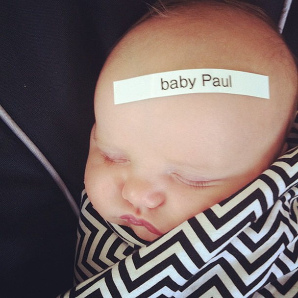
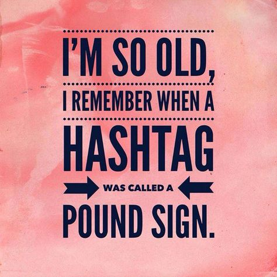
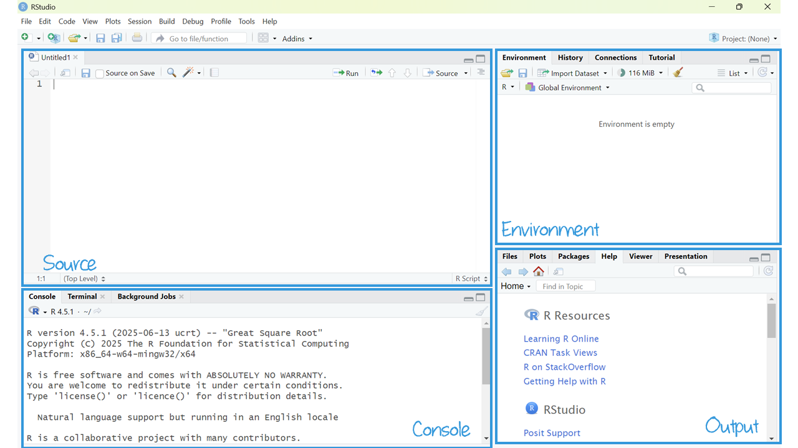
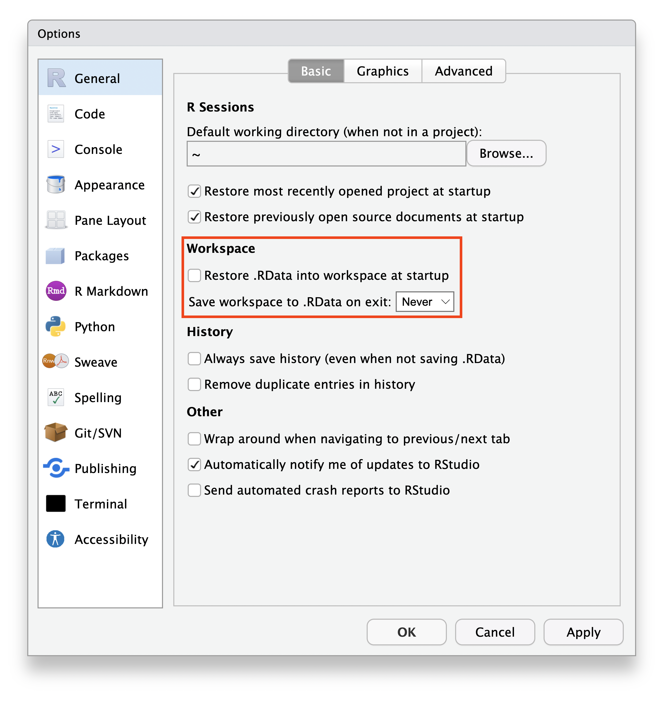
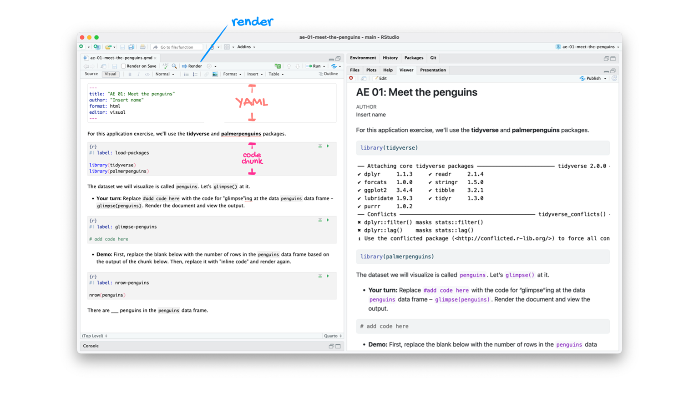
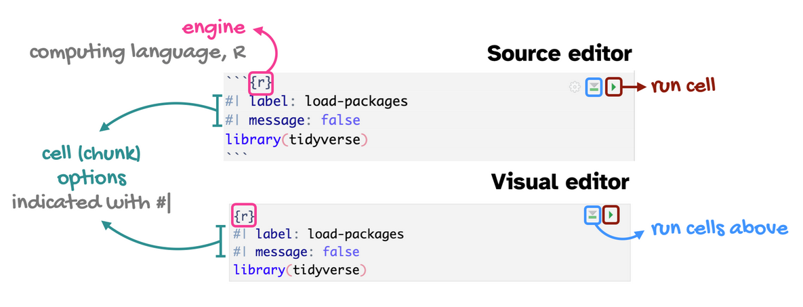
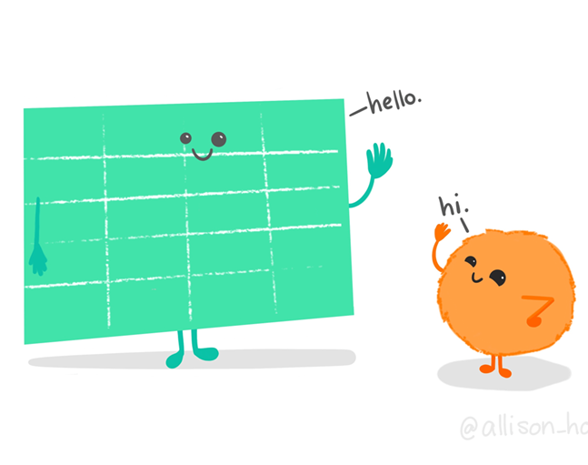

---
project:
  render:
    - "!/code-alongs" 
title: "R workflow"
format:
  revealjs:
    controls: true
    theme: [default, custom.scss]
    highlight-style: atom-one
    include-in-header:
    - file: mathjax-color.html
    slide-number: c
    math: mathjax
    code-annotations: hover
    chalkboard: true
    title-slide-attributes:
      data-background-image: "images/01/hello.png"
      data-background-size: 250px
      data-background-position: bottom center
revealjs-plugins:
  - quiz
filters:
    - openlinksinnewpage
editor: 
  markdown: 
    wrap: 72
execute: 
  echo: true
---

```{r echo=FALSE}

#| label: setup
#| message: false
#| include: false

## Load packages, custom functions, and styles
source("custom-setup-styles.R")

knitr::opts_knit$set(digits = 2)

# Set global theme with base font size 20
theme_set(theme_minimal(base_size = 20))

# Override default discrete color and fill scales
scale_colour_discrete <- function(...) scale_color_manual(values = my_palette)

# Color in math equations
# https://egallic.fr/Recherche/aide-memoire/quarto_equation_colors.html#colors-in-equations-with-revealjs
```

# Agenda {data-menu-title="Agenda" background-image="images/calendar.png" background-size="100px" background-repeat="repeat"}

-   R & RStudio Workflow
-   Quarto
-   Getting Started


# Learning objectives

By the end of the lecture, you will be able to ...

-   setup a workflow using R and RStudio\
-   familiarize yourself with a dataset using R and RStudio\
-   create a reproducible report using Quarto\

# R & RStudio Tour {.theme-section}

## Tour: RStudio Panes {background-image="images/watch.png" background-size="100px" background-repeat="repeat"}

<br>

::: {style="color: #18BC9C; font-size: 300%; font-family: 'Shadows Into Light'"}
Sit back and enjoy the show!
:::

::: notes
-   open new R script  
-   Environment (data values, functions)
-   Plots, Help, Viewer
-   Console -- typing
:::

## Mini-task {data-menu-title="R-scripts (& Quarto)" .smaller}

::: task
 Open a new R Script.
:::

Click the dropdown arrow next to the "[New File
icon]{style="color: #3498DB"}," and then "[R
script]{style="color: #3498DB"}".

{width="65%"}

::: aside
Alternatively, hold down "Ctrl" + "Shift" + "N."
:::

::: notes
An R-script is a file that will contain the documentation of the code of
what you tell R to do.
:::

## Mini-tasks {.sparse-slide}

::: task
 Type `2 + 2` in the Console. Then push `Enter`.
:::

<br> 

. . .

::: task
 Type `2 + 2` in the R Script Then click `Run`.
:::


::: notes
What's the difference between the console and a script file?
:::

## Documentation

::: r-stack


{.fragment fragment-index="1"}
:::

::: notes
In .R scripts and Quarto, you can document your code. Err on the side of
over documentation. Your future self will thank you. In .R scripts, the
way to make a comment rather than a command, is to put a pound sign in
front of the text.
:::

## Mini-task {.sparse-slide}

::: task
 Add a comment above your `2 + 2` code in your R script. Then click `Run`.
:::


## Tour recap: Panes

::::: r-stack
:::: {style="font-size: 80%"}
There are four key regions or “panes” in the interface:

1.  [**Source
    pane:**](https://docs.posit.co/ide/user/ide/guide/ui/ui-panes.html#source)
    where you can edit and save R scripts or author computational
    documents like Quarto and R Markdown.

2.  [**Console
    pane:**](https://docs.posit.co/ide/user/ide/guide/ui/ui-panes.html#console)
    is used to write short interactive R commands.

3.  [**Environment
    pane:**](https://docs.posit.co/ide/user/ide/guide/ui/ui-panes.html#environment-pane)
    displays temporary R objects created during that R session.

4.  [**Output
    pane:**](https://docs.posit.co/ide/user/ide/guide/ui/ui-panes.html#output-pane)
    displays the plots, tables, or HTML outputs of executed code along
    with files saved to disk.

::: {.callout-tip icon="false"}
##  Heads Up!

The top-left panel (source pane) and can be launched by opening any
editable file in RStudio.
:::
::::

{.fragment fragment-index="1"}
:::::

::: notes
Console pane: best for exploring.\
Source pane: best for documenting.
:::

## RStudio projects {.sparese-slide}

Create a **RStudio project** for each data analysis project.

It supports an organized and reproducible workflow, cleanly separated
from all other projects that you are working on. Everything you need in
one place:

::: {style="font-size: 80%"}
-   local data files to load into RStudio.
-   scripts to edit or run in bits or as a whole.
-   Save your outputs (plots and cleaned data).
:::

::: notes
Source:
<https://docs.posit.co/ide/user/ide/get-started/#hello-rstudio-projects>
:::


## File types {.sparse-slide}

There are many file types, but these are key to an R & RStudio workflow
(and likely new to you):

::: {style="font-size: 70%"}
| Extension | Description |
|--------------------------|----------------------------------------------|
| .Rproj | RStudio project file (keeps project settings). |
| .R | R scripts store a sequence of R commands (code) that can be run all at once or line by line. |
| .qmd | Quarto Markdown creates reproducible documents that contain a combination of text, code, and output. |
| .Rdata (or sometimes .rda) | These store and load R objects—like data frames. |
:::


## Mini-task {data-menu-title="Create a RStudio Project" .smaller}

::: task
 Create a new project in RStudio.
:::


::: {.incremental}
-   Click: [File \> New
Project]{style="color: #3498DB"}.

-   In the New Project wizard that pops up, select: [New Directory, then New
Project]{style="color: #3498DB"}.

-   Name the project “[SOC6302]{style="color: #f39c12"}” 

-  Click [Browse]{style="color: #3498DB"} and save the project anywhere **except** your downloads folder.

-   Click: [Create Project]{style="color: #3498DB"}.

-   This will launch you into a new RStudio Project inside a new folder
called “SOC6302”.
:::

## Mini-task {data-menu-title="Blank slate" .smaller}

::: task
 Clear the memory at every restart of RStudio.
:::

:::: r-stack
::: {style="font-size: 80%"}
Turn off theautomatic saving of your workspace and .Rdata files with you quit
RStudio. This is important for reproducibility, debugging, and avoiding
littering your computer with unnecessary files.

**Set this via:**

1.  [Tools \> Global Options]{style="color: #3498DB"}.
2.  [Uncheck “Restore .RData into Workspace at
    Startup”]{style="color: #3498DB"}.
3.  Choose "[Never]{style="color: #3498DB"}" on the “Save workspace to
    .RData on exit”.
4.  Click "[Apply]{style="color: #3498DB"}" and
    "[OK]{style="color: #3498DB"}".
:::

{.fragment fragment-index="1" width="45%"}
::::


# Quarto {.theme-section}

## Quarto

The tool you'll use to create reproducible computational documents.
Every piece of assignment you hand in will be a Quarto document.

-   Fully reproducible reports
-   R code + narrative

::: notes
You are likely familiar with word processors like MS Word or Google
Docs. We will not be using these in this class. Instead, the words you
would write in such a document, as well as your R code, will go into a
Quarto document. You will *render* the document (more on what this means
later) to get a document out that has your words, code, and the output
of that code. Everything in one place, beautifully formatted!
:::

##  {#slide28-id data-menu-title="RScript vs Quarto"}

::::: columns
::: {.column width="50%"}
### [RScript]{style="color: #18BC9C;"}

-   great for learning, exploring and tinkering.

-   rerun it without attention to formatting or markdown.
:::

::: {.column width="50%"}
### [Quarto]{style="color: #18BC9C;"}

-   great for communicating analysis and results

-   combines narrative explanation with code output (results).
:::
:::::

## Tour: Quarto {background-image="images/watch.png" background-size="100px" background-repeat="repeat"}

<br>

::: {style="color: #18BC9C; font-size: 300%; font-family: 'Shadows Into Light'"}
Sit back and enjoy the show!
:::

::: notes
-   Use code-along-02 as an example
-   YAML Ain't Markup Language
-   code chunk (+ code comments)
-   code chunk options
-   narrative (heading levels)
-   run (line vs code chunk)
-   run cells above
-   source and visual
-   render
:::

## Tour recap: Quarto



::: aside
Source: [Dr. Mine
Çetinkaya-Rundel](https://sta199-f24.github.io/slides/01-meet-the-toolkit-slides.html#/tour-recap-quarto)
:::

## Tour recap: Quarto Code-chunks



::: {style="font-size: 55%"}
-   **chunk labels** are helpful for describing what the code is doing,
    for jumping between code cells in the editor, and for
    troubleshooting
-   `message: false` hides any messages emitted by the code in your
    rendered document
:::

::: aside
Source: [Dr. Mine
Çetinkaya-Rundel](https://sta199-f24.github.io/slides/03-grammar-of-data-transformation-slides.html#/recap-code-cells-aka-code-chunks)
:::

## How will we use Quarto?

-   Every **code-along** and **milestone** will be a Quarto document
-   The scaffolding will decrease over the course
-   You will create and submit a Quarto document for your **research
    project**
    
::: aside
[Tutorial: Hello, Quarto](https://quarto.org/docs/get-started/hello/rstudio.html)
:::
    

# Your first code-along {data-menu-title="Code-along 01" background-image="images/terminal.png"}

<br>

[ Download
code-along-01.qmd](https://app.filen.io/#/d/76f625ab-fa4f-4316-ab7c-289d55426788%23KPdlNcTsrKBIi26zdHFFiFzz9qeNMfNd)

## Mini-task {.sparse-slide}

::: task
 Save this code-along in your newly created project folder..
:::

<br>

There's no command in the R console to save scripts or Quarto files— you
use the editor's [File]{style="color: #3498DB"} \> [Save
As]{style="color: #3498DB"} or Ctrl+S.

# Getting Started {.theme-section}

## Comprehensive R Archive Network (CRAN) {.sparse-slide}

CRAN is like an App Store for R. It hosts R packages, documentation, and
source code contributed by users worldwide. It is mediated (e.g.,
quality controlled), making it incredibly reliable.


## Packages

R comes with basic tools, but **packages** extend the capabilities of
base R (what you already installed). An R package is like a toolbox: a
collection of functions, data, and documentation that help you do
specific tasks using R.

<br>

::: {style="font-size: 70%"}
**You'll install each package (1X per system):**
:::

```{r}
#| label: install-ex
#| message: false

install.packages("tidyverse")
```

<br>

::: {style="font-size: 70%"}
**You'll load each package (every time you use it):**
:::

```{r}
#| label: load-ex
#| message: false

library(tidyverse)
```

::: notes
What's the difference between installing and loading a package?
Why is this annoying workflow a "feature"?
:::


## Mini-task {data-menu-title="Install `tidyverse()`"}

::: task
 Install the `tidyverse()` package, available on CRAN.
:::

<br>

::: {style="font-size: 80%"}
[**Run the code chunk in your code-along.**]{style="color: #18BC9C; font-family: 'Shadows Into Light'"} 
  
*OR:* Copy and paste the code into your [Console pane]{style="color: #F39C12;"}. 
Then hit "Enter".
:::

<br>

```{r}
#| eval: false
#| message: false
#| label: install-tidyverse

install.packages("tidyverse")
```


## Mini-tasks {data-menu-title="Install `tinytex()`"}

::: task
 Install the `tinytex()` package, available on CRAN.
:::

<br>

::: {style="font-size: 80%"}
[**Run the code chunk in your code-along.**]{style="color: #18BC9C; font-family: 'Shadows Into Light'"} 
  
*OR:* Copy and paste the code into your [Console pane]{style="color: #F39C12;"}. 
Then hit "Enter".
:::

<br>

```{r}
#| eval: false
#| message: false
#| label: install-tinytex01

install.packages('tinytex')
```

<br>

. . .

```{r}
#| eval: false
#| message: false
#| label: install-tinytex02

tinytex::install_tinytex()
```

## Mini-tasks {data-menu-title="Install `gssr()` and `gssrdoc()`"}

::: task
 Install the `gssr()` package, NOT on CRAN.
:::

```{r}
#| eval: false
#| message: false
#| label: install-gssr

# Install 'gssr' from 'ropensci' universe
install.packages('gssr', repos =
  c('https://kjhealy.r-universe.dev', 'https://cloud.r-project.org'))
```

<br>

. . .

::: task
 Install the `gssrdoc()` package, NOT on CRAN.
:::

```{r}
#| eval: false
#| message: false
#| label: install-gssrdoc
# Install 'gssrdoc' from 'ropensci' universe
install.packages('gssrdoc', repos =
  c('https://kjhealy.r-universe.dev', 'https://cloud.r-project.org'))
```


## Load the packages {.sparse-slide}

::: {style="color: #18BC9C; font-size: 80%; font-family: 'Shadows Into Light'"}
**Run the code chunk in your code-along.**
:::

<br>

```{r}
#| message: false
#| label: load

library(tidyverse) # for data wrangling
library(gssr) # U.S. General Social Survey data
library(gssrdoc) # GSS documentation
```

## Environment

::: {style="color: #18BC9C; font-size: 80%; font-family: 'Shadows Into Light'"}
**Run the code chunk in your code-along.**
:::

<br>

```{r}
#| message: false
#| label: enviro

# software documentation
sessionInfo()

```


## Meet your data

::::: columns
::: {.column width="50%"}

:::

::: {.column width="50%"}
We're going to use data from the [U.S. General Social Survey
(GSS)](https://gss.norc.org/us/en/gss/about-the-gss.html).
:::
:::::

::: notes
Who know what the GSS is?  
:::

## Load some data 

::: {style="color: #18BC9C; font-size: 80%; font-family: 'Shadows Into Light'"}
**Run the code chunk in your code-along.**
:::

```{r}
#| label: gss24
#| output-location: fragment

# Load the data (will appear in your Global Environment pane)
gss24 <- gss_get_yr(2024)

# Preview the data named gss24
gss24

```


::: notes
A “tibble” is another name for “tidy dataset,” meaning that the data is
organized in structured, clear rows and columns. “(75,699 × 6,867)”
means the dataset contains 75,699 rows and 6,867 columns. Commonly, in
social sciences, rows are referred to as “observations” and columns as
“variables.” In our case, there are 75,699 observations (e.g.,
respondents) and 6,867 variables.
:::


## Browse dataframe {.sparse-slide}

::: task
 Open the `gss24` dataframe.
:::

With your mouse, go to the environment panel (upper-right) and click on
the `gss24` object. It opens in a tab on the source pane.

<br>

This is often a good idea to browse data to get a first feel for the data, but only if
your dataset is relatively small.

::: notes
Each row is an observation (person). Each column in a variable.
:::


##  {data-menu-title="Why use codebooks"}


::: notes
Author Naomi Wolf wrote a book about the treatment of homosexuality in
19th century England. She reported that it was punishable by death since
“sodomy” charges were followed by “death recorded” in the judicial logs.
However, “sodomy” referred to a host of other sexual offenses, and
“death recorded” specifically means they weren’t killed because their
death was recorded but not carried out.

Paul Dolan wrote a book about how marriage makes you miserable. A key
part of his evidence was that in the American Time Use Survey, married
people surveyed about their happiness when the spouse was present
reported being happy, but when the spouse was absent they reported being
unhappy. Covering up unhappiness in front of their spouse, truly
miserable! But while Dolan read spouse present/absent as “spouse is in
the room during questioning”, it actually meant “spouse
together/separated.” He was comparing couples that were together vs.
couples that were separating!
:::

## Variable documentation {.smaller}

The [GSS
documentation](https://gss.norc.org/us/en/gss/get-documentation.html) is
available online in .pdf form.

Because we loaded the `gssrdoc` package, for information about a
specific GSS variable:\
type `?varname` at the console.

<br>

In the output pane, the `Help` tab will show the variable documentation.

<br>

::: {.callout-tip icon="false"}
##  Heads Up!

Replace "varname" with the name of a variable.\
Example: `?meovrwrk`
:::

## Variable documentation example

```{r}
#| echo: false
#| label: meovrwrk-help

cat(readLines("images/01/meovrwrk.txt"), sep = "\n")
```

::: notes
Variable name: meovrwrk\
Variable label: Men hurt family when focus on work too much\
1994 was the first year of the survey.\
695 respondents agreed with the statement.\
iap -- missing. Values: the numeric and response category key (1 =
strongly agree)
:::


## Variables 

You can access the variables (i.e., columns) using the `$` operator, as
shown using the `table()` function. The variable names are case sensitive. 

<br>

```{r}
#| label: meovrwrk-table-gss24

table(gss24$meovrwrk)
```

::: task
 195 respondents were coded as `1` on this variable. What does that
mean?
:::


## Mini-tasks {data-menu-title="Variables: Practice"}

::: task
 Change the code to show the variable `fefam`.
:::

<br>

```{r}
#| label: fefam-table-gss24

# Replace meovrwrk with fefam
table(gss24$meovrwrk)
```

. . .

::: task
 add text to your code-along that interprets the results for the
`2` value for `fefam`.
:::

## Quarto: Render {.smaller}

Finally, let's `render` your code-along-01 and see the results!

{width="200%"}

::: {.callout-tip icon="false"}
##  Heads Up!

Click the down arrow next to `render` to choose whether to preview
within RStudio's Viewer Pane or in your browser.
:::

# Support {background-image="images/file-video-solid.png" background-size="100px" background-repeat="repeat"}

Some help videos and further explanation:

[R - Intro RStudio Interface](https://youtu.be/opy-v0WAHXM)

[EasyR - Getting started with R the easy
way](https://youtu.be/K9-zDmq737I)
