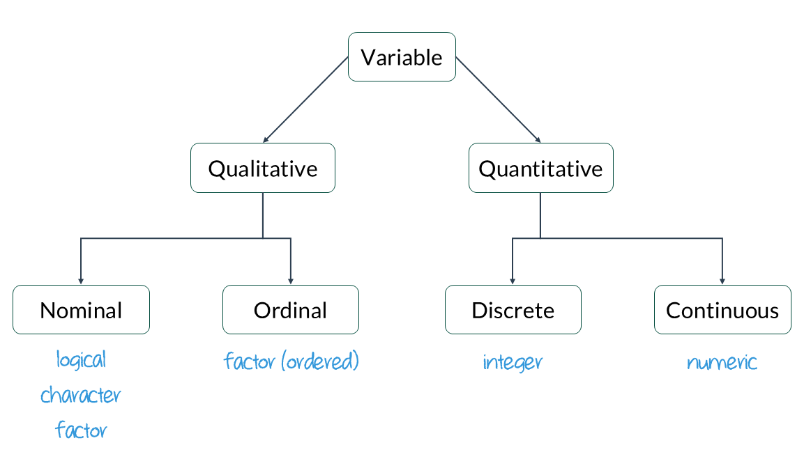

```{r echo=FALSE}
#| label: setup
#| message: false
#| include: false

## Load packages, custom functions, and styles
source("custom-setup-styles.R")

knitr::opts_knit$set(digits = 2)

# Set global theme with base font size 20
theme_set(theme_minimal(base_size = 20))

# Override default discrete color and fill scales
scale_colour_discrete <- function(...) scale_color_manual(values = my_palette)

# Color in math equations
# https://egallic.fr/Recherche/aide-memoire/quarto_equation_colors.html#colors-in-equations-with-revealjs
```

# Agenda {data-menu-title="Agenda" background-image="images/calendar.png" background-size="100px" background-repeat="repeat"}

-   Coding Basics
-   Variable Types
-   Frequency Distributions

::: notes
[What questions do we have from the tutorial??]{style="color: #6f42c1"}
:::

# Learning objectives

By the end of the lecture, you will be able to ...

-   use R to conduct basic calculations/comparisons
-   identify and convert variable types
-   create useful frequency tables

# Code-along 02 {data-menu-title="Code-along" background-image="images/terminal.png"}

<br>

[ Download code-along-02.qmd](https://www.dropbox.com/scl/fi/1v6ny70wlcmgipr8r9vfy/code-along-02.qmd?rlkey=5ato8mhbwonv0gnd3t7jijbsc&dl=1)


## Mini-task {data-menu-title="Install `summarytools()`"}

::: task
 Install the [`summarytools()`](https://cran.r-project.org/web/packages/summarytools/vignettes/introduction.html) package, available on CRAN.
:::

<br>

::: {style="font-size: 80%"}
[**Run the code chunk in your code-along.**]{style="color: #18BC9C; font-family: 'Shadows Into Light'"} 
  
*OR:* Copy and paste the code into your [Console pane]{style="color: #F39C12;"}. 
Then hit "Enter".
:::

<br>

```{r}
#| message: false
#| eval: false
#| label: install-summarytools

install.packages("summarytools")
```

::: notes
[What does this mean in your code-along: "This chunk will not run (on purpose!) when rendered because eval: false."?]{style="color: #6f42c1"}
:::

## Mini-task {data-menu-title="Load the packages"}

::: task
 Load the standard packages and our new `summarytools()` package.
:::

<br>

```{r}
#| message: false
#| label: load

library(tidyverse)
library(haven) # not core tidyverse
library(gssr)
library(gssrdoc) # load the GSS codebook
library(summarytools)
```

::: notes
`haven()` was installed with tidyverse; but it doesn't load automatically
:::


## Mini-task {data-menu-title="Load your data"}

::: task
 Load the 2024 GSS data.
:::

<br>

```{r}
#| message: false
#| label: gssdata

# Get the data only for the 2024 survey respondents
gss24 <- gss_get_yr(2024)
```

::: notes
[Why did we need to use `library()` before we loaded the GSS data?]{style="color: #6f42c1"}
:::


# Coding Basics {.theme-section}

## Coding basics {.smaller}

::::: columns

::: {.column}
You can use R to do basic math calculations

```{r}
#| label: arithmetic

1 + 2
2 * 5
(1 + 2) / 2
```
:::

::: {.column .fragment}

You can create new objects with the assignment operator `<-`
```{r}
#| label: assign

x <- 3 * 4
x
```
:::

:::::

::::: columns

::: {.column .fragment}
You can (and should) make comments in your code
```{r}
#| label: comments

# R will ignore any text after # for that line

primes <- c(2, 3, 5, 7, 11, 13) # create vector of prime numbers
primes
```
:::

::: {.column .fragment}
Object names must start with a letter and can only contain letters, numbers, _, and .

    i_use_snake_case
    otherPeopleUseCamelCase
    some.people.use.periods
    And_aFew.People_RENOUNCEconvention

:::

:::::

::: aside
Source: [R for Data Science](https://r4ds.hadley.nz/workflow-basics.html)
:::

## Coding basics: demo

::::: columns

::: {.column}

```{r}
#| label: basics

a <- 7
b <- 3
addition <- a + b
subtraction <- a - b
multiplication <- a * b
division <- a / b
exponentiation <- a^2
```

:::

::: {.column .fragment}


```{r}
#| label: basics-results

a
b
addition
subtraction
multiplication
division
exponentiation
```

:::

::::


## Operators in R

[Operators in R](https://www.geeksforgeeks.org/r-language/r-operators/) are 
symbols directing R to perform various kinds of mathematical, logical, and 
decision operations. A few of the key ones to know before we get started:  

<br>

**Assignment operators** assign values to variables:  
[**<-,  ->,  =**]{style="color: #3498DB"}  

**Comparison operators** test equality or inequality:  
[**==, !=, >, >=, <, <=**]{style="color: #3498DB"}  
  
**Logical operators** indicate "and", "or", and "not":  
[**&,  |,  !**]{style="color: #3498DB"}  
  

## Comparison operators 

| operator | definition                                |
|:---------|:------------------------------------------|
| `<`      | [is less than?]{.fragment}                |
| `<=`     | [is less than or equal to?]{.fragment}    |
| `>`      | [is greater than?]{.fragment}             |
| `>=`     | [is greater than or equal to?]{.fragment} |
| `==`     | [is exactly equal to?]{.fragment}         |
| `!=`     | [is not equal to?]{.fragment}             |

: {tbl-colwidths="\[25,75\]"}


## Comparison operators (cont) {.smaller}

::::: columns

::: {.column .fragment}
```{r}
#| label: compare

x <- 5
y <- 3
equal <- x == y
not_equal <- x != y
less_than <- x < y
more_than <- x > y
less_than_or_equal_to <- x <= y
more_than_or_equal_to <- x >= y
```
:::

::: {.column .fragment}
```{r}
#| label: compare-output

x
y
equal
not_equal
less_than
more_than
less_than_or_equal_to
more_than_or_equal_to
```
:::

:::::

::: aside
Source: [IONOS editorial team](https://www.ionos.ca/digitalguide/websites/web-development/r-operators/)
:::

## Logical operators 

| operator      | definition                                                            |
|:--------------|:----------------------------------------------------------------------|
| `x & y`       | [is x AND y?]{.fragment}                                              |
| `x | y`       | [is x OR y?]{.fragment}                                               |
| `is.na(x)`    | [is x NA?]{.fragment}                                                 |
| `!is.na(x)`   | [is x not NA?]{.fragment}                                             |

: {tbl-colwidths="\[25,75\]"}


## Logical operators (cont)

::::: columns

::: {.column .fragment}
```{r}
#| label: logical

x <- TRUE
y <- FALSE

and_operator <- x & y
or_operator <- x | y
not_operator <- !x
```
:::

::: {.column .fragment}
```{r}
#| label: logical-output

and_operator
or_operator
not_operator
```
:::

:::::

::: aside
Source: [IONOS editorial team](https://www.ionos.ca/digitalguide/websites/web-development/r-operators/)
:::


## Mini-task {data-menu-title="Assignment operators"}

::: task
 Make a tiny data frame and save it.
:::

<br>


```{r}
#| label: tibble
#| output-location: fragment

df <- tibble(x = c(1, 2, 3, 4, 5), y = c("a", "a", "b", "c", "c"))

df # look at df
```


# Variable Types {.theme-section}

## Data types in R

A property is assigned to objects that determines how generic functions operate with it.  

Common 'types' or 'classes' of variables:  

-   **logical**
-   **character**
-   **integer**
-   **numeric**
-   [and more, but we won't be focusing on those]{style="font-family: 'Shadows Into Light'"}


## Data class + variable type


{width="100%"}

## `class()` {.smaller}

::::: columns
::: column
**logical** - Boolean values `TRUE` and `FALSE`

<br>

```{r}
class(TRUE)
```
:::

::: {.column .fragment}
**character** - character strings

<br> <br>

```{r}
class("Sociology")
```
:::
:::::


::::: columns
::: {.column .fragment}

<br>

**Integer** - numeric data without decimals  
(indicated with an `L`).

```{r}
class(2L)
```
:::

::: {.column .fragment}

<br>

**numeric** - default type if values are numbers or if the values contain decimals.
```{r}
class(2.5)
```
:::
:::::


## Factor {.sparse-slide}

**factors** consist of character data with a fixed and known set of possible values 

<br>

```{r}
#| label: factors01

opinion <- factor(c("like", "dislike", "dislike", "hate", "dislike", "hate"))
class(opinion)
```
 
. . .

<br>

```{r}
#| label: factors02

# By default, the levels are sorted alphabetically.
levels(opinion)
```

## Factor order {.sparse-slide}

```{r}
#| label: factors03

# Reorder the levels with the argument `levels` in the `factor()` function
opinion <- factor(opinion, levels = c("hate", "dislike", "like"))
levels(opinion)
```

. . . 

<br>


```{r}
#| label: factors04

# If the order has meaning (like rankings), you can make it an ordered factor
opinion <- factor(opinion, levels = c("hate", "dislike", "like"), ordered = TRUE)
levels(opinion)
```


## Converting between types {.smaller}

Use a function: `as.logical()`, `as.numeric()`, `as.integer()`, or `as.character()`.

<br>

::::: columns
::: column
Create a numeric variable.
```{r}
#| label: convert_01

x <- 1:3
x
class(x)
```

<br>

::: {.callout-tip icon="false"}
##  Heads Up!
The : (colon) means 'through.' 
:::

:::

::: {.column .fragment}
Change it to a character variable. 
```{r}
#| label: convert_02

y <- as.character(x)
y
class(y)
```

<br>

::: {.callout-tip icon="false"}
##  Heads Up!
Notice the quotation marks around the values.
:::

:::
:::::

## Haven labelled {.sparse-slide}

When you import data into R from software like SPSS, Stata, or SAS, 
you might notice a special class called `haven_labelled`. 

<br>

::::: columns

::: {.column}

```{r}
#| label: labelled01
#| output-location: fragment

class(gss24$premarsx)
```
:::

::: {.column}

```{r}
#| label: labelled02
#| output-location: fragment

table(gss24$premarsx)
```
:::

:::::

## Haven labelled cont.

It makes data easier to understand without needing a separate codebook.

```{r}
#| label: value_labels
#| code-line-numbers: "1|2"
#| output-location: fragment

attr(gss24$premarsx, "label") # <1>
print_labels(gss24$premarsx) # <2>
```

1.   A description of the variable
2.   View the label attached to each numeric value


::: notes
The column itself might have a variable label (a description like "Gender of respondent")

The column contains values (numbers)

Each value may have a label attached (like "Male" for 1, "Female" for 2)

:::

##  {data-menu-title="Haven labelled cont."}

You can use
[`as_factor`](https://haven.tidyverse.org/reference/as_factor.html)
to see the value labels of the variable `premarsx`. 

::: {.panel-tabset}

## Mini-task

::: task
 Use `as_factor()` inside the `table()` function for the variable `premarsx`
:::


## with `as_factor()`

```{r}
#| label: label02_premarsx
table(as_factor(gss24$premarsx), useNA = "ifany")
```

## without `as_factor()`

```{r}
#| label: label03_premarsx
table(gss24$premarsx, useNA = "ifany")
```

:::

::: notes
[In the code-along, REPLACE THE BLANK LINE WITH THE NAME OF THE VARIABLE]{style="color: #f39c12"}  
  
[What would happen if we didn't include `as_factor()` within `table()`?]{style="color: #6f42c1"}
:::


## Convert labels to factors {.smaller}

:::: {.panel-tabset}

## `zap_missing()`

::: task
 1. Use `zap_missing()` to get rid of all the 'missing' (NA) levels
:::

<br>

::: {.fragment}
```{r}
#| label: label04_premarsx

gss24$premarsx <- zap_missing(gss24$premarsx)
table(as_factor(gss24$premarsx), useNA = "ifany") # see the results
```
:::

## `as_factor()`

::: task
 2. Use `as_factor()` to apply the labels instead of numeric values
:::

<br>

::: {.fragment}
```{r}
#| label: label05_premarsx

gss24$premarsx <- as_factor(gss24$premarsx) # replace the values with labels
table(gss24$premarsx, useNA = "ifany") # notice we didn't need to wrap the variable in as_factor
```
:::

## `droplevels()`

::: task 
 3. Use `droplevels()` to get rid of the empty levels in `premarsx`.
:::


<br>

::: {.fragment}
```{r}
#| label: label06_premarsx

gss24$premarsx <- droplevels(gss24$premarsx)
table(gss24$premarsx)
```
:::

::::

::: notes
1.  [REPLACE THE BLANK LINES WITH THE NAME OF THE VARIABLE]{style="color: #f39c12"}  
2.  [REPLACE THE BLANK LINE WITH THE FUNCTION `as_factor()`]{style="color: #f39c12"}  
3.  [REPLACE THE BLANK LINES WITH THE `droplevels()` function & the NAME OF THE VARIABLE]{style="color: #f39c12"} 
:::

## Mini-task {data-menu-title="Convert labels to factors cont."}

::: task
 Use `zap_missing()`, `as_factor()`, & `droplevels()` on the variable `sex`.
:::

<br>

. . .


```{r}
#| label: labels_sex

gss24$sex <- zap_missing(gss24$sex) # <1>
gss24$sex <- as_factor(gss24$sex) # <2>
gss24$sex <- droplevels(gss24$sex) # <3>

table(gss24$sex)
```


1. Get rid of all the 'missing' (NA) levels.
2. Replace the values with labels.
3. Get rid of the empty levels (if any).


::: notes
[use zap_missing(), as_factor(), and droplevels() to do the same for the sex variable.]{style="color: #f39c12"} 
:::

# Frequency Distributions {.theme-section}

::: notes

:::

## Relative frequency table 

Let’s try functions from the `summarytools()` package to get univariate (1 variable) and bivariate (2 variables) descriptive statistics.

<br>

`freq()` creates table of the counts for a variable. 

```{r}
#| label: freq01
#| output-location: fragment

freq(gss24$sex)
```

::: notes
[To use the `freq()` function, what did we need to do first?]{style="color: #6f42c1"}
AK: Load the `summarytools()` package.
:::


## Mini-task {data-menu-title="Relative frequency table cont"}

::: task
 Use `freq()` on the variable `premarsx`
:::

<br>

. . .

```{r}
#| label: freq02

freq(gss24$premarsx)
```

## Pretty tables {.smaller}

One of `summarytools` main purposes is to help clean and prepare data for further analysis. 
But sometimes we don't care about the missing values. 

<br>

Using `report.nas = FALSE` suppresses the missing data.\
The `headings = FALSE` parameter suppresses the heading section. 

<br>

```{r}
#| label: freq03
#| output-location: fragment

freq(gss24$sex, report.nas = FALSE, headings = FALSE)
```


## Mini-task {data-menu-title="Pretty tables cont"}

::: task
 Make a pretty frequency table for the variable `premarsx`.
:::

<br>

. . .

```{r}
#| label: freq04

freq(gss24$premarsx, report.nas = FALSE, headings = FALSE)
```


## Cross-tabs {.smaller}

We've been using the `table()` function with one variable at a time, but it also let's you create a frequency table (**crosstab**) with two variables.

<br>

```{r}
#| label: crosstab01
#| output-location: fragment

# 1st variable is the rows, 2nd variable is the columns.
table(gss24$premarsx, gss24$sex)
```

<br>

. . .

[But it's missing the **column** percentages...]{style="color: #F39C12; font-family: 'Shadows Into Light'"}

## Relative frequency by group {.smaller}

To run `freq()` by group, pair it with the `stby()` function. 

```{r}
#| label: crosstab02
#| output-location: fragment

stby(gss24$premarsx, gss24$sex, freq)
```

<br> 

. . .

[This is hard to read and we don't need the cumulative frequencies.]{style="color: #F39C12; font-family: 'Shadows Into Light'"}

::: notes
`stby()` lets us obtain grouped statistics with summarytools functions
:::

## Pretty cross-tabs with `ctable()`

Use `summarytools::ctable` instead!

<br>

```{r}
#| label: crosstab03
#| code-line-numbers: "1|2|3|4"
#| output-location: fragment

ctable(gss24$premarsx, gss24$sex, # <1>
  prop = "c", # <2>
  format = "p", # <3>
  useNA = "no"
) # <4>
```

1.  Change from `table()` to `ctable()`.
2.  The "c" gives column %; "r" would give row %.
3.  This adds the % symbols to the table.
4.  Exclude the missing levels from the table.

::: notes
Add to your code-along: 
1. [*X* percentage of respondents believe sex before marriage is 'almost always wrong'?]{style="color: #6f42c1"}  
2. [A greater percentage of *X* think sex before marriage is 'not wrong at all'.]{style="color: #6f42c1"}
:::

##  {.quiz-question data-menu-title="Knowledge Check" background-image="images/clipboard-question.png" background-size="100px" background-repeat="repeat"}

::: {style="color: #F39C12"}
 Based on your table, what percentage of
respondents believe sex before marriage is 'almost always wrong'?
:::

-   [5.7]{.correct data-explanation="💯 Correct!"}
-   [16.8]{data-explanation="😲 This is the % who think premartial sex is 'always wrong'."}
-   [121]{data-explanation="😲 This is the **number** of respondents who think 'almost always wrong'."}
-   [12.2]{data-explanation="😲 This is % who think premarital sex is 'wrong only sometimes'."}

##  {.quiz-question data-menu-title="Knowledge Check" background-image="images/clipboard-question.png" background-size="100px" background-repeat="repeat"}

::: {style="color: #F39C12"}
 Based on your table, do a greater percentage of men or women think sex before marriage is 'not wrong at all'?
:::

-   [Men]{.correct data-explanation="💯 Correct!"}
-   [Women]{data-explanation="😲 66% is greater than 64.6%"}
