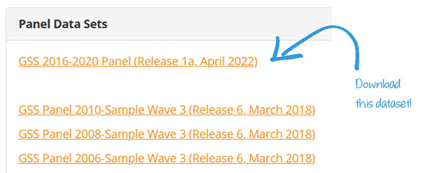
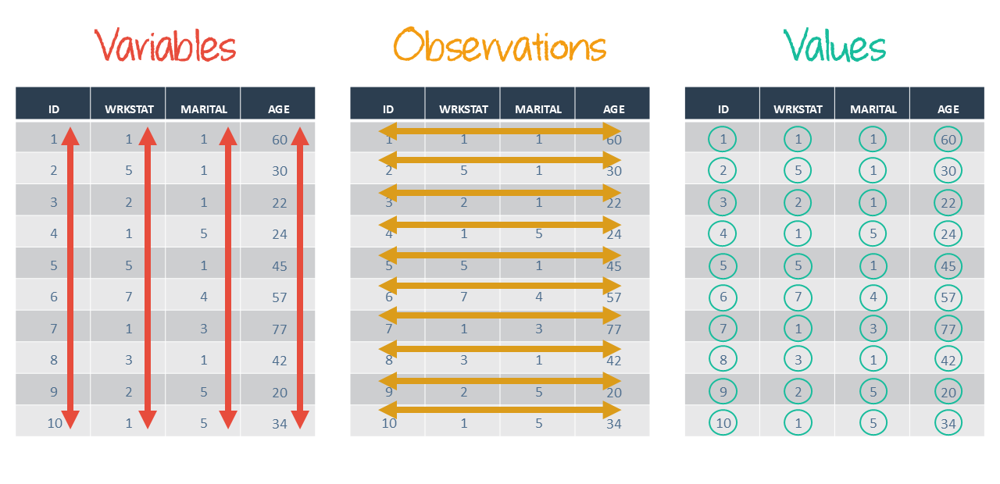
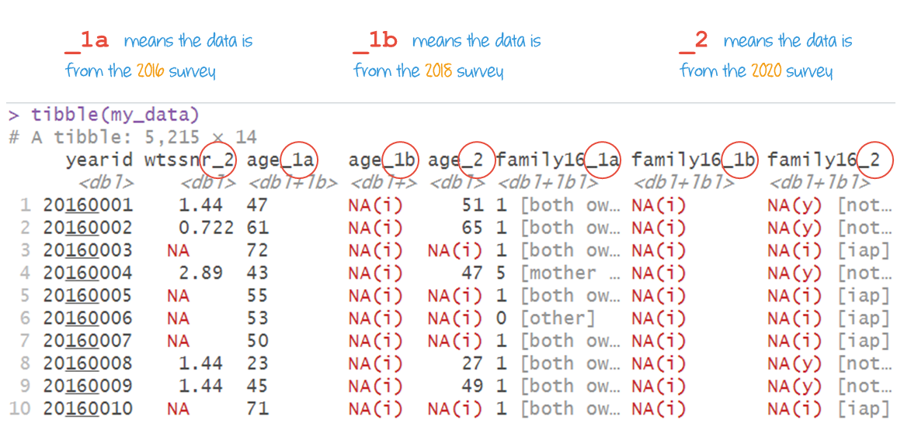
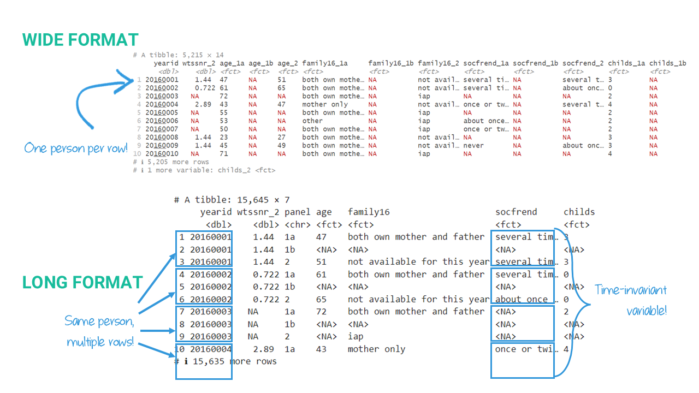

```{r echo=FALSE}

#| label: setup
#| message: false
#| include: false

## Load packages, custom functions, and styles
source("custom-setup-styles.R")

knitr::opts_knit$set(digits = 2)

# Set global theme with base font size 20
theme_set(theme_minimal(base_size = 20))

# Override default discrete color and fill scales
scale_colour_discrete <- function(...) scale_color_manual(values = my_palette)

# Color in math equations
# https://egallic.fr/Recherche/aide-memoire/quarto_equation_colors.html#colors-in-equations-with-revealjs
```

# Agenda {data-menu-title="Agenda" background-image="images/calendar.png" background-size="100px" background-repeat="repeat"}

-   Manipulating Dataframes
-   Joining Dataframes

::: notes
missing data? & **outliers** - dates? - lists
:::

# Learning objectives

By the end of the lecture, you will be able to ...

-   Setup relative file paths for reproducible projects
-   Reshape data between wide and long formats 
-   Reorder columns and rows

# Code-along 04 {data-menu-title="Code-along" background-image="images/terminal.png"}

Download and open [code-along-04.qmd](https://app.filen.io/#/d/3de917ac-ea8c-48a5-9f04-99b8cf7f31b8%23CbYcjNXevz13eP5DiLVBVYRIXBus67Au)

## Packages {.sparse-slide}

Install the
[`here()`](https://cran.r-project.org/web/packages/summarytools/vignettes/introduction.html)
package, available on CRAN.

```{r}
#| message: false
#| label: summarytools
#| eval: false

install.packages("here")
```

<br>

Load the standard packages and our new `here()` package.

```{r}
#| message: false
#| label: load

library(here)
library(tidyverse) 
library(haven) # not core tidyverse
library(gssr)
library(gssrdoc)
library(summarytools)
```

## GSS Panel Data: Download

<https://gss.norc.org/get-the-data/stata>

<br>

{width="100%"}

::: {.callout-tip icon="false"}
##  Heads Up!

Save the **unzipped** file in your class `data` folder.
:::

## GSS Panel Data: Load {.sparse-slide}

```{r}
#| message: false
#| label: gsspanel-01

# Use here() to construct the file path
gss_panel.dta <- here("data", "GSS_2020_panel_stata_1a/gss2020panel_r1a.dta")

#load the data using `haven::read_dta()`
data <- read_dta(gss_panel.dta)

# Or, do both at the same time!
# data <- read_dta(here("data", "GSS_2020_panel_stata_1a/gss2020panel_r1a.dta"))

```

## GSS 2016-2020 Panel Dataset {.sparse-slide}

Study of former 2016 and 2018 GSS respondents were interviewed again in
2020

-   Variables from 2016 (Wave 1a) have [**\_1a**]{style="color: #e74c3c"} appended
-   Variables from 2018 (Wave 1b) have [**\_1b**]{style="color: #e74c3c"} appended
-   Variables from 2020 (Wave 2) have [**\_2**]{style="color: #e74c3c"} appended

## GSS 2016-2020 Panel Dataset {.sparse-slide}

```{r}
#| label: gsspanel-02
#| echo: false

set.seed(815)  # Ensures you get the same sample every time

data |>
  select(yearid, starts_with("year_"), starts_with("age_")) |>
  slice_sample(n = 10) 
```

# Reproducible workflow

## Replication

[**The guiding principle for workflow.**]{style="color: #18BC9C"}

A workflow of data analysis is a process for managing all aspects of
data analysis.

<br>

Planning, documenting, and organizing your work; cleaning the data;
creating, renaming, and verifying variables; performing and presenting
statistical analyses; producing replicable results; and archiving what
you have done are all integral parts of your workflow.

::: aside
Source: (Long 2008)
:::

## Steps in a workflow

|  |  |
|-------------------------------|-----------------------------------------|
| **Set up** | Systematic organization of the project and project files. |
| **Familiarize self with data** | Skipping takes more time in the long run. |
| **Process data** | Takes the [**MOST**]{style="color: #e74c3c;"} time. |
| **Running analyses** | What people **THINK** takes the most time. |
| **Presenting results** | What people (wrongly) think does not take time. |


## Filepaths {.smaller}

A project-based workflow + `here()` avoids changing file paths.

<br>

::::: columns
::: {.column width="60%"}
**ABSOLUTE FILE PATHS**

Department of Sociology\
Unit 17100, 17th Floor, Ontario Power Building\
700 University Ave., Toronto, ON M5G 1Z5

`C:\Users\Pepin\GitHub\SOC6302\scripts`
:::

::: {.column width="40%"}
**RELATIVE FILE PATHS**

Take the left side elevators to the 17th floor.\
Go through the double doors and a take a right.\
First door on your left.

`here`([scripts]{style="color: #18BC9C"})
:::
:::::

## File names

should be:

-   machine-readable
-   human-readable
-   play well with default-ordering

## Project structure

Let's set up your project structure using the `here()` package.


## `here()` {.sparse-slide}

First, let's establish our project directory

```{r}
#| eval: false
#| message: false
#| label: here

# shows the file path to the root of the project
here()

```

<br>

Next, we'll create folders within our project.

## Example folder structure {.smaller}

::::::::::::::::::::: columns

:::::::: {.column width="40%"}
**SOC6302**

::::::: file-tree
<details open>

<summary>SOC6302/</summary>

<details>

<summary>data/</summary>

<div>

gss7924-raw.rda

</div>

<div>

gss7924-processed.Rdata/

</div>

</details>

<details>

<summary>code-alongs/</summary>

</details>

<details>

<summary>milestones/</summary>

</details>

<details>

<summary>project/</summary>

<details>

<summary>data/</summary>

</details>

<details>

<summary>scripts/</summary>

</details>

<details>

<summary>outputs/</summary>

</details>

</details>

<div>

readme.qmd

</div>

<div>

SOC6302.Rproj

</div>

</details>
:::::::
::::::::

:::::::::::::: {.column width="60%"}
**Research Projects**

::::::::::::: file-tree
<details open>

<summary>project/</summary>

<details>

<summary>data/</summary>

<div>

gss7924-raw.rda

</div>

<div>

gss7924-processed.Rdata/

</div>

</details>

<details>

<summary>scripts/</summary>

<div>

clean_data.R

</div>

<div>

analyze_data.R

</div>

<div>

draft.qmd

</div>

</details>

<details>

<summary>outputs/</summary>

<div>

draft.html

</div>

<details>

<summary>figures/</summary>

<div>

plot1.png

</div>

<div>

plot2.png

</div>

</details>

</details>

<div>

readme.qmd

</div>

<div>

project.Rproj

</div>

</details>
:::::::::::::
::::::::::::::


:::::::::::::::::::::

## Create a folder structure

using `here()` and `dir.create()`

```{r}
#| eval: false
#| message: false
#| label: base-folders

# Create base folders
dir.create(here("data"), recursive = TRUE)
dir.create(here("code-alongs"), recursive = TRUE)
dir.create(here("milestones"), recursive = TRUE)
dir.create(here("project"), recursive = TRUE)
```

## Create sub-folders

using `here()` and `dir.create()`

```{r}
#| eval: false
#| message: false
#| label: sub-folders

# Create project sub-folders
dir.create(here("project", "data"), recursive = TRUE)
dir.create(here("project", "scripts"), recursive = TRUE)
dir.create(here("project", "outputs"), recursive = TRUE)

```

## Check your work

report a list of folders and or files in the R-project folders and
sub-folder.

```{r}
#| eval: false
#| message: false
#| label: list-files

# Your SOC6302 class folder
list.files(path = here())

# Your "Project" sub-folder
list.files(path = here("project"))

```


# Manipulating Dataframes {.theme-section}

## Selection helpers {.smaller}

Match variables according to a given pattern.

-    `starts_with()`: Starts with an exact prefix.
-    `ends_with()`: Ends with an exact suffix.
-    `contains()`: Contains a literal string.
-    ...

```{r}
#| label: starts-with-01
#| eval: false

my_data <- data |>
  select(yearid, wtssnr_2, 
         starts_with("age_"), 
         starts_with("family16_"),
         starts_with("socfrend_"),
         starts_with("childs_")) 

```

<br>

. . . 

```{r}
#| label: starts-with-02
#| code-line-numbers: "4|7"

# You can supply multiple prefixes or suffixes.
my_data <- data |>
  select(yearid, wtssnr_2, 
         starts_with(c("age_", "family16_", "socfrend", "childs"))
         )

my_data <- as_factor(my_data) # Apply labels to data

```


## `head()` & `tail()` {.smaller}

Look at the first few column names and **first** few rows.

```{r}
#| label: head
head(my_data, n = 5)
```

<br>

. . .

Look at the first few column names and **last** few rows.

```{r}
#| label: tail
tail(my_data, n = 5)
```

## Reminder: Tidy data

{width="100%"}

##  {data-menu-title="Not tidy data" }

{width="100%"}

. . .

::: {style="color: #e74c3c; font-family: 'Shadows Into Light'"}
**This data is NOT tidy!**  
Some column names include values of a variable (survey year). 
:::


##  {data-menu-title="Tidy data" }

```{r}
#| label: tidy
#| echo: false

my_data |>
  pivot_longer(
    cols = c(-yearid, -wtssnr_2),
    names_to = c(".value", "panel"),
    names_sep = "_") 

```

<br> 

::: {style="color: #18bc9c; font-family: 'Shadows Into Light'"}
**This data is tidy!**  
Each variable in its own column, and each observation in its own row. 
:::

## {data-menu-title="Wide vs Long"}

{width="100%"}

## Reshaping data


## `pivot_longer()`

```{r}
#| label: pivot-longer
#| code-line-numbers: "2|3|4|5"

my_data <- my_data |>
  pivot_longer(
    cols = 3:14, # <1> 
    names_to = c(".value", "panel"), # <2>
    names_sep = "_") # <3>
    
head(my_data, n = 5)
```

1.  `cols =` specifies which columns to pivot; 
2.  `names_to =` creates multiple value columns from the name parts and a new column that stores the identifier.
3.  `names_sep =` where to split the names into a variable (.value) and what to use as a key identifier


## `pivot_wider()`

```{r}
#| label: wider
#| code-line-numbers: "1|2|3|4"

my_data |> # not overwriting my_data
  pivot_wider( # <1>
    names_from = panel, # <2>
    values_from = c(-yearid, -wtssnr_2)) # <3>

head(my_data, n = 5)

```

1.  Increasing the number of columns and decreasing the number of rows
2.  Which column to get the name of the output columns
3.  Which columns to exclude from the pivot

## Recode the reshaped variable

```{r}
#| label: recode-panel

my_data <- my_data |>
  mutate(panel = case_when(
         panel == "1a" ~ 2016,
         panel == "1b" ~ 2018,
         panel == "2" ~ 2020,
         TRUE ~ NA_integer_))

head(my_data, n = 3)
```

. . . 

::: {.callout-tip icon="false"}
##  Heads Up!

`family16` is a time-invariant variable.
:::

## `relocate()` {.smaller}

```{r}
#| label: relocate-01

my_data <- my_data |> 
  relocate(panel)

head(my_data, n = 2)
```

<br>

. . . 

```{r}
#| label: relocate-02

my_data <- my_data |> 
  relocate(panel, .after = yearid)

head(my_data, n = 2)
```

## `arrange()` {.smaller}

```{r}
#| label: arrange-01
#| output-location: column


my_data |> 
  arrange(panel) |>
  select(yearid, panel, age) |>
  head(n = 5)

```

<br> 

. . .

```{r}
#| label: arrange-02
#| output-location: column

my_data |> 
  arrange(desc(panel)) |>
  select(yearid, panel, age) |>
  head(n = 5)

```


# Think Like a Statistician {background-image="images/lightbulb-solid.png" background-size="80px" background-repeat="repeat"}

Are married people above or below average in internet use or income? Does it vary by survey year?

<br>

[ **How do we find
out?**]{style="color: #F39C12; font-size: 175%; font-family: 'Shadows Into Light'"}


## {data-menu-title="Think Like a Statistician" background-image="images/lightbulb-solid.png" background-size="80px" background-repeat="repeat"}

Answering this research question takes a few steps. But, the first step is to create a dataframe with all the necessary information.

[ **Can you reproduce this table?**]{style="color: #F39C12; font-size: 150%; font-family: 'Shadows Into Light'"}

<br>

```{r}
#| label: think-output
#| echo: false

# Reshape data
think_data <- data |>
    select(yearid, 
         starts_with("marital_"), 
         starts_with("wwwhr_"),
         starts_with("realrinc_")) |>
    pivot_longer(
      cols = 2:10,
      names_to = c(".value", "panel"), 
      names_sep = "_") |>
    relocate(panel, .after = yearid)

# recode variables
think_data <- think_data |>
  mutate(panel = case_when(
         panel == "1a" ~ 2016,
         panel == "1b" ~ 2018,
         panel == "2" ~ 2020,
         TRUE ~ NA_integer_),
         marital = as_factor(marital))

## summarize by panel
think_summary <- think_data |>
  drop_na(wwwhr, realrinc)  |>
  group_by(panel) |>  
  summarise(
    avg_www = round(mean(wwwhr), digits = 2), 
    avg_inc = round(mean(realrinc), digits = 2)
    )

think_full <- full_join(think_data, think_summary, by = "panel")

head(think_full, n = 6)

```


## {.smaller data-menu-title="Your Data Take" background-image="images/lightbulb-solid.png" background-size="80px" background-repeat="repeat"}

::: {style="color: #f39c12; font-size: 175%; font-family: 'Shadows Into Light'"}
 **What's your conclusion to our research question?**
:::

```{r}
#| label: think-answer
#| echo: false

# Filter for married individuals and create flags
think_married <- think_full |>
  filter(marital == "married") |>
  group_by(panel) |>
  mutate(
    income_status = ifelse(realrinc > avg_inc, "Above Average", "Below Average"),
    internet_status = ifelse(wwwhr > avg_www, "Above Average", "Below Average")
  )
```

```{r}
#| label: think-answer-01

# Income status
ctable(think_married$income_status, think_married$panel, 
  prop = "c", 
  format = "p", 
  useNA = "no",
  headings = FALSE
)

```


```{r}
#| label: think-answer-02

# Internet status
ctable(think_married$internet_status, think_married$panel, 
  prop = "c", 
  format = "p", 
  useNA = "no",
  headings = FALSE
)
```