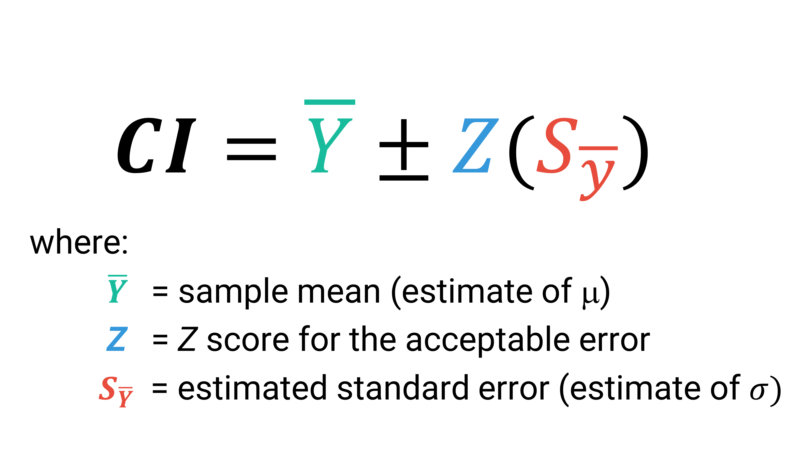

```{r echo=FALSE}

#| label: setup
#| message: false
#| include: false

## Load packages, custom functions, and styles
source("custom-setup-styles.R")

knitr::opts_knit$set(digits = 2)

# Set global theme with base font size 20
theme_set(theme_minimal(base_size = 20))

# Override default discrete color and fill scales
scale_colour_discrete <- function(...) scale_color_manual(values = my_palette)

# Color in math equations
# https://egallic.fr/Recherche/aide-memoire/quarto_equation_colors.html#colors-in-equations-with-revealjs
```

# Agenda {data-menu-title="Agenda" background-image="images/calendar.png" background-size="100px" background-repeat="repeat"}

-   Confidence Intervals
-   Hypothesis Testing

::: notes
-   missing data?
-   **outliers**
-   dates?
-   lists
-   forcats (reorder factor levels)
:::

# Learning objectives

By the end of the lecture, you will be able to ...

-   Use R to calculate confidence intervals for means and proportions
-   Use R to conduct one and two sample t-tests

# Code-along 05 {data-menu-title="Code-along" background-image="images/terminal.png"}

Download and open [code-along-05.qmd](https://www.dropbox.com/scl/fi/bcj7la52a3yv52g785irx/code-along-05.qmd?rlkey=7jx5zydkq8in2i90fg2x1kv48&dl=1)

## Mini-task {data-menu-title="Install `Rmisc()`"}

::: task
 Install the
[`Rmisc()`](https://cran.r-project.org/web/packages/Rmisc/refman/Rmisc.html)
package, available on CRAN.
:::

<br>

::: {style="font-size: 80%"}
[**Run the code chunk in your
code-along.**]{style="color: #18BC9C; font-family: 'Shadows Into Light'"}

*OR:* Copy and paste the code into your [Console
pane]{style="color: #F39C12;"}. Then hit "Enter".
:::

<br>

```{r}
#| eval: false
#| label: install-Rmisc

install.packages("Rmisc")
```

::: notes
[What does this mean in your code-along: "This chunk will not run (on
purpose!) when rendered because eval: false."?]{style="color: #6f42c1"}
:::

::: aside
We'll use `Rmisc()` to calculate confidence intervals with
`summarize()`.
:::

## Mini-task {data-menu-title="Load the packages"}

::: task
 Load the standard packages and our new `Rmisc()`
package.
:::

<br>

```{r}
#| message: false
#| label: load

library(tidyverse)
library(haven) # not core tidyverse
library(gssr)
library(gssrdoc) # load the GSS codebook
library(summarytools)
library(Rmisc) # load the new package
```

::: notes
`haven()` was installed with tidyverse; but it doesn't load
automatically
:::

## Mini-task {data-menu-title="Load your data"}

::: task
 Load the 2022 GSS data.
:::

<br>

. . .

```{r}
#| message: false
#| label: gssdata

# Get the data from the 2022 survey
gss22 <- gss_get_yr(2022)

```

## Variables

-   `wwwhr` Not counting e-mail, about how many minutes or hours per
    week do you use the Web?\
-   `postlife` Do you believe there is a life after death?\
-   `childs` How many children have you ever had?
-   `sex` Respondent's sex

## Mini-task {data-menu-title="Load your data"}

::: task
 Create a dataset named `my_data` with the variables `wwwhr`,
`postlife`, `childs`, & `sex` with no missing data
:::

<br>

. . .

```{r}
#| label: my_data

# Create a new df
my_data <-gss22 |>
  select(wwwhr, postlife, childs, sex) |>
  drop_na()

```

# Confidence Intervals {.theme-section}

## Review: `summarise()` {.sparse-slide}

```{r}
#| label: summarise01
#| output-location: fragment

my_data |>
  summarise(
    n = n(),
    mean = mean(wwwhr),
    sd = sd(wwwhr)
    )

```

##  {data-menu-title="CIs equation"}

::: panel-tabset
### CI

{width="100%"}

### SE


:::

## `summarise()` with equation

```{r}
#| message: false
#| label: summarise02
#| code-line-numbers: "1-5|6|7|8-9"

wwwhr_sum <- my_data |>
  summarise(
    n = n(),
    mean_wwwhr = mean(wwwhr),
    sd_wwwhr = sd(wwwhr),
    se_wwwhr = sd_wwwhr / sqrt(n),
    ci_lower = mean_wwwhr - (1.96 * se_wwwhr),
    ci_upper = mean_wwwhr + (1.96 * se_wwwhr)
    )

```

## Code Meets Question {.sparse-slide background-image="images/gears-solid-full.png" background-size="80px" background-repeat="repeat"}

::: task
 What can we infer about the population mean based
on this confidence interval?
:::

<br>

```{r}
#| label: wwwhr_sum-CMQ

wwwhr_sum

```

## `summarise()` + `CI()` {.sparse-slide}

```{r}
#| label: summarise-ci95
#| code-line-numbers: "6-7"
#| output-location: fragment

wwwhr_ci <- my_data |>
  summarise(
    n = n(),
    mean_wwwhr = mean(wwwhr),
    sd_wwwhr = sd(wwwhr),
    lowCI_wwwhr = Rmisc::CI(wwwhr)['lower'],
    hiCI_wwwhr  = Rmisc::CI(wwwhr)['upper']
    )

wwwhr_ci
```

. . .

::: {style="color: #e74c3c; font-family: 'Shadows Into Light'"}
**Neat! But how confident are we?**
:::

::: notes
That’s really interesting, but don’t we need to know our confidence
level? Otherwise, how do we interpret the interval? What is the
probability that the average number of hours people spend on the
internet per week is between 14.17 hours and 15.62 hours?
:::

## `summarise()` + `CI()` {.sparse-slide}

```{r}
#| label: summarise-ci99
#| code-line-numbers: "6-7"
#| output-location: fragment

wwwhr_ci99 <- my_data |>
  summarise(
    n = n(),
    mean_wwwhr = mean(wwwhr),
    sd_wwwhr = sd(wwwhr),
    lowCI_wwwhr = CI(wwwhr, ci = 0.99)['lower'],
    hiCI_wwwhr  = CI(wwwhr, ci = 0.99)['upper']
    )

wwwhr_ci99
```

::: notes
The default confidence level of the CI() function is 95%. Let’s change
our code to see what the confidence interval looks like if we wanted to
be 99% confident that the true population average number of hours on the
internet was within our confidence interval.
:::

## CIs & percision {.smaller}

::::: columns
::: column
**95% confidence intervals**

```{r}
#| label: table-ci95

wwwhr_ci
```
:::

::: column
**99% confidence intervals**

```{r}
#| label: table-ci99

wwwhr_ci99
```
:::
:::::

<br>


::: task
 **How does a 95% confidence interval differ from a
99% confidence interval in terms of width and certainty?**
:::

## CIs (wrong) with proportions

```{r}
#| label: proportions01
#| output-location: fragment

my_data |>
  summarise(
    n = n(),
    mean_ghosts = mean(postlife),
    sd_ghosts = sd(postlife),
    lowCI_ghosts = CI(postlife, ci = 0.99)['lower'],
    hiCI_ghosts  = CI(postlife, ci = 0.99)['upper']
    )

```

. . .

::: {style="color: #e74c3c; font-family: 'Shadows Into Light'"}
**This doesn't work because the values aren't coded 0 and 1.**
:::

## CIs (correct) with proportions

```{r}
#| label: proportions02
#| output-location: fragment

# Use logic to recode (yes: 1 = 1; no: 2 = 0)
my_data$ghosts <- ifelse(my_data$postlife == 1, 1, 0)
  
my_data |>
  summarise(
    n = n(),
    mean_ghosts = mean(ghosts),
    sd_ghosts = sd(ghosts),
    lowCI_ghosts = CI(ghosts, ci = 0.99)['lower'],
    hiCI_ghosts  = CI(ghosts, ci = 0.99)['upper']
    )

```

## Comparing CIs

::: panel-tabset
### Code

```{r}
#| label: proportions03
#| code-line-numbers: "1-3|5-6|7-13"


my_data$sex <- zap_missing(my_data$sex) 
my_data$sex <- as_factor(my_data$sex)   
my_data$sex <- droplevels(my_data$sex)  

df_ghosts <- my_data |>
  group_by(sex) |>
  summarise(
    n = n(),
    mean = mean(ghosts),
    sd = sd(ghosts),
    lower = CI(ghosts, ci = 0.95)['lower'],
    upper  = CI(ghosts, ci = 0.95)['upper']
    )

```

### Table

```{r}
#| label: proportions04

df_ghosts

```

### Plot

```{r}
#| echo: false
#| label: proportions05

df_ghosts |>
  ggplot(aes(x = mean, y = sex, color = sex)) +
  geom_point(size = 3) +
  geom_errorbar(aes(xmin = lower, xmax = upper), width = 0.2, size = 1.2) +
  theme(legend.position = "none") +
  xlim(.5, 1) +
  labs(title = "Proportion believe in ghosts",
       subtitle = "with 95% confidence intervals",
       y = " ",
       x = " ",
       caption = "US General Social Survey 2022") 
```
:::

## Comparing CIs

::: panel-tabset
### Code

```{r}
#| label: wwwhr01
#| code-line-numbers: "1-2|3-9"

df_wwwhr <- my_data |>
  group_by(sex) |>
  summarise(
    n = n(),
    mean = mean(wwwhr),
    sd = sd(wwwhr),
    lower = CI(wwwhr, ci = 0.95)['lower'],
    upper  = CI(wwwhr, ci = 0.95)['upper']
    )

```

### Table

```{r}
#| message: false
#| label: wwwhr02

df_wwwhr

```

### Plot

```{r}
#| echo: false
#| message: false
#| label: wwwhr03

df_wwwhr |>
  ggplot(aes(x = mean, y = sex, color = sex)) +
  geom_point(size = 3) +
  geom_errorbar(aes(xmin = lower, xmax = upper), width = 0.2, size = 1.2) +
  theme(legend.position = "none") +
  xlim(0, 22) +
  labs(title = "Average hours of internet use per week",
       subtitle = "with 95% confidence intervals",
       y = " ",
       x = " ",
       caption = "US General Social Survey 2022") 
```
:::

# Hypothesis Testing {.theme-section}

## `t.test()`

Performs one and two sample t-tests. To use this function, we’ll need to
specify a few things:

-   variable of interest
-   mu (H0): a number indicating the true value of the mean
-   alternative hypothesis (H1): “two.sided”, “greater”, or “less”

## `t.test()` in action

In your family sociology course you learned that fertility rates have
been dropping.

You used to think that people had 2 children, on average. But, now you
suspect that people are having fewer than 2 children.

<br>

. . .

::: task
 How do you test your hypothesis?
:::

##  {.quiz-question data-menu-title="Knowledge Check" background-image="images/clipboard-question.png" background-size="100px" background-repeat="repeat"}

::: {style="color: #F39C12"}
 Which of these equations represents your
**research** hypothesis?
:::

-   [H1: µ ≠ 2]{data-explanation="😲 But you have a direction in mind."}
-   [H1: µ =
    2]{data-explanation="You think the average is 2 kids exactly?"}
-   [H1: µ \< 2]{.correct data-explanation="💯 Correct!"}
-   [H1: µ \>
    2]{data-explanation="You think the average is greater than 2 kids?"}

##  {.quiz-question data-menu-title="Knowledge Check" background-image="images/clipboard-question.png" background-size="100px" background-repeat="repeat"}

::: {style="color: #F39C12"}
 Which of these equations represents your
**null** hypothesis?
:::

-   [H0: µ ≠ 2]{data-explanation="The null hypothesis is always '='"}
-   [H0: µ = 2]{.correct data-explanation="💯 Correct!"}
-   [H0: µ \<
    2]{data-explanation="😲 This was your research hypothesis."}
-   [H0: µ \> 2]{data-explanation="The null hypothesis is always '='"}

## Review: Summary Statistics

```{r}
#| label: childs-summarise
#| output-location: fragment

my_data |>
  summarise(
    n = n(),
    mean = mean(childs),
    median = median(childs),
    sd = sd(childs))

```

. . .

::: {style="color: #e74c3c; font-family: 'Shadows Into Light'"}
Is the difference between our sample mean and 2 statistically
significant or could we have gotten this mean simply by chance (sample
variation)?
:::

## Review: CIs

```{r}
#| label: childs-CI
#| code-line-numbers: "7-11"
#| output-location: fragment

my_data |>
  summarise(
    n = n(),
    mean = mean(childs),
    median = median(childs),
    sd = sd(childs),
    se = sd / sqrt(n),
    lower = CI(childs, ci = 0.99)['lower'],
    upper  = CI(childs, ci = 0.99)['upper']
    )

```

. . .

::: {style="color: #e74c3c; font-family: 'Shadows Into Light'"}
Does the confidence interval overlap with 2? What does that tell you?
:::

## One sample `t.test()` for means

```{r}
#| label: ttest01
#| output-location: fragment

t.test(my_data$childs)

```

. . .

> **H0 = 0 by default**

## One sample `t.test()` for means

```{r}
#| label: ttest02

t.test(my_data$childs, mu=2, alternative="less") # Ho: mu=2

```

. . .

> **H0 = 2; one-tail test**

##  {.quiz-question data-menu-title="Knowledge Check" background-image="images/clipboard-question.png" background-size="100px" background-repeat="repeat"}

::: {style="color: #F39C12"}
 Assuming an α level of .05, should you
reject the null hypothesis?
:::

-   [No, because the 𝛼 level of .01 is greater than the p-value (\<
    .000).]{data-explanation="😲 The p-value is less than 𝛼."}
-   [No, because the p-value (\< .000) is less than the 𝛼 level of
    .01.]{data-explanation="Y😲 The p-value is less than 𝛼."}
-   [Yes, because the p-value (\< .000) is less than the 𝛼 level of
    .01.]{.correct data-explanation="💯 Correct!"}

##  {.quiz-question data-menu-title="Knowledge Check" background-image="images/clipboard-question.png" background-size="100px" background-repeat="repeat"}

::: {style="color: #F39C12"}
 Which of these statements best summarizes
your conclusion?
:::

-   [Our evidence proves that people have fewer than two children, on
    average.]{data-explanation="😲 We can't prove our research hypothesis."}
-   [People, on average, have two
    children.]{data-explanation="😲 Is that what the mean showed?"}
-   [On average, the number of children people have is statistically
    significantly lower than two.]{.correct
    data-explanation="💯 Correct!"}

## two sample `t.test()` in action

::: task
 Are the proportions of men and women who believe in
ghosts statistically significantly different?
:::

. . .

```{r}
#| label: ttest03
#| output-location: fragment

t.test(my_data$ghosts ~ my_data$sex, alternative = "two.sided")

```

##  {.quiz-question data-menu-title="Knowledge Check" background-image="images/clipboard-question.png" background-size="100px" background-repeat="repeat"}

::: {style="color: #F39C12"}
 Assuming an α level of .05, what do you
conclude?
:::

-   [There is no statistically significant difference between men and
    women in belief in
    ghosts.]{data-explanation="😲 The p-value is less than 𝛼."}
-   [Men are significantly more likely than women to believe in ghosts
    (p \< .05).]{data-explanation="Y😲 Look at the sample means again."}
-   [Women are significantly more likely than men to believe in ghosts
    (p \< .05).]{.correct data-explanation="💯 Correct!"}

## Aside: paired `t.test()` {.sparse-slide}

**Independent group t-test**\
[Do two subsamples have the same
mean?]{style="color: #F39C12; font-family: 'Shadows Into Light'"}

```{r}
#| message: false
#| label: ttest-samples
#| eval: false

t.test(my_data$ghosts ~ my_data$sex, alternative = "two.sided")

```

<br>

. . .

**Paired t-test**\
[Do two variables have the same
mean?]{style="color: #F39C12; font-family: 'Shadows Into Light'"}

```{r}
#| message: false
#| label: ttest-paired
#| eval: false

t.test(Pair(hrs1_2018, hrs1_2020) ~ 1, data = gss_panel)

```

# Think Like a Statistician {background-image="images/lightbulb-solid.png" background-size="80px" background-repeat="repeat"}

## Think Like a Statistician {background-image="images/lightbulb-solid.png" background-size="80px" background-repeat="repeat"}

[ **Do women have more years of education
(`educ`) than men, on
average?**]{style="color: #F39C12; font-size: 100%; font-family: 'Shadows Into Light'"}

<br>

. . .

[ **Are the proportions of men & women who
support abortion for any reason (`abany`) statistically
different?**]{style="color: #F39C12; font-size: 100%; font-family: 'Shadows Into Light'"}

<br>

. . .

[ **Do fewer men than women support gun laws
(`gunlaw`)?**]{style="color: #F39C12; font-size: 100%; font-family: 'Shadows Into Light'"}

::: aside
Use the 2022 GSS dataset
:::

## Think Like a Statistician {background-image="images/lightbulb-solid.png" background-size="80px" background-repeat="repeat"}

::: panel-tabset
### `educ`

```{r}
#| message: false
#| label: educ01
#| echo: false
#| results: hide

## See what the DV looks like
freq(gss22$educ)

## Run some basic stats
gss22 |>  
  select(year, educ, sex) |> 
  drop_na(educ, sex)  |>
  group_by(sex) |>  
  summarise(
    count = n(),
    min = min(educ),
    median = median(educ),
    max = max(educ),
    mean = round(mean(educ), digits = 2), 
    sd = sd(educ),
    lower = CI(educ, ci = 0.95)['lower'],
    upper = CI(educ, ci = 0.95)['upper']
    ) 

```

```{r}
#| message: false
#| label: educ02
#| echo: false

t.test(gss22$educ ~ gss22$sex, alternative = "less")

```

### `abany`

```{r}
#| message: false
#| label: abany01
#| echo: false
#| results: hide

## See what the DV looks like
freq(gss22$abany)

# Use logic to recode (yes: 1 = 1; no: 2 = 0)
gss22$abany <- ifelse(gss22$abany == 1, 1, 0)

## Run some basic stats
gss22 |>  
  select(year, abany, sex) |> 
  drop_na(abany, sex)  |>
  group_by(sex) |>  
  summarise(
    count = n(),
    min = min(abany),
    max = max(abany),
    mean = round(mean(abany), digits = 2), 
    sd = sd(abany),
    lower = CI(abany, ci = 0.95)['lower'],
    upper = CI(abany, ci = 0.95)['upper']
    ) 

t.test(gss22$abany ~ gss22$sex, alternative = "two.sided")

```

```{r}
#| message: false
#| label: abany02
#| echo: false

t.test(gss22$abany ~ gss22$sex, alternative = "two.sided")

```

### `gunlaw`

```{r}
#| message: false
#| label: gunlaw01
#| echo: false
#| results: hide

## See what the DV looks like
freq(gss22$gunlaw)

# Use logic to recode (yes: 1 = 1; no: 2 = 0)
gss22$gunlaw <- ifelse(gss22$gunlaw == 1, 1, 0)

## Run some basic stats
gss22 |>  
  select(year, gunlaw, sex) |> 
  drop_na(gunlaw, sex)  |>
  group_by(sex) |>  
  summarise(
    count = n(),
    min = min(gunlaw),
    max = max(gunlaw),
    mean = round(mean(gunlaw), digits = 2), 
    sd = sd(gunlaw),
    lower = CI(gunlaw, ci = 0.95)['lower'],
    upper = CI(gunlaw, ci = 0.95)['upper']
    ) 

t.test(gss22$gunlaw ~ gss22$sex, alternative = "two.sided")

```

```{r}
#| message: false
#| label: gunlaw02
#| echo: false

t.test(gss22$gunlaw ~ gss22$sex, alternative = "two.sided")

```
:::
