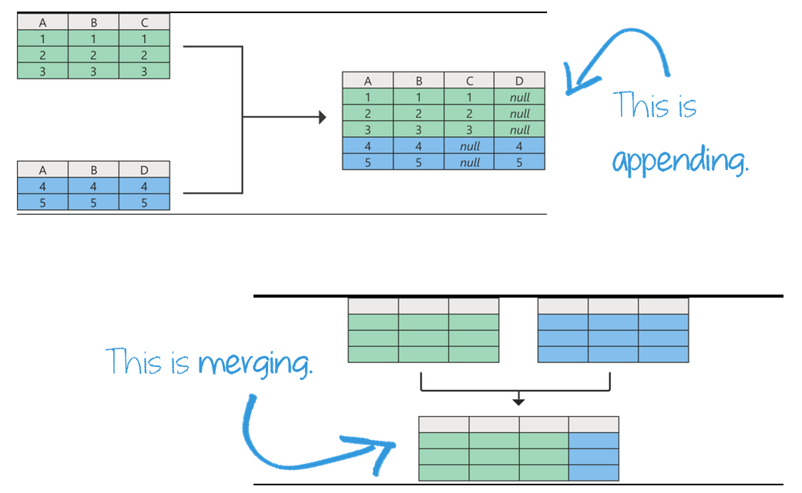
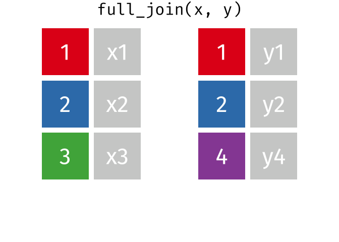

```{r echo=FALSE}

#| label: setup
#| message: false
#| include: false

## Load packages, custom functions, and styles
source("custom-setup-styles.R")

knitr::opts_knit$set(digits = 2)

# Set global theme with base font size 20
theme_set(theme_minimal(base_size = 20))

# Override default discrete color and fill scales
scale_colour_discrete <- function(...) scale_color_manual(values = my_palette)

# Color in math equations
# https://egallic.fr/Recherche/aide-memoire/quarto_equation_colors.html#colors-in-equations-with-revealjs
```

# Agenda {data-menu-title="Agenda" background-image="images/calendar.png" background-size="100px" background-repeat="repeat"}

-   X
-   Y

::: notes
-   forcats (reorder factor levels)
-   missing data?
-   **outliers** -- data viz & tables
-   dates?
-   lists
:::

# Learning objectives

By the end of the lecture, you will be able to ...

-   Combine and expand dataframes
-   YY

# Code-along 08 {data-menu-title="Code-along" background-image="images/terminal.png"}

Download and open [code-along-08.qmd]()

## Packages {.sparse-slide}

Load the standard packages.

```{r}
#| message: false
#| label: load

# Only need to install once per machine. 
# install.packages("gtsummary")

library(here)
library(tidyverse) 
library(haven) # not core tidyverse
library(gssr)
library(gssrdoc) # load the GSS codebook
library(summarytools)
library(gtsummary) 
```


# Joining Dataframes {.theme-section}

## appending v.s. merging {.sparse-slide}

::: {.callout-note icon="false"}
##  APPEND
add new observations (rows) to existing variables
:::

<br>

::: {.callout-note icon="false"}
##  MERGE
add new variables (columns) to existing observations
(many merge types)
:::

## appending v.s. merging {.sparse-slide}

{width="100%"}

## Example datasets {.sparse-slide}

:::: columns

::: column
**dataframe 1**

```{r}
#| label: df1
#| echo: false

# Create the example dataframes
df_partner1 <- data.frame(
  coupleid = c(2, 1, 3),
  name = c("John", "Megan", "Bin"),
  age = c(42, 36, 38)
)

df_partner1
```
:::

::: column
**dataframe 2**

```{r}
#| label: df2
#| echo: false

df_partner2 <- data.frame(
  coupleid = c(1, 3, 2),
  name = c("Sue", "Ye-jin", "Chrissy"),
  age = c(40, 39, 35)
)
df_partner2
```
:::
::::

<br>

**dataframe 3**

```{r}
#| label: df3
#| echo: false

df_family <- data.frame(
  coupleid = c(3, 1, 4),
  marstat = c(1, 0, 1),
  numchild = c(1, 0, 2),
  country = c("S.Korea", "US", "Canada")
)
df_family
```


## append data with `bind_rows()` {.sparse-slide}

```{r}
#| label: append

df_all <- bind_rows(df_partner1, df_partner2)

tibble(df_all)
```

## merge data with joins {.sparse-slide}

add columns from `df1` to `df2`, matching observations based on the keys

-    `left_join()` keeps all observations in `df1`.
-    `right_join()` keeps all observations in `df2`.
-    `full_join()` keeps all observations in `df1` and `df2`.
-    `inner_join()` only keeps observations from `df1` that have a matching key in `df2`

## `left_join()` {.smaller}

::: columns
::: {.column width="35%"}

:::

::: {.column width="65%"}
```{r}
#| label: left-join

df_couples <- left_join(df_partner1, df_family, by = "coupleid")

tibble(df_couples)
```
:::
:::


## `right_join()`  {.smaller}

::: columns
::: {.column width="35%"}

:::

::: {.column width="65%"}
```{r}
#| label: right-join

df_couples <- right_join(df_partner1, df_family, by = "coupleid")

tibble(df_couples)
```
:::
:::

## `full_join()`  {.smaller}

::: columns
::: {.column width="35%"}

:::

::: {.column width="65%"}
```{r}
#| label: full-join

df_couples <- full_join(df_partner1, df_family, by = "coupleid")

tibble(df_couples)
```
:::
:::

## `inner_join()`  {.smaller}

::: columns
::: {.column width="35%"}

:::

::: {.column width="65%"}
```{r}
#| label: inner-join

df_couples <- inner_join(df_partner1, df_family, by = "coupleid")

tibble(df_couples)
```
:::
:::
