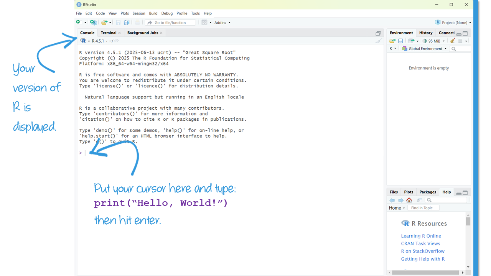

```{r setup, include=FALSE}
library(learnr)
library(fontawesome)
library(gfonts)

knitr::opts_chunk$set(echo = TRUE)
```

<link href="https://fonts.googleapis.com/css2?family=Shadows+Into+Light&display=swap" rel="stylesheet">

<script>
  document.addEventListener("DOMContentLoaded", function () {
    document.querySelectorAll("a[href^='http']").forEach(function(link) {
      link.setAttribute("target", "_blank");
      link.setAttribute("rel", "noopener noreferrer");
    });
  });
</script>

Introduction to Data Analysis
--------------------------------------------------------------------------------

{ width=25% }


`r fa("fas fa-lightbulb", fill = "#18BC9C")` [**LEARNING OBJECTIVES**]{style="color: #18BC9C;"}

1.  Learn to use the tutorials
2.  Describe effective methods of learning to code
3.  Set up your R environment

`r fa("fas fa-book", fill = "#18BC9C")` [**READINGS**]{style="color: #18BC9C;"}

Readings are available on Quercus.

1. Wheelan, Charles. 2014. “What’s the Point?” Pp. 1–14 in *Naked Statistics: Stripping the Dread from the Data*. New York: W. W. Norton & Company.


`r fa("fas fa-language", fill = "#18BC9C")` [**TERMS**]{style="color: #18BC9C;"}

-   Grappling\
-   Reproducible example\
-   R\
-   RStudio\


Introduction to Tutorials
--------------------------------------------------------------------------------

Before proceeding through the tutorial or attending class lectures, you should first complete the assigned readings (available on Quercus). 

A new tutorial will be available most weeks. Tutorials will focus on conceptual understanding of descriptive and basic inferential statistical concepts. Each tutorial contains a mixture of new content, explanations to go along with your readings, videos to watch, and practice questions.  

### Practice

Throughout the tutorials, you'll see the <practice>`r fa("otter")`</practice> (e.g., otter icon), indicating a review of recently covered tutorial material. It is strongly recommended that you re-try these practice questions until you have mastered the concepts.  
  
The otter icon symbolizes playfulness, curiosity, and emotional intelligence. It's a reminder to take a lighthearted approach to learning statistics.  

Let's try it out.  

<br>
  
<practice>`r fa("otter")` PRACTICE:</practice>
```{r P00, echo=FALSE}
  question("Why do you love statistics and coding?",
         answer("Because uncovering patters in data feels like solving a mystery.",
                message = "Get your Scooby Doo on!"),
         answer("Because empirical evidence helps me understand a messy world.",
                message = "Things are complicated. The world needs you!"),
         answer("Because visualizing data with code is both fun and rewarding.",
                message = "Who doesn't like drawing pictures?!"),
         answer("All of the above (and more!).", correct = TRUE),
         random_answer_order = FALSE,
         allow_retry = TRUE
)
```
  
  
At times, you may also be asked to practice interpretation of R output within the tutorials. The code will be pre-written for you and all you will have to do is click the ‘Run’ button to see the results. 
  
Other times, you will practice coding by revising existing code or manually typing in your own code to run. You can’t break the tutorial code. If you get an error message, press the ‘Start Over’ button and the code will automatically reset to the default.  If you get stuck, you can click the ‘Hint’ button for some help. Phew!

{ width=100% }
  
<br />  

Let's try it out. Click the `Run Code` button below.

```{r head, exercise=TRUE}
print("Hello, World!")
```

```{r head-solution}
print("Hello, World!")
```

<div id="head-hint">
**HINT:** Just push the `Run Code` button to see the output.
</div>
<br />


::: {.my-tip}
#### Heads Up!
Look for the pen icon for key information to pay attention to throughout the tutorial.
:::
    
<br>

{ width=80% }  


### Learning Check  


At the end of each tutorial, you will complete a Learning Check. 
These questions are not for credit but provide a tool for you to check your own learning progress.

You should aim to complete a Learning Check each week in order to keep up with the course material.  
  
You are responsible for learning the content in all of the readings, videos, and tutorial content. 
Expect that all information available in a tutorial will appear during the interactive lecture, 
the midterm, or will be necessary to complete your research brief.  
  
Make sure you have 'submitted' each answer so that it will be auto-graded.  
  
{ width=90% }
  
  
At any time, you can start the tutorial over by clicking the "Start Over" button underneath the table of contents (left side of the tutorial).  


Learning to Code
--------------------------------------------------------------------------------
  
#### Technology is fun!

You're not just learning the statistical concepts in this course, but how to produce the statistics. Analyzing data requires learning to use new technology. 

Learning statistical software to analyze data can be really fun. You get to learn about real world social problems! 

#### Technology is challenging!

But, it can also be frustrating. There's even a bingo card of common errors (i.e. bugs) that new statistical programmers will expect to experience.

{ width=80% }
  
<br>

[**Why are you making me learn something so frustrating?**]{.shadows-text style="color: #F39C12; font-size: 150%;"}  
  
One reason is that [**calculating the statistics by hand quickly gets cumbersome, time consuming, and difficult**]{style="color: #18BC9C;"}. You'll learn the statistical techniques using small sample sizes, but to really understand the social world, datasets typically have 100s, 1,000s, even 100,000s of values.  
  
The second reason to learn statistical software is because [**good social science is built on replication**]{style="color: #18BC9C;"}. 
It is impractical, and more prone to errors, for scientists to replicate research by hand. Replication of statistical procedures helps catch minor coding errors, highlights unusual decisions made by researchers, inappropriate statistical techniques, and corrupted data.  
  
But technology presents its own challenges. Replication using technology requires researchers to use sometimes unfamiliar software, working on devices with unique environments and settings.  
  
When it feels like the technology is preventing you from getting to the course content, take a deep breath, and **remember that building your technology skills is part of this course.**  

###

### Failure

A common misconception is that some people are just not math (or tech) people. 
[This is a myth.](https://www.theatlantic.com/education/archive/2013/10/the-myth-of-im-bad-at-math/280914/){target="_blank"} 
  
::: {style="color: #18BC9C; font-family: 'Shadows Into Light'; font-size: 150%; font-weight: bold"}
"People’s belief that 'math ability' can’t change becomes a self-fulfilling prophecy."
:::

Confidence and persistence likely have a larger role in math ability than genetics.  

{ width=50% }

It is important to remain process oriented rather than product oriented. 
Instead of focusing on outcomes, such as external rewards (grades), focus on your learning process. 
How do you do that? One approach is to change your mindset.  

Adopting a [**"growth mindset"**](https://hbr.org/2016/01/what-having-a-growth-mindset-actually-means) will help you get the most out of this course. A growth mindset is the belief that your skills and abilities can develop (through work and practice).  
  
Another key to increasing your confidence is to expect failure. 
Failure is part of learning. When students are afraid of failing, it is harder for them to learn. 
But, research shows that students must occasionally fail, and even be frustrated at times, to really learn.  

Get comfortable with making mistakes right now. 
Failure is part of the learning process. Your job is to persist. 
    
Your code is not expected to be perfect the first time. 
Identifying and fixing errors in your own code is such an inherent part of the process, 
there's even a name for it: **debugging**  
 
{ width=100% }

<br>

### Grappling

Learning to use statistical software necessitates [**grappling**](https://www.edutopia.org/blog/4-tips-teaching-problem-solving-from-student-anna-pelletiere). 

::: {style="color: #F39C12; font-size: 125%; font-family: 'Shadows Into Light'; font-weight: bold"}
Grappling implies trying even before you fail the first time.  
  
It’s thinking, “First, I’ll work with it independently. Okay, I’m really
not understanding it. Let me go back to my notes. Okay, I have solved
for the first part of it. Now I have the second part of it. Okay, I got
the question wrong; let me try again. Maybe I can ask my peer now.”  
  
Grappling is working hard to make sure you understand the problem fully,
and then using every resource at your fingertips to solve it.”  
:::
  
  
In this course, this means you'll put your active learning skills to use. 
You, not your professor or TA, will work through encountered problems. 
You, of course, will be supported and coached through the entire process. 
Working with statistical software will become easier as you build your skills in problem-solving errors. Unfortunately, it gets increasingly difficult if you 
rely on others to solve the issue, as the errors stack-up.  
  
If you learn one thing in this course, I want you to walk away having better problem solving skills. 
This is because most statistical analyses happen **not because the person is a math genius**, 
but because they persisted through the minefield of technical issues by **being excellent problem-solvers.** 
  

[**Coding is mostly Googling**]{style="color: #18BC9C; font-weight: bold"}


It is a misperception that the best statistical analysts sit down at their computers and type code from memory. 
In fact, much of process of coding is **copying code from somewhere else and modifying it** to fit your particular situation. 
There's even a common refrain that "coding is mostly Googling."  
  
Learning to analyze data with software requires a lot of practice and attention to detail. 
It also requires a lot of time searching the internet for help. 
Learning to identify the right words and phrases in a Google search is part of building your coding skills.  

Try to stay focused on being in the process, not the outcome.

{ width=80% }


#### When you get stuck...

[**...there are many options to get unstuck:**]{style="color: #18BC9C"}

-   Review the slides. Pay very close attention to small details.
-   Try something else to see if you get a new error.
-   Use Google to search for possible answers or new explanations.
-   Watch a help video on YouTube on the topic.
-   Re-start your web-browser or device.
-   Try another web-browser or device.
-   Ask a peer. Or an advanced student.
-   Start or join a weekly study group.
-   Post the question on the class discussion board.
-   Email your TA

When none of these strategies fix the issue, it is time to ask for help.  
  
  
### How to get help

The best quantitative researchers produce a trail for their code so that future researchers can replicate their analysis.  

::: {.my-tip}
#### Heads Up!
Replication principles should be used when asking for help.
:::


::: {style="color: #18BC9C; font-family: 'Shadows Into Light'; font-size: 150%; font-weight: bold"}
Goal: Make someone else feel your pain!
:::
 
How do you make someone else feel your pain?  
  
<br />

#### Create a trail!

{ width=90% }

<br>

#### Create a reproducible example

-   Assume others know nothing about your issue. 
-   Describe your steps to create the problem so that someone else can replicate it. 
-   This means clearly describing the issue and the steps you've already taken to solve it.   
<br />  

#### Good etiquette

**Search for answers before posting your question.**\
[Let me google that for you. 🙄]{style="color: #18BC9C; font-family: 'Shadows Into Light'; font-weight: bold"} 

**Describe the problem.**\
["It doesn't work" isn't descriptive enough.]{style="color: #18BC9C; font-family: 'Shadows Into Light'; font-weight: bold"} 

**Describe your environment.**\
[What operating system are you using? Which R version? What packages? Dataset?]{style="color: #18BC9C; font-family: 'Shadows Into Light'; font-weight: bold"}\

**Describe the solution.**\
[Confirm if a solution offered works. Or, if you solve it on your own, post how you solved
it.]{style="color: #18BC9C; font-family: 'Shadows Into Light'; font-weight: bold"}

<br />

#### Help in this class

In this class, the fastest way to get help on milestones or your research brief is during the lab. The second fastest way is to **post your reproducible example on the Quercus discussion board**.  
  
If none of these solve your problem, draft an email to your TA, with detailed notes about the problem and the troubleshooting steps you've already taken. You might be surprised how often even writing the problem out in detail helps you find the answer on your own. Send your email if you still need assistance.  
  

[**Before requesting an individual meeting with a
TA:**]{style="color: #E74C3C"}

-   Spend a sufficient amount of time working on it on your own.
-   Ask two of your peers.
-   Post the question on the class discussion board.

[**When emailing:**]{style="color: #E74C3C"}

-   Explain what troubleshooting steps you’ve already taken.
-   Report who you’ve already asked for help.


R environment
--------------------------------------------------------------------------------

Normally, tutorials are self-contained in your web-browser -- everything you need to do will take place within the tutorial.  

However, we need to set up your computing environment before the first interactive-lecture. So, we're going to make an exception this one time.  
  
Learning to **write** a computer program to print `Hello, World!` to your
screen is often the first thing you learn in programming.

To make sure you are ready **use** a computer program (R) to work with
data, let's set up your device to use R to print this sentence to your screen.

<br>

#### Computational toolkit:

1.  **R**: The programming language you'll learn in this course.

2.  **RStudio**: The software you'll use to write R code in.

<br>

::: {.my-tip}
#### Heads Up!
R is the name of the programming language itself and RStudio is a
convenient interface.
:::  
  
###
  
### Download and Install R

R is available through the web page of [The Comprehensive R Archive
Network](http://cran.r-project.org/) (CRAN).

The top of the web page provides three links for downloading R. Follow
the link that describes your operating system: Windows, Mac, or Linux.
Complete instructions area available from
[rstudio-education](https://rstudio-education.github.io/hopr/starting.html),
with key steps listed below.

#### **R: Windows**

To install R on Windows, click the “Download R for Windows” link.

Then click the “base” link.

Next, click the first link at the top of the new page. This link should
say something like “Download R 4.5.1 for Windows.” (Note: 4.5.1 will be
replaced by the most current version of R.)

The link downloads an installer program, which installs the most
up-to-date version of R for Windows.

Run this program and step through the installation wizard that appears.
The wizard will install R into your program files folders and place a
shortcut in your Start menu. You’ll need to have all of the appropriate
administration privileges to install new software on your machine.

<br>

::: {.my-tip}
#### Windows Help Video
If you prefer to watch a video or would like more details, 
I recommend Windows users 
[watch this video](https://www.youtube.com/watch?v=4AjFbJsNNb8). 
Or, you can search out a video yourself if you prefer.
:::

<br>

#### **R: Mac**

To install R on a Mac, click the “Download R for Mac” link. Next, click
on the `R-4.5.1` package link (or the package link for the most current
release of R). An installer will download to guide you through the
installation process. The installer lets you customize your
installation, but the defaults will be suitable for most users. If your
computer requires a password before installing new progams, you’ll need
it here.

<br>

::: {.my-tip}
#### MAC Help Video
If you prefer to watch a video or would like more details, 
I recommend Mac users 
[watch this video](https://www.youtube.com/watch?v=8NvvydRwxEI). 
Or, you can search out a video yourself if you prefer.
:::  
  
### Download & Install R-studio

After you have installed R, you are ready to begin this section! 
In your web browser (e.g., Chrome, Safari, Edge), go to: 
[https://posit.co/download/rstudio-desktop/](https://posit.co/download/rstudio-desktop/)

Since you've already installed R, you're reading for step 2.  

Click on the `"DOWNLOAD RSTUDIO DESKTOP FOR WINDOWS/MAC0S"` button.  

This is a big file, so it may take a few minutes to download. 
Once it's downloaded, click on the file to install it. 
  
  
### Open RStudio

Once you've installed R and RStudio, locate RStudio and open it.

**Windows Users**: you'll find RStudio by either using the Windows search bar or 
clicking on the Windows start button and then typing "RStudio."

**Mac Users**: RStudio will can be found in your launchpad, 
or you can drag and drop it to your applications folder. Click "Open" when asked 
if you want to open the program that has been downloaded from the internet. 
If a pop-up asks if you want to install "git" tools, you can click "Cancel" 
(not necessary for this class).

  
  
#### **`print()`**

In RStudio (not in this tutorial), put your cursor next to the `>` and type: `print("Hello, World!)` 

Then press enter. You should see your sentence appear below it.

{width=100%}

<br>


```{r}
print("Hello, World!")
```


<br>

::: {.my-tip}
#### Heads Up!
`print` is case-sensitive (e.g., don't capitalize "p"). 
Include the parentheses and quotes. 
Move your cursor to after the last ")" before hitting "Enter". 
:::
  
<br>
  
Congrats! You're ready to begin analyzing data! 


Learning Check 01
--------------------------------------------------------------------------------

Please answer the following questions to verify you understand the topics in this module. 
  
********************************************************************************

```{r Q01, echo=FALSE}
question("Q01. What does failure have to do with learning statistics?",
    answer("Students must occasionally fail to really learn new skills.", correct = TRUE),
    answer("Students who are 'math people' will fail less often than other students."),
    answer("Students should avoid failure by studying as many hours as possible."),
    answer("Most of the time failure can and should be avoided by reading the course materials."),
    random_answer_order = TRUE,
           allow_retry = TRUE
  )
```

```{r Q02, echo=FALSE}
question("Q02. What does the otter icon in the tutorials symbolize?",
         answer("Playfulness, curiosity, and emotional intelligence", correct = TRUE),
         answer("Mastery of statistical concepts."),
         answer("A strict and serious approach to learning."),
         answer("Completion of all practice questions."),
         random_answer_order = TRUE,
         allow_retry = TRUE
           )
```

```{r Q03, echo=FALSE}
question("Q03. Are you able to print `Hello, World!` in RStudio on your own device?",
         answer("Yes, of course! I'm ready for class!", correct = TRUE,
                message = "Great! See you soon Rockstar!"),
         answer("No, I'm going to get help in class", 
                message = "You won't have time and you'll start behind!"),
         answer("No, RStudio requires a paid subscription I can't afford.",
                message = "RStudio is free. Get to work!"),
         answer("No, I'm not good with technology.", 
                message = "Review the 'Learning to Code' section and then try it again."),
         random_answer_order = TRUE,
         allow_retry = TRUE
           )
```

```{r Q04, echo=FALSE}
question("Q04. What does Oscar Gandy suggest about the relationship between statistical models and real-world phenomena?",
         answer("Statistical models perfectly represent real-world phenomena"),
         answer("Statistical models are simplifications that help us understand complex realities.", correct = TRUE),
         answer("Statistical models are irrelevant to real-world applications."),
         answer("Statistical models eliminate the need for continuous data collection."),
         random_answer_order = TRUE,
         allow_retry = TRUE
         )
```

```{r Q05, echo=FALSE}
question("Q05. What does Charles Wheelan suggest about the misuse of statistics?",
         answer("Statistics can almost always be trusted, regardless of context."),
         answer("Statistics can be manipulated to mislead or support biased conclusions.", correct = TRUE),
         answer("Statistics are often irrelevant in real-world applications."),
         answer("Statistics reduce the need for critical thinking."),
         random_answer_order = TRUE,
         allow_retry = TRUE
)
```