```{r setup, include=FALSE}

# GLOBAL ENVIRONMENT PANE
## source("tutorials/SOC6302-03/custom-setup-styles.R")
## library(gssr)
## library(gssrdoc)
## data(gss_all)
## gss24 <- gss_get_yr(2024)
## data(gss_dict)

## Load packages, custom functions, and styles
source("custom-setup-styles.R")

## Load all gss
gss_all <- readRDS("data/gss_all.rds")

# Get the data only for the 2024 survey respondents
gss24 <- readRDS("data/gss24.rds")

## Options
tutorial_options(exercise.checker = gradethis::grade_learnr)
options(dplyr.summarise.inform=F)   # Avoid grouping warning
options(digits=4)                   # Round numbers
theme_set(theme_minimal())          # set ggplot theme
# st_options(freq.report.nas = FALSE) # remove extra columns in freq()
 # any reason need to see this?!?! CHECK FOR SP22
  
knitr::opts_chunk$set(echo = FALSE,
                      warning = FALSE, 
                      messages = FALSE)

```

<link href="https://fonts.googleapis.com/css2?family=Shadows+Into+Light&display=swap" rel="stylesheet">

```{=html}
<script>
  document.addEventListener("DOMContentLoaded", function () {
    document.querySelectorAll("a[href^='http']").forEach(function(link) {
      link.setAttribute("target", "_blank");
      link.setAttribute("rel", "noopener noreferrer");
    });
  });
</script>
```

## Introduction to Data Analysis

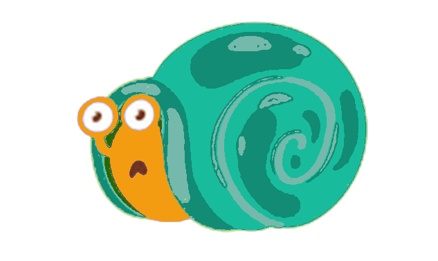{width="25%"}

`r fa("fas fa-lightbulb", fill = "#18BC9C")` [**LEARNING
OBJECTIVES**]{style="color: #18BC9C;"}

1.  Learn to use online tutorials and coding strategies effectively.
2.  Set up your R environment.
3.  Calculate and interpret the mean, median, and mode.

<br>

`r fa("fas fa-book", fill = "#18BC9C")`
[**READINGS**]{style="color: #18BC9C;"}

Readings are available on Quercus.

1.  Wheelan, Charles. 2014. “What’s the Point?” Pp. 1–14 in *Naked
    Statistics: Stripping the Dread from the Data*. New York: W. W.
    Norton & Company.
    
2.  Gandy, Oscar H. Jr. 2008. “Being a Statistician Means Never Having to Say You’re Certain.” Pp. 295–306 in *White Logic, White Methods: Racism and Methodology*, edited by T. Zuberi and E. Bonilla-Silva. Lanham: Rowman & Littlefield Publishers.

<br>

`r fa("fas fa-language", fill = "#18BC9C")`
[**TERMS**]{style="color: #18BC9C;"}

+----------------------+----------------+
|                      |                |
+======================+================+
| - GRAPPLING          | - DISTRIBUTION |
| - REPRODUCIBLE       | - MEAN         |
|   EXAMPLE            | - MEDIAN       |
| - R                  | - MODE         |
| - RSTUDIO            | - OUTLIER      |
|                      | - PERCENTILE   |
|                      | - BIMODAL      |
+----------------------+----------------+

## Course Basics

[Welcome to Stats for Sociologists!]{style="color: #18BC9C; font-size: 150%; font-family: 'Shadows Into Light'; font-weight: bold"}

This course combines readings, self-paced online tutorials, interactive
lectures, and hands-on lab sessions designed to help you learn
statistical concepts, develop your R programming skills, and apply
course material through guided practice and independent work. Because
each week's content builds on previous material, it is important to stay
up to date each week and throughout the term.

Before each week's class, you should complete the assigned readings on
Quercus, followed by the online tutorial. The readings and tutorials
will prepare you for the interactive lecture, where course concepts are
applied using R and RStudio. You will then practice these skills and
interpretation in your lab session with support from your peers and TA.

Most weeks, a new online tutorial will be released on Quercus for you to
complete at your own pace before the following week's lecture. [*This
introductory tutorial is an exception to that schedule and should be
completed before "Quant Camp" during Orientation Week, in place of the
Week 1 tutorial.*]{style="color: #F39C12;"}

### Tutorial Features

Tutorials include explanations of key concepts, examples, videos,
self-check questions, and practice exercises.

Throughout the tutorials, you'll see the
<practice>`r fa("otter")`</practice> (e.g., otter icon), indicating a
review of recently covered tutorial material. It is strongly recommended
that you re-try these practice questions until you have mastered the
concepts.

The otter icon symbolizes playfulness, curiosity, and emotional
intelligence. It's a reminder to take a lighthearted approach to
learning statistics.

Let's try it out.

<br>

<practice>`r fa("otter")` PRACTICE:</practice>

```{r P00, echo=FALSE}
  question("Why do you love statistics and coding?",
         answer("Because uncovering patters in data feels like solving a mystery.",
                message = "Get your Scooby Doo on!"),
         answer("Because empirical evidence helps me understand a messy world.",
                message = "Things are complicated. The world needs you!"),
         answer("Because visualizing data with code is both fun and rewarding.",
                message = "Who doesn't like drawing pictures?!"),
         answer("All of the above (and more!).", correct = TRUE),
         random_answer_order = FALSE,
         allow_retry = TRUE
)
```

At times, you may also be asked to practice interpretation of R output
within the tutorials. The code will be pre-written for you and all you
will have to do is click the ‘Run’ button to see the results.

Other times, you will practice coding by revising existing code or
manually typing in your own code to run. You can’t break the tutorial
code. If you get an error message, press the ‘Start Over’ button and the
code will automatically reset to the default. If you get stuck, you can
click the ‘Hint’ button for some help. Phew!

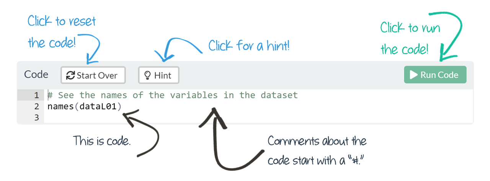{width="100%"}

<br />

Let's try it out. Click the `Run Code` button below.

```{r head, exercise=TRUE}
print("Hello, World!")
```

```{r head-solution}
print("Hello, World!")
```

::: {#head-hint}
**HINT:** Just push the `Run Code` button to see the output.
:::

<br />

::: my-tip
#### Heads Up!

Look for the hat icon for key information to pay attention to throughout
the tutorial.
:::

<br>

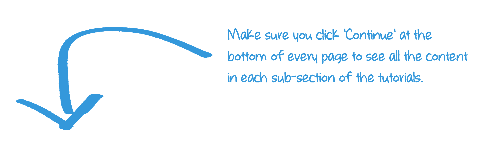{width="80%"}

### Learning Check

At the end of each tutorial, you will complete a Learning Check. These
questions are not for credit but provide a tool for you to check your
own learning progress.

You should aim to complete a Learning Check each week in order to keep
up with the course material.

You are responsible for learning the content in all of the readings,
videos, and tutorial content. Expect that all information available in a
tutorial will appear during the interactive lecture, the midterm, or
will be necessary to complete your research brief.

Make sure you have 'submitted' each answer so that it will be
auto-graded.

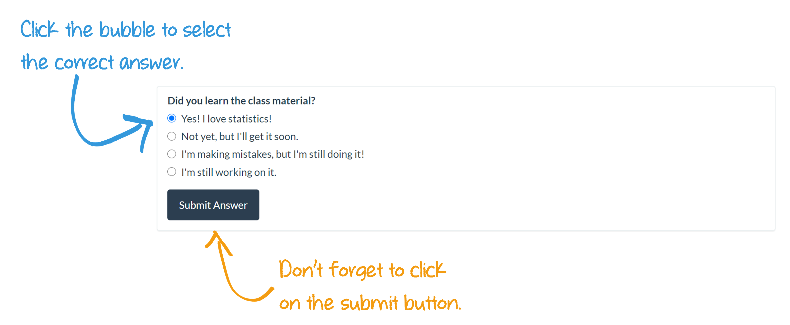{width="90%"}

At any time, you can start the tutorial over by clicking the "Start
Over" button underneath the table of contents (left side of the
tutorial).

### Learning to Code

#### Technology is fun!

You're not just learning the statistical concepts in this course, but
how to produce the statistics. Analyzing data requires learning to use
new technology.

Learning statistical software to analyze data can be really fun. You get
to learn about real world social problems!

#### Technology is challenging!

But, it can also be frustrating. There's even a bingo card of common
errors (i.e. bugs) that new statistical programmers will expect to
experience.

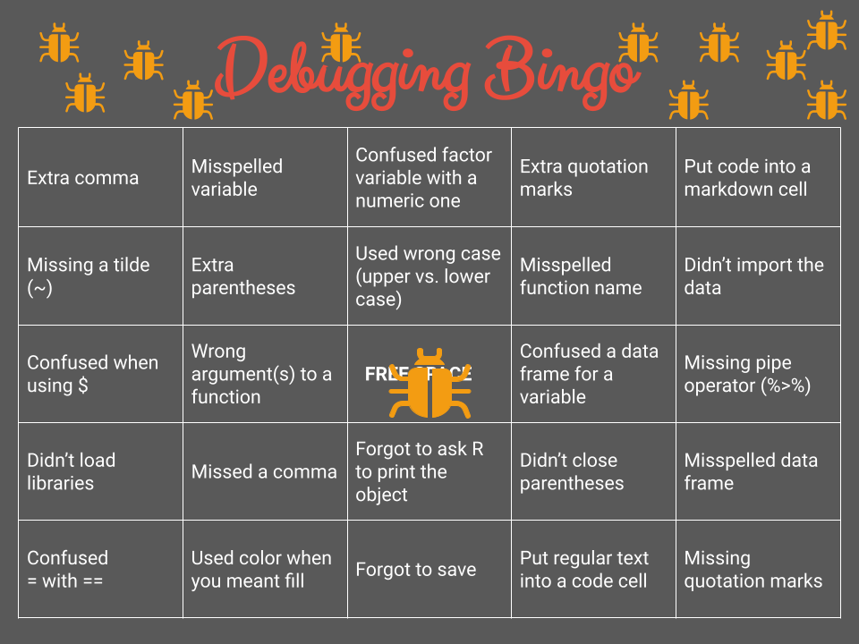{width="80%"}

<br>

[**Why are you making me learn something so
frustrating?**]{.shadows-text style="color: #F39C12; font-size: 150%;"}

One reason is that [**calculating the statistics by hand quickly gets
cumbersome, time consuming, and difficult**]{style="color: #18BC9C;"}.
You'll learn the statistical techniques using small sample sizes, but to
really understand the social world, datasets typically have 100s,
1,000s, even 100,000s of values.

The second reason to learn statistical software is because [**good
social science is built on replication**]{style="color: #18BC9C;"}. It
is impractical, and more prone to errors, for scientists to replicate
research by hand. Replication of statistical procedures helps catch
minor coding errors, highlights unusual decisions made by researchers,
inappropriate statistical techniques, and corrupted data.

But technology presents its own challenges. Replication using technology
requires researchers to use sometimes unfamiliar software, working on
devices with unique environments and settings.

When it feels like the technology is preventing you from getting to the
course content, take a deep breath, and **remember that building your
technology skills is part of this course.**

### Failure

A common misconception is that some people are just not math (or tech)
people. [This is a
myth.](https://www.theatlantic.com/education/archive/2013/10/the-myth-of-im-bad-at-math/280914/){target="_blank"}

::: {style="color: #18BC9C; font-family: 'Shadows Into Light'; font-size: 150%; font-weight: bold"}
"People’s belief that 'math ability' can’t change becomes a
self-fulfilling prophecy."
:::

Confidence and persistence likely have a larger role in math ability
than genetics.

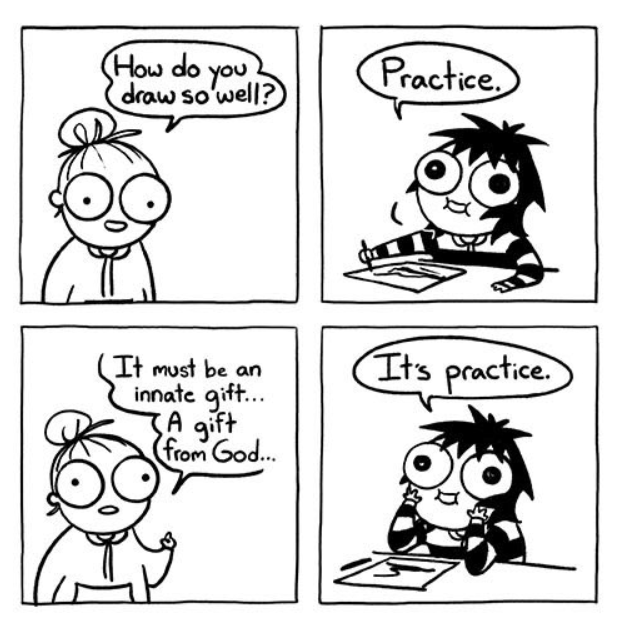{width="50%"}

It is important to remain process oriented rather than product oriented.
Instead of focusing on outcomes, such as external rewards (grades),
focus on your learning process. How do you do that? One approach is to
change your mindset.

Adopting a [**"growth
mindset"**](https://hbr.org/2016/01/what-having-a-growth-mindset-actually-means)
will help you get the most out of this course. A growth mindset is the
belief that your skills and abilities can develop (through work and
practice).

Another key to increasing your confidence is to expect failure. Failure
is part of learning. When students are afraid of failing, it is harder
for them to learn. But, research shows that students must occasionally
fail, and even be frustrated at times, to really learn.

Get comfortable with making mistakes right now. Failure is part of the
learning process. Your job is to persist.

Your code is not expected to be perfect the first time. Identifying and
fixing errors in your own code is such an inherent part of the process,
there's even a name for it: **debugging**

{width="100%"}

<br>

### Grappling

Learning to use statistical software necessitates
[**grappling**](https://www.edutopia.org/blog/4-tips-teaching-problem-solving-from-student-anna-pelletiere).

::: {style="color: #F39C12; font-size: 125%; font-family: 'Shadows Into Light'; font-weight: bold"}
Grappling implies trying even before you fail the first time.

It’s thinking, “First, I’ll work with it independently. Okay, I’m really
not understanding it. Let me go back to my notes. Okay, I have solved
for the first part of it. Now I have the second part of it. Okay, I got
the question wrong; let me try again. Maybe I can ask my peer now.”

Grappling is working hard to make sure you understand the problem fully,
and then using every resource at your fingertips to solve it.”
:::

In this course, this means you'll put your active learning skills to
use. You, not your professor or TA, will work through encountered
problems. You, of course, will be supported and coached through the
entire process. Working with statistical software will become easier as
you build your skills in problem-solving errors. Unfortunately, it gets
increasingly difficult if you rely on others to solve the issue, as the
errors stack-up.

If you learn one thing in this course, I want you to walk away having
better problem solving skills. This is because most statistical analyses
happen **not because the person is a math genius**, but because they
persisted through the minefield of technical issues by **being excellent
problem-solvers.**

[**Coding is mostly
Googling**]{style="color: #18BC9C; font-weight: bold"}

It is a misperception that the best statistical analysts sit down at
their computers and type code from memory. In fact, much of process of
coding is **copying code from somewhere else and modifying it** to fit
your particular situation. There's even a common refrain that "coding is
mostly Googling."

Learning to analyze data with software requires a lot of practice and
attention to detail. It also requires a lot of time searching the
internet for help. Learning to identify the right words and phrases in a
Google search is part of building your coding skills.

Try to stay focused on being in the process, not the outcome.

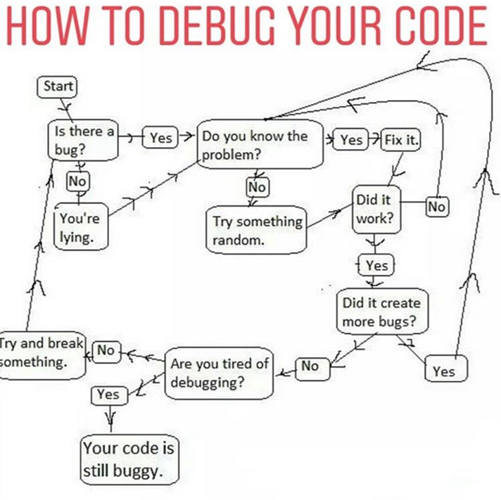{width="80%"}

#### When you get stuck...

[**...there are many options to get unstuck:**]{style="color: #18BC9C"}

- Review the slides. Pay very close attention to small details.
- Try something else to see if you get a new error.
- Use Google to search for possible answers or new explanations.
- Watch a help video on YouTube on the topic.
- Re-start your web-browser or device.
- Try another web-browser or device.
- Ask a peer. Or an advanced student.
- Start or join a weekly study group.
- Post the question on the class discussion board.
- Email your TA

When none of these strategies fix the issue, it is time to ask for help.

### How to get help

The best quantitative researchers produce a trail for their code so that
future researchers can replicate their analysis.

::: my-tip
#### Heads Up!

Replication principles should be used when asking for help.
:::

::: {style="color: #18BC9C; font-family: 'Shadows Into Light'; font-size: 150%; font-weight: bold"}
Goal: Make someone else feel your pain!
:::

How do you make someone else feel your pain?

<br />

#### Create a trail!

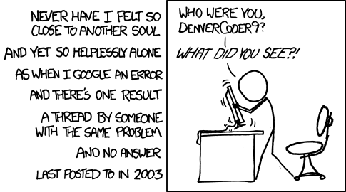{width="90%"}

<br>

#### Create a reproducible example

- Assume others know nothing about your issue.
- Describe your steps to create the problem so that someone else can
  replicate it.
- This means clearly describing the issue and the steps you've already
  taken to solve it.\
  <br />

#### Good etiquette

**Search for answers before posting your question.**\
[Let me google that for you.
🙄]{style="color: #18BC9C; font-family: 'Shadows Into Light'; font-weight: bold"} 

**Describe the problem.**\
["It doesn't work" isn't descriptive
enough.]{style="color: #18BC9C; font-family: 'Shadows Into Light'; font-weight: bold"} 

**Describe your environment.**\
[What operating system are you using? Which R version? What packages?
Dataset?]{style="color: #18BC9C; font-family: 'Shadows Into Light'; font-weight: bold"}\

**Describe the solution.**\
[Confirm if a solution offered works. Or, if you solve it on your own,
post how you solved
it.]{style="color: #18BC9C; font-family: 'Shadows Into Light'; font-weight: bold"}

<br />

#### Help in this class

In this class, the fastest way to get help on milestones or your
research brief is during the lab. The second fastest way is to **post
your reproducible example on the Quercus discussion board**.

If none of these solve your problem, draft an email to your TA, with
detailed notes about the problem and the troubleshooting steps you've
already taken. You might be surprised how often even writing the problem
out in detail helps you find the answer on your own. Send your email if
you still need assistance.

[**Before requesting an individual meeting with a
TA:**]{style="color: #E74C3C"}

- Spend a sufficient amount of time working on it on your own.
- Ask two of your peers.
- Post the question on the class discussion board.

[**When emailing:**]{style="color: #E74C3C"}

- Explain what troubleshooting steps you’ve already taken.
- Report who you’ve already asked for help.

## R environment

Normally, tutorials are self-contained in your web-browser -- everything
you need to do will take place within the tutorial.

However, we need to set up your computing environment before the "Quant
Camp" session of Orientation Week. So, we're going to make an exception
this one time.

To make sure you are ready use a computer program to work with
data, let's set up your device to use R.

<br>

#### Computational toolkit:

1.  **R**: The programming language you'll learn in this course.

2.  **RStudio**: The software you'll use to write R code in.

<br>

::: my-tip
#### Heads Up!

R is the name of the programming language itself and RStudio is a
convenient interface.
:::

### 

### Download and Install R

R is available through the web page of [The Comprehensive R Archive
Network](http://cran.r-project.org/) (CRAN).

The top of the web page provides three links for downloading R. Follow
the link that describes your operating system: Windows, Mac, or Linux.
Complete instructions area available from
[rstudio-education](https://rstudio-education.github.io/hopr/starting.html),
with key steps listed below.

#### **R: Windows**

To install R on Windows, click the “Download R for Windows” link.

Then click the “base” link.

Next, click the first link at the top of the new page. This link should
say something like “Download R 4.5.1 for Windows.” (Note: 4.5.1 will be
replaced by the most current version of R.)

The link downloads an installer program, which installs the most
up-to-date version of R for Windows.

Run this program and step through the installation wizard that appears.
The wizard will install R into your program files folders and place a
shortcut in your Start menu. You’ll need to have all of the appropriate
administration privileges to install new software on your machine.

<br>

::: my-tip
#### Windows Help Video

If you prefer to watch a video or would like more details, I recommend
Windows users [watch this
video](https://www.youtube.com/watch?v=4AjFbJsNNb8). Or, you can search
out a video yourself if you prefer.
:::

<br>

#### **R: Mac**

To install R on a Mac, click the “Download R for Mac” link. Next, click
on the `R-4.5.1` package link (or the package link for the most current
release of R). An installer will download to guide you through the
installation process. The installer lets you customize your
installation, but the defaults will be suitable for most users. If your
computer requires a password before installing new progams, you’ll need
it here.

<br>

::: my-tip
#### MAC Help Video

If you prefer to watch a video or would like more details, I recommend
Mac users [watch this
video](https://www.youtube.com/watch?v=8NvvydRwxEI). Or, you can search
out a video yourself if you prefer.
:::

::: my-tip
#### Heads Up!

Mac users also need to install [XQuartz](https://www.xquartz.org/). Note that the installation process can take multiple minutes and after that process, the computer will likely restart on its own. 

:::

### Download & Install R-studio

After you have installed R, you are ready to begin this section! In your
web browser (e.g., Chrome, Safari, Edge), go to:
<https://posit.co/download/rstudio-desktop/>

Since you've already installed R, you're reading for step 2.

Click on the `"DOWNLOAD RSTUDIO DESKTOP FOR WINDOWS/MAC0S"` button.

This is a big file, so it may take a few minutes to download. Once it's
downloaded, click on the file to install it.

### Open RStudio

Once you've installed R and RStudio, locate RStudio and open it.

**Windows Users**: you'll find RStudio by either using the Windows
search bar or clicking on the Windows start button and then typing
"RStudio."

**Mac Users**: RStudio will can be found in your launchpad, or you can
drag and drop it to your applications folder. Click "Open" when asked if
you want to open the program that has been downloaded from the internet.
If a pop-up asks if you want to install "git" tools, you can click
"Cancel" (not necessary for this class).

<br>  

#### **`print()`**

Learning to **write** a computer program to print `Hello, World!` to
your screen is often the first thing you learn in programming.

Let's make sure your device is setup to use R to simply **print** this sentence to your screen.

In RStudio (*not in this tutorial*), put your cursor next to the `>` and
type: `print("Hello, World!)`

Then press enter. You should see your sentence appear below it.

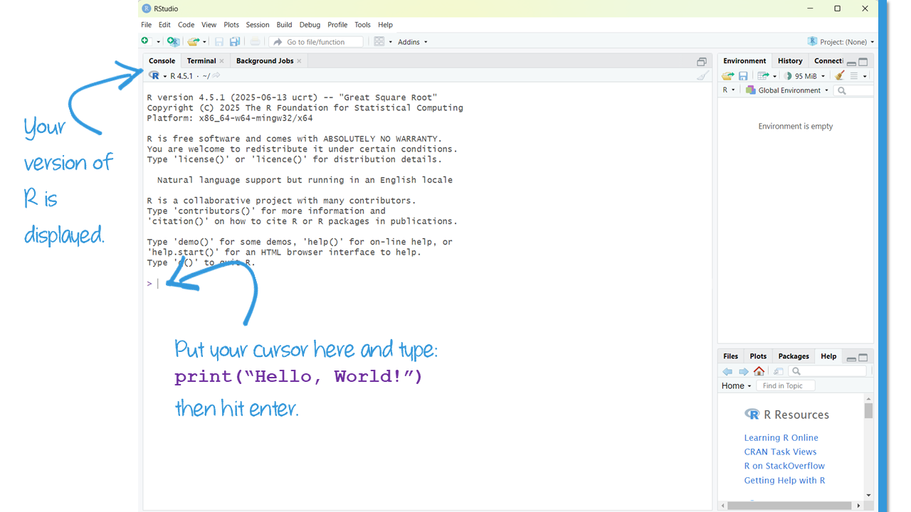{width="100%"}

<br>

```{r}
print("Hello, World!")
```

<br>

::: my-tip
#### Heads Up!

`print` is case-sensitive (e.g., don't capitalize "p"). Include the
parentheses and quotes. Move your cursor to after the last ")" before
hitting "Enter".
:::

<br>

Congrats! You're ready to begin analyzing data! You'll put these skills
into practice during the Quant Camp session of orientation week, where
you'll get an introduction to using R and RStudio.

[*For the next step, however, you'll leave RStudio and continue in this web-based tutorial, which will guide you through the remaining orientation activities before you're ready for Quant Camp.*]{style="color: #F39C12;"}

## Measures of Central Tendency

Before diving into data analysis in R, it is important to review some
basic descriptive statistics.

Sociologists and demographers often ask questions such as: How many hours do people spend on social media each day? How long have immigrants lived in Canada? How old are women when they get married? How many close friends does a person have? How frequently do people experience racial discrimination?

To answer these questions, researchers collect data on **variables** of interest.

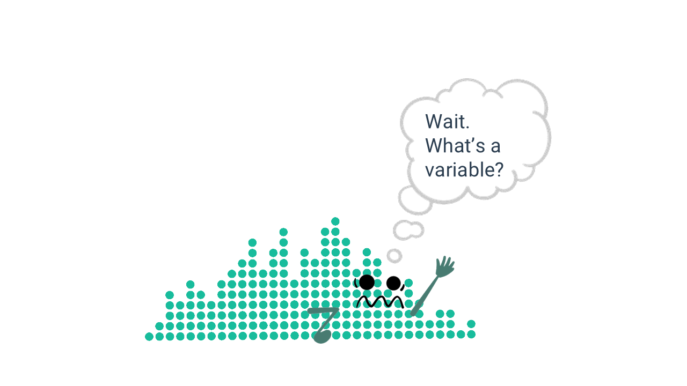{width="60%"}
<br />

::: my-def
#### VARIABLES

Any factor, trait, or condition that can exist in differing amounts or
types.
:::

Variables are attributes that describe a person, place, thing, or idea that we can measure. They can be thought of as characteristics that *vary* from one observation to another. For example, age, income, number of children, years since immigration, and hours spent on social media are all variables.

To be useful for statistical analysis, categories within a variable should be *mutually exclusive* (each observation fits into only one category) and *exhaustive* (every observation can be classified).

<br>  

Researchers examine the **distribution** of a variable to understand how its values are spread across people or groups. Are most values similar, or is there a lot of variation? 

::: my-def
#### DISTRIBUTION:

Shows all the possible values (or intervals) of the data and how often
they occur.
:::

<br>

The mean, median, and mode are measures of central tendency, each of which summarizes the distribution in a different way.

::: {style="color: #18BC9C; font-size: 150%; font-family: 'Shadows Into Light'"}
Measures of central tendency help us describe the “**typical**” or
“central” value in a distribution
:::

Measures of central tendency are among the most commonly used statistics
in research. Watch this [video](https://youtu.be/B1HEzNTGeZ4) for an
overview of the measures of central tendency [11 minutes].


<br>

### Mean

The mean is also known as the average. It is arguably the most commonly
used measure of central tendency.

<br>

::: my-def
#### MEAN

The arithmetic average obtained by adding up all the scores and dividing
by the total number of scores.
:::

<br>

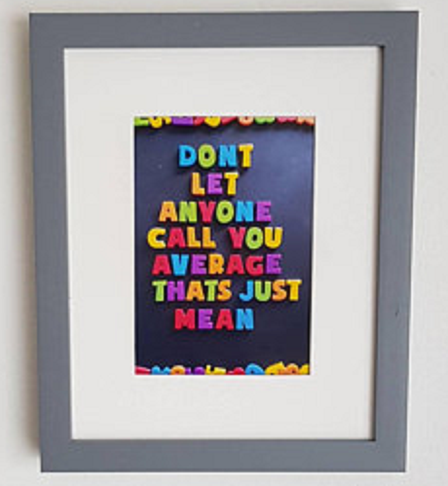{width="40%"}

<br>

To calculate it, add all of the observations together, and divide by the
number of observations.

**Finding the [mean]{style="color: #18BC9C"} in a list:**

$7, 4, 2, 8, 0, 9, 5$

1.  Add all observations together: $7 + 4 + 2 + 8 + 0 + 9 + 5 = 35$
2.  Divide the sum by the number of observations: $\frac{35}{7} = 5$

<br>

It's weakness is that it is sensitive to **outliers**, extreme scores in
a dataset

::: my-def
#### OUTLIERS

Values that are much lower or much greater than the rest of the values
in a dataset.
:::

<br>

Pretend the following values are annual incomes for 10 families:

| Family ID | Annual Income (CAD) |
|:----------|:--------------------|
| F01       | \$48,000            |
| F02       | \$52,000            |
| F03       | \$45,000            |
| F04       | \$50,000            |
| F05       | \$53,000            |
| F06       | \$49,000            |
| F07       | \$46,000            |
| F08       | \$51,000            |
| F09       | \$65,000            |
| F10       | \$250,000           |

[*Source: Totally fake data*]{style="color: $gray-300; font-size: 80%"}

<br>

`r fa("otter", fill = "#F39C12")`<practice> PRACTICE:</practice>

Let's use `R` to calculate the average.

1.  Click the `Run Code` button below.\
2.  Then, click **`Submit Answer.`**

```{r mean01, exercise=TRUE}
# store the values in an object called my_data
my_data <- c(48000, 52000, 45000, 50000, 53000, 
             49000, 46000, 51000, 65000, 250000)

# Use the mean function
mean(my_data)
```

```{r mean01-solution}
# store the values in an object called my_data
my_data <- c(48000, 52000, 45000, 50000, 53000, 
             49000, 46000, 51000, 65000, 250000)

# Use the mean function
mean(my_data)
```

::: {#mean01-hint}
**Hint:** Just push the `Run Code` button to see the output.
:::

```{r mean01-check}
grade_this_code()
```

<br />

::: {.column style="color: #E74C3C; font-size: 150%; font-family: 'Shadows Into Light'"}
Most families in this sample earn between \$45K–53K, but one high-income
household pushes the average far above what’s typical: **\$70,900**
:::

Does this seem like an accurate representation of the typical annual
income of these families? Only one family earns more than our average,
whereas the rest of the sample earns significantly less than that.

If we calculated the average without the unusual (outlier) family with
the \$250,000 annual income, what would the mean?

`r fa("otter", fill = "#F39C12")`<practice> PRACTICE:</practice>

1.  Remove the `250000` income from our list.
2.  Click the `Run Code` button below to re-calculate the average.
3.  When you're satisfied with your code, click **`Submit Answer.`**

```{r mean02, exercise=TRUE}
# store the values in an object called my_data
my_data <- c(48000, 52000, 45000, 50000, 53000, 
             49000, 46000, 51000, 65000, 250000)

# Use the mean function
mean(my_data)
```

```{r mean02-solution}
# store the values in an object called my_data
my_data <- c(48000, 52000, 45000, 50000, 53000, 
             49000, 46000, 51000, 65000)

# Use the mean function
mean(my_data)
```

::: {#mean02-hint}
**Hint:** Did you delete the **comma** after `51000` & `250000` from the
list?
:::

```{r mean02-check}
grade_this_code()
```

<br />

This average is more representative of the typical annual income for
families in the sample. About half of the families have an income below
the mean, and half have an income above the mean.

To summarize, averages are easy to calculate but they can also be
misleading.

<br>

Means are often depicted as line graphs, as seen in the figure below.

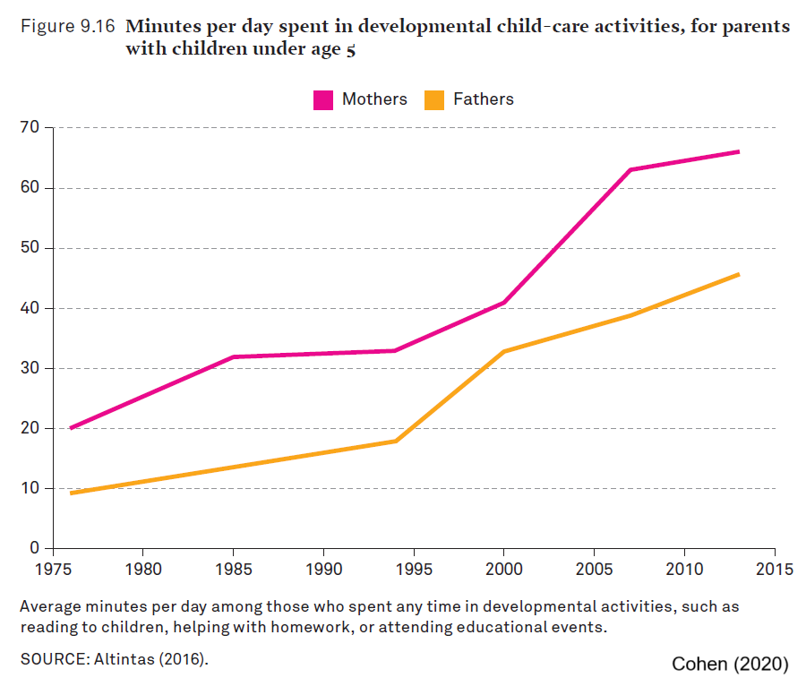{width="80%"}

### Median

The median is the middlemost point of your data.

::: my-def
#### MEDIAN

The score that divides the distribution into two equal halves.
:::

<br>

{width="75%"}

<br>

**Finding the [median]{style="color: #18BC9C"} in a list** with an
**odd** number of observations:

$7, 2, 1, 3, 4, 1, 5, 9, 2$

1.  Put the list in order: $1, 1, 2, 2, 3, 4, 5, 7, 9$\
2.  Pick the center number: $3$

<br>

**Finding the [median]{style="color: #18BC9C"} in a list** with an
**even** number of observations:

$2, 0, 1, 2, 5, 1, 3, 1$

1.  Put the list in order: $0, 1, 1, 1, 2, 2, 3, 5$\
2.  Add the two center numbers & divide by 2: $\frac{1 + 2}{2} = 1.5$

The median is the value at the **50th percentile** in a *cumulative*
frequency distribution. (This is typically an easier way to find the
median than counting individual observations.)

<br>

::: my-def
#### PERCENTILE

A score below which a specific percentage of the distribution falls.
:::

If you score at the 25th percentile on a test, then **25**% of the class
did worse than you and **75**% of the class did better.

If you score at the 90th percentile on a test, then **90**% of the class
did worse than you and **10**% of the class did better.

A distribution is sometimes divided up into quarters: Q1, Q2, Q3, and
Q4. The median is always Q2.

```{r}
#| message: false
#| label: histogram

# create x vector
xAxis <- rnorm(500)             

# create groups in variable using conditional 
# statements
group <- rep(1, 500)              
group[xAxis > -1] <- 2
group[xAxis > 0] <- 3
group[xAxis > 0 & xAxis < 1] <- 4

# create sample data frame
sample_data <- data.frame(xAxis, group) 
min_x <- min(sample_data$xAxis, na.rm = TRUE)
max_x <- max(sample_data$xAxis, na.rm = TRUE)

# create histogram using ggplot() 
# function colored by group
ggplot(sample_data, aes(x = xAxis, fill = as.factor(group))) +
  geom_histogram(color = '#e9ecef', alpha = 0.6, position = 'identity') +
  geom_vline(xintercept = 0, color = 'black', linetype = 'dashed') +
  annotate("text", x = -1.5, y = 5, label = "25%", vjust = 2, color = "white") +
  annotate("text", x =  -.5, y = 5, label = "25%", vjust = 2, color = "white") +
  annotate("text", x =   .5, y = 5, label = "25%", vjust = 2, color = "white") +
  annotate("text", x =  1.5, y = 5, label = "25%", vjust = 2, color = "white") +
  theme_minimal() +
  scale_x_continuous(limits = c(min_x-1, max_x+2), breaks = c(-1, 0, 1, max_x), labels = c("Q1", "Q2\nMedian", "Q3", "Q4")) +
  scale_fill_manual(values = c("#e74c3c", "#18BC9C", "#f39c12", "#3498db")) +
  theme(
    legend.position = "none",
    axis.title.x = element_blank(),
    axis.title.y = element_blank(),
    axis.text.y = element_blank()
  )
```

<br>

`r fa("otter", fill = "#F39C12")`<practice> PRACTICE:</practice>

Let's use `R` to calculate the median.

1.  Replace the blank line with the function `median`.\
2.  Click the `Run Code` button below.
3.  When you're satisfied with your code, click **`Submit Answer.`**

```{r median01, exercise=TRUE}
# store the values in an object called my_data
my_data <- c(48000, 52000, 45000, 50000, 53000, 
             49000, 46000, 51000, 65000, 250000)

# Use the median function
_____(my_data)
```

```{r median01-solution}
# store the values in an object called my_data
my_data <- c(48000, 52000, 45000, 50000, 53000, 
             49000, 46000, 51000, 65000, 250000)

# Use the median function
median(my_data)
```

::: {#median01-hint}
**Hint:** Did you delete the word "mean" and replace it with "median"?
:::

```{r median01-check}
grade_this_code()
```

<br>

Watch this [video](https://youtu.be/2_sdgFJxb_U) for instructions on how
to find the median in a frequency table [3 minutes].


<br> <br>

Half of all observations are always below the median and the other half
are always above the median.

**Percentage distribution of opinion on whether the demands of your job
interfere with your family life?**

```{r}
#| message: false
#| label: wkvsfam
#| echo: false
#| eval: false
 
gss_all$wkvsfam <- as_factor(zap_missing(gss_all$wkvsfam))

# Create frequency & proportions table
tab <- gss_all %>%
  filter(year == 2022, !is.na(wkvsfam)) %>%
  group_by(wkvsfam) %>%
  summarise(n = n(), .groups = "drop") %>%
  mutate(
    percent = round(100 * n / sum(n), 0),
    cum_percent = round(cumsum(percent), 0)
  ) %>%
  ungroup()

# Add totals row
tab_totals <- tab %>%
  summarise(across(c(n, percent), sum, na.rm = TRUE)) %>%
  mutate(wkvsfam = "Total")

# Combine with original table
tab_with_totals <- bind_rows(tab, tab_totals)

## Pretty table
tab_with_totals %>%
  flextable() %>%
  style_flextable() %>%
  set_header_labels(
    n = "n", percent = "%",
    cum_percent = "cumulative %"
  ) %>%
  color(color = "#e74c3c", i = 3, j = 4)

# [*Source: U.S. General Social Survey 2022*]{style="color: $gray-300; font-size: 80%"}
```

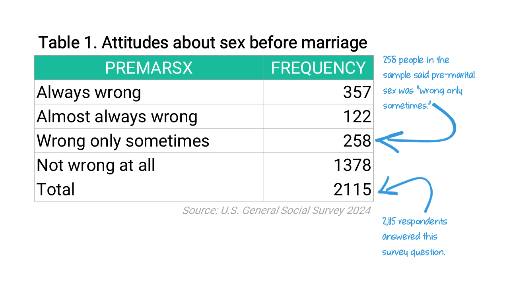{width="100%"}

[**Survey question**: *How often do the demands of your job interfere
with your family life?*]{style="font-size: 80%"}

<br>

------------------------------------------------------------------------

Watch this [video](https://youtu.be/xTwDmnEEb9E) on how to find the
median in a histogram [\~3 minutes].


<br>

Could you find the median in this historgram?

```{r}

my_data <- gss_all |>
  select(agekdbrn, year) |>
  filter(!is.na(agekdbrn) & agekdbrn < 50 & year >= 2018)

sumstatz <- data.frame(whichstat = c("median"),
                       value     = c(median(my_data$agekdbrn)))
my_data |>
  ggplot(aes(agekdbrn)) + 
  geom_histogram(binwidth = 1, show.legend = FALSE) + 
  geom_density(col="black", show.legend = FALSE) + 
  geom_vline(data=sumstatz,aes(xintercept = value,
                               linetype = whichstat), 
             col = "#20c997",
             size=1) +
  theme_minimal() +
    theme(
    axis.title.y = element_blank(),
    ) +
  xlab("age when 1st child born") +
   labs(
    color = "Statistic",
    linetype = "Statistic"
  ) 
```

[*Source: U.S. General Social Survey
2018-2022*]{style="color: $gray-300; font-size: 80%"}

[**Survey question [agekdbrn]**: *How old were you when your first child
was born?*]{style="font-size: 80%"}

<br>

### Mode

The mode is the value the occurs most often. If I asked you your
favorite ice cream flavor and 3 people said vanilla, 4 people said
chocolate, and 17 people said mint-chocolate chip, the mode would be
"mint-chocolate chip."

::: my-def
#### MODE

Category or score with the highest frequency (or percentage) in a
distribution.
:::

<br>

**Finding the [mode]{style="color: #18BC9C"} in a list:**

$7, 2, 1, 3, 4, 1, 5, 1, 2$

1.  Put the list in order: $1, 1, 1, 2, 2, 3, 4, 5, 7$
2.  Pick the most frequent number: $1$

The number 1 appears 3 times in the list, more than any other number.
That makes it the mode.

`r fa("otter", fill = "#F39C12")`<practice> PRACTICE:</practice>

```{r P01, echo=FALSE}
question("A random sample of 8 students report having the following number of 
siblings: $2, 0, 1, 2, 5, 1, 3, 1$. What is the mode?",
         answer("1",   correct = TRUE, message = "Well done!"),
         answer("1.8", message = "This is the mean but the mode is the most frequently occurring value."),
         answer("5",   message = "Which number appears in the list most often?"),
         answer("3",   message = "Which number appears in the list most often?"),
         random_answer_order = TRUE,
         allow_retry = TRUE
)
```

<br>

::: my-tip
#### Heads Up!

In R, mean() and median() are standard functions which do what you'd
expect. `mode()` tells you the internal storage mode of the object, not
the value that occurs the most.
:::

<br>

------------------------------------------------------------------------

#### Finding the mode in a table

The mode can also be identified in a table. The mode is the category
with the greatest frequency or the largest percentage.

**Percentage distribution of opinion on whether people are helpful or
look out for themselves**

```{r}
#| message: false
#| label: mode
#| echo: false
#| eval: false

freq(gss24$helpful, report.nas = FALSE, headings = FALSE) 
```

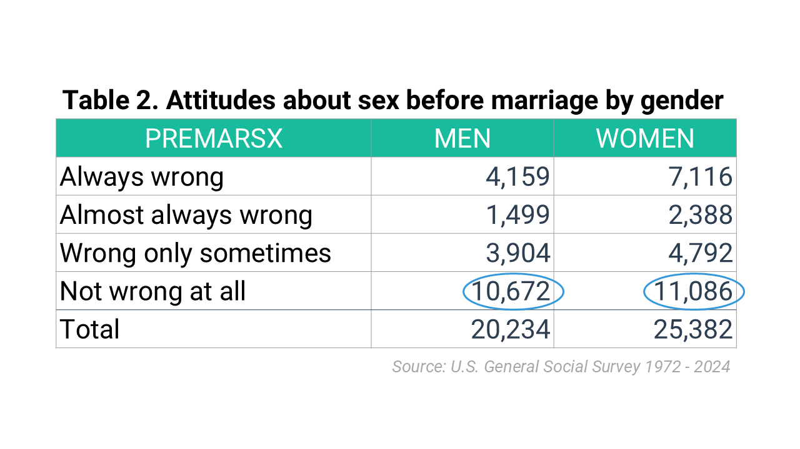{width="100%"}

[**Survey question**: *Would you say that most of the time people try to
be helpful, or that they are mostly just looking out for
themselves?*]{style="font-size: 80%"}

<br> <br>

------------------------------------------------------------------------

Now, let's try it by creating a frequency table in R and then finding
the mode.

`r fa("otter", fill = "#F39C12")`<practice> PRACTICE:</practice>

1.  Replace the blank line with `fairearn`.
2.  Click the `Run Code` button to create a relative frequency table.
3.  When you're satisfied with your code, click **`Submit Answer.`**

```{r mode01, exercise=TRUE}
#| message: false
#| warning: false

freq(gss_all$________, report.nas = FALSE) 
```

```{r mode01-solution}
#| message: false
#| warning: false

freq(gss_all$fairearn, report.nas = FALSE) 
```

::: {#mode01-hint}
**Hint:** Did you type `fairearn` in place of the blank line?
:::

```{r mode01-check}
grade_this_code()
```

[**Survey question**: *How fair is what you earn on your job in
comparison to others doing the same type of work you
do?*]{style="font-size: 80%"}

```{r P02, echo=FALSE}
question("What is the mode of this distribution?",
         answer("About as much as you deserve",     correct = TRUE, message = "Rock on!"),
         answer("Much less than you deserve",       message = "Which category has the largest percentage?"),
         answer("Somewhat less than you deserve",   message = "Which category has the largest percentage?"),
         answer("Somewhat more than you deserve",   message = "Which category has the largest percentage?"),
         answer("Much more than you deserve",       message = "Hardly anyone thinks they make more $ than they deserve."),
         random_answer_order = TRUE,
         allow_retry = TRUE
)
```

<br>

#### Bimodal:

A “bimodal distribution” has two distinct humps, even if the peaks
aren’t exactly the same height.

::: my-def
#### BIMODAL

Two values or categories with the highest frequency.
:::

<br>

Take a look at the figure below. It shows the distributions for daily
new confirmed COVID-19 deaths per million people for Canada and the U.S.

<iframe src="https://ourworldindata.org/explorers/covid?zoomToSelection=true&amp;time=2020-03-01..2021-07-30&amp;facet=none&amp;country=USA~CAN&amp;pickerSort=asc&amp;pickerMetric=location&amp;hideControls=true&amp;Metric=Confirmed+deaths&amp;Interval=7-day+rolling+average&amp;Relative+to+population=true&amp;tab=line" loading="lazy" style="width: 100%; height: 600px; border: 0px none;" allow="web-share; clipboard-write">

</iframe>

<br>

We could identify the modal number of deaths to be around 10 deaths per
million people in the U.S., occurring sometime in January of 2021.

For Canada, the mode occurs in May of 2020 at about 4.49 death per
million Canadians.

If we only reported those modes and dates, it would seem like the most
fatalities in the two countries occurred at wildly different times.

However, the graph makes it obvious that there were actually two peaks,
occurring around the same time, in both countries: one in the spring of
2020 and one in the winter of 2021.

These distributions are examples of a bi-modal distribution: there are
essentially two peaks (for each country).

<br>

------------------------------------------------------------------------

`r fa("otter", fill = "#F39C12")`<practice> PRACTICE:</practice>

Using the figure below to answer the following practice question.

These figure shows distributions of reviews for a variety of movies.

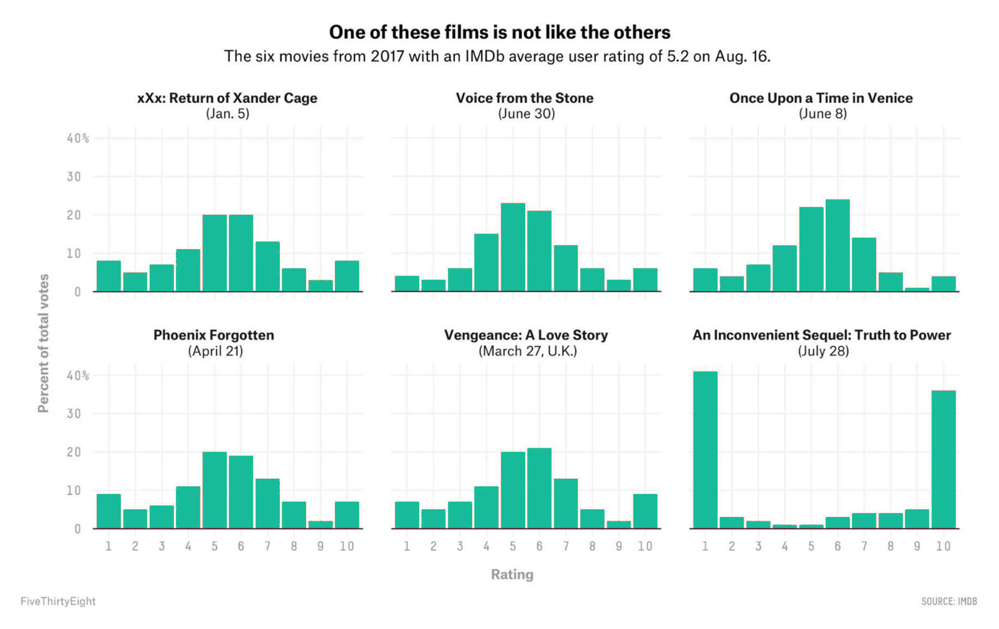{width="100%"}

```{r P03, echo=FALSE}
question("Which movie review distribution is bimodal?",
         answer("An Inconvenient Sequel: Truth to Power",     correct = TRUE, message = "People either hated or loved this movie!"),
         answer("Voice from the Stone",        message = "Which distribution has two distinct peaks?"),
         answer("Once Upon a Time in Venice",  message = "Which distribution has two distinct peaks?"),
         answer("Vengeance: A Love Story",      message = "Which distribution has two distinct peaks?"),
         answer("Phoenix Forgotten",           message = "Which distribution has two distinct peaks?"),
         random_answer_order = TRUE,
         allow_retry = TRUE
)
```

<br>


## Learning Check 01

Please answer the following questions to verify you understand the
topics in this module.

------------------------------------------------------------------------

```{r Q01, echo=FALSE}
question("Q01. What does failure have to do with learning statistics?",
    answer("Students must occasionally fail to really learn new skills.", correct = TRUE),
    answer("Students who are 'math people' will fail less often than other students."),
    answer("Students should avoid failure by studying as many hours as possible."),
    answer("Most of the time failure can and should be avoided by reading the course materials."),
    random_answer_order = TRUE,
           allow_retry = TRUE
  )
```

```{r Q02, echo=FALSE}
question("Q02. What does the otter icon in the tutorials symbolize?",
         answer("Playfulness, curiosity, and emotional intelligence", correct = TRUE),
         answer("Mastery of statistical concepts."),
         answer("A strict and serious approach to learning."),
         answer("Completion of all practice questions."),
         random_answer_order = TRUE,
         allow_retry = TRUE
           )
```

```{r Q03, echo=FALSE}
question("Q03. Are you able to print `Hello, World!` in RStudio on your own device?",
         answer("Yes, of course! I'm ready for class!", correct = TRUE,
                message = "Great! See you soon Rockstar!"),
         answer("No, I'm going to get help in class", 
                message = "You won't have time and you'll start behind!"),
         answer("No, RStudio requires a paid subscription I can't afford.",
                message = "RStudio is free. Get to work!"),
         answer("No, I'm not good with technology.", 
                message = "Review the 'Learning to Code' section and then try it again."),
         random_answer_order = TRUE,
         allow_retry = TRUE
           )
```

```{r Q04, echo=FALSE}
question("Q04. Alex is frustrated that their R code isn’t working as expected. Undeterred, they review it line by line, test each part, and trace the issue until they fix it. What is this process an example of?",
         answer("Debugging", correct = TRUE,
                message = "Yes! Be like Alex."),
         answer("Statistical modeling", 
                message = "I mean, eventually, that's the goal!"),
         answer("Code optimization",
                message = "Alex is improving working code?"),
         answer("Writing a function", 
                message = "Whoa, that's fancy!"),
         random_answer_order = TRUE,
         allow_retry = TRUE
           )
```

```{r Q05, echo=FALSE}
question("Q05. What does Charles Wheelan suggest about the misuse of statistics?",
         answer("Statistics can almost always be trusted, regardless of context."),
         answer("Statistics can be manipulated to mislead or support biased conclusions.", correct = TRUE),
         answer("Statistics are often irrelevant in real-world applications."),
         answer("Statistics reduce the need for critical thinking."),
         random_answer_order = TRUE,
         allow_retry = TRUE
)
```

```{r Q06, echo=FALSE}
question("Q06. What does Oscar Gandy suggest about the relationship between statistical models and real-world phenomena?",
         answer("Statistical models perfectly represent real-world phenomena"),
         answer("Statistical models are simplifications that help us understand complex realities.", correct = TRUE),
         answer("Statistical models are irrelevant to real-world applications."),
         answer("Statistical models eliminate the need for continuous data collection."),
         random_answer_order = TRUE,
         allow_retry = TRUE
         )
```