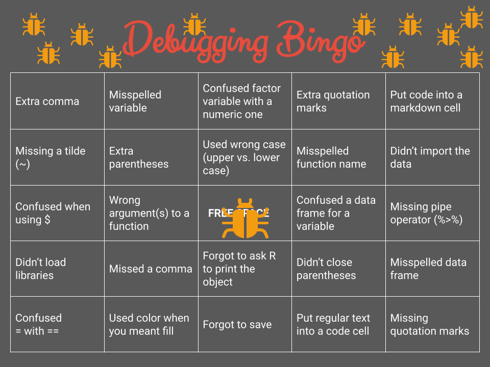

```{r setup, include=FALSE}
library(learnr)
library(fontawesome)
library(fontawesome)
library(gfonts)

knitr::opts_chunk$set(echo = TRUE)
```

<link href="https://fonts.googleapis.com/css2?family=Shadows+Into+Light&display=swap" rel="stylesheet">

<script>
  document.addEventListener("DOMContentLoaded", function () {
    document.querySelectorAll("a[href^='http']").forEach(function(link) {
      link.setAttribute("target", "_blank");
      link.setAttribute("rel", "noopener noreferrer");
    });
  });
</script>

Introduction to Data Analysis
--------------------------------------------------------------------------------

{ width=25% }


`r fa("fas fa-lightbulb", fill = "#18BC9C")` [**LEARNING OBJECTIVES**]{style="color: #18BC9C;"}

1.  Be familiar with basic terms of quantitative data analysis
2.  Describe effective methods of learning to code

`r fa("fas fa-book", fill = "#18BC9C")` [**READINGS**]{style="color: #18BC9C;"}

Readings are available on Quercus.

1.  What's the point?
2.  Descriptive Statistics: Who Was the Best Baseball Player of All Time?

`r fa("fas fa-language", fill = "#18BC9C")` [**TERMS**]{style="color: #18BC9C;"}

-   UNIT OF ANALYSIS\
-   POPULATION\
-   SAMPLE\
-   N & n
-   DESCRIPTIVE STATISTICS\
-   INFERENTIAL STATISTICS\
-   TIDY DATA\
-   VARIABLES\
-   DICHOTOMOUS\
-   NOMINAL\
-   ORDINAL\
-   INTERVAL-RATIO\


Introduction to Tutorials
--------------------------------------------------------------------------------

A new tutorial will be available most weeks. 
Each tutorial contains a mixture of new content, explanations to go along with your readings, videos to watch, and practice questions.  
    
Before proceeding through the tutorial or attending class lectures, you should first complete the assigned readings (available on Quercus). 
  
<br />  
  
#### `r fa("keyboard", fill = "#F39C12")`<practice> PRACTICE:</practice>
Throughout the tutorials, you'll see the  <practice>keyboard icon</practice>, indicating a review of the recently covered tutorial material. 
It is strongly recommended that you re-try these practice questions until you have mastered the concepts.  
  
<br />  

::: {.my-tip}
#### Heads Up!
Look for the mitten icon for key information to pay attention to throughout the tutorial.
:::
    
<br>

{ width=80% }  

###
  
### Learning Check  


At the end of each tutorial, you will complete a Learning Check. 
These questions are not for credit but provide a tool for you to check your own learning progress.

You should aim to complete a Learning Check each week in order to keep up with the course material.  
  
You are responsible for learning the content in all of the readings, videos, and tutorial content. 
Expect that all information available in a tutorial will appear during the interactive lecture, 
the midterm, or will be necessary to complete your research brief.  
  
Make sure you have 'submitted' each answer so that it will be auto-graded.  
  
{ width=90% }
  
  
At any time, you can start the tutorial over by clicking the "Start Over" button underneath the table of contents (left side of the tutorial).  


Social Statistics Basics
--------------------------------------------------------------------------------

[**I'm interested in sociology. Why do I have to learn about statistics?**]{.shadows-text style="color: #F39C12; font-size: 150%;"}

Students often arrive in statistics classes wondering why they are required to take this class. 
Watch [this video](https://www.youtube.com/watch?v=QwhK-iEyXYA) 
for a summary of how sociologists *do* sociology and
how statistics fits into the bigger picture [~10 minutes].  
  
  

<br>

Before we can analyze data, we need to identify the **unit of analysis**: who or what is being studied. 
The unit of analysis can be people, institutions, groups, things, countries, states, and so on.  

Rarely do scientists have the time to study an entire population of interest, so we usually take a sample.

::: {.my-callout}
#### POPULATION
All units of analysis (people, institutions, groups, etc.) in which the researcher is interested.
:::
  
  
::: {.my-callout}
#### SAMPLE
A subset of people (or institutions, groups, etc.) selected from a population.
:::
  
<br>

#### A note on notation: 

[**N**]{style="font-size: 200%; color: #E74C3C;"} refers to **population** size  
  
[***n***]{style="font-size: 200%; color: #E74C3C;"} refers to **sample** size

<br>

::: {.my-tip}
#### Heads Up!
The capitalization of the symbols/notations in statistics are meaningful.
:::

Capital letters are typically used when describing a population.
Lowercase letters are often used when describing a sample.
  

{ width=50% }

###

### Descriptive vs. Inferential Statistics

In this course, you will learn about descriptive and inferential statistics. 
There are two types of statistics:  


::: {.my-callout}
#### DESCRIPTIVE STATISTICS
Procedures that help us organize and describe data collected from a sample or population.
:::
  
  
::: {.my-callout}
#### INFERENTIAL STATISTICS
Making underlying predictions or inferences about a _population_ using observations and analyses from a _sample._ 
::: 
  
<br>  
  
Watch this short [video](https://youtu.be/87rxkjYNHUk)
for a more detailed explanation of the difference between the two [3 minutes].  
  

  
<br />  
  
We will focus on descriptive statistics the first few weeks of the course, before moving on to inferential statistics.

<br>  


`r fa("keyboard", fill = "#F39C12")`<practice> PRACTICE:</practice>

*Indicate whether the following uses descriptive or inferential statistics*

```{r P01, echo=FALSE}
  question("The number of Toronto residents who were homeless in 2024.",
         answer("Descriptive", correct = TRUE),
         answer("Inferential"),
         random_answer_order = TRUE,
         allow_retry = TRUE
)
```

```{r P02, echo=FALSE}
  question("Determining students’ opinion about the quality of dining options at UofT based on a sample of 100 students.",
         answer("Inferential", correct = TRUE),
         answer("Descriptive", message = "Hint: The phrase 'based on' in the statement means _inferences_ are being made."),
         random_answer_order = TRUE,
         allow_retry = TRUE
)
```


### Tidy Data  
  
Quantitative researchers commonly analyze data stored in tables, 
where data is recorded in a combination of rows and columns (*think* spreadsheets).

[__Tidy data__](https://medium.com/@prabhakar_p/importance-of-tidy-data-and-its-impact-on-data-analysis-22e2e5acd90d) is a specific way of organizing data into a consistent format 
(how the data is organized in rows and columns).

Tidy data files contain one line for each observation, such as a record or person (also called a "respondent"). 
**Each column generally represents a single variable.**  
  
{ width=60% }
<br />


::: {.my-callout}
#### VARIABLES
Any factor, trait, or condition that can exist in differing amounts or types. 
::: 


Variables are attributes that describe a person, place, thing, or idea that we can then measure. 
They can be thought of as characteristics that *vary*. 

Variables must be **mutually exclusive** (classify every observation) and **exhaustive** (one category for each observation).
  
  
There are three rules that make a dataset tidy:

1. Each variable must have its own column.
2. Each observation must have its own row.
3. Each value must have its own cell.

  
{ width=75% }

<br />

To conduct statistical analyses, we need to know the scale of measurement for a variable. 
There are different ways that variables can be measured.  
  
Consider how we might measure *happiness* in a survey.  
  
People could tell us they either are happy or they are not happy. They could tell us how happy they are, such as very unhappy, somewhat unhappy, somewhat happy, or very happy. 
We could ask people to rate their happiness on a scale from 1-10, with 1 being not at all happy and 10 being ecstatic! 
Or, we could ask people to tell us what emotion they most felt throughout the day (e.g., happy, sad, content, joyful, anxious, and so on).  
  
These options are all different _levels of measurement_.  
  
<br />  


### Measurement Levels  
  
  
__Watch this short [video](https://www.youtube.com/watch?v=hZxnzfnt5v8){target="_blank"} explaining the different types of data that scientists collect [~6 minutes].__


#### **Terms**

[**DICHOTOMOUS** (aka binary)]{style="color: #18BC9C;"}
A variable with only two categories. 

[**NOMINAL**]{style="color: #18BC9C;"}  
A variable made up of categories that cannot be ordered according to rank.  

[**ORDINAL**]{style="color: #18BC9C;"}
A variable made up of ranked categories, but there is no systematic and measurable numeric difference between the categories.  

[**INTERVAL-RATIO**]{style="color: #18BC9C;"}
A variable with categories that are rank-ordered and expressed in the same units.

***

#### **Transforming Variables**  
One kind of variable can be transformed into another kind of variable. 
Properties that can be measured at a more precise level can also be measured at a less precise level, but not vice versa.
  
  
<br />

[Example:]{style="color: #F39C12;"}  
Years of education, an interval variable, can be dichotomized into "high school graduate" vs. "not a graduate."
  
  
{ width=100% }

<br />
`r fa("keyboard", fill = "#DB9C1B")`<practice> PRACTICE:</practice>

  
*Identify the following as nominal level, ordinal level, or interval-ratio level data.*

```{r P03, echo=FALSE}
  question("Satisfaction rating (extremely dislike, dislike, neutral, like, extremely like)",
           answer("nominal", message = "Try again. These responses have a ranked order."),
           answer("ordinal", correct = TRUE, message = "Amazing!"),
           answer("interval-ratio", message = "Try again. The differences between adjacent categories do not necessarily have the same meaning."),
           random_answer_order = TRUE,
           allow_retry = TRUE
  )
```

```{r P04, echo=FALSE}
  question("Amount of money in savings accounts",
           answer("interval-ratio", correct = TRUE, message = "Splendid!"),
           answer("nominal", message = "Try again. This isn't a variable made up of categories that cannot be ordered according to rank."),
           answer("ordinal",  message = "Try again. The difference between two values is meaningful."),
           random_answer_order = TRUE,
           allow_retry = TRUE
  )
```


Learning to Code
--------------------------------------------------------------------------------

#### Technology is fun!

You're not just learning the statistical concepts in this course, but how to produce the statistics. Analyzing data requires learning to use new technology. 

Learning statistical software to analyze data can be really fun. You get to learn about real world social problems! 

#### Technology is challenging!

But, it can also be frustrating. There's even a bingo card of common errors (i.e. bugs) that new statistical programmers will expect to experience.

{ width=80% }
  
<br>

[**Why are you making me learn something so frustrating?**]{.shadows-text style="color: #F39C12; font-size: 150%;"}  
  
One reason is that [**calculating the statistics by hand quickly gets cumbersome, time consuming, and difficult**]{style="color: #18BC9C;"}. You'll learn the statistical techniques using small sample sizes, but to really understand the social world, datasets typically have 100s, 1,000s, even 100,000s of values.  
  
The second reason to learn statistical software is because [**good social science is built on replication**]{style="color: #18BC9C;"}. 
It is impractical, and more prone to errors, for scientists to replicate research by hand. Replication of statistical procedures helps catch minor coding errors, highlights unusual decisions made by researchers, inappropriate statistical techniques, and corrupted data.  
  
But technology presents its own challenges. Replication using technology requires researchers to use sometimes unfamiliar software, working on devices with unique environments and settings.  
  
When it feels like the technology is preventing you from getting to the course content, take a deep breath, and **remember that building your technology skills is part of this course.**  

### Failure

A common misconception is that some people are just not math (or tech) people. 
[This is a myth.](https://www.theatlantic.com/education/archive/2013/10/the-myth-of-im-bad-at-math/280914/){target="_blank"} 
  
::: {style="color: #18BC9C; font-family: 'Shadows Into Light'; font-weight: bold"}
"People’s belief that 'math ability' can’t change becomes a self-fulfilling prophecy."
:::

Confidence and persistence likely have a larger role in math ability than genetics.  

{ width=50% }

It is important to remain process oriented rather than product oriented. 
Instead of focusing on outcomes, such as external rewards (grades), focus on your learning process. 
How do you do that? One approach is to change your mindset.  

Adopting a [**"growth mindset"**](https://hbr.org/2016/01/what-having-a-growth-mindset-actually-means) will help you get the most out of this course. A growth mindset is the belief that your skills and abilities can develop (through work and practice).  
  
Another key to increasing your confidence is to expect failure. 
Failure is part of learning. When students are afraid of failing, it is harder for them to learn. 
But, research shows that students must occasionally fail, and even be frustrated at times, to really learn.  

Get comfortable with making mistakes right now. 
Failure is part of the learning process. Your job is to persist. 
    
Your code is not expected to be perfect the first time. 
Identifying and fixing errors in your own code is such an inherent part of the process, 
there's even a name for it: **debugging**  
 
{ width=100% }

<br>

### Grappling

Learning to use statistical software necessitates [**grappling**](https://www.edutopia.org/blog/4-tips-teaching-problem-solving-from-student-anna-pelletiere). 

::: {style="color: #F39C12; font-size: 125%; font-family: 'Shadows Into Light'; font-weight: bold"}
Grappling implies trying even before you fail the first time.  
  
It’s thinking, “First, I’ll work with it independently. Okay, I’m really
not understanding it. Let me go back to my notes. Okay, I have solved
for the first part of it. Now I have the second part of it. Okay, I got
the question wrong; let me try again. Maybe I can ask my peer now.”  
  
Grappling is working hard to make sure you understand the problem fully,
and then using every resource at your fingertips to solve it.”  
:::
  
  
In this course, this means you'll put your active learning skills to use. 
You, not your professor or TA, will work through encountered problems. 
You, of course, will be supported and coached through the entire process. 
Working with statistical software will become easier as you build your skills in problem-solving errors. Unfortunately, it gets increasingly difficult if you 
rely on others to solve the issue, as the errors stack-up.  
  
If you learn one thing in this course, I want you to walk away having better problem solving skills. 
This is because most statistical analyses happen **not because the person is a math genius**, 
but because they persisted through the minefield of technical issues by **being excellent problem-solvers.** 
  

[**Coding is mostly Googling**]{style="color: #18BC9C; font-weight: bold"}


It is a misperception that the best statistical analysts sit down at their computers and type code from memory. 
In fact, much of process of coding is **copying code from somewhere else and modifying it** to fit your particular situation. 
There's even a common refrain that "coding is mostly Googling."  
  
Learning to analyze data with software requires a lot of practice and attention to detail. 
It also requires a lot of time searching the internet for help. 
Learning to identify the right words and phrases in a Google search is part of building your coding skills.  

Try to stay focused on being in the process, not the outcome.

{ width=80% }


#### When you get stuck...

[**...there are many options to get unstuck:**]{style="color: #18BC9C"}

-   Review the slides. Pay very close attention to small details.
-   Try something else to see if you get a new error.
-   Use Google to search for possible answers or new explanations.
-   Watch a help video on YouTube on the topic.
-   Re-start your web-browser or device.
-   Try another web-browser or device.
-   Ask a peer. Or an advanced student.
-   Start or join a weekly study group.
-   Post the question on the class discussion board.
-   Email your TA

When none of these strategies fix the issue, it is time to ask for help.  
  
  
### How to get help

The best quantitative researchers produce a trail for their code so that future researchers can replicate their analysis.  

::: {.my-tip}
#### Heads Up!
Replication principles should be used when asking for help.
:::
 
When asking for help, do what you can to **create a reproducible example.** 
The goal is for **someone else to feel your pain.** 
How do you make someone else feel your pain?  
  
<br />

#### Create a trail!

{ width=90% }

<br>

#### Create a reproducible example

::: {style="color: #18BC9C; font-family: 'Shadows Into Light'; font-size: 150%; font-weight: bold"}
Goal: Make someone else feel your pain!
:::
  
-   Assume others know nothing about your issue. 
-   Describe your steps to create the problem so that someone else can replicate it. 
-   This means clearly describing the issue and the steps you've already taken to solve it.   
<br />  

#### Good etiquette

**Search for answers before posting your question.**\
[Let me google that for you. 🙄]{style="color: #18BC9C; font-family: 'Shadows Into Light'; font-weight: bold"} 

**Describe the problem.**\
["It doesn't work" isn't descriptive enough.]{style="color: #18BC9C; font-family: 'Shadows Into Light'; font-weight: bold"} 

**Describe your environment.**\
[What operating system are you using? Which R version? What packages? Dataset?]{style="color: #18BC9C; font-family: 'Shadows Into Light'; font-weight: bold"}\

**Describe the solution.**\
[Confirm if a solution offered works. Or, if you solve it on your own, post how you solved
it.]{style="color: #18BC9C; font-family: 'Shadows Into Light'; font-weight: bold"}

<br />

#### Help in this class

In this class, the fastest way to get help on milestones or your research brief is during the lab. The second fastest way is to **post your reproducible example on the Quercus discussion board**.  
  
If none of these solve your problem, draft an email to your TA, with detailed notes about the problem and the troubleshooting steps you've already taken. You might be surprised how often even writing the problem out in detail helps you find the answer on your own. Send your email if you still need assistance.  
  

[**Before requesting an individual meeting with a
TA:**]{style="color: #E74C3C"}

-   Spend a sufficient amount of time working on it on your own.
-   Ask two of your peers.
-   Post the question on the class discussion board.

[**When emailing:**]{style="color: #E74C3C"}

-   Explain what troubleshooting steps you’ve already taken.
-   Report who you’ve already asked for help.


Learning Check 01
--------------------------------------------------------------------------------

Please answer the following questions to verify you understand the topics in this module. 
  
********************************************************************************

```{r Q01, echo=FALSE}
  question("Q01. The change in the number of legal immigrants coming to Canada between 2015 and 2025 is an example of _________ statistics.",
         answer("descriptive", correct = TRUE),
         answer("inferential"),
         random_answer_order = TRUE,
         allow_retry = TRUE
)
```

```{r Q02, echo=FALSE}
  question("Q02. What is the key difference between N and *n*?",
         answer("N represents the entire group being studies, whereas *n* represents a subset of that group.", correct = TRUE, message = "💯 Correct!"),
         answer("N is always smaller than *n*", message = "😲 The opposite is true."),
         answer("N refers to the number of variables, whereas *n* refers to the number of observations."),
          answer("N and *n* are interchangeable terms in statistics."),
         random_answer_order = TRUE,
         allow_retry = TRUE
)
```

```{r Q03, echo=FALSE}
  question("Q03. Which of the following is an example of a nominal level of measurement?",
         answer("The type of religion a person identifies with (e.g., Christianity, Islam, Judaism)", correct = TRUE, message = "💯 Correct!"),
         answer("The income of a family in dollars", message = "Nominal variables are categorical. This is a continuous variable."),
         answer("A ranking of provinces by marriage rate", message = "This would be an ordinal variable. This is a continuous variable."),
          answer("The number of children in a household", message = "This could be an ordinal or a continuous variable."),
         random_answer_order = TRUE,
         allow_retry = TRUE
)
```

```{r Q04, echo=FALSE}
  question("Q04. Ranking neighborhoods by crime rate (e.g., low, medium, high)",
           answer("ordinal", correct = TRUE, message = "Fantastic!"),
           answer("nominal", message = "Try again. This isn't a variable made up of categories that cannot be ordered."),
           answer("interval-ratio", message = "Try again. The differences between adjacent categories do not necessarily have the same meaning."),
           random_answer_order = TRUE,
           allow_retry = TRUE
  )
```

```{r Q05, echo=FALSE}
  question("Q05. What does failure have to do with learning statistics?",
    answer("Students must occasionally fail to really learn new skills.", correct = TRUE),
    answer("Students who are 'math people' will fail less often than other students."),
    answer("Students should avoid failure by studying as many hours as possible."),
    answer("Most of the time failure can and should be avoided by reading the course materials."),
    random_answer_order = TRUE,
           allow_retry = TRUE
  )
```