```{r}
#| label: setup
#| message: false
#| include: false

# GLOBAL ENVIRONMENT PANE
## source("tutorials/SOC6302-02/custom-setup-styles.R")
## data(gss_all)
## gss24 <- gss_get_yr(2024)
## data(gss_dict)

## Load packages, custom functions, and styles
source("custom-setup-styles.R")

## Load all gss
gss_all <- readRDS("data/gss_all.rds")

# Get the data only for the 2024 survey respondents
gss24 <- readRDS("data/gss24.rds")

knitr::opts_chunk$set(echo = TRUE)
```

<link href="https://fonts.googleapis.com/css2?family=Shadows+Into+Light&display=swap" rel="stylesheet">

```{=html}
<script>
  document.addEventListener("DOMContentLoaded", function () {
    document.querySelectorAll("a[href^='http']").forEach(function(link) {
      link.setAttribute("target", "_blank");
      link.setAttribute("rel", "noopener noreferrer");
    });
  });
</script>
```

## Descriptive Statistics

{width="25%"}

`r fa("fas fa-lightbulb", fill = "#18BC9C")` [**LEARNING
OBJECTIVES**]{style="color: #18BC9C;"}

1.  Be familiar with basic terms of quantitative data analysis
2.  Calculate and interpret proportions, percentages, and frequency distributions
3.  Calculate measures of variability and analyze distributions

`r fa("fas fa-book", fill = "#18BC9C")`
[**READINGS**]{style="color: #18BC9C;"}

Readings are available on Quercus.

1.  Wheelan, Charles. 2014. “Descriptive Statistics: Who Was the Best
    Baseball Player of All Time?” Pp. 15–35 in *Naked Statistics:
    Stripping the Dread from the Data*. New York: W. W. Norton &
    Company.

2.  Wickham, Hadley, Mine Cetinkaya-Rundel, and Garrett Grolemund. 2023.
    “[Data Transformation](https://r4ds.hadley.nz/data-transform.html).”
    in *R for Data Science: Import, Tidy, Transform, Visualize, and
    Model Data*. Beijing Boston Farnham Sebastopol Tokyo: O’Reilly
    Media.

<br>

`r fa("fas fa-language", fill = "#18BC9C")`
[**TERMS**]{style="color: #18BC9C;"}

+---------------------------+------------------------------------+
|                           |                                    |
+===========================+====================================+
| - UNIT OF ANALYSIS        | - POSITIVELY SKEWED DISTRIBUTION   |
| - POPULATION              | - NEGATIVELY SKEWED DISTRIBUTION   |
| - SAMPLE                  | - RELATIVE FREQUENCY DISTRIBUTION  |
| - N & n                   | - PROPORTION                       |
| - DESCRIPTIVE STATISTICS  | - PERCENTAGE                       |
| - INFERENTIAL STATISTICS  | - CUMULATIVE                       |
| - TIDY DATA               | - RATE                             |
| - VARIABLES               | - BAR GRAPH                        |
| - DICHOTOMOUS             | - HISTOGRAM                        |
| - NOMINAL                 | - LINE GRAPH                       |
| - ORDINAL                 | - STATISTICAL MAP                  |
| - INTERVAL-RATIO          | - RANGE                            |
| - FREQUENCY DISTRIBUTION  | - INTERQUARTILE RANGE              |
| - SYMMETRICAL             | - VARIANCE                         |
|   DISTRIBUTION            | - STANDARD DEVIATION               |
+---------------------------+------------------------------------+

## Basic Statistical Terminology

[**I'm interested in sociology. Why do I have to learn about
statistics?**]{.shadows-text style="color: #F39C12; font-size: 150%;"}

Students often arrive in statistics classes wondering why they are
required to take this class. Watch [this
video](https://www.youtube.com/watch?v=QwhK-iEyXYA) for a summary of how
sociologists *do* sociology and how statistics fits into the bigger
picture [\~10 minutes].


<br>

Before we can analyze data, we need to identify the **unit of
analysis**: who or what is being studied. The unit of analysis can be
people, institutions, groups, things, countries, states, and so on.

Rarely do scientists have the time to study an entire population of
interest, so we usually take a sample.

::: my-def
#### POPULATION

All units of analysis (people, institutions, groups, etc.) in which the
researcher is interested.
:::

<br>

::: my-def
#### SAMPLE

A subset of people (or institutions, groups, etc.) selected from a
population.
:::

<br>

#### A note on notation:

[**N**]{style="font-size: 200%; color: #E74C3C;"} refers to
**population** size

[***n***]{style="font-size: 200%; color: #E74C3C;"} refers to **sample**
size

<br>

::: my-tip
#### Heads Up!

The capitalization of the symbols/notations in statistics are
meaningful.
:::

Capital letters are typically used when describing a population.
Lowercase letters are often used when describing a sample.

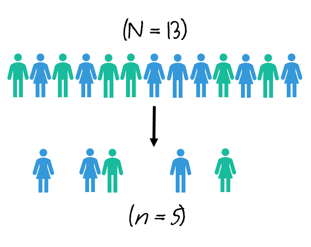{width="50%"}

### 

### Descriptive vs. Inferential Statistics

In this course, you will learn about descriptive and inferential
statistics. There are two types of statistics:

::: my-def
#### DESCRIPTIVE STATISTICS

Procedures that help us organize and describe data collected from a
sample or population.
:::

<br>

::: my-def
#### INFERENTIAL STATISTICS

Making underlying predictions or inferences about a *population* using
observations and analyses from a *sample.*
:::

<br>

Watch this short [video](https://youtu.be/87rxkjYNHUk) for a more
detailed explanation of the difference between the two [3 minutes].


<br />

We will focus on descriptive statistics the first few weeks of the
course, before moving on to inferential statistics.

<br>

`r fa("otter", fill = "#F39C12")`<practice> PRACTICE:</practice>

*Indicate whether the following uses descriptive or inferential
statistics*

```{r P01, echo=FALSE}
  question("The number of Toronto residents who were homeless in 2024.",
         answer("Descriptive", correct = TRUE),
         answer("Inferential"),
         random_answer_order = TRUE,
         allow_retry = TRUE
)
```

```{r P02, echo=FALSE}
  question("Determining students’ opinion about the quality of dining options at UofT based on a sample of 100 students.",
         answer("Inferential", correct = TRUE),
         answer("Descriptive", message = "Hint: The phrase 'based on' in the statement means _inferences_ are being made."),
         random_answer_order = TRUE,
         allow_retry = TRUE
)
```

### Tidy Data

Quantitative researchers commonly analyze data stored in tables, where
data is recorded in a combination of rows and columns (*think*
spreadsheets).

[**Tidy
data**](https://medium.com/@prabhakar_p/importance-of-tidy-data-and-its-impact-on-data-analysis-22e2e5acd90d)
is a specific way of organizing data into a consistent format (how the
data is organized in rows and columns).

Tidy data files contain one line for each observation, such as a record
or person (also called a "respondent"). **Each column generally
represents a single variable.**

There are three rules that make a dataset tidy:

1.  Each variable must have its own column.
2.  Each observation must have its own row.
3.  Each value must have its own cell.

{width="75%"}

<br />

To conduct statistical analyses, we need to know the scale of
measurement for a variable. There are different ways that variables can
be measured.

Consider how we might measure *happiness* in a survey.

People could tell us they either are happy or they are not happy. They
could tell us how happy they are, such as very unhappy, somewhat
unhappy, somewhat happy, or very happy. We could ask people to rate
their happiness on a scale from 1-10, with 1 being not at all happy and
10 being ecstatic! Or, we could ask people to tell us what emotion they
most felt throughout the day (e.g., happy, sad, content, joyful,
anxious, and so on).

These options are all different *levels of measurement*.

<br />

### Measurement Levels

**Watch this short
[video](https://www.youtube.com/watch?v=hZxnzfnt5v8){target="_blank"}
explaining the different types of data that scientists collect [\~6
minutes].**


#### **Terms**

[**DICHOTOMOUS** (aka binary)]{style="color: #18BC9C;"} A variable with
only two categories.

[**NOMINAL**]{style="color: #18BC9C;"}\
A variable made up of categories that cannot be ordered according to
rank.

[**ORDINAL**]{style="color: #18BC9C;"} A variable made up of ranked
categories, but there is no systematic and measurable numeric difference
between the categories.

[**INTERVAL-RATIO**]{style="color: #18BC9C;"} A variable with categories
that are rank-ordered and expressed in the same units.

<br>

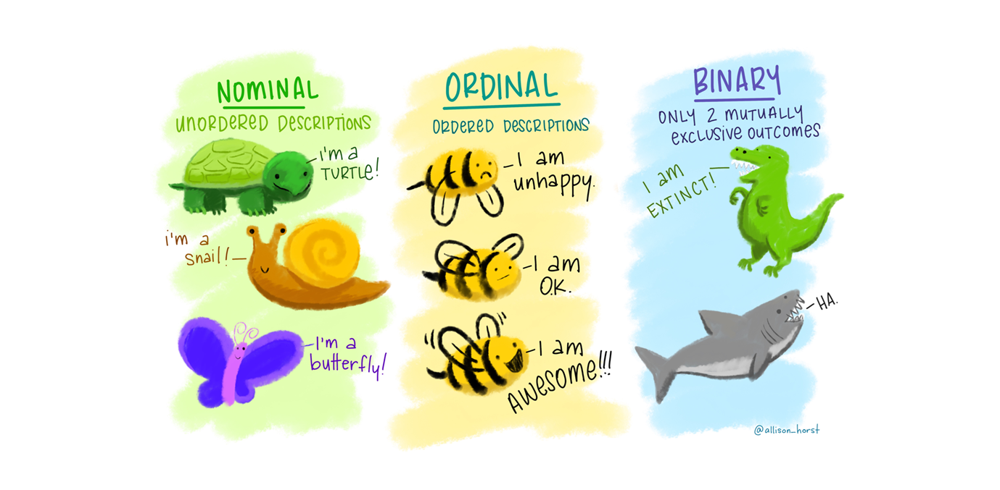{width="100%"}

<br>

#### **Transforming Variables**

One kind of variable can be transformed into another kind of variable.
Properties that can be measured at a more precise level can also be
measured at a less precise level, but not vice versa.

<br />

[Example:]{style="color: #F39C12;"}\
Years of education, an interval variable, can be dichotomized into "high
school graduate" vs. "not a graduate."

<br /> `r fa("otter", fill = "#DB9C1B")`<practice> PRACTICE:</practice>

*Identify the following as nominal level, ordinal level, or
interval-ratio level data.*

```{r P03, echo=FALSE}
  question("Satisfaction rating (extremely dislike, dislike, neutral, like, extremely like)",
           answer("nominal", message = "Try again. These responses have a ranked order."),
           answer("ordinal", correct = TRUE, message = "Amazing!"),
           answer("interval-ratio", message = "Try again. The differences between adjacent categories do not necessarily have the same meaning."),
           random_answer_order = TRUE,
           allow_retry = TRUE
  )
```

```{r P04, echo=FALSE}
  question("Amount of money in savings accounts",
           answer("interval-ratio", correct = TRUE, message = "Splendid!"),
           answer("nominal", message = "Try again. This isn't a variable made up of categories that cannot be ordered according to rank."),
           answer("ordinal",  message = "Try again. The difference between two values is meaningful."),
           random_answer_order = TRUE,
           allow_retry = TRUE
  )
```

### Choosing a Measure

One reason it is important to understand variable types is that they
help us choose the most appropriate measure of central tendency.
Different levels of measurement allow us to calculate different
statistics.

An appropriate measure of central tendency depends on three factors:

1.  the way the variables are measured (i.e., the level of measurement)\
2.  the shape of the distribution\
3.  the purpose of the research

The [**MODE**]{style="color: #18bc9c"} is appropriate for **nominal**
and **ordinal** variables.

It can be identified for **interval-ratio** level variables, but is
often not useful.

The [**MEDIAN**]{style="color: #18bc9c"} is appropriate for
**interval-ratio** and **ordinal** variables.\
It cannot be used for **nominal** level variables.

The [**MEAN**]{style="color: #18bc9c"} can ONLY be determined for
**interval-ratio** variables.

## Frequency Distributions

::: my-def
#### FREQUENCY DISTRIBUTION

A table reporting the number of observations falling into each category
of the variable.
:::

<br>

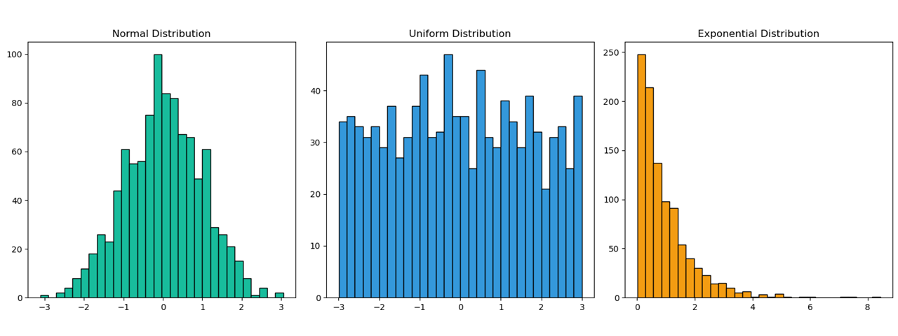{width="100%"}

<br />

First, let's revisit the mean, median, and mode. Understanding how these
measures compare to one another provides important clues about the shape
of a distribution. Check out this
[video](https://www.youtube.com/watch?v=kn83BA7cRNM) [11 minutes].


<br>

When the mean, median, and mode are all equal to one another, we say
that the distribution is **symmetrical**.

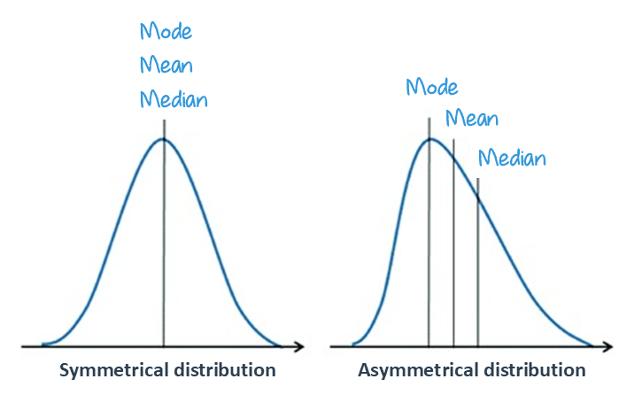{width="80%"}

The mean is a good measure of central tendency for a symmetrical
distribution.

But, the mean can be **skewed** by very high or very low numbers. The
mean is a less suitable measure of central tendency in distributions
with extreme values on one side.

<br>

#### Positively Skewed Distribution

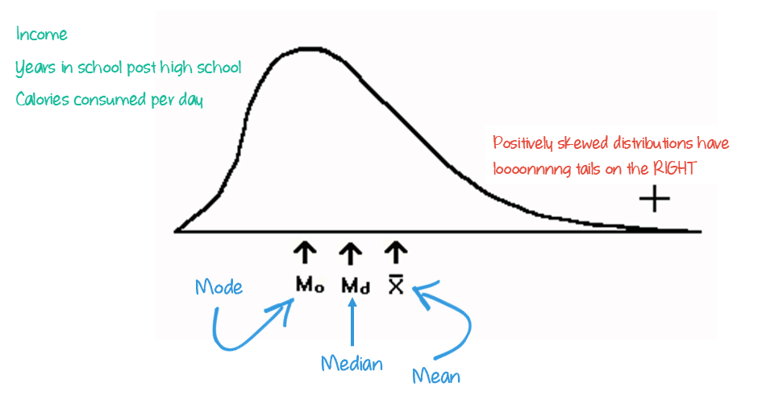{width="80%"}

::: my-tip
#### Heads up!

When a distribution is positively skewed, the mean is greater than the
median.
:::

<br>

#### Negatively Skewed Distribution

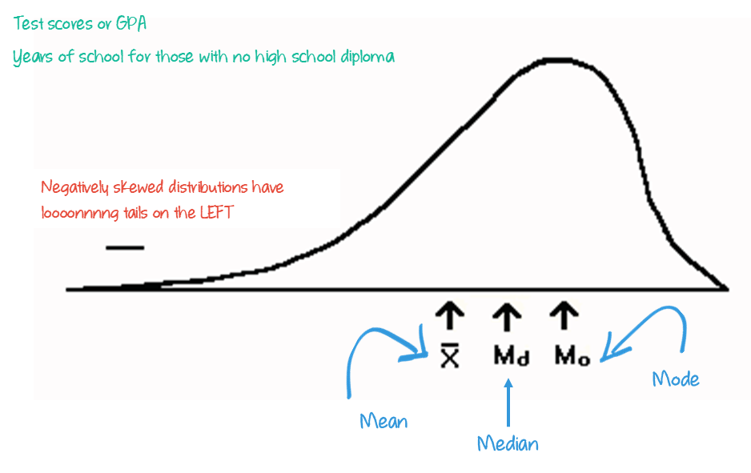{width="80%"}

<br>

::: my-tip
#### Heads up!

When a distribution is negatively skewed, the mean is less than the
median.
:::

<br>

------------------------------------------------------------------------

`r fa("otter", fill = "#F39C12")`<practice> PRACTICE:</practice>

**What is the best measure of central tendency for each of the
following?**\
HINT: Identify the type of variable first. Then decide which measure is
appropriate.

```{r P05, echo=FALSE}
question("Racial composition of students at UofT.",
         answer("Mode", correct = TRUE, 
                message = "That's it!"),
         answer("Median or Mode",       
                message = "The median cannot be used for nominal level variables."),
         answer("Median",              
                message = "The median cannot be used for nominal level variables."),
         answer("Mean",                
                message = "Race isn't an interval-ratio variable."),
         random_answer_order = TRUE,
         allow_retry = TRUE
)
```

```{r P06, echo=FALSE}
question("Distance traveled to work each day by Toronto residents.",
         answer("Mean and Median", correct = TRUE, 
                message = "Well done!"),
         answer("Mode",                 
                message = "The mode is probably not useful here."),
         answer("Median and Mode",       
                message = "The mode is probably not useful here."),
         answer("Median",               
                message = "Maybe....but, we have no reason to think the distance would be skewed."),
         random_answer_order = TRUE,
         allow_retry = TRUE
)
```

```{r P07, echo=FALSE}
question("Number of crimes committed by current inmates in Ontario correctional facilities.",
         answer("Median", correct = TRUE, 
                message = "I agree!"),
         answer("Mode",                   
                message = "The mode is probably not useful here."),
         answer("Median and Mode",        
                message = "The mode is probably not useful here."),
         answer("Mean",                   
                message = "Possibly...but what if most inmates only committed 1 crime and others committed a lot?"),
         random_answer_order = TRUE,
         allow_retry = TRUE
)
```

<br>

### Distribution Tables

A common first step in data analysis is to create a table showing the
number of observations for each value of a variable. This is called a
**frequency table**. It consists of two columns.

The first column includes the variable and the response categories.

The second column reports the number of cases in each category, as well
as the total number of cases (i.e., sum of all frequencies).

<br>

**Table 01. Attitudes about sex before marriage**

```{r}
#| label: table01
#| echo: false
#| eval: false

gss24$premarsx <- zap_missing(gss24$premarsx) 
gss24$premarsx <- as_factor(gss24$premarsx)
gss24$premarsx <- droplevels(gss24$premarsx)

freq_premarsx <- gss24 |>
  select(sex, premarsx) |>
  filter(!is.na(premarsx)) |>
  count(premarsx)

total_row <- freq_premarsx|>
  summarise(across(where(is.numeric), sum)) |>
  mutate(premarsx = "Total")

# combine
table_premarsx <- rbind(freq_premarsx, total_row)

# Render the table
table_premarsx %>%
  flextable() %>%
  style_flextable()

# [Source: U.S. General Social Survey, 2024]{style="color: #grey80; font-size: 80%"}
```

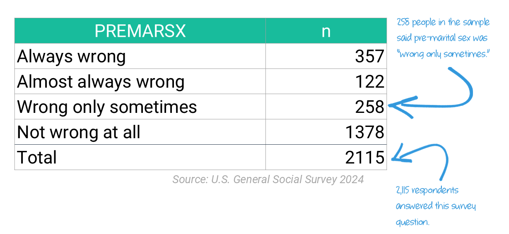{width="100%"}

[**Survey question**: *There's been a lot of discussion about the way
morals and attitudes about sex are changing in this country. If a man
and woman have sex relations before marriage, do you think it is
\_\_\_\_\_\_\_\_\_\_\_\_.*]{style="font-size: 80%"}

<br>

Frequency tables are important for understanding data, but sometimes
they can be misleading if the frequencies aren't considered in context.

Let's look at an example.

::: my-think
#### Think Like a Statistician:

Are women more likely than men to say premarital sex is "*not wrong at
all*"?
:::

<br>

We start by looking at the frequency table that shows men and women's
number of responses for each category.

**Table 02. Attitudes about sex before marriage by gender**

```{r}
#| label: table02
#| echo: false

gss_all$premarsx <- as_factor(zap_missing(gss_all$premarsx))
gss_all$sex <- as_factor(zap_missing(gss_all$sex))

freq_premarsx <- gss_all %>%
  select(sex, premarsx) %>%
  filter(!is.na(premarsx), !is.na(sex)) %>%
  group_by(sex) %>%
  count(premarsx) %>%
  pivot_wider(
    names_from = sex,
    values_from = n,
    values_fill = 0
  )

# create total row
total_row <- freq_premarsx %>%
  summarise(across(where(is.numeric), sum)) %>%
  mutate(premarsx = "Total") %>%
  select(names(freq_premarsx)) # ensure column order matches

# combine
table_premarsx <- rbind(freq_premarsx, total_row)

# Get number of rows
n_rows <- nrow(table_premarsx) # fixing transparency

# Render the table
table_premarsx %>%
  flextable() %>%
  style_flextable() %>%
  # Manually add zebra stripes with solid colors w/o transparency
  bg(i = seq(1, n_rows, by = 2), bg = "white", part = "body") %>%
  bg(i = seq(2, n_rows, by = 2), bg = "#F2F2F2", part = "body")
```

[Source: U.S. General Social Survey,
1972-2024]{style="color: #grey80; font-size: 80%"}

<br>

The table shows that 10,672 men and 11,086 women in the survey stated
sex before marriage was 'not wrong at all.'

If 414 more women than men thought premarital sex was "not wrong at
all", why can't we conclude that women are more likely than men to think
sex before marriage is '*not wrong at all*?'

### 

### Relative Frequency Distributions

Examine the table again to see the total number of men and women in the
sample. More women than men answered the survey, which we didn't
consider when comparing the frequencies alone.

::: my-def
#### RELATIVE FREQUENCY DISTRIBUTION

A table showing the proportion or percentage for each value of a
variable.
:::

To account for the greater number of women than men in our sample, we
use a 'relative frequency distribution,' showing either proportions or
percentages to make our comparison.

[**Proportions**]{style="font-size: 125%"} are between 0 and 1.0.

$Proportion = \frac{f}{n}$

[**Percentages**]{style="font-size: 125%"} are between 0 and 100.

$Percentage = proportion × 100.$

In our table, we need two numbers to make the calculations.

1.  The count of men who said sex before marriage was 'not wrong at all'
    (f = 10,672)\
2.  The total number of men who answered the survey question (n =
    20,234)

$\frac{10,672}{20,234} = .53$

This is the proportion of men who said sex before marriage was 'not
wrong at all.'

It's often easier to talk about these numbers in percentages. So, we
just multiply the proportion (.53) by 100.

**53% of men said sex before marriage was 'not wrong at all.'**

Let's use R as a calculator to do the same thing for women.

Click the `Run Code` button below.

```{r calc, exercise=TRUE}
(11086/25382)*100
```

```{r calc-solution}
(11086/25382)*100
```

::: {#calc-hint}
**HINT:** Just push the `Run Code` button to see the output.
:::

<br />

In other words, **44% of women said sex before marriage was 'not wrong
at all.'**

<br>

When do the same calculation for each category for both men and women,
we can display these numbers in a **frequency table**.

**Table 03. Attitudes about sex before marriage by gender**

```{r}
#| label: table03
#| echo: false

gss_all$premarsx <- droplevels(gss_all$premarsx)

# Create frequency & proportions table
tab <- gss_all %>%
  filter(!is.na(premarsx), !is.na(sex)) %>%
  group_by(sex, premarsx) %>%
  summarise(n = n(), .groups = "drop") %>%
  group_by(sex) %>%
  mutate(percent = round(100 * n / sum(n), 0)) %>%
  ungroup() %>%
  pivot_wider(
    names_from = sex, values_from = c(n, percent)
  )

# Add totals row
tab_totals <- tab %>%
  summarise(across(where(is.numeric), \(x) sum(x, na.rm = TRUE))) %>%
  mutate(premarsx = "Total")

# Combine with original table
tab_with_totals <- bind_rows(tab, tab_totals)

## Pretty table
tab_with_totals %>%
  select(premarsx, n_male, percent_male, n_female, percent_female) %>%
  flextable() %>%
  style_flextable() %>%
  set_header_labels(
    n_male = "n", percent_male = "%",
    n_female = "n", percent_female = "%"
  ) %>%
  add_header_row(
    values = c("", "Men", "Women"),
    colwidths = c(1, 2, 2)
  ) %>%
  align(j = c(2, 3, 4, 5), align = "center", part = "all") %>%
  color(color = "#3498DB", i = 1, j = 3) |>
  color(color = "#3498DB", i = 2, j = 3) |>
  color(color = "#3498DB", i = 3, j = 3) |>
  color(color = "#3498DB", i = 4, j = 3) |>
  color(color = "#3498DB", i = 5, j = 3) |>
  bold(i = 5, j = 3, bold = TRUE)
```

[Source: U.S. General Social Survey,
1972-2024]{style="color: #grey80; font-size: 80%"}

::: my-tip
#### Heads Up!

Percentage columns ALWAYS sum to 100%.

${21 + 7 + 19 + 53 = 100\%}$
:::

<br>

Let's review our findings: 53% of men but only 44% of women reported sex
before marriage was 'not wrong at all.'

::: my-take
#### Your Data Take!

A greater proportion of men (53%) than women (44%) say premarital sex is
"*not wrong at all*."
:::

To summarize, in order to compare meaningfully across groups, a
frequency should be converted into a proportion or a percentage.

<br>

`r fa("otter", fill = "#F39C12")`<practice> PRACTICE:</practice>

```{r P08, echo=FALSE}
  question("According to Table 03, are men or women more likely to say sex before marriage is 'wrong only sometimes'?",
         answer("They are equally likely, about 19% of both men and women.", correct = TRUE),
         answer("Men are more likely than women.",
                message = "Did you guess based on gender stereotypes? Base your opinion on the table."),
         answer("Women are more likely than men.",
                message = "There are more women than men in the sample, so you must look at the % column."),
         random_answer_order = TRUE,
         allow_retry = TRUE
)
```

#### Working Backwards

You can also work backwards to **calculate a frequency** for a
particular category if all you know is the percentage for the category
and the total frequency.

For example, if you know that 9% of women from a sample of 25,382
believe sex before marriage is 'almost always wrong,' you can calculate
the number of women in this category.

$proportion * total freq = freq$

Let's use R as a calculator to prove it to ourselves:

**Replace the blank line with x to calculate the frequency from the
proportion.** Then, click the `Run Code` button below to confirm your
results.

```{r prop, exercise=TRUE}
# Get the %
x <- 2388/25382

x # show x

# Get the freq
__ * 25382
```

```{r prop-solution}
# Get the %
x <- 2388/25382

x # show x

# Get the freq
x * 25382
```

::: {#prop-hint}
**HINT:** Did you replace \_\_ with the letter 'x' (no quotes)?
:::

<br />

### Cumulative Distributions

There's one more distribution to know about.

::: my-def
#### Cumulative Distribution

A table showing the number or percentage of observations at or below a
given category.
:::

<br>

Sometimes researchers want to know the percentage of people in two or
more categories. These descriptions are displayed as cumulative
distributions.

Maybe we wanted to know the percentage of people who think premarital
sex is always OR almost always wrong. We need to sum the percentages
from each of the categories to get our answer.

In 2024, 23% of people reported premarital sex is 'always' or 'almost
always' wrong.

**Table 04. Attitudes about sex before marriage by gender**

```{r}
#| label: table04
#| echo: false

gss24$premarsx <- as_factor(zap_missing(gss24$premarsx))
gss24$sex <- as_factor(zap_missing(gss24$sex))

gss24$premarsx <- droplevels(gss24$premarsx)
gss24$sex <- droplevels(gss24$sex)

# Create frequency & proportions table
tab <- gss24 %>%
  filter(!is.na(premarsx)) %>%
  group_by(premarsx) %>%
  summarise(n = n(), .groups = "drop") %>%
  mutate(
    percent = round(100 * n / sum(n), 0),
    cum_percent = round(cumsum(percent), 0)
  ) %>%
  ungroup()

# Add totals row
tab_totals <- tab %>%
  summarise(across(where(is.numeric), \(x) sum(x, na.rm = TRUE))) %>%
  mutate(premarsx = "Total")

# Combine with original table
tab_with_totals <- bind_rows(tab, tab_totals)

## Pretty table
tab_with_totals %>%
  flextable() %>%
  style_flextable() %>%
  set_header_labels(
    n = "n", percent = "%",
    cum_percent = "cumulative %"
  ) %>%
  color(color = "#18bc9c", i = 1, j = 3) %>%
  color(color = "#fd7e14", i = 2, j = 3) %>%
  color(color = "#e74c3c", i = 2, j = 4)
```

[Source: U.S. General Social Survey,
2024]{style="color: #grey80; font-size: 80%"}

${\color{mathGreen} 17} + {\color{mathOrange} 6} = {\color{mathRed} 23\%}$

### Rates

Sometimes it makes sense to report frequencies as rates, rather than as
proportions or percentages. Common rates sociologists might be
interested in include the marriage rate, birth rate, or crime rate.

::: my-def
#### RATES

$\frac{Actual\;occurrences}{possible\;occurrences}$
:::

<br>

Rates are often expressed per 1,000 or 100,000. (Calculate basic rate
and multiply it by 1,000 or 100,000.)

**Examples:**

- [Canada's divorce
  rate](https://www150.statcan.gc.ca/n1/daily-quotidien/220309/dq220309a-eng.htm)
  decreased from 12.7 per 1,000 in 1991 to 5.6 per 1,000 in 2020.\
- The [2021 suicide
  rate](https://health-infobase.canada.ca/mental-health/suicide-self-harm/suicide-mortality.html)
  of 14.8 per 100,000 population for middle aged Canadians (30-59 years
  old) was the highest of any age group.\
- [Canada's total fertility
  rate](https://www150.statcan.gc.ca/n1/daily-quotidien/240925/dq240925c-eng.htm)
  reached a new low in 2023 of 1.26 children per woman.

<br>

Rates can also be calculated for sub-groups.

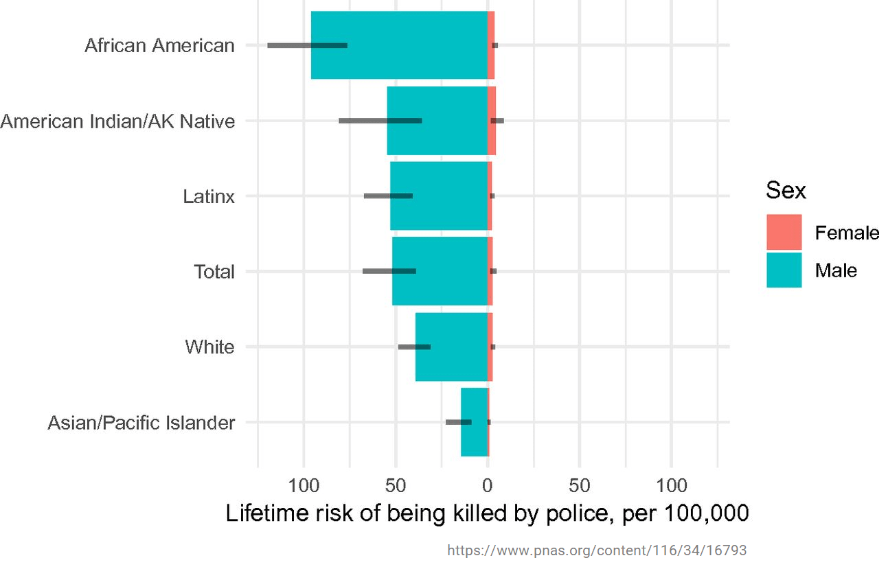{width="90%"}

As this chart shows, nearly 100 in 100,000 Black men and boys will be
killed by U.S. police over the life course. Notice the different ways
rates can be conveyed:

1.  Latino men and boys have an estimated risk of being killed by police
    of about 53 per 100,000.\
2.  Asian/Pacific Islander men and boys face a lifetime risk of between
    9 and 23 per 100,000.\
3.  White men and boys face a lifetime risk of about 39 per 100,000.

<br />

::: my-tip
#### Heads up!

The denominator must include all possible occurrences.
:::

<br>

Can the divorce rate be calculated as follows?

$\frac{\text{Number couples divorcing in 2024}}{\text{Number couples marrying in 2024}}$

No! The *denominator* should consist of all couples who could
divorce—including *every couple that is married* at any point in 2024,
even if they got married before 2024.

<br>

#### Summary:

**Interval-ratio:**\
can have [frequency distributions]{style="color: #18bc9c"}, [cumulative
frequency distributions]{style="color: #18bc9c"}, and
[rates]{style="color: #18bc9c"}

**Nominal variables:**\
can have [frequency distributions]{style="color: #18bc9c"}, cannot have
[cumulative frequency distributions]{style="color: #e74c3c"}

**Ordinal:**\
can have [frequency distributions]{style="color: #18bc9c"} and
[cumulative frequency distributions]{style="color: #18bc9c"}

### Figures

Sociologists want to understand data because it helps us understand the
social world. Raw data, like the distributions we have reviewed, are
often presented as statistical graphs. Graphing data helps people get
the overall summary of a large amount of information quickly.

Tables are especially good at conveying the details about the
relationship between variables. But, graphs help direct attention to the
take-away of the relationship, helping people focus on the bigger
picture rather than the details.

Let's consider some examples. Each of the graphs below could be
presented as a table. But, the audience would have to work very hard to
get the take-away point of the data from a table.

<br>

A [**bar graph**]{style="color: #18bc9c"} is used:\
for **nominal** or **ordinal** variables,

to show frequencies or percentages,

using separated rectangles, with height proportional\
to the frequency or percentage.

{width="100%"}

<br>

A [**histogram**]{style="color: #18bc9c"} is used:\
for **interval-ratio** variables,

to show frequencies or percentages,

using separated rectangles, with height proportional\
to the frequency or percentage.

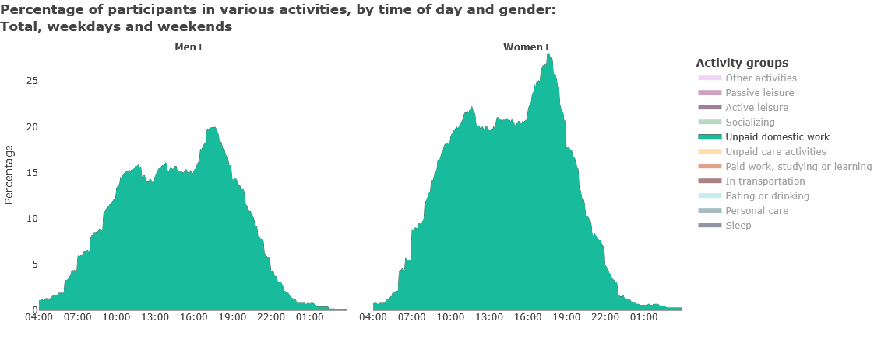{width="100%"}

<br>

A [**line graph**]{style="color: #18bc9c"} is used:\
for **interval-ratio** variables,

to show frequencies or percentages,

joining by category the frequency or average with a line.

{width="100%"}

<br>

A [**statistical map**]{style="color: #18bc9c"} is used:\
for **interval-ratio** variables,

to show geographical variations, often in ratios,

using variation in color or hue.

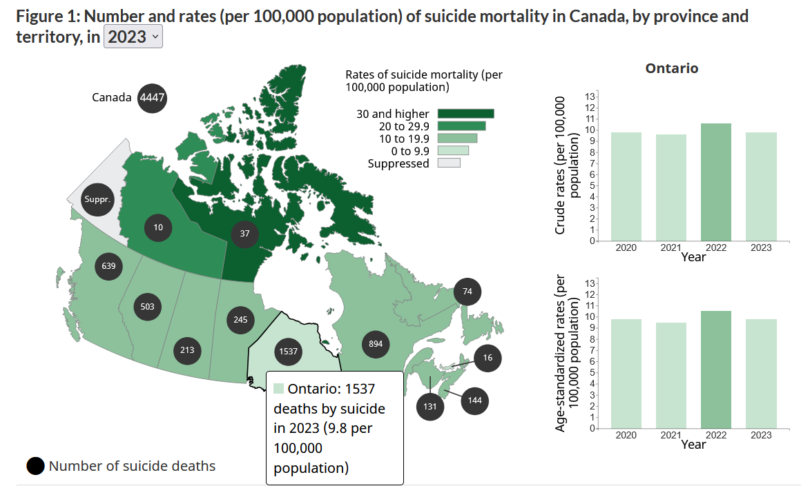{width="100%"}


## Measures of Variability

In this tutorial, you will learn how to calculate measures of
variability, values that describe the diversity in a distribution, for
**interval-ratio** (aka continuous) variables. Measures of variability
reveal how *spread out* the values in your dataset are.

Watch this short [video](https://www.youtube.com/watch?v=R4yfNi_8Kqw)
explaining why we need measures of variability in addition to our
measures of central tendency (mean, median, and mode) [\~11 minutes].
WARNING: MATH AHEAD!


<br />

### Range

::: my-def
#### RANGE

The difference between the highest and lowest values in a distribution.
:::

<br>

Here's a short [video](https://youtu.be/0HS1P3vhNBU) showing you how to
calculate the *range* [\~3 minutes]. 

<br />

**Finding the [range]{style="color: #18BC9C"} in a list:**

Women's ideal age of marriage:

$26,  23,  28,  27,  24,  25,  32,  25,  28,  25,  25,  26,  27,  26,  27,  25$

1.  Put the list in order:
    ${\color{mathBlue} 23}, 24, 25, 25, 25, 25, 25, 26, 26, 26, 27, 27, 27, 28, 28, {\color{mathRed} 32}$
2.  Subtract the min from the max:
    ${\color{mathRed} 32} - {\color{mathBlue} 23} = 9$

<br>

What about using `R` to do the calculations for us? We can use the
`IQR()` function and try it out on our fake family income data.

`r fa("otter", fill = "#F39C12")`<practice> PRACTICE:</practice>

1.  Replace the blank line with `range`.
2.  Click the `Run Code` button.
3.  When you're satisfied with your code, click **`Submit Answer`**.

```{r range01, exercise=TRUE}
# store the values in an object called my_data
my_data <- c(26, 23, 28, 27, 24, 25, 32, 25, 28, 25, 25, 26, 27, 26, 27, 25)

# Use the range function on my_data
_____(my_data)
```

```{r range01-solution}
# store the values in an object called my_data
my_data <- c(26, 23, 28, 27, 24, 25, 32, 25, 28, 25, 25, 26, 27, 26, 27, 25)

# Use the descr function on my_data
range(my_data)
```

::: {#range01-hint}
**Hint:** Delete the blank line and type "range" (without the quotes).
:::

```{r range01-check}
grade_this_code()
```

<br>

The **strength** of the range is that it is easy to calculate and simple
to understand.

The **weakness** of the range is that it is based only on the lowest and
the highest scores, which could be atypical and therefore it may be
misleading.

For example, if we wanted to know about people's average annual income,
including
[Drake](https://www.celebritynetworth.com/richest-celebrities/richest-rappers/drake-net-worth/)
in the range would make it appear as if more people earn millions of
dollars a year (most don't).

<br>

### Interquartile Range

::: my-def
#### INTERQUARTILE RANGE (IQR)

The width of the middle 50% of the distribution.
:::

<br>

The interquartile range (IQR) is the difference between the lower (Q1)
and upper (Q3) quartiles.

{width="100%"}

<br />\
To calculate the IQR, you have to first find the values of Q1 and Q3.
Check out this [video](https://youtu.be/4L5J49T0He4) for a demonstration
on calculating the quartiles [\~6 minutes].\


<br />

Now that you know what the quartiles are, you can use this information
to calculate the IQR. To do so, you simply subtract Q1 from Q3.

<br>

[**IQR**]{style="color: #18BC9C"} **in a list** with an **odd** number
of observations:

$2, 3, 3, 4, 4, 6, 7, 7, 7, 8, 9, 11, 12$

1.  [Q1]{style="color: #F39C12"} is the median of the numbers below the
    [median]{style="color: #3498DB"}:
    ${\color{mathOrange} 2, 3, 3, 4, 4, 6,} {\color{mathBlue} 7},
    7, 7, 8, 9, 11, 12$ ($\frac{3 + 4}{2}$)
    $= {\color{mathOrange} 3.5}$\
2.  [Q3]{style="color: #E74C3C"} is the median of the numbers above the
    [median]{style="color: #3498DB"}:
    $2, 3, 3, 4, 4, 6, {\color{mathBlue} 7},
    {\color{mathRed}7, 7, 8, 9, 11, 12}$ ($\frac{8 + 9}{2}$)
    $= {\color{mathRed} 8.5}$\
3.  Subtract Q1 from Q3:
    ${\color{mathRed} 8.5} - {\color{mathOrange} 3.5} = 5$

<br>

[**IQR**]{style="color: #18BC9C"} **in a list** with an **even** number
of observations:

$3, 4, 5, 7, 9, 10, 11, 13$

1.  [Q1]{style="color: #F39C12"} is the median of the numbers below the
    [median]{style="color: #3498DB"}: ${\color{mathOrange} 3, 4, 5, 7, }
    9, 10, 11, 13$ ($\frac{4 + 5}{2}$) $= {\color{mathOrange} 4.5}$\
2.  [Q3]{style="color: #E74C3C"} is the median of the numbers above the
    [median]{style="color: #3498DB"}: $3, 4, 5, 7,
    {\color{mathRed}9, 10, 11, 13}$ ($\frac{10 + 11}{2}$)
    $= {\color{mathRed} 10.5}$\
3.  Subtract Q1 from Q3:
    ${\color{mathRed} 10.5} - {\color{mathOrange} 4.5} = 6$

::: my-tip
#### Heads Up!

The median of the list is [$8$]{style="color: #3498DB"}.
:::

<br>

What about using `R` to do the calculations for us? We can use the
`quantile()` function to get the minx, Q1, Q2 (median), Q3, and Q4
(max). `IQR()` function will simply repot the IQR.

But, there's a catch! The `iqr()` function is simple, but there are
actually 9 different ways that R can calculate the IQR! Yikes!

To match our calculations:

- odd number of observations = **type 6**
- even number of observations = **type 5**

Try it out on our fake data and see if you can match our hand
calculations.

`r fa("otter", fill = "#F39C12")`<practice> PRACTICE:</practice>

1.  Replace the blank line with the correct type number.
2.  Click the `Run Code` button.
3.  When you're satisfied with your code, click **`Submit Answer.`**

```{r iqr01, exercise=TRUE}
# store the values in an object called my_data
my_data <- c(2, 3, 3, 4, 4, 6, 7, 7, 7, 8, 9, 11, 12)

# Choose the correct type and then use the IQR function on my_data
quantile(my_data, type = _)
IQR(my_data, type = _)
```

```{r iqr01-solution}
# store the values in an object called my_data
my_data <- c(2, 3, 3, 4, 4, 6, 7, 7, 7, 8, 9, 11, 12)

# Choose the correct type and then use the IQR function on my_data
quantile(my_data, type = 6)
IQR(my_data, type = 6)
```

::: {#iqr01-hint}
**Hint:** Delete the blank lines and type "6" (without the quotes).
:::

```{r iqr01-check}
grade_this_code()
```

<br>

```{r iqr02, exercise=TRUE}
# store the values in an object called my_data
my_data <- c(3, 4, 5, 7, 9, 10, 11, 13)

# Choose the correct type and then use the IQR and quantile functions on my_data
quantile(my_data, type = _)
IQR(my_data, type = _)

```

```{r iqr02-solution}
# store the values in an object called my_data
my_data <- c(3, 4, 5, 7, 9, 10, 11, 13)

# Choose the correct type and then use the IQR and quantile functions on my_data
quantile(my_data, type = 5)
IQR(my_data, type = 5)

```

::: {#iqr02-hint}
**Hint:** Delete the blank lines and type "5" (without the quotes).
:::

```{r iqr02-check}
grade_this_code()
```

<br>

### Standard Deviation

A key measure of spread in statistics is the standard deviation.

::: my-def
#### STANDARD DEVIATION

A measure of variation for interval-ratio variables.
:::

<br>

Along the way to calculating the standard deviation, you calculate the
**variance** of a distribution. The variance is also a measure of
variation of a distribution, but it is difficult to interpret because
the number doesn't reflect interpretable units.

Therefore, most of the time we continue on in our calculations to
determine the standard deviation. The standard deviation is expressed in
the same units as the observations. Meaning, if our variable is age, the
standard deviation will be expressed in years. If our variable is
income, the standard deviation will be expressed in dollars.

If all of the values in a distribution are identical, the standard
deviation would be equal to zero. The mean, median, and mode would all
be the same value, as there would be no variation between the values.
For example, let's say I asked a sample of 30 students how many hours
they spent watching Netflix last week, and everyone reported 10 hours.
The mean, median, and mode would all be 10. The standard deviation would
be zero because there was no variation in the answers.

Now, let's say I asked these same 30 students this question the
following week. They all mostly reported 10 hours of Netflix viewing
this week too. Except, this week, one person reported zero hours because
they canceled their Netflix account and one person was home sick for the
week and reported 20 hours of Netflix viewing. The mean, median, and
mode would remain 10 hours per week. But, the standard deviation would
be larger than zero because there was variation in the reported hours.
The larger the standard deviation, the more variation there is in a
distribution (i.e., values in a dataset).

<br>

**5 steps for calculating the standard deviation.**

1.  Calculate the mean.

2.  Subtract the mean from every value (deviation from the mean).

3.  Square each "deviation from the mean."

4.  Calculate the **mean of the squared "deviations from the mean**."

5.  Take the square root of this new mean!

::: my-tip
#### Heads Up!

The mean of the squared "deviations from the mean" is the variance!
:::

<br>

Did I lose you there? Watch this
[video](https://www.youtube.com/watch?v=WVx3MYd-Q9w) for a demonstration
[4 minutes]. Here's where the real math comes in!


<br />

Note the end of the video mentions there are two formula's for
calculating the standard deviation (and variance). Technically, instead
of summing the "squared deviations from the mean" and dividing the sum
from the total number of observations, when using a sample,
statisticians divide by the total number of observations minus one.

Once the sample sizes become large enough, there's a negligible
difference between the two. **In this course, we're not going to worry
about the difference.** Always use the population variance and standard
deviation equations, if asked to calculate by hand.

{width="100%"}

<br>

#### Interpretation

Okay, now that you know *how* to calculate the standard deviation, why
would you *want* to?

Watch this [video](https://youtu.be/MRqtXL2WX2M) for the explanation for
why this is a useful skill in statistics [4 minutes].


**The interpretation of a standard deviation requires knowing the
mean.** Then, you can say something like this:

```         
I expect the average [whatever you're studying] to differ by [your standard deviation] from the mean.
```

For example, if the average number of minutes watching television per
day was 250 and the standard deviation was 90, you could say:

```         
I expect the average number of minutes of television watched per day to differ by 90 minutes from the mean (250 minutes).
```

<br>

**Let's see this in action**

$2,3,4,7,9$

<br>

#### Step 1 Calculate the mean $\bar{X}$

$\frac{2 + 3 + 4 + 7 +9}{5} = 5$

<br>

#### Step 2 Subtract the mean ($\bar{X}$) from every value ($X$)

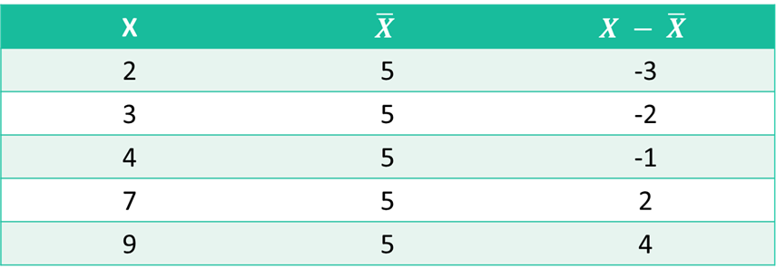{width="100%"}

<br>

#### Step 3 Square each difference

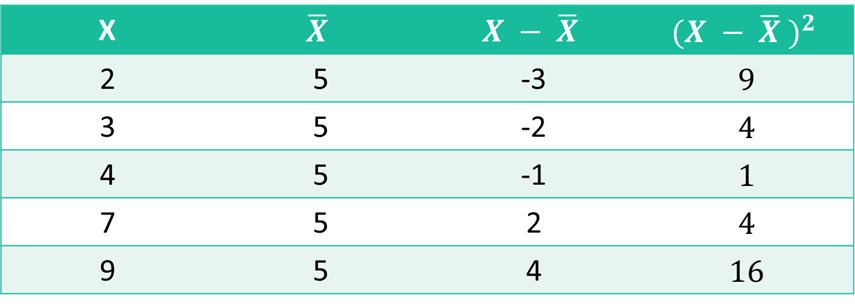{width="100%"}

<br>

#### Step 4 Calculate the mean of the squares

{width="100%"}

$\frac{9 + 4 +1 + 4 +16}{5} = 6.8$

<br>

::: my-tip
#### Heads Up!

6.8 is known as the variance!
:::

<br>

#### Step 5 Take the square root of the variance

$\sqrt{6.8} = 2.6$

I expect the average [*whatever you're studying*] to differ by [*your
standard deviation*] from the mean.

<br>

**Example**: Mean: 5; SD: 2.6

::: {style="color: #18bc9c; font-family: 'Shadows Into Light'"}
I expect the average [number of household family members] to differ by
[2.6 people] from the mean [of 5 people per household].
:::

<br>

Wow, this is going to get tedious with any more cases. Let's make `R` do
this for us instead. Use the `sd()` function and try it out on our fake
family income data.

`r fa("otter", fill = "#F39C12")`<practice> PRACTICE:</practice>

1.  Use the `sd()` with `my_data`.
2.  Click the `Run Code` button.
3.  When you're satisfied with your code, click **`Submit Answer.`**

```{r sd01, exercise=TRUE}
# store the values in an object called my_data
my_data <- c(48000, 52000, 45000, 50000, 53000, 
             49000, 46000, 51000, 65000, 250000)

# Use the sd() function on my_data below

```

```{r sd01-solution}
# store the values in an object called my_data
my_data <- c(48000, 52000, 45000, 50000, 53000, 
             49000, 46000, 51000, 65000, 250000)

# Use the sd() function on my_data below
sd(my_data)
```

```{r sd01-hint-1}
# store the values in an object called my_data
my_data <- c(48000, 52000, 45000, 50000, 53000, 
             49000, 46000, 51000, 65000, 250000)

# Use the sd() function on my_data below
sd(_____)
```

```{r sd01-check}
grade_this_code()
```

<br>


## Learning Check 02

Please answer the following questions to verify you understand the
topics in this module.

```{r Q01, echo=FALSE}
  question("Q01. The change in the number of legal immigrants coming to Canada between 2015 and 2025 is an example of _________ statistics.",
         answer("descriptive", correct = TRUE),
         answer("inferential"),
         random_answer_order = TRUE,
         allow_retry = TRUE
)
```

```{r Q02, echo=FALSE}
  question("Q02. What is the key difference between N and *n*?",
         answer("N represents the entire group being studies, whereas *n* represents a subset of that group.", correct = TRUE, message = "💯 Correct!"),
         answer("N is always smaller than *n*", message = "😲 The opposite is true."),
         answer("N refers to the number of variables, whereas *n* refers to the number of observations."),
          answer("N and *n* are interchangeable terms in statistics."),
         random_answer_order = TRUE,
         allow_retry = TRUE
)
```

```{r Q03, echo=FALSE}
  question("Q03. Which of the following is an example of a nominal level of measurement?",
         answer("The type of religion a person identifies with (e.g., Christianity, Islam, Judaism)", correct = TRUE, message = "💯 Correct!"),
         answer("The income of a family in dollars", message = "Nominal variables are categorical. This is a continuous variable."),
         answer("A ranking of provinces by marriage rate", message = "This would be an ordinal variable. This is a continuous variable."),
          answer("The number of children in a household", message = "This could be an ordinal or a continuous variable."),
         random_answer_order = TRUE,
         allow_retry = TRUE
)
```


#### Using the table below, answer the following questions.

*Fill in the missing cells of the table (by hand or using a
spreadsheet).*

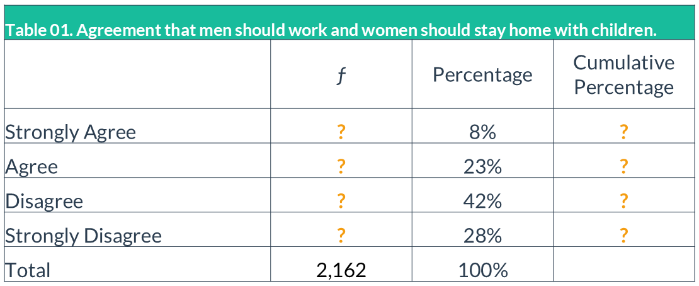{width="100%"}\
[Source: U.S. General Social Survey,
2024]{style="color: #grey80; font-size: 80%"}


```{r Q04, echo=FALSE}
  question("Q04. What percentage of people 'Strongly Agree' or 'Agree' men should work and women should stay-at-home?",
    answer("31%", correct = TRUE, message = "Bravo!"),
    answer("8", message = "This is the % who 'Strongly Agree,' but doesn't include those who also 'Agree.'"),
    answer("23%", message = "This is the % who 'Agree,' but doesn't include those who also 'Strongly Agree.'"),
    answer("42%", message = "This is the % who 'Disagree.'"),
    random_answer_order = TRUE,
           allow_retry = TRUE
  )
```

```{r, echo=FALSE}

my_data <- gss_all |>
  select(agekdbrn) |>
  filter(!is.na(agekdbrn) & agekdbrn < 50)

sumstatz <- data.frame(
  whichstat = c("median", "mean"),
  value     = c(median(my_data$agekdbrn), mean(my_data$agekdbrn))
)

sumstatz$whichstat <- factor(sumstatz$whichstat, levels = c("median", "mean"))

my_data |>
  ggplot(aes(agekdbrn)) + 
  geom_histogram(binwidth = 1, show.legend = FALSE) + 
  geom_density(col="black", show.legend = FALSE) + 
  geom_vline(data=sumstatz,
             aes(xintercept = value,
                 linetype = whichstat, col = whichstat), 
             linewidth = 1) +
  theme_minimal() +
    theme(
    axis.title.y = element_blank(),
    axis.text.y = element_blank()
    ) +
  xlab("age when 1st child born") +
  scale_color_manual(values = c("#20c997", "#f39c12")) +
  scale_linetype_manual(values = c("median" = "solid", "mean" = "dashed")) +
   labs(
    color = "Statistic",
    linetype = "Statistic"
  ) 
```

[*Source: U.S. General Social Survey
1994-2022*]{style="color: $gray-300; font-size: 80%"}

```{r Q05, echo=FALSE}
  question("Q05. Is this distribution symmetrical, negatively skewed, or positively skewed?",
    answer("positively skewed",    correct = TRUE),
    answer("negatively skewed",    message = "Negatively skewed distributions have a tail sticking out to the _left_."),
    answer("symmetrical",          message = "In symmetrical distributions, the mean = median."),
         random_answer_order = TRUE,
         allow_retry = TRUE
  )
```

<br>

You went back to the original surveys and find out that there was a typo
with the outlier. Instead of `250,000`, the actual income was `25,000`.
Correct this in your data and calculate the mean and the mode.

```{r lc01, exercise=TRUE}
# store the values in an object called my_data
my_data <- c(48000, 52000, 45000, 50000, 53000, 
             49000, 46000, 51000, 65000, 250000)

# Use the mean and median functions

```


```{r Q06, echo=FALSE}
  question("Q06. With the correction, is the distribution symmetrical, negatively skewed, or positively skewed?",
   answer("negatively skewed",    correct = TRUE,
           message = "Yes! In negatively skewed distributions, the mean < median."),
   answer("positively skewed",    
           message = "In positively skewed distributions, the mean > median."),
   answer("symmetrical",          
           message = "In symmetrical distributions, the mean = median."),
         random_answer_order = TRUE,
         allow_retry = TRUE
  )
```

<br>

```{r lc02, exercise=TRUE}

# Create a frequency table for the `premarsx` variable.

```

```{r Q07, echo=FALSE}
  question("Q07. According to your frequency table, what is the mode of the `premarsx` variable?",
   answer("not wrong at all",    correct = TRUE,
           message = "Yes! It has the greatest frequency and %."),
   answer("always wrong",    
           message = "Which category has the largest frequency?"),
   answer("almost always wrong",          
           message = "Which category has the largest frequency?"),
   answer("wrong only sometimes",          
           message = "Which category has the largest frequency?"),
         random_answer_order = TRUE,
         allow_retry = TRUE
  )
```

<br>

You've been asked to explain how the divorce rate has changed since the
1990s. To analyze this trend, you've been provided with a sample dataset
containing the 1991-1995 and 2016-2020 divorce rates for Canada's 10
provinces.

**Number of persons who divorced per 1,000 married persons**

```{r table, echo=FALSE}

url <- "https://www150.statcan.gc.ca/n1/daily-quotidien/220309/t002a-eng.csv"
divorce_data <- as_tibble(read_csv(url, skip = 4, 
                                   col_names = F, 
                                   show_col_types = FALSE,
                                   n_max = 10)) |>
  rename(
    region = 1,
    div_rate_1995 = 2,
    div_rate_2020 = 3
  )

kable(divorce_data) |>
  kable_styling(bootstrap_options = "striped", full_width = F, position = "left") %>%
  row_spec(0, color = "white", background = "#18BC9C")
```

Source(s): Canadian Vital Statistics – Divorce Database (3235).

<br />

#### Start your analysis by calculating the statistics needed to fill in the following table.

Then, answer the questions below. Now's a good time to get out some
scratch paper and a pencil to do some math.

```{r, echo=FALSE}
#| eval: false
#| results: hide

range(divorce_data$div_rate_1995)
range(divorce_data$div_rate_2020)

median(divorce_data$div_rate_1995)
median(divorce_data$div_rate_2020)

IQR(divorce_data$div_rate_1995, type = 6)
IQR(divorce_data$div_rate_2020, type = 6)

sd(divorce_data$div_rate_1995)
sd(divorce_data$div_rate_2020)
```

{width="90%"}


```{r Q08, echo=FALSE}
  question("Q08. According to the IQRs, what could you conclude about the divorce rates in 1995 and 2020?",
    answer("The IQR in 1995 was greater than in 2020, so the divorce rates between provinces varied more in 1995 than in 2020", correct = TRUE),
    answer("The IQR in 1995 was greater than in 2020, so the divorce rates between provinces varied more in 2018 than in 1995"),
    answer("On average, the divorce rate was higher in 2020 than in 2020"),
    answer("The divorce rate was about three times greater in 2020 than in 2020"),
         random_answer_order = TRUE,
         allow_retry = TRUE  )
```


```{r Q09, echo=FALSE}
  question("Q09. What was the standard deviation for the divorce rate in 2020?",
    answer("0.94",  correct = TRUE),
    answer("2.31",  message = "The standard deviation for 1995."),
    answer("7.47",  message = "This is the mean."),
    answer(".88",  message = "This is the variance."),
         random_answer_order = TRUE,
         allow_retry = TRUE    )
```

```{r Q10, echo=FALSE}
  question("Q10. What other number is needed to interpret the standard deviation?",
    answer("mean",  correct = TRUE),
    answer("median",  message = "The median is helpful but not what I was looking for."),
    answer("mode",  message = "This would be hard to calculate for a continuous variable."),
    answer("variance",  message = "Nope, but you could find it by squaring the standard deviation!"),
         random_answer_order = TRUE,
         allow_retry = TRUE    )
```
