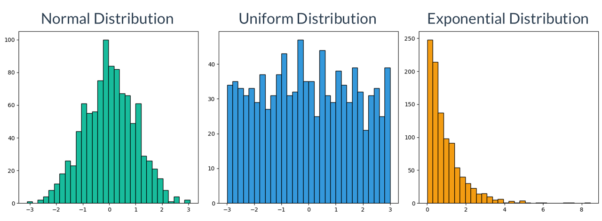

```{r}
#| label: setup
#| message: false
#| include: false

## Load packages, custom functions, and styles
source("custom-setup-styles.R")

## Load all gss
data(gss_all)

knitr::opts_chunk$set(echo = TRUE)
```

<link href="https://fonts.googleapis.com/css2?family=Shadows+Into+Light&display=swap" rel="stylesheet">

```{=html}
<script>
  document.addEventListener("DOMContentLoaded", function () {
    document.querySelectorAll("a[href^='http']").forEach(function(link) {
      link.setAttribute("target", "_blank");
      link.setAttribute("rel", "noopener noreferrer");
    });
  });
</script>
```

## Basic Statistical Terminology

{width="25%"}

`r fa("fas fa-lightbulb", fill = "#18BC9C")` [**LEARNING
OBJECTIVES**]{style="color: #18BC9C;"}

1.  Be familiar with basic terms of quantitative data analysis
2.  Calculate proportions and percentages
3.  Construct and analyze frequency, percentage, and cumulative
    distributions

`r fa("fas fa-book", fill = "#18BC9C")`
[**READINGS**]{style="color: #18BC9C;"}

Readings are available on Quercus.

1.  Wheelan, Charles. 2014. “Descriptive Statistics: Who Was the Best
    Baseball Player of All Time?” Pp. 15–35 in *Naked Statistics:
    Stripping the Dread from the Data*. New York: W. W. Norton &
    Company.

`r fa("fas fa-language", fill = "#18BC9C")`
[**TERMS**]{style="color: #18BC9C;"}

+----------------------------+-------------------------------------+
| -   UNIT OF ANALYSIS       | -   FREQUENCY DISTRIBUTION          |
|                            |                                     |
| -   POPULATION             | -   RELATIVE FREQUENCY DISTRIBUTION |
|                            |                                     |
| -   SAMPLE                 | -   PROPORTION                      |
|                            |                                     |
| -   N & n                  | -   PERCENTAGE                      |
|                            |                                     |
| -   DESCRIPTIVE STATISTICS | -   CUMULATIVE                      |
|                            |                                     |
| -   INFERENTIAL STATISTICS | -   RATE                            |
|                            |                                     |
| -   TIDY DATA              | -   BAR GRAPH                       |
|                            |                                     |
| -   VARIABLES              | -   HISTOGRAM                       |
|                            |                                     |
| -   DICHOTOMOUS            | -   LINE GRAPH                      |
|                            |                                     |
| -   NOMINAL                | -   STATISTICAL MAP                 |
|                            |                                     |
| -   ORDINAL                |                                     |
|                            |                                     |
| -   INTERVAL-RATIO         |                                     |
+----------------------------+-------------------------------------+

Statistics Vocabulary
------------------------------------------------------------------------

[**I'm interested in sociology. Why do I have to learn about
statistics?**]{.shadows-text style="color: #F39C12; font-size: 150%;"}

Students often arrive in statistics classes wondering why they are
required to take this class. Watch [this
video](https://www.youtube.com/watch?v=QwhK-iEyXYA) for a summary of how
sociologists *do* sociology and how statistics fits into the bigger
picture [\~10 minutes].


<br>

Before we can analyze data, we need to identify the **unit of
analysis**: who or what is being studied. The unit of analysis can be
people, institutions, groups, things, countries, states, and so on.

Rarely do scientists have the time to study an entire population of
interest, so we usually take a sample.

::: my-callout
#### POPULATION

All units of analysis (people, institutions, groups, etc.) in which the
researcher is interested.
:::

<br>

::: my-callout
#### SAMPLE

A subset of people (or institutions, groups, etc.) selected from a
population.
:::

<br>

#### A note on notation:

[**N**]{style="font-size: 200%; color: #E74C3C;"} refers to
**population** size

[***n***]{style="font-size: 200%; color: #E74C3C;"} refers to **sample**
size

<br>

::: my-tip
#### Heads Up!

The capitalization of the symbols/notations in statistics are
meaningful.
:::

Capital letters are typically used when describing a population.
Lowercase letters are often used when describing a sample.

{width="50%"}

### 

### Descriptive vs. Inferential Statistics

In this course, you will learn about descriptive and inferential
statistics. There are two types of statistics:

::: my-callout
#### DESCRIPTIVE STATISTICS

Procedures that help us organize and describe data collected from a
sample or population.
:::

<br>

::: my-callout
#### INFERENTIAL STATISTICS

Making underlying predictions or inferences about a *population* using
observations and analyses from a *sample.*
:::

<br>

Watch this short [video](https://youtu.be/87rxkjYNHUk) for a more
detailed explanation of the difference between the two [3 minutes].


<br />

We will focus on descriptive statistics the first few weeks of the
course, before moving on to inferential statistics.

<br>

`r fa("otter", fill = "#F39C12")`<practice> PRACTICE:</practice>

*Indicate whether the following uses descriptive or inferential
statistics*

```{r P01, echo=FALSE}
  question("The number of Toronto residents who were homeless in 2024.",
         answer("Descriptive", correct = TRUE),
         answer("Inferential"),
         random_answer_order = TRUE,
         allow_retry = TRUE
)
```

```{r P02, echo=FALSE}
  question("Determining students’ opinion about the quality of dining options at UofT based on a sample of 100 students.",
         answer("Inferential", correct = TRUE),
         answer("Descriptive", message = "Hint: The phrase 'based on' in the statement means _inferences_ are being made."),
         random_answer_order = TRUE,
         allow_retry = TRUE
)
```

### Tidy Data

Quantitative researchers commonly analyze data stored in tables, where
data is recorded in a combination of rows and columns (*think*
spreadsheets).

[**Tidy
data**](https://medium.com/@prabhakar_p/importance-of-tidy-data-and-its-impact-on-data-analysis-22e2e5acd90d)
is a specific way of organizing data into a consistent format (how the
data is organized in rows and columns).

Tidy data files contain one line for each observation, such as a record
or person (also called a "respondent"). **Each column generally
represents a single variable.**

{width="60%"}
<br />

::: my-callout
#### VARIABLES

Any factor, trait, or condition that can exist in differing amounts or
types.
:::

Variables are attributes that describe a person, place, thing, or idea
that we can then measure. They can be thought of as characteristics that
*vary*.

Variables must be **mutually exclusive** (classify every observation)
and **exhaustive** (one category for each observation).

There are three rules that make a dataset tidy:

1.  Each variable must have its own column.
2.  Each observation must have its own row.
3.  Each value must have its own cell.

{width="75%"}

<br />

To conduct statistical analyses, we need to know the scale of
measurement for a variable. There are different ways that variables can
be measured.

Consider how we might measure *happiness* in a survey.

People could tell us they either are happy or they are not happy. They
could tell us how happy they are, such as very unhappy, somewhat
unhappy, somewhat happy, or very happy. We could ask people to rate
their happiness on a scale from 1-10, with 1 being not at all happy and
10 being ecstatic! Or, we could ask people to tell us what emotion they
most felt throughout the day (e.g., happy, sad, content, joyful,
anxious, and so on).

These options are all different *levels of measurement*.

<br />

### Measurement Levels

**Watch this short
[video](https://www.youtube.com/watch?v=hZxnzfnt5v8){target="_blank"}
explaining the different types of data that scientists collect [\~6
minutes].**


#### **Terms**

[**DICHOTOMOUS** (aka binary)]{style="color: #18BC9C;"} A variable with
only two categories.

[**NOMINAL**]{style="color: #18BC9C;"}\
A variable made up of categories that cannot be ordered according to
rank.

[**ORDINAL**]{style="color: #18BC9C;"} A variable made up of ranked
categories, but there is no systematic and measurable numeric difference
between the categories.

[**INTERVAL-RATIO**]{style="color: #18BC9C;"} A variable with categories
that are rank-ordered and expressed in the same units.

------------------------------------------------------------------------

#### **Transforming Variables**

One kind of variable can be transformed into another kind of variable.
Properties that can be measured at a more precise level can also be
measured at a less precise level, but not vice versa.

<br />

[Example:]{style="color: #F39C12;"}\
Years of education, an interval variable, can be dichotomized into "high
school graduate" vs. "not a graduate."

{width="100%"}

<br /> `r fa("otter", fill = "#DB9C1B")`<practice> PRACTICE:</practice>

*Identify the following as nominal level, ordinal level, or
interval-ratio level data.*

```{r P03, echo=FALSE}
  question("Satisfaction rating (extremely dislike, dislike, neutral, like, extremely like)",
           answer("nominal", message = "Try again. These responses have a ranked order."),
           answer("ordinal", correct = TRUE, message = "Amazing!"),
           answer("interval-ratio", message = "Try again. The differences between adjacent categories do not necessarily have the same meaning."),
           random_answer_order = TRUE,
           allow_retry = TRUE
  )
```

```{r P04, echo=FALSE}
  question("Amount of money in savings accounts",
           answer("interval-ratio", correct = TRUE, message = "Splendid!"),
           answer("nominal", message = "Try again. This isn't a variable made up of categories that cannot be ordered according to rank."),
           answer("ordinal",  message = "Try again. The difference between two values is meaningful."),
           random_answer_order = TRUE,
           allow_retry = TRUE
  )
```

Frequency Distributions
------------------------------------------------------------------------

Once we've collected the data from a sample, we evaluate the responses. 
Are all the responses alike? Did people pick one answer category more than others? 
Are lots of people middle class or are some people very poor and some people really rich?  
  
To answer these questions, researchers analyze the *distribution* of the data.  
  
::: my-callout
#### DISTRIBUTION:
Shows all the possible values (or intervals) of the data and how often they occur.
:::
  
::: my-callout
#### FREQUENCY DISTRIBUTION

A table reporting the number of observations falling into each category
of the variable.
:::

<br>

{ width=60% }

<br />    

#### Distribution Tables

A common first step in data analysis is to create a table showing the number of observations for each value of a variable. This is called a **frequency table**. 
It consists of two columns.  
  
The first column includes the variable and the response categories.  

The second column reports the number of cases in each category, 
as well as the total number of cases (i.e., sum of all frequencies).  


```{r}
#| echo = FALSE

gss_all$premarsx <- as_factor(zap_missing(gss_all$premarsx))
gss_all$sex <- as_factor(zap_missing(gss_all$sex))

freq_premarsx <- gss_all %>%
  select(id, year, sex, premarsx) %>%
  filter(year == 2024, !is.na(premarsx)) %>%
  count(premarsx)

total_row <- freq_premarsx %>%
  summarise(across(where(is.numeric), sum)) %>%
  mutate(premarsx = "Total")

# combine
table_premarsx <- rbind(freq_premarsx, total_row)
```

<br>

**Table 1. Attitudes about sex before marriage**

```{r}
#| label: table01
#| echo: false

# Render the table
table_premarsx %>%
  flextable() %>%
  style_flextable()
```

[Source: U.S. General Social Survey, 2024]{style="color: #grey80; font-size: 80%"}

[**Survey question**: *There's been a lot of discussion about the way
morals and attitudes about sex are changing in this country. If a man
and woman have sex relations before marriage, do you think it is
\_\_\_\_\_\_\_\_\_\_\_\_.*]{style="font-size: 80%"}


Learning Check 02
------------------------------------------------------------------------

Please answer the following questions to verify you understand the
topics in this module.


```{r Q01, echo=FALSE}
  question("Q01. The change in the number of legal immigrants coming to Canada between 2015 and 2025 is an example of _________ statistics.",
         answer("descriptive", correct = TRUE),
         answer("inferential"),
         random_answer_order = TRUE,
         allow_retry = TRUE
)
```

```{r Q02, echo=FALSE}
  question("Q02. What is the key difference between N and *n*?",
         answer("N represents the entire group being studies, whereas *n* represents a subset of that group.", correct = TRUE, message = "💯 Correct!"),
         answer("N is always smaller than *n*", message = "😲 The opposite is true."),
         answer("N refers to the number of variables, whereas *n* refers to the number of observations."),
          answer("N and *n* are interchangeable terms in statistics."),
         random_answer_order = TRUE,
         allow_retry = TRUE
)
```

```{r Q03, echo=FALSE}
  question("Q03. Which of the following is an example of a nominal level of measurement?",
         answer("The type of religion a person identifies with (e.g., Christianity, Islam, Judaism)", correct = TRUE, message = "💯 Correct!"),
         answer("The income of a family in dollars", message = "Nominal variables are categorical. This is a continuous variable."),
         answer("A ranking of provinces by marriage rate", message = "This would be an ordinal variable. This is a continuous variable."),
          answer("The number of children in a household", message = "This could be an ordinal or a continuous variable."),
         random_answer_order = TRUE,
         allow_retry = TRUE
)
```

```{r Q04, echo=FALSE}
  question("Q04. Ranking neighborhoods by crime rate (e.g., low, medium, high) is a _________ type of variable.",
           answer("ordinal", correct = TRUE, message = "Fantastic!"),
           answer("nominal", message = "Try again. This isn't a variable made up of categories that cannot be ordered."),
           answer("interval-ratio", message = "Try again. The differences between adjacent categories do not necessarily have the same meaning."),
           random_answer_order = TRUE,
           allow_retry = TRUE
  )
```
