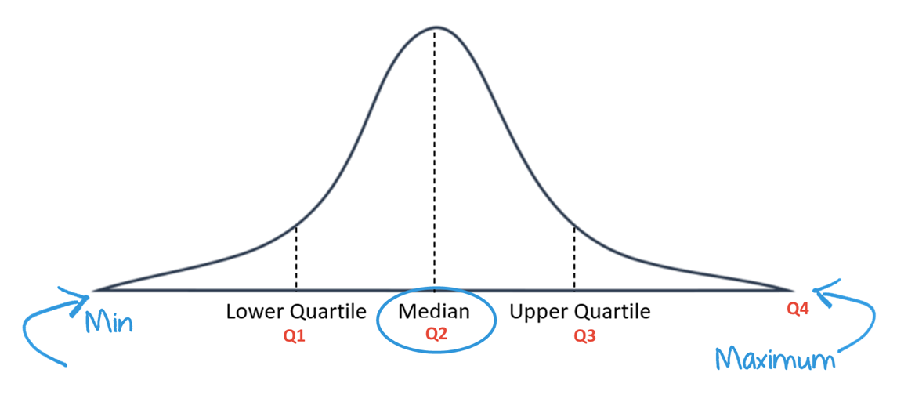
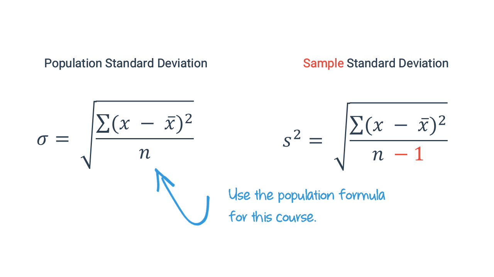
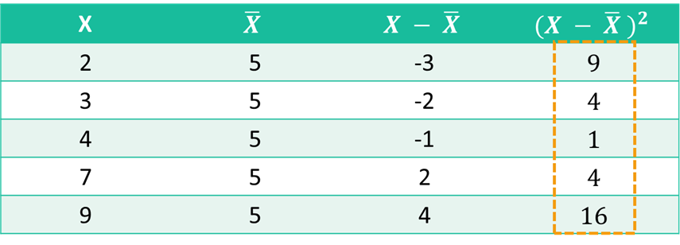
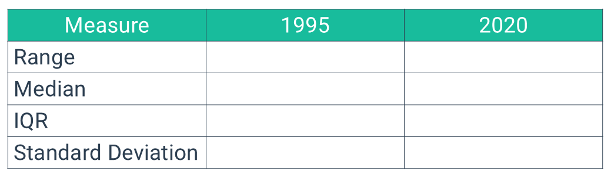

```{r}
#| label: setup
#| message: false
#| include: false

# GLOBAL ENVIRONMENT PANE
## source("tutorials/SOC6302-03/custom-setup-styles.R")
## library(gssr)
## library(gssrdoc)
## data(gss_all)
## gss24 <- gss_get_yr(2024)
## data(gss_dict)

## Load packages, custom functions, and styles
source("custom-setup-styles.R")

## Load all gss
gss_all <- readRDS("data/gss_all.rds")

# Get the data only for the 2024 survey respondents
gss24 <- readRDS("data/gss24.rds")

## Options
tutorial_options(exercise.checker = gradethis::grade_learnr)
options(dplyr.summarise.inform=F)   # Avoid grouping warning
options(digits=4)                   # Round numbers
theme_set(theme_minimal())          # set ggplot theme
# st_options(freq.report.nas = FALSE) # remove extra columns in freq()
 # any reason need to see this?!?! CHECK FOR SP22
  
knitr::opts_chunk$set(echo = FALSE,
                      warning = FALSE, 
                      messages = FALSE)
```

<link href="https://fonts.googleapis.com/css2?family=Shadows+Into+Light&display=swap" rel="stylesheet">

```{=html}
<script>
  document.addEventListener("DOMContentLoaded", function () {
    document.querySelectorAll("a[href^='http']").forEach(function(link) {
      link.setAttribute("target", "_blank");
      link.setAttribute("rel", "noopener noreferrer");
    });
  });
</script>
```

## Central Tendency & Variability

{width="25%"}


## Measures of Variability

In this tutorial, you will learn how to calculate measures of
variability, values that describe the diversity in a distribution, for
**interval-ratio** (aka continuous) variables. Measures of variability
reveal how *spread out* the values in your dataset are.

Watch this short [video](https://www.youtube.com/watch?v=R4yfNi_8Kqw)
explaining why we need measures of variability in addition to our
measures of central tendency (mean, median, and mode) [\~11 minutes].
WARNING: MATH AHEAD!


<br />

### Range

::: my-def
#### RANGE

The difference between the highest and lowest values in a distribution.
:::

<br>

Here's a short [video](https://youtu.be/0HS1P3vhNBU) showing you how to
calculate the *range* [\~3 minutes]. 

<br />

**Finding the [range]{style="color: #18BC9C"} in a list:**

Women's ideal age of marriage:

$26,  23,  28,  27,  24,  25,  32,  25,  28,  25,  25,  26,  27,  26,  27,  25$

1.  Put the list in order:
    ${\color{mathBlue} 23}, 24, 25, 25, 25, 25, 25, 26, 26, 26, 27, 27, 27, 28, 28, {\color{mathRed} 32}$
2.  Subtract the min from the max:
    ${\color{mathRed} 32} - {\color{mathBlue} 23} = 9$

<br>

What about using `R` to do the calculations for us? We can use the
`IQR()` function and try it out on our fake family income data.

`r fa("otter", fill = "#F39C12")`<practice> PRACTICE:</practice>

1.  Replace the blank line with `range`.
2.  Click the `Run Code` button.
3.  When you're satisfied with your code, click **`Submit Answer`**.

```{r range01, exercise=TRUE}
# store the values in an object called my_data
my_data <- c(26, 23, 28, 27, 24, 25, 32, 25, 28, 25, 25, 26, 27, 26, 27, 25)

# Use the range function on my_data
_____(my_data)
```

```{r range01-solution}
# store the values in an object called my_data
my_data <- c(26, 23, 28, 27, 24, 25, 32, 25, 28, 25, 25, 26, 27, 26, 27, 25)

# Use the descr function on my_data
range(my_data)
```

::: {#range01-hint}
**Hint:** Delete the blank line and type "range" (without the quotes).
:::

```{r range01-check}
grade_this_code()
```

<br>

The **strength** of the range is that it is easy to calculate and simple
to understand.

The **weakness** of the range is that it is based only on the lowest and
the highest scores, which could be atypical and therefore it may be
misleading.

For example, if we wanted to know about people's average annual income,
including
[Drake](https://www.celebritynetworth.com/richest-celebrities/richest-rappers/drake-net-worth/)
in the range would make it appear as if more people earn millions of
dollars a year (most don't).

<br>

### Interquartile Range

::: my-def
#### INTERQUARTILE RANGE (IQR)

The width of the middle 50% of the distribution.
:::

<br>

The interquartile range (IQR) is the difference between the lower (Q1)
and upper (Q3) quartiles.

{width="100%"}

<br />\
To calculate the IQR, you have to first find the values of Q1 and Q3.
Check out this [video](https://youtu.be/4L5J49T0He4) for a demonstration
on calculating the quartiles [\~6 minutes].\


<br />

Now that you know what the quartiles are, you can use this information
to calculate the IQR. To do so, you simply subtract Q1 from Q3.

<br>

[**IQR**]{style="color: #18BC9C"} **in a list** with an **odd** number
of observations:

$2, 3, 3, 4, 4, 6, 7, 7, 7, 8, 9, 11, 12$

1.  [Q1]{style="color: #F39C12"} is the median of the numbers below the
    [median]{style="color: #3498DB"}:
    ${\color{mathOrange} 2, 3, 3, 4, 4, 6,} {\color{mathBlue} 7},
    7, 7, 8, 9, 11, 12$ ($\frac{3 + 4}{2}$)
    $= {\color{mathOrange} 3.5}$\
2.  [Q3]{style="color: #E74C3C"} is the median of the numbers above the
    [median]{style="color: #3498DB"}:
    $2, 3, 3, 4, 4, 6, {\color{mathBlue} 7},
    {\color{mathRed}7, 7, 8, 9, 11, 12}$ ($\frac{8 + 9}{2}$)
    $= {\color{mathRed} 8.5}$\
3.  Subtract Q1 from Q3:
    ${\color{mathRed} 8.5} - {\color{mathOrange} 3.5} = 5$

<br>

[**IQR**]{style="color: #18BC9C"} **in a list** with an **even** number
of observations:

$3, 4, 5, 7, 9, 10, 11, 13$

1.  [Q1]{style="color: #F39C12"} is the median of the numbers below the
    [median]{style="color: #3498DB"}: ${\color{mathOrange} 3, 4, 5, 7, }
    9, 10, 11, 13$ ($\frac{4 + 5}{2}$) $= {\color{mathOrange} 4.5}$\
2.  [Q3]{style="color: #E74C3C"} is the median of the numbers above the
    [median]{style="color: #3498DB"}: $3, 4, 5, 7,
    {\color{mathRed}9, 10, 11, 13}$ ($\frac{10 + 11}{2}$)
    $= {\color{mathRed} 10.5}$\
3.  Subtract Q1 from Q3:
    ${\color{mathRed} 10.5} - {\color{mathOrange} 4.5} = 6$

::: my-tip
#### Heads Up!

The median of the list is [$8$]{style="color: #3498DB"}.
:::

<br>

What about using `R` to do the calculations for us? We can use the
`quantile()` function to get the minx, Q1, Q2 (median), Q3, and Q4
(max). `IQR()` function will simply repot the IQR.

But, there's a catch! The `iqr()` function is simple, but there are
actually 9 different ways that R can calculate the IQR! Yikes!

To match our calculations:

- odd number of observations = **type 6**
- even number of observations = **type 5**

Try it out on our fake data and see if you can match our hand
calculations.

`r fa("otter", fill = "#F39C12")`<practice> PRACTICE:</practice>

1.  Replace the blank line with the correct type number.
2.  Click the `Run Code` button.
3.  When you're satisfied with your code, click **`Submit Answer.`**

```{r iqr01, exercise=TRUE}
# store the values in an object called my_data
my_data <- c(2, 3, 3, 4, 4, 6, 7, 7, 7, 8, 9, 11, 12)

# Choose the correct type and then use the IQR function on my_data
quantile(my_data, type = _)
IQR(my_data, type = _)
```

```{r iqr01-solution}
# store the values in an object called my_data
my_data <- c(2, 3, 3, 4, 4, 6, 7, 7, 7, 8, 9, 11, 12)

# Choose the correct type and then use the IQR function on my_data
quantile(my_data, type = 6)
IQR(my_data, type = 6)
```

::: {#iqr01-hint}
**Hint:** Delete the blank lines and type "6" (without the quotes).
:::

```{r iqr01-check}
grade_this_code()
```

<br>

```{r iqr02, exercise=TRUE}
# store the values in an object called my_data
my_data <- c(3, 4, 5, 7, 9, 10, 11, 13)

# Choose the correct type and then use the IQR and quantile functions on my_data
quantile(my_data, type = _)
IQR(my_data, type = _)

```

```{r iqr02-solution}
# store the values in an object called my_data
my_data <- c(3, 4, 5, 7, 9, 10, 11, 13)

# Choose the correct type and then use the IQR and quantile functions on my_data
quantile(my_data, type = 5)
IQR(my_data, type = 5)

```

::: {#iqr02-hint}
**Hint:** Delete the blank lines and type "5" (without the quotes).
:::

```{r iqr02-check}
grade_this_code()
```

<br>

### Standard Deviation

A key measure of spread in statistics is the standard deviation.

::: my-def
#### STANDARD DEVIATION

A measure of variation for interval-ratio variables.
:::

<br>

Along the way to calculating the standard deviation, you calculate the
**variance** of a distribution. The variance is also a measure of
variation of a distribution, but it is difficult to interpret because
the number doesn't reflect interpretable units.

Therefore, most of the time we continue on in our calculations to
determine the standard deviation. The standard deviation is expressed in
the same units as the observations. Meaning, if our variable is age, the
standard deviation will be expressed in years. If our variable is
income, the standard deviation will be expressed in dollars.

If all of the values in a distribution are identical, the standard
deviation would be equal to zero. The mean, median, and mode would all
be the same value, as there would be no variation between the values.
For example, let's say I asked a sample of 30 students how many hours
they spent watching Netflix last week, and everyone reported 10 hours.
The mean, median, and mode would all be 10. The standard deviation would
be zero because there was no variation in the answers.

Now, let's say I asked these same 30 students this question the
following week. They all mostly reported 10 hours of Netflix viewing
this week too. Except, this week, one person reported zero hours because
they canceled their Netflix account and one person was home sick for the
week and reported 20 hours of Netflix viewing. The mean, median, and
mode would remain 10 hours per week. But, the standard deviation would
be larger than zero because there was variation in the reported hours.
The larger the standard deviation, the more variation there is in a
distribution (i.e., values in a dataset).

<br>

**5 steps for calculating the standard deviation.**

1.  Calculate the mean.

2.  Subtract the mean from every value (deviation from the mean).

3.  Square each "deviation from the mean."

4.  Calculate the **mean of the squared "deviations from the mean**."

5.  Take the square root of this new mean!

::: my-tip
#### Heads Up!

The mean of the squared "deviations from the mean" is the variance!
:::

<br>

Did I lose you there? Watch this
[video](https://www.youtube.com/watch?v=WVx3MYd-Q9w) for a demonstration
[4 minutes]. Here's where the real math comes in!


<br />

Note the end of the video mentions there are two formula's for
calculating the standard deviation (and variance). Technically, instead
of summing the "squared deviations from the mean" and dividing the sum
from the total number of observations, when using a sample,
statisticians divide by the total number of observations minus one.

Once the sample sizes become large enough, there's a negligible
difference between the two. **In this course, we're not going to worry
about the difference.** Always use the population variance and standard
deviation equations, if asked to calculate by hand.

{width="100%"}

<br>

#### Interpretation

Okay, now that you know *how* to calculate the standard deviation, why
would you *want* to?

Watch this [video](https://youtu.be/MRqtXL2WX2M) for the explanation for
why this is a useful skill in statistics [4 minutes].


**The interpretation of a standard deviation requires knowing the
mean.** Then, you can say something like this:

```         
I expect the average [whatever you're studying] to differ by [your standard deviation] from the mean.
```

For example, if the average number of minutes watching television per
day was 250 and the standard deviation was 90, you could say:

```         
I expect the average number of minutes of television watched per day to differ by 90 minutes from the mean (250 minutes).
```

<br>

**Let's see this in action**

$2,3,4,7,9$

<br>

#### Step 1 Calculate the mean $\bar{X}$

$\frac{2 + 3 + 4 + 7 +9}{5} = 5$

<br>

#### Step 2 Subtract the mean ($\bar{X}$) from every value ($X$)

{width="100%"}

<br>

#### Step 3 Square each difference

{width="100%"}

<br>

#### Step 4 Calculate the mean of the squares

{width="100%"}

$\frac{9 + 4 +1 + 4 +16}{5} = 6.8$

<br>

::: my-tip
#### Heads Up!

6.8 is known as the variance!
:::

<br>

#### Step 5 Take the square root of the variance

$\sqrt{6.8} = 2.6$

I expect the average [*whatever you're studying*] to differ by [*your
standard deviation*] from the mean.

<br>

**Example**: Mean: 5; SD: 2.6

::: {style="color: #18bc9c; font-family: 'Shadows Into Light'"}
I expect the average [number of household family members] to differ by
[2.6 people] from the mean [of 5 people per household].
:::

<br>

Wow, this is going to get tedious with any more cases. Let's make `R` do
this for us instead. Use the `sd()` function and try it out on our fake
family income data.

`r fa("otter", fill = "#F39C12")`<practice> PRACTICE:</practice>

1.  Use the `sd()` with `my_data`.
2.  Click the `Run Code` button.
3.  When you're satisfied with your code, click **`Submit Answer.`**

```{r sd01, exercise=TRUE}
# store the values in an object called my_data
my_data <- c(48000, 52000, 45000, 50000, 53000, 
             49000, 46000, 51000, 65000, 250000)

# Use the sd() function on my_data below

```

```{r sd01-solution}
# store the values in an object called my_data
my_data <- c(48000, 52000, 45000, 50000, 53000, 
             49000, 46000, 51000, 65000, 250000)

# Use the sd() function on my_data below
sd(my_data)
```

```{r sd01-hint-1}
# store the values in an object called my_data
my_data <- c(48000, 52000, 45000, 50000, 53000, 
             49000, 46000, 51000, 65000, 250000)

# Use the sd() function on my_data below
sd(_____)
```

```{r sd01-check}
grade_this_code()
```

<br>

## Learning Check 03

Please answer the following questions to verify you understand the
topics in this tutorial.

```{r}

my_data <- gss_all |>
  select(agekdbrn) |>
  filter(!is.na(agekdbrn) & agekdbrn < 50)

sumstatz <- data.frame(
  whichstat = c("median", "mean"),
  value     = c(median(my_data$agekdbrn), mean(my_data$agekdbrn))
)

sumstatz$whichstat <- factor(sumstatz$whichstat, levels = c("median", "mean"))

my_data |>
  ggplot(aes(agekdbrn)) + 
  geom_histogram(binwidth = 1, show.legend = FALSE) + 
  geom_density(col="black", show.legend = FALSE) + 
  geom_vline(data=sumstatz,
             aes(xintercept = value,
                 linetype = whichstat, col = whichstat), 
             linewidth = 1) +
  theme_minimal() +
    theme(
    axis.title.y = element_blank(),
    axis.text.y = element_blank()
    ) +
  xlab("age when 1st child born") +
  scale_color_manual(values = c("#20c997", "#f39c12")) +
  scale_linetype_manual(values = c("median" = "solid", "mean" = "dashed")) +
   labs(
    color = "Statistic",
    linetype = "Statistic"
  ) 
```

[*Source: U.S. General Social Survey
1994-2022*]{style="color: $gray-300; font-size: 80%"}

```{r Q01, echo=FALSE}
  question("Q01. Is this distribution symmetrical, negatively skewed, or positively skewed?",
    answer("positively skewed",    correct = TRUE),
    answer("negatively skewed",    message = "Negatively skewed distributions have a tail sticking out to the _left_."),
    answer("symmetrical",          message = "In symmetrical distributions, the mean = median."),
         random_answer_order = TRUE,
         allow_retry = TRUE
  )
```

<br>

Using our data from before, calculate the mean and the median (with R or
by hand).

```{r lc01, exercise=TRUE}
# store the values in an object called my_data
my_data <- c(48000, 52000, 45000, 50000, 53000, 
             49000, 46000, 51000, 65000, 250000)

# Use the mean and median functions

```

```{r Q02, echo=FALSE}
  question("Q02. Based on your findings, is the distribution symmetrical, negatively skewed, or positively skewed?",
    answer("positively skewed",    correct = TRUE,
           message = "Yes! In positively skewed distributions, the mean > median."),
    answer("negatively skewed",    
           message = "In negatively skewed distributions, the mean < median."),
    answer("symmetrical",          
           message = "In symmetrical distributions, the mean = median."),
         random_answer_order = TRUE,
         allow_retry = TRUE
  )
```

You went back to the original surveys and find out that there was a typo
with the outlier. Instead of `250,000`, the actual income was `25,000`.
Correct this in your data and calculate the mean and the mode again.

```{r Q03, echo=FALSE}
  question("Q03. With the correction, is the distribution symmetrical, negatively skewed, or positively skewed?",
   answer("negatively skewed",    correct = TRUE,
           message = "Yes! In negatively skewed distributions, the mean < median."),
   answer("positively skewed",    
           message = "In positively skewed distributions, the mean > median."),
   answer("symmetrical",          
           message = "In symmetrical distributions, the mean = median."),
         random_answer_order = TRUE,
         allow_retry = TRUE
  )
```

```{r lc02, exercise=TRUE}

# Create a frequency table for the `premarsx` variable.

```

```{r Q04, echo=FALSE}
  question("Q04. According to your frequency table, what is the mode of the `premarsx` variable?",
   answer("not wrong at all",    correct = TRUE,
           message = "Yes! It has the greatest frequency and %."),
   answer("always wrong",    
           message = "Which category has the largest frequency?"),
   answer("almost always wrong",          
           message = "Which category has the largest frequency?"),
   answer("wrong only sometimes",          
           message = "Which category has the largest frequency?"),
         random_answer_order = TRUE,
         allow_retry = TRUE
  )
```

<br>

You've been asked to explain how the divorce rate has changed since the
1990s. To analyze this trend, you've been provided with a sample dataset
containing the 1991-1995 and 2016-2020 divorce rates for Canada's 10
provinces.

**Number of persons who divorced per 1,000 married persons**

```{r table, echo=FALSE}

url <- "https://www150.statcan.gc.ca/n1/daily-quotidien/220309/t002a-eng.csv"
divorce_data <- as_tibble(read_csv(url, skip = 4, 
                                   col_names = F, 
                                   show_col_types = FALSE,
                                   n_max = 10)) |>
  rename(
    region = 1,
    div_rate_1995 = 2,
    div_rate_2020 = 3
  )

kable(divorce_data) |>
  kable_styling(bootstrap_options = "striped", full_width = F, position = "left") %>%
  row_spec(0, color = "white", background = "#18BC9C")
```

Source(s): Canadian Vital Statistics – Divorce Database (3235).

<br />

#### Start your analysis by calculating the statistics needed to fill in the following table.

Then, answer the questions below. Now's a good time to get out some
scratch paper and a pencil to do some math.

```{r}
#| eval: false
#| results: hide

range(divorce_data$div_rate_1995)
range(divorce_data$div_rate_2020)

median(divorce_data$div_rate_1995)
median(divorce_data$div_rate_2020)

IQR(divorce_data$div_rate_1995, type = 6)
IQR(divorce_data$div_rate_2020, type = 6)

sd(divorce_data$div_rate_1995)
sd(divorce_data$div_rate_2020)
```

{width="90%"}

```{r Q05, echo=FALSE}
  question("Q05. What was the median divorce rate in 1995?",
    answer("11.35", correct = TRUE),
    answer("12.5",  message = "This is just a randomly made up number."),
    answer("6.4", message = "This is the range for 1995."),
    answer("11.42", message = "This is the mean divorce rate. The median is the center of the data."),
         random_answer_order = TRUE,
         allow_retry = TRUE
  )
```

```{r Q06, echo=FALSE}
  question("Q06. What was the median divorce rate in 2020?",
    answer("7.35",  correct = TRUE),
    answer("6.5", message = "This is just a randomly made up number."),
    answer("3.5", message = "This is the range for 2020."),
    answer("7.47", message = "This is the mean divorce rate. The median is the center of the data."),
         random_answer_order = TRUE,
         allow_retry = TRUE
  )
```

```{r Q07, echo=FALSE}
  question("Q07. According to the IQRs, what could you conclude about the divorce rates in 1995 and 2020?",
    answer("The IQR in 1995 was greater than in 2020, so the divorce rates between provinces varied more in 1995 than in 2020", correct = TRUE),
    answer("The IQR in 1995 was greater than in 2020, so the divorce rates between provinces varied more in 2018 than in 1995"),
    answer("On average, the divorce rate was higher in 2020 than in 2020"),
    answer("The divorce rate was about three times greater in 2020 than in 2020"),
         random_answer_order = TRUE,
         allow_retry = TRUE  )
```

```{r Q08, echo=FALSE}
  question("Q08. Why was it important to calculate the IQR in addition to the range?",
    answer("The range is sensitive to outliers. The range could give a misleading impression of the spread of the divorce rates if one province's divorce rate was much different from the rest.", correct = TRUE),
    answer("The IQR is sensitive to outliers. The IQR could give a misleading impression of the spread of the divorce rates if one state's divorce rate was much different from the rest."),
    answer("This is just a math exercise to show how both indicators show similar information."),
    answer("The range shows the spread of the data while the IQR reflects the higher divorce rate in 1995 than in 2020."),
         random_answer_order = TRUE,
         allow_retry = TRUE  
    )
```

```{r Q09, echo=FALSE}
  question("Q09. What was the standard deviation for the divorce rate in 2020?",
    answer("0.94",  correct = TRUE),
    answer("2.31",  message = "The standard deviation for 1995."),
    answer("7.47",  message = "This is the mean."),
    answer(".88",  message = "This is the variance."),
         random_answer_order = TRUE,
         allow_retry = TRUE    )
```

```{r Q10, echo=FALSE}
  question("Q10. What other number is needed to interpret the standard deviation?",
    answer("mean",  correct = TRUE),
    answer("median",  message = "The median is helpful but not what I was looking for."),
    answer("mode",  message = "This would be hard to calculate for a continuous variable."),
    answer("variance",  message = "Nope, but you could find it by squaring the standard deviation!"),
         random_answer_order = TRUE,
         allow_retry = TRUE    )
```
