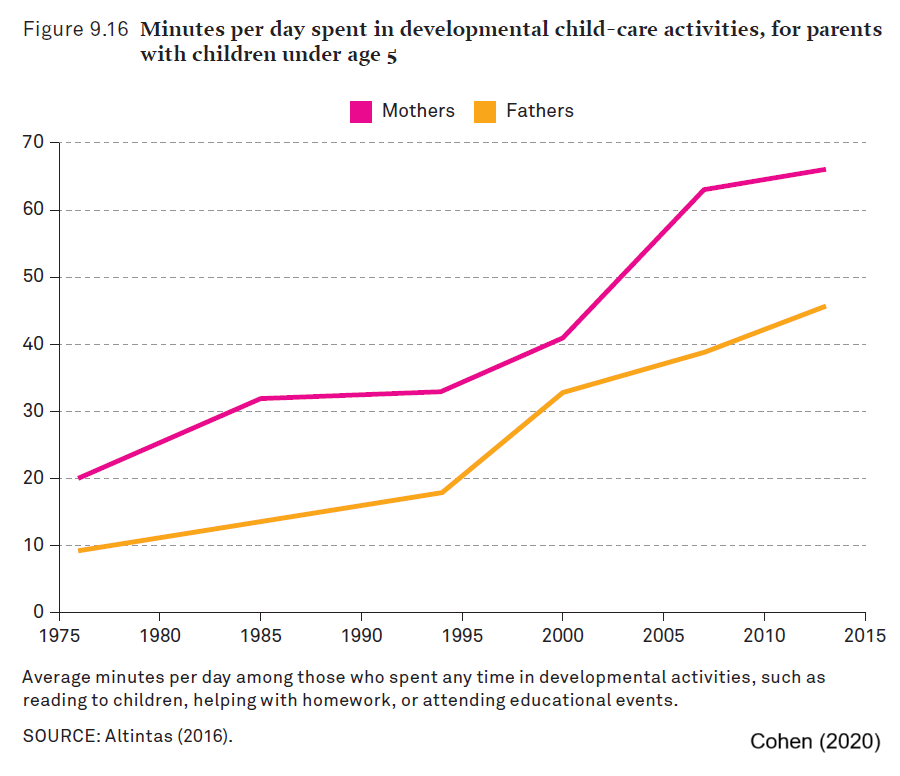
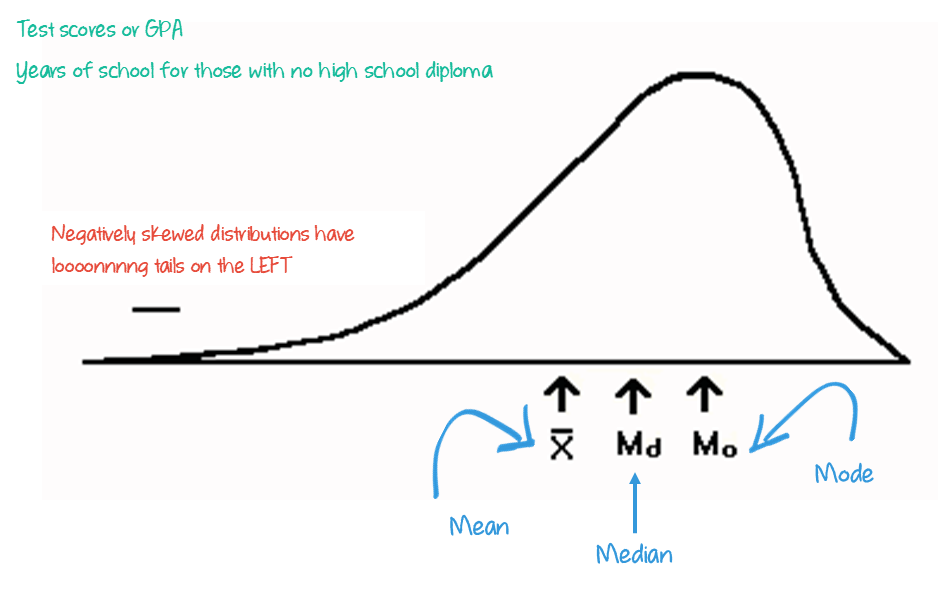

```{r}
#| label: setup
#| message: false
#| include: false

# GLOBAL ENVIRONMENT PANE
## source("tutorials/SOC6302-03/custom-setup-styles.R")
## data(gss_all)
## gss24 <- gss_get_yr(2024)
## data(gss_dict)

## Load packages, custom functions, and styles
source("custom-setup-styles.R")

## Load all gss
gss_all <- readRDS("data/gss_all.rds")

# Get the data only for the 2024 survey respondents
gss24 <- readRDS("data/gss24.rds")

## Options
tutorial_options(exercise.checker = gradethis::grade_learnr)
options(dplyr.summarise.inform=F)   # Avoid grouping warning
options(digits=4)                   # Round numbers
theme_set(theme_minimal())          # set ggplot theme
# st_options(freq.report.nas = FALSE) # remove extra columns in freq()
 # any reason need to see this?!?! CHECK FOR SP22
  
knitr::opts_chunk$set(echo = FALSE,
                      warning = FALSE, 
                      messages = FALSE)
```

<link href="https://fonts.googleapis.com/css2?family=Shadows+Into+Light&display=swap" rel="stylesheet">

```{=html}
<script>
  document.addEventListener("DOMContentLoaded", function () {
    document.querySelectorAll("a[href^='http']").forEach(function(link) {
      link.setAttribute("target", "_blank");
      link.setAttribute("rel", "noopener noreferrer");
    });
  });
</script>
```

# Central Tendency & Variability

{width="25%"}

`r fa("fas fa-lightbulb", fill = "#18BC9C")` [**LEARNING
OBJECTIVES**]{style="color: #18BC9C;"}

1.  Explain the importance of measures of central tendency and
    variability.
2.  Calculate and interpret the mean, median, mode, range, interquartile
    range, variance, and standard deviation.
3.  Identify the relative strengths and weaknesses of the the measures.
4.  Determine and explain the shape of a distribution.

<br>

`r fa("fas fa-book", fill = "#18BC9C")`
[**READINGS**]{style="color: #18BC9C;"}

Readings are available on Quercus.

1.  Wheelan, Charles. 2014. “Descriptive Statistics: Who Was the Best
    Baseball Player of All Time?” Pp. 15–35 in *Naked Statistics:
    Stripping the Dread from the Data*. New York: W. W. Norton &
    Company.

2.  Wickham, Hadley, Mine Cetinkaya-Rundel, and Garrett Grolemund. 2023.
    “[Data Transformation](https://r4ds.hadley.nz/data-transform.html).”
    in *R for Data Science: Import, Tidy, Transform, Visualize, and
    Model Data*. Beijing Boston Farnham Sebastopol Tokyo: O’Reilly
    Media.

<br>

`r fa("fas fa-language", fill = "#18BC9C")`
[**TERMS**]{style="color: #18BC9C;"}


+----------------------+-------------------------------+
| -   MEAN             | -   RANGE                     |
| -   MEDIAN           | -   INTERQUARTILE RANGE       |
| -   MODE             | -   VARIANCE                  |
| -   OUTLIER          | -   STANDARD DEVIATION        |
| -   PERCENTILE       |                               |
| -   BIMODAL          |                               |
| -   SYMMETRICAL      |                               |
|     DISTRIBUTION     |                               |
| -   POSITIVELY       |                               |
|     SKEWED           |                               |
|     DISTRIBUTION     |                               |
| -   NEGATIVELY       |                               |
|     SKEWED           |                               |
|     DISTRIBUTION     |                               |
+----------------------+-------------------------------+


## Measures of Central Tendency

::: {style="color: #18BC9C; font-size: 150%; font-family: 'Shadows Into Light'"}
We use summary statistics to find out what is **TYPICAL** in a
distribution.
:::

Watch this [video](https://youtu.be/B1HEzNTGeZ4){target="_blank"} for an
overview of the measures of central tendency [11 minutes].


### Mean

The mean is also known as the average. It is arguably the most commonly
used measure of central tendency.

<br>

::: my-def
#### MEAN

The arithmetic average obtained by adding up all the scores and dividing
by the total number of scores.
:::

<br>

{width="50%"}

<br>

To calculate it, add all of the observations together, and divide by the
number of observations.

**Finding the [mean]{style="color: #18BC9C"} in a list:**

$7, 4, 2, 8, 0, 9, 5$

1.  Add all observations together: $7 + 4 + 2 + 8 + 0 + 9 + 5 = 35$
2.  Divide the sum by the number of observations: $\frac{35}{7} = 5$

It's weakness is that it is sensitive to **outliers**, extreme scores in
a distribution.

::: my-def
#### OUTLIERS

Values that are much lower or much greater than the rest of the values
in a dataset.
:::

<br>

Pretend the following values are annual incomes for 10 families:

| Family ID | Annual Income (CAD) |
|:----------|:--------------------|
| F01       | \$48,000            |
| F02       | \$52,000            |
| F03       | \$45,000            |
| F04       | \$50,000            |
| F05       | \$53,000            |
| F06       | \$49,000            |
| F07       | \$46,000            |
| F08       | \$51,000            |
| F09       | \$65,000            |
| F10       | \$250,000           |

[*Source: Totally fake data*]{style="color: $gray-300; font-size: 80%"}

<br>

Let's use `R` to calculate the average. Click the `Run Code` button
below.

```{r mean01, exercise=TRUE}
# store the values in an object called my_data
my_data <- c(48000, 52000, 45000, 50000, 53000, 
             49000, 46000, 51000, 65000, 250000)

# Use the mean function
mean(my_data)
```

```{r mean01-solution}
# store the values in an object called my_data
my_data <- c(48000, 52000, 45000, 50000, 53000, 
             49000, 46000, 51000, 65000, 250000)

# Use the mean function
mean(my_data)
```

::: {#mean01-hint}
**Hint:** Just push the `Run Code` button to see the output.
:::

<br />

::: {.column style="color: #E74C3C; font-size: 150%; font-family: 'Shadows Into Light'"}
Most families in this sample earn between \$45K–53K, but one high-income
household pushes the average far above what’s typical: **\$70,900**
:::

Does this seem like an accurate representation of the typical annual
income of these families? Only one family earns more than our average,
whereas the rest of the sample earns significantly less than that.

If we calculated the average without the unusual (outlier) family with the 
$250,000 annual income, what would the mean? 


Remove the `250000` income from our list and then click the `Run Code` button
below to re-calculate the average.
  
When you're satisfied with your code, click **`Submit Answer.`**

```{r mean02, exercise=TRUE}
# store the values in an object called my_data
my_data <- c(48000, 52000, 45000, 50000, 53000, 
             49000, 46000, 51000, 65000, 250000)

# Use the mean function
mean(my_data)
```

```{r mean02-solution}
# store the values in an object called my_data
my_data <- c(48000, 52000, 45000, 50000, 53000, 
             49000, 46000, 51000, 65000)

# Use the mean function
mean(my_data)
```

<div id="mean02-hint">
**Hint:** Did you delete the **comma** after `51000` & `250000` from the list?
</div>


```{r mean02-check}
grade_this_code()
```

<br />


This average is more representative of the typical annual income for families in 
the sample. About half of the families have an income below the mean, and half have an income above the mean.  

To summarize: averages are easy to calculate but they can also be misleading.

<br>

Means are often depicted as line graphs, as seen in the figure below.  

{width="100%"}

### Median

The median is the middlemost point of your data. 

::: my-def
#### MEDIAN

The score that divides the distribution into two equal halves.
:::

<br>
  
{ width=100% }  

<br>

**Finding the [median]{style="color: #18BC9C"} in a list** with an
**odd** number of observations:

$7, 2, 1, 3, 4, 1, 5, 9, 2$

1.  Put the list in order: $1, 1, 2, 2, 3, 4, 5, 7, 9$\
2.  Pick the center number: $3$

<br>

**Finding the [median]{style="color: #18BC9C"} in a list** with an
**even** number of observations:

$2, 0, 1, 2, 5, 1, 3, 1$

1.  Put the list in order: $0, 1, 1, 1, 2, 2, 3, 5$\
2.  Add the two center numbers & divide by 2: $\frac{1 + 2}{2} = 1.5$


***  

The median is the value at the __50th percentile__ in a _cumulative_ frequency distribution. 
(This is typically an easier way to find the median than counting individual observations.)  
<br>
  
::: my-def
#### PERCENTILE
  
A score below which a specific percentage of the distribution falls.
:::
  
If you score at the 25th percentile on a test, then __25__% of the class did worse than you and __75__% of the class did better.

If you score at the 90th percentile on a test, then __90__% of the class did worse than you and __10__% of the class did better. 

A distribution is sometimes divided up into quarters: Q1, Q2, Q3, and Q4. The median is always Q2.

  
```{r}
#| message: false
#| label: histogram

# create x vector
xAxis <- rnorm(500)             

# create groups in variable using conditional 
# statements
group <- rep(1, 500)              
group[xAxis > -1] <- 2
group[xAxis > 0] <- 3
group[xAxis > 0 & xAxis < 1] <- 4

# create sample data frame
sample_data <- data.frame(xAxis, group) 
min_x <- min(sample_data$xAxis, na.rm = TRUE)
max_x <- max(sample_data$xAxis, na.rm = TRUE)

# create histogram using ggplot() 
# function colored by group
ggplot(sample_data, aes(x = xAxis, fill = as.factor(group))) +
  geom_histogram(color = '#e9ecef', alpha = 0.6, position = 'identity') +
  geom_vline(xintercept = 0, color = 'black', linetype = 'dashed') +
  annotate("text", x = -1.5, y = 5, label = "25%", vjust = 2, color = "white") +
  annotate("text", x =  -.5, y = 5, label = "25%", vjust = 2, color = "white") +
  annotate("text", x =   .5, y = 5, label = "25%", vjust = 2, color = "white") +
  annotate("text", x =  1.5, y = 5, label = "25%", vjust = 2, color = "white") +
  theme_minimal() +
  scale_x_continuous(limits = c(min_x-1, max_x+2), breaks = c(-1, 0, 1, max_x), labels = c("Q1", "Q2\nMedian", "Q3", "Q4")) +
  scale_fill_manual(values = c("#e74c3c", "#18BC9C", "#f39c12", "#3498db")) +
  theme(
    legend.position = "none",
    axis.title.x = element_blank(),
    axis.title.y = element_blank(),
    axis.text.y = element_blank()
  )
```
  

<br>

Watch this [video](https://youtu.be/2_sdgFJxb_U){target="_blank"} for instructions on how to find the median in a frequency table [3 minutes].  


  
<br>
<br>

Half of all observations are always below the median and the other half are always above the median.  

**Percentage distribution of opinion on whether the demands of your job interfere with your family life?**

```{r}
#| message: false
#| label: wkvsfam
#| echo: false
#| eval: false
 
gss_all$wkvsfam <- as_factor(zap_missing(gss_all$wkvsfam))

# Create frequency & proportions table
tab <- gss_all %>%
  filter(year == 2022, !is.na(wkvsfam)) %>%
  group_by(wkvsfam) %>%
  summarise(n = n(), .groups = "drop") %>%
  mutate(
    percent = round(100 * n / sum(n), 0),
    cum_percent = round(cumsum(percent), 0)
  ) %>%
  ungroup()

# Add totals row
tab_totals <- tab %>%
  summarise(across(c(n, percent), sum, na.rm = TRUE)) %>%
  mutate(wkvsfam = "Total")

# Combine with original table
tab_with_totals <- bind_rows(tab, tab_totals)

## Pretty table
tab_with_totals %>%
  flextable() %>%
  style_flextable() %>%
  set_header_labels(
    n = "n", percent = "%",
    cum_percent = "cumulative %"
  ) %>%
  color(color = "#e74c3c", i = 3, j = 4)

# [*Source: U.S. General Social Survey 2022*]{style="color: $gray-300; font-size: 80%"}
```


{ width=100% }

[**Survey question**: *How often do the demands of your job interfere with your family life?*]{style="font-size: 80%"}

<br>
<br>

***

Watch this [video](https://youtu.be/xTwDmnEEb9E){target="_blank"} on how to find the median in a histogram [~3 minutes].  


<br>


```{r}

my_data <- gss_all |>
  select(agekdbrn) |>
  filter(!is.na(agekdbrn) & agekdbrn < 50)

sumstatz <- data.frame(whichstat = c("median"),
                       value     = c(median(my_data$agekdbrn)))
my_data |>
  ggplot(aes(agekdbrn)) + 
  geom_histogram(binwidth = 1, show.legend = FALSE) + 
  geom_density(col="black", show.legend = FALSE) + 
  geom_vline(data=sumstatz,aes(xintercept = value,
                               linetype = whichstat), 
             col = "#20c997",
             size=1) +
  theme_minimal() +
    theme(
    axis.title.y = element_blank(),
    axis.text.y = element_blank()
    ) +
  xlab("age when 1st child born") +
   labs(
    color = "Statistic",
    linetype = "Statistic"
  ) 
```

[*Source: U.S. General Social Survey 1994-2022*]{style="color: $gray-300; font-size: 80%"}  
  
[**Survey question**: *How old were you when your first child was born?*]{style="font-size: 80%"}


### Mode  

The mode is the value the occurs most often.  If I asked you your favorite ice cream flavor and 3 people said vanilla, 4 people said chocolate, and 17 people said mint-chocolate chip, the mode would be "mint-chocolate chip."
  
::: my-def
#### MODE

Category or score with the highest frequency (or percentage) in a distribution.
:::
  
<br>

**Finding the [mode]{style="color: #18BC9C"} in a list:**

$7, 2, 1, 3, 4, 1, 5, 1, 2$

1.  Put the list in order: $1, 1, 1, 2, 2, 3, 4, 5, 7$
2.  Pick the most frequent number: $1$

The number 1 appears 3 times in the list, more than any other number. 
That makes it the mode.


`r fa("otter", fill = "#F39C12")`<practice> PRACTICE:</practice>

```{r P01, echo=FALSE}
question("A random sample of 8 students report having the following number of 
siblings: $2, 0, 1, 2, 5, 1, 3, 1$. What is the mode?",
         answer("1",   correct = TRUE, message = "Well done!"),
         answer("1.8", message = "This is the mean but the mode is the most frequently occurring value."),
         answer("5",   message = "Which number appears in the list most often?"),
         answer("3",   message = "Which number appears in the list most often?"),
         random_answer_order = TRUE,
         allow_retry = TRUE
)
```

<br>

***

#### Finding the mode in a table 
  
The mode can also be identified in a table. The mode is the category with the greatest frequency or the largest percentage. 

**Percentage distribution of opinion on whether people are helpful or look out for themselves**

```{r}
#| message: false
#| label: mode
#| echo: false
#| eval: false

freq(gss24$helpful, report.nas = FALSE, headings = FALSE) 
```

{ width=100% }

[**Survey question**: *Would you say that most of the time people try to be helpful, or that they are mostly just looking out for themselves?*]{style="font-size: 80%"}

<br>
<br>

***

`r fa("otter", fill = "#F39C12")`<practice> PRACTICE:</practice>

Replace the blank line with `fairearn` and click the `Run Code` button to create a relative frequency table for this variable.  

When you're satisfied with your code, click **`Submit Answer.`**

```{r mode01, exercise=TRUE}
#| message: false
#| warning: false

freq(gss_all$________, report.nas = FALSE) 
```

```{r mode01-solution}
#| message: false
#| warning: false

freq(gss_all$fairearn, report.nas = FALSE) 
```

<div id="mode01-hint">
**Hint:** Did you type `fairearn` in place of the blank line?
</div>

```{r mode01-check}
grade_this_code()
```


[**Survey question**: *How fair is what you earn on your job in comparison to others doing the same type of work you do?*]{style="font-size: 80%"}


```{r P02, echo=FALSE}
question("What is the mode of this distribution?",
         answer("About as much as you deserve",     correct = TRUE, message = "Rock on!"),
         answer("Much less than you deserve",       message = "Which category has the largest percentage?"),
         answer("Somewhat less than you deserve",   message = "Which category has the largest percentage?"),
         answer("Somewhat more than you deserve",   message = "Which category has the largest percentage?"),
         answer("Much more than you deserve",       message = "Hardly anyone thinks they make more $ than they deserve."),
         random_answer_order = TRUE,
         allow_retry = TRUE
)
```


#### Bimodal:

A “bimodal distribution” has two distinct humps, even if the peaks aren’t exactly the same height.  

::: my-def
#### BIMODAL

Two values or categories with the highest frequency.  
:::

<br>

Take a look at the figure below. 
It shows the distributions for daily new confirmed COVID-19 deaths per million people for Canada and the U.S.
    
  
<iframe src="https://ourworldindata.org/explorers/covid?zoomToSelection=true&time=2020-03-01..2021-07-30&facet=none&country=USA~CAN&pickerSort=asc&pickerMetric=location&hideControls=true&Metric=Confirmed+deaths&Interval=7-day+rolling+average&Relative+to+population=true&tab=line" loading="lazy" style="width: 100%; height: 600px; border: 0px none;" allow="web-share; clipboard-write"></iframe>
  
<br>
  
We could identify the modal number of deaths to be around 10 deaths per million people in the U.S., occurring sometime in January of 2021.  

For Canada, the mode occurs in May of 2020 at about 4.49 death per million Canadians. 

If we only reported those modes and dates, it would seem like the most fatalities in the two countries occurred at wildly different times.

However, the graph makes it obvious that there were actually two peaks, occurring around the same time, in both countries: one in the spring of 2020 and one in the winter of 2021. 

These distributions are examples of a bi-modal distribution: there are essentially two peaks (for each country).

<br>
<br>

***

`r fa("otter", fill = "#F39C12")`<practice> PRACTICE:</practice>

Using the figure below to answer the following practice question.  
  
These figure shows distributions of reviews for a variety of movies.  
  
{ width=100% } 
  
  
```{r P03, echo=FALSE}
question("Which movie review distribution is bimodal?",
         answer("An Inconvenient Sequel: Truth to Power",     correct = TRUE, message = "People either hated or loved this movie!"),
         answer("Voice from the Stone",        message = "Which distribution has two distinct peaks?"),
         answer("Once Upon a Time in Venice",  message = "Which distribution has two distinct peaks?"),
         answer("Vengeance: A Love Story",      message = "Which distribution has two distinct peaks?"),
         answer("Phoenix Forgotten",           message = "Which distribution has two distinct peaks?"),
         random_answer_order = TRUE,
         allow_retry = TRUE
)
```

<br>

### Choosing a Measure  
  
An appropriate measure of central tendency depends on three factors:  
  
1. the way the variables are measured (i.e., the level of measurement)  
2. the shape of the distribution  
3. the purpose of the research  

The [**MODE**]{style="color: #18bc9c"} is appropriate for **nominal**
and **ordinal** variables.

It can be identified for **interval-ratio** level variables, but is
often not useful.

The [**MEDIAN**]{style="color: #18bc9c"} is appropriate for
**interval-ratio** and **ordinal** variables.\
It cannot be used for **nominal** level variables.

The [**MEAN**]{style="color: #18bc9c"} can ONLY be determined for
**interval-ratio** variables.

### Distributions
  
  
Let's make sure you've got the differences between the mean, median, and mode. 
And why they are important to know. 
Check out this [video](https://www.youtube.com/watch?v=kn83BA7cRNM){target="_blank"} [11 minutes].  
  

  
<br>
  
When the mean, median, and mode are all equal to one another, we say that the distribution is __symmetrical__.  
  
  
{ width=90% } 
  
  
The mean is a good measure of central tendency for a symmetrical distribution.

But, the mean can be __skewed__ by very high or very low numbers. 
The mean is a less suitable measure of central tendency in distributions with extreme values on one side.  
  
<br>
  
#### Positively Skewed Distribution
  

{ width=90% } 
  
::: my-tip
#### Heads up! 

When a distribution is positively skewed, the mean is greater than the median.
:::  

<br>
  
#### Negatively Skewed Distribution
  
  
{ width=90% } 
  
<br>

::: my-tip
#### Heads up!

When a distribution is negatively skewed, the mean is less than the median.
:::

<br>

***

`r fa("otter", fill = "#F39C12")`<practice> PRACTICE:</practice>

__What is the best measure of central tendency for each of the following?__  
HINT: Identify the type of variable first. Then decide which measure is appropriate.

```{r P05, echo=FALSE}
question("Racial composition of students at UofT.",
         answer("Mode", correct = TRUE, 
                message = "That's it!"),
         answer("Median or Mode",       
                message = "The median cannot be used for nominal level variables."),
         answer("Median",              
                message = "The median cannot be used for nominal level variables."),
         answer("Mean",                
                message = "Race isn't an interval-ratio variable."),
         random_answer_order = TRUE,
         allow_retry = TRUE
)
```
  
  
```{r P06, echo=FALSE}
question("Distance traveled to work each day by Toronto residents.",
         answer("Mean and Median", correct = TRUE, 
                message = "Well done!"),
         answer("Mode",                 
                message = "The mode is probably not useful here."),
         answer("Median and Mode",       
                message = "The mode is probably not useful here."),
         answer("Median",               
                message = "Maybe....but, we have no reason to think the distance would be skewed."),
         random_answer_order = TRUE,
         allow_retry = TRUE
)
```
  
  
```{r P07, echo=FALSE}
question("Number of crimes committed by current inmates in Ontario correctional facilities.",
         answer("Median", correct = TRUE, 
                message = "I agree!"),
         answer("Mode",                   
                message = "The mode is probably not useful here."),
         answer("Median and Mode",        
                message = "The mode is probably not useful here."),
         answer("Mean",                   
                message = "Possibly...but what if most inmates only committed 1 crime and others committed a lot?"),
         random_answer_order = TRUE,
         allow_retry = TRUE
)
```


## Measures of Variability

#### SD
Maybe use this for standard deviations?

```{r}
cars$length <- cars$speed
bw <- diff(range(cars$length)) / (2 * IQR(cars$length) / length(cars$length)^(1/3))

sumstatz <- data.frame(whichstat = c("mean",
                                     "sd upr", 
                                     "sd lwr"),
                       value     = c(mean(cars$length),
                                     mean(cars$length)+sd(cars$length),
                                     mean(cars$length)-sd(cars$length)))

ggplot(data=cars, aes(length)) + 
  geom_histogram(aes(y =after_stat(density)),
                 col="black",
                 binwidth = bw) + 
  geom_density(col="black") + 
  geom_vline(data=sumstatz,aes(xintercept = value,
                               linetype = whichstat,
                               col = whichstat),size=1)+
  labs(title='Length Plot', x='Length', y='Count')
```