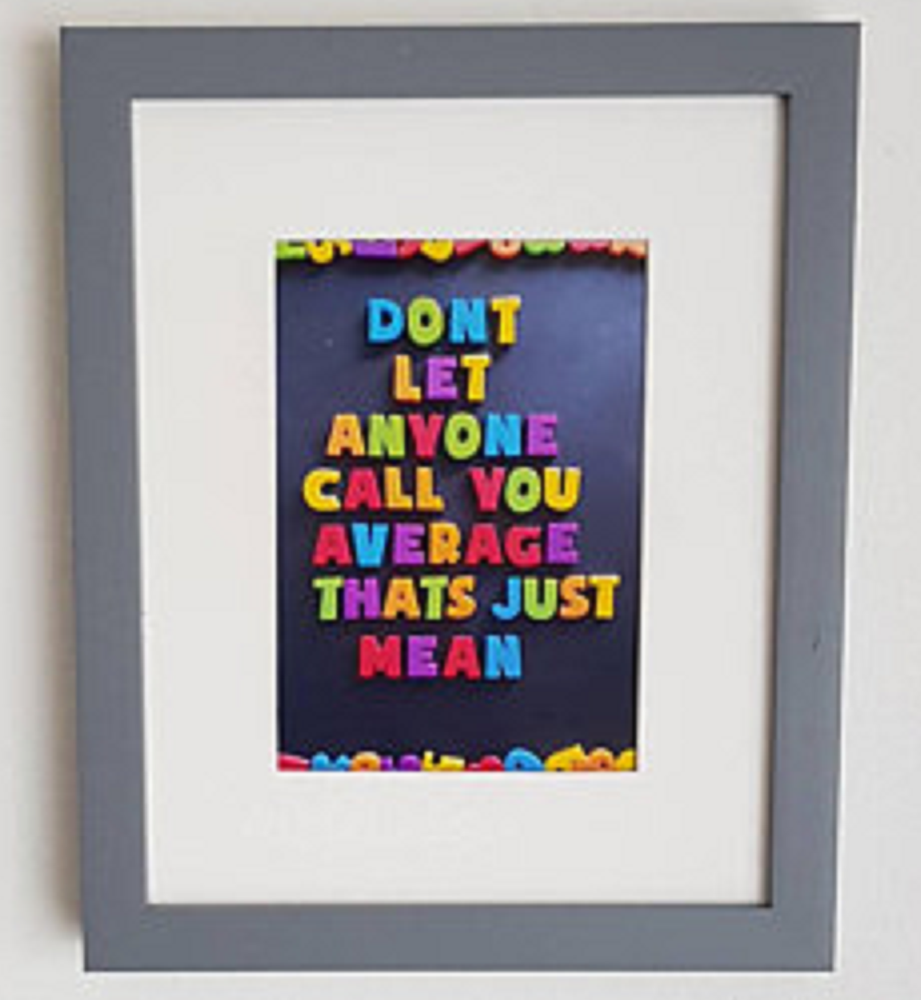
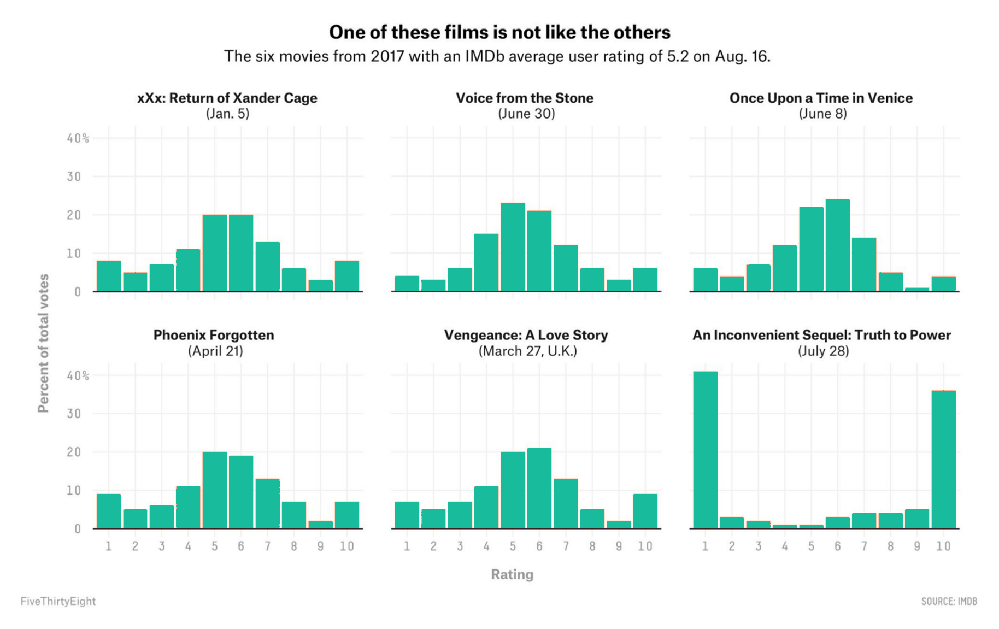

```{r}
#| label: setup
#| message: false
#| include: false

# GLOBAL ENVIRONMENT PANE
## source("tutorials/SOC6302-03/custom-setup-styles.R")
## library(gssr)
## library(gssrdoc)
## data(gss_all)
## gss24 <- gss_get_yr(2024)
## data(gss_dict)

## Load packages, custom functions, and styles
source("custom-setup-styles.R")

## Load all gss
gss_all <- readRDS("data/gss_all.rds")

# Get the data only for the 2024 survey respondents
gss24 <- readRDS("data/gss24.rds")

## Options
tutorial_options(exercise.checker = gradethis::grade_learnr)
options(dplyr.summarise.inform=F)   # Avoid grouping warning
options(digits=4)                   # Round numbers
theme_set(theme_minimal())          # set ggplot theme
# st_options(freq.report.nas = FALSE) # remove extra columns in freq()
 # any reason need to see this?!?! CHECK FOR SP22
  
knitr::opts_chunk$set(echo = FALSE,
                      warning = FALSE, 
                      messages = FALSE)
```

<link href="https://fonts.googleapis.com/css2?family=Shadows+Into+Light&display=swap" rel="stylesheet">

```{=html}
<script>
  document.addEventListener("DOMContentLoaded", function () {
    document.querySelectorAll("a[href^='http']").forEach(function(link) {
      link.setAttribute("target", "_blank");
      link.setAttribute("rel", "noopener noreferrer");
    });
  });
</script>
```

## Central Tendency & Variability

{width="25%"}

`r fa("fas fa-lightbulb", fill = "#18BC9C")` [**LEARNING
OBJECTIVES**]{style="color: #18BC9C;"}

1.  Explain the importance of measures of central tendency and
    variability.
2.  Calculate and interpret the mean, median, mode, range, interquartile
    range, variance, and standard deviation.
3.  Identify the relative strengths and weaknesses of the the measures.
4.  Determine and explain the shape of a distribution.

<br>

`r fa("fas fa-book", fill = "#18BC9C")`
[**READINGS**]{style="color: #18BC9C;"}

Readings are available on Quercus.

1.  Wheelan, Charles. 2014. “Descriptive Statistics: Who Was the Best
    Baseball Player of All Time?” Pp. 15–35 in *Naked Statistics:
    Stripping the Dread from the Data*. New York: W. W. Norton &
    Company.

2.  Wickham, Hadley, Mine Cetinkaya-Rundel, and Garrett Grolemund. 2023.
    “[Data Transformation](https://r4ds.hadley.nz/data-transform.html).”
    in *R for Data Science: Import, Tidy, Transform, Visualize, and
    Model Data*. Beijing Boston Farnham Sebastopol Tokyo: O’Reilly
    Media.

<br>

`r fa("fas fa-language", fill = "#18BC9C")`
[**TERMS**]{style="color: #18BC9C;"}


+----------------------+-------------------------------+
| -   MEAN             | -   RANGE                     |
| -   MEDIAN           | -   INTERQUARTILE RANGE       |
| -   MODE             | -   VARIANCE                  |
| -   OUTLIER          | -   STANDARD DEVIATION        |
| -   PERCENTILE       |                               |
| -   BIMODAL          |                               |
| -   SYMMETRICAL      |                               |
|     DISTRIBUTION     |                               |
| -   POSITIVELY       |                               |
|     SKEWED           |                               |
|     DISTRIBUTION     |                               |
| -   NEGATIVELY       |                               |
|     SKEWED           |                               |
|     DISTRIBUTION     |                               |
+----------------------+-------------------------------+


Measures of Central Tendency
--------------------------------------------------------------------------------

::: {style="color: #18BC9C; font-size: 150%; font-family: 'Shadows Into Light'"}
We use summary statistics to find out what is **TYPICAL** in a
distribution.
:::

Watch this [video](https://youtu.be/B1HEzNTGeZ4) for an
overview of the measures of central tendency [11 minutes].


### Mean

The mean is also known as the average. It is arguably the most commonly
used measure of central tendency.

<br>

::: my-def
#### MEAN

The arithmetic average obtained by adding up all the scores and dividing
by the total number of scores.
:::

<br>

{width="50%"}

<br>

To calculate it, add all of the observations together, and divide by the
number of observations.

**Finding the [mean]{style="color: #18BC9C"} in a list:**

$7, 4, 2, 8, 0, 9, 5$

1.  Add all observations together: $7 + 4 + 2 + 8 + 0 + 9 + 5 = 35$
2.  Divide the sum by the number of observations: $\frac{35}{7} = 5$

<br>

It's weakness is that it is sensitive to **outliers**, extreme scores in
a distribution.

::: my-def
#### OUTLIERS

Values that are much lower or much greater than the rest of the values
in a dataset.
:::

<br>

Pretend the following values are annual incomes for 10 families:

| Family ID | Annual Income (CAD) |
|:----------|:--------------------|
| F01       | \$48,000            |
| F02       | \$52,000            |
| F03       | \$45,000            |
| F04       | \$50,000            |
| F05       | \$53,000            |
| F06       | \$49,000            |
| F07       | \$46,000            |
| F08       | \$51,000            |
| F09       | \$65,000            |
| F10       | \$250,000           |

[*Source: Totally fake data*]{style="color: $gray-300; font-size: 80%"}

<br>

`r fa("otter", fill = "#F39C12")`<practice> PRACTICE:</practice>

Let's use `R` to calculate the average. 

1.   Click the `Run Code` button below.  
2.   Then, click **`Submit Answer.`**

```{r mean01, exercise=TRUE}
# store the values in an object called my_data
my_data <- c(48000, 52000, 45000, 50000, 53000, 
             49000, 46000, 51000, 65000, 250000)

# Use the mean function
mean(my_data)
```

```{r mean01-solution}
# store the values in an object called my_data
my_data <- c(48000, 52000, 45000, 50000, 53000, 
             49000, 46000, 51000, 65000, 250000)

# Use the mean function
mean(my_data)
```

::: {#mean01-hint}
**Hint:** Just push the `Run Code` button to see the output.
:::

```{r mean01-check}
grade_this_code()
```

<br />

::: {.column style="color: #E74C3C; font-size: 150%; font-family: 'Shadows Into Light'"}
Most families in this sample earn between \$45K–53K, but one high-income
household pushes the average far above what’s typical: **\$70,900**
:::

Does this seem like an accurate representation of the typical annual
income of these families? Only one family earns more than our average,
whereas the rest of the sample earns significantly less than that.

If we calculated the average without the unusual (outlier) family with the 
$250,000 annual income, what would the mean? 

`r fa("otter", fill = "#F39C12")`<practice> PRACTICE:</practice>

1.  Remove the `250000` income from our list.
2.  Click the `Run Code` button below to re-calculate the average. 
3.  When you're satisfied with your code, click **`Submit Answer.`**

```{r mean02, exercise=TRUE}
# store the values in an object called my_data
my_data <- c(48000, 52000, 45000, 50000, 53000, 
             49000, 46000, 51000, 65000, 250000)

# Use the mean function
mean(my_data)
```

```{r mean02-solution}
# store the values in an object called my_data
my_data <- c(48000, 52000, 45000, 50000, 53000, 
             49000, 46000, 51000, 65000)

# Use the mean function
mean(my_data)
```

<div id="mean02-hint">
**Hint:** Did you delete the **comma** after `51000` & `250000` from the list?
</div>


```{r mean02-check}
grade_this_code()
```

<br />


This average is more representative of the typical annual income for families in 
the sample. About half of the families have an income below the mean, and half have an income above the mean.  

To summarize, averages are easy to calculate but they can also be misleading.

<br>

Means are often depicted as line graphs, as seen in the figure below.  

{width="80%"}

### Median

The median is the middlemost point of your data. 

::: my-def
#### MEDIAN

The score that divides the distribution into two equal halves.
:::

<br>
  
{ width=75% }  

<br>

**Finding the [median]{style="color: #18BC9C"} in a list** with an
**odd** number of observations:

$7, 2, 1, 3, 4, 1, 5, 9, 2$

1.  Put the list in order: $1, 1, 2, 2, 3, 4, 5, 7, 9$\
2.  Pick the center number: $3$

<br>

**Finding the [median]{style="color: #18BC9C"} in a list** with an
**even** number of observations:

$2, 0, 1, 2, 5, 1, 3, 1$

1.  Put the list in order: $0, 1, 1, 1, 2, 2, 3, 5$\
2.  Add the two center numbers & divide by 2: $\frac{1 + 2}{2} = 1.5$

The median is the value at the __50th percentile__ in a _cumulative_ frequency distribution. (This is typically an easier way to find the median than counting individual observations.)  

<br>
  
::: my-def
#### PERCENTILE
  
A score below which a specific percentage of the distribution falls.
:::
  
If you score at the 25th percentile on a test, then __25__% of the class did worse than you and __75__% of the class did better.

If you score at the 90th percentile on a test, then __90__% of the class did worse than you and __10__% of the class did better. 

A distribution is sometimes divided up into quarters: Q1, Q2, Q3, and Q4. The median is always Q2.

  
```{r}
#| message: false
#| label: histogram

# create x vector
xAxis <- rnorm(500)             

# create groups in variable using conditional 
# statements
group <- rep(1, 500)              
group[xAxis > -1] <- 2
group[xAxis > 0] <- 3
group[xAxis > 0 & xAxis < 1] <- 4

# create sample data frame
sample_data <- data.frame(xAxis, group) 
min_x <- min(sample_data$xAxis, na.rm = TRUE)
max_x <- max(sample_data$xAxis, na.rm = TRUE)

# create histogram using ggplot() 
# function colored by group
ggplot(sample_data, aes(x = xAxis, fill = as.factor(group))) +
  geom_histogram(color = '#e9ecef', alpha = 0.6, position = 'identity') +
  geom_vline(xintercept = 0, color = 'black', linetype = 'dashed') +
  annotate("text", x = -1.5, y = 5, label = "25%", vjust = 2, color = "white") +
  annotate("text", x =  -.5, y = 5, label = "25%", vjust = 2, color = "white") +
  annotate("text", x =   .5, y = 5, label = "25%", vjust = 2, color = "white") +
  annotate("text", x =  1.5, y = 5, label = "25%", vjust = 2, color = "white") +
  theme_minimal() +
  scale_x_continuous(limits = c(min_x-1, max_x+2), breaks = c(-1, 0, 1, max_x), labels = c("Q1", "Q2\nMedian", "Q3", "Q4")) +
  scale_fill_manual(values = c("#e74c3c", "#18BC9C", "#f39c12", "#3498db")) +
  theme(
    legend.position = "none",
    axis.title.x = element_blank(),
    axis.title.y = element_blank(),
    axis.text.y = element_blank()
  )
```
  
<br>

`r fa("otter", fill = "#F39C12")`<practice> PRACTICE:</practice>

Let's use `R` to calculate the median.  

1.   Replace the blank line with the function `median`.  
2.   Click the `Run Code` button below. 
3.   When you're satisfied with your code, click **`Submit Answer.`**

```{r median01, exercise=TRUE}
# store the values in an object called my_data
my_data <- c(48000, 52000, 45000, 50000, 53000, 
             49000, 46000, 51000, 65000, 250000)

# Use the median function
_____(my_data)
```

```{r median01-solution}
# store the values in an object called my_data
my_data <- c(48000, 52000, 45000, 50000, 53000, 
             49000, 46000, 51000, 65000, 250000)

# Use the median function
median(my_data)
```

::: {#median01-hint}
**Hint:** Did you delete the word "mean" and replace it with "median"?
:::

```{r median01-check}
grade_this_code()
```

<br>

Watch this [video](https://youtu.be/2_sdgFJxb_U) for instructions on how to find the median in a frequency table [3 minutes].  


  
<br>
<br>

Half of all observations are always below the median and the other half are always above the median.  

**Percentage distribution of opinion on whether the demands of your job interfere with your family life?**

```{r}
#| message: false
#| label: wkvsfam
#| echo: false
#| eval: false
 
gss_all$wkvsfam <- as_factor(zap_missing(gss_all$wkvsfam))

# Create frequency & proportions table
tab <- gss_all %>%
  filter(year == 2022, !is.na(wkvsfam)) %>%
  group_by(wkvsfam) %>%
  summarise(n = n(), .groups = "drop") %>%
  mutate(
    percent = round(100 * n / sum(n), 0),
    cum_percent = round(cumsum(percent), 0)
  ) %>%
  ungroup()

# Add totals row
tab_totals <- tab %>%
  summarise(across(c(n, percent), sum, na.rm = TRUE)) %>%
  mutate(wkvsfam = "Total")

# Combine with original table
tab_with_totals <- bind_rows(tab, tab_totals)

## Pretty table
tab_with_totals %>%
  flextable() %>%
  style_flextable() %>%
  set_header_labels(
    n = "n", percent = "%",
    cum_percent = "cumulative %"
  ) %>%
  color(color = "#e74c3c", i = 3, j = 4)

# [*Source: U.S. General Social Survey 2022*]{style="color: $gray-300; font-size: 80%"}
```


{ width=100% }

[**Survey question**: *How often do the demands of your job interfere with your family life?*]{style="font-size: 80%"}

<br>

***

Watch this [video](https://youtu.be/xTwDmnEEb9E) on how to find the median in a histogram [~3 minutes].  


<br>


Could you find the median in this historgram? 

```{r}

my_data <- gss_all |>
  select(agekdbrn, year) |>
  filter(!is.na(agekdbrn) & agekdbrn < 50 & year >= 2018)

sumstatz <- data.frame(whichstat = c("median"),
                       value     = c(median(my_data$agekdbrn)))
my_data |>
  ggplot(aes(agekdbrn)) + 
  geom_histogram(binwidth = 1, show.legend = FALSE) + 
  geom_density(col="black", show.legend = FALSE) + 
  geom_vline(data=sumstatz,aes(xintercept = value,
                               linetype = whichstat), 
             col = "#20c997",
             size=1) +
  theme_minimal() +
    theme(
    axis.title.y = element_blank(),
    ) +
  xlab("age when 1st child born") +
   labs(
    color = "Statistic",
    linetype = "Statistic"
  ) 
```

[*Source: U.S. General Social Survey 2018-2022*]{style="color: $gray-300; font-size: 80%"}  
  
[**Survey question [agekdbrn]**: *How old were you when your first child was born?*]{style="font-size: 80%"}

<br>


### Mode  

The mode is the value the occurs most often.  If I asked you your favorite ice cream flavor and 3 people said vanilla, 4 people said chocolate, and 17 people said mint-chocolate chip, the mode would be "mint-chocolate chip."
  
::: my-def
#### MODE

Category or score with the highest frequency (or percentage) in a distribution.
:::
  
<br>

**Finding the [mode]{style="color: #18BC9C"} in a list:**

$7, 2, 1, 3, 4, 1, 5, 1, 2$

1.  Put the list in order: $1, 1, 1, 2, 2, 3, 4, 5, 7$
2.  Pick the most frequent number: $1$

The number 1 appears 3 times in the list, more than any other number. 
That makes it the mode.


`r fa("otter", fill = "#F39C12")`<practice> PRACTICE:</practice>

```{r P01, echo=FALSE}
question("A random sample of 8 students report having the following number of 
siblings: $2, 0, 1, 2, 5, 1, 3, 1$. What is the mode?",
         answer("1",   correct = TRUE, message = "Well done!"),
         answer("1.8", message = "This is the mean but the mode is the most frequently occurring value."),
         answer("5",   message = "Which number appears in the list most often?"),
         answer("3",   message = "Which number appears in the list most often?"),
         random_answer_order = TRUE,
         allow_retry = TRUE
)
```

<br>

::: my-tip
#### Heads Up!

In R, mean() and median() are standard functions which do what you'd expect. 
`mode()` tells you the internal storage mode of the object, not the value that occurs the most.
:::

<br>

***

#### Finding the mode in a table 
  
The mode can also be identified in a table. The mode is the category with the greatest frequency or the largest percentage. 

**Percentage distribution of opinion on whether people are helpful or look out for themselves**

```{r}
#| message: false
#| label: mode
#| echo: false
#| eval: false

freq(gss24$helpful, report.nas = FALSE, headings = FALSE) 
```

{ width=100% }

[**Survey question**: *Would you say that most of the time people try to be helpful, or that they are mostly just looking out for themselves?*]{style="font-size: 80%"}

<br>
<br>

***

Now, let's try it by creating a frequency table in R and then finding the mode.  

`r fa("otter", fill = "#F39C12")`<practice> PRACTICE:</practice>

1.   Replace the blank line with `fairearn`.
2.   Click the `Run Code` button to create a relative frequency table. 
3.   When you're satisfied with your code, click **`Submit Answer.`**

```{r mode01, exercise=TRUE}
#| message: false
#| warning: false

freq(gss_all$________, report.nas = FALSE) 
```

```{r mode01-solution}
#| message: false
#| warning: false

freq(gss_all$fairearn, report.nas = FALSE) 
```

<div id="mode01-hint">
**Hint:** Did you type `fairearn` in place of the blank line?
</div>

```{r mode01-check}
grade_this_code()
```


[**Survey question**: *How fair is what you earn on your job in comparison to others doing the same type of work you do?*]{style="font-size: 80%"}

```{r P02, echo=FALSE}
question("What is the mode of this distribution?",
         answer("About as much as you deserve",     correct = TRUE, message = "Rock on!"),
         answer("Much less than you deserve",       message = "Which category has the largest percentage?"),
         answer("Somewhat less than you deserve",   message = "Which category has the largest percentage?"),
         answer("Somewhat more than you deserve",   message = "Which category has the largest percentage?"),
         answer("Much more than you deserve",       message = "Hardly anyone thinks they make more $ than they deserve."),
         random_answer_order = TRUE,
         allow_retry = TRUE
)
```

<br>

#### Bimodal:

A “bimodal distribution” has two distinct humps, even if the peaks aren’t exactly the same height.  

::: my-def
#### BIMODAL

Two values or categories with the highest frequency.  
:::

<br>

Take a look at the figure below. 
It shows the distributions for daily new confirmed COVID-19 deaths per million people for Canada and the U.S.
    
  
<iframe src="https://ourworldindata.org/explorers/covid?zoomToSelection=true&time=2020-03-01..2021-07-30&facet=none&country=USA~CAN&pickerSort=asc&pickerMetric=location&hideControls=true&Metric=Confirmed+deaths&Interval=7-day+rolling+average&Relative+to+population=true&tab=line" loading="lazy" style="width: 100%; height: 600px; border: 0px none;" allow="web-share; clipboard-write"></iframe>
  
<br>
  
We could identify the modal number of deaths to be around 10 deaths per million people in the U.S., occurring sometime in January of 2021.  

For Canada, the mode occurs in May of 2020 at about 4.49 death per million Canadians. 

If we only reported those modes and dates, it would seem like the most fatalities in the two countries occurred at wildly different times.

However, the graph makes it obvious that there were actually two peaks, occurring around the same time, in both countries: one in the spring of 2020 and one in the winter of 2021. 

These distributions are examples of a bi-modal distribution: there are essentially two peaks (for each country).

<br>

***

`r fa("otter", fill = "#F39C12")`<practice> PRACTICE:</practice>

Using the figure below to answer the following practice question.  
  
These figure shows distributions of reviews for a variety of movies.  
  
{ width=100% } 
  
```{r P03, echo=FALSE}
question("Which movie review distribution is bimodal?",
         answer("An Inconvenient Sequel: Truth to Power",     correct = TRUE, message = "People either hated or loved this movie!"),
         answer("Voice from the Stone",        message = "Which distribution has two distinct peaks?"),
         answer("Once Upon a Time in Venice",  message = "Which distribution has two distinct peaks?"),
         answer("Vengeance: A Love Story",      message = "Which distribution has two distinct peaks?"),
         answer("Phoenix Forgotten",           message = "Which distribution has two distinct peaks?"),
         random_answer_order = TRUE,
         allow_retry = TRUE
)
```

<br>

### Choosing a Measure  
  
An appropriate measure of central tendency depends on three factors:  
  
1. the way the variables are measured (i.e., the level of measurement)  
2. the shape of the distribution  
3. the purpose of the research  

The [**MODE**]{style="color: #18bc9c"} is appropriate for **nominal**
and **ordinal** variables.

It can be identified for **interval-ratio** level variables, but is
often not useful.

The [**MEDIAN**]{style="color: #18bc9c"} is appropriate for
**interval-ratio** and **ordinal** variables.\
It cannot be used for **nominal** level variables.

The [**MEAN**]{style="color: #18bc9c"} can ONLY be determined for
**interval-ratio** variables.

### Distributions
  
  
Let's make sure you've got the differences between the mean, median, and mode. 
And why they are important to know. 
Check out this [video](https://www.youtube.com/watch?v=kn83BA7cRNM){target="_blank"} [11 minutes].  
  

  
<br>
  
When the mean, median, and mode are all equal to one another, we say that the distribution is __symmetrical__.  
  
  
{ width=80% } 
  
  
The mean is a good measure of central tendency for a symmetrical distribution.

But, the mean can be __skewed__ by very high or very low numbers. 
The mean is a less suitable measure of central tendency in distributions with extreme values on one side.  
  
<br>
  
#### Positively Skewed Distribution
  

{ width=80% } 
  
::: my-tip
#### Heads up! 

When a distribution is positively skewed, the mean is greater than the median.
:::  

<br>
  
#### Negatively Skewed Distribution
  
  
{ width=80% } 
  
<br>

::: my-tip
#### Heads up!

When a distribution is negatively skewed, the mean is less than the median.
:::

<br>

***

`r fa("otter", fill = "#F39C12")`<practice> PRACTICE:</practice>

__What is the best measure of central tendency for each of the following?__  
HINT: Identify the type of variable first. Then decide which measure is appropriate.

```{r P04, echo=FALSE}
question("Racial composition of students at UofT.",
         answer("Mode", correct = TRUE, 
                message = "That's it!"),
         answer("Median or Mode",       
                message = "The median cannot be used for nominal level variables."),
         answer("Median",              
                message = "The median cannot be used for nominal level variables."),
         answer("Mean",                
                message = "Race isn't an interval-ratio variable."),
         random_answer_order = TRUE,
         allow_retry = TRUE
)
```
  
  
```{r P05, echo=FALSE}
question("Distance traveled to work each day by Toronto residents.",
         answer("Mean and Median", correct = TRUE, 
                message = "Well done!"),
         answer("Mode",                 
                message = "The mode is probably not useful here."),
         answer("Median and Mode",       
                message = "The mode is probably not useful here."),
         answer("Median",               
                message = "Maybe....but, we have no reason to think the distance would be skewed."),
         random_answer_order = TRUE,
         allow_retry = TRUE
)
```
  
  
```{r P06, echo=FALSE}
question("Number of crimes committed by current inmates in Ontario correctional facilities.",
         answer("Median", correct = TRUE, 
                message = "I agree!"),
         answer("Mode",                   
                message = "The mode is probably not useful here."),
         answer("Median and Mode",        
                message = "The mode is probably not useful here."),
         answer("Mean",                   
                message = "Possibly...but what if most inmates only committed 1 crime and others committed a lot?"),
         random_answer_order = TRUE,
         allow_retry = TRUE
)
```


<br>

Measures of Variability
--------------------------------------------------------------------------------

In this tutorial, you will learn how to calculate measures of variability, 
values that describe the diversity in a distribution, for **interval-ratio** 
(aka continuous) variables. 
Measures of variability reveal how *spread out* the values in your dataset are. 

Watch this short [video](https://www.youtube.com/watch?v=R4yfNi_8Kqw) 
explaining why we need measures of variability in addition to our measures of 
central tendency (mean, median, and mode) [~11 minutes]. WARNING: MATH AHEAD!  


  
<br />  


### Range

::: my-def
#### RANGE

The difference between the highest and lowest values in a distribution.
:::

<br>

Here's a short [video](https://youtu.be/0HS1P3vhNBU){target="_blank"} showing you how to calculate the _range_ [~3 minutes].

  
  
<br />  

**Finding the [range]{style="color: #18BC9C"} in a list:**

Women's ideal age of marriage:  

$26,  23,  28,  27,  24,  25,  32,  25,  28,  25,  25,  26,  27,  26,  27,  25$

1.  Put the list in order:
    ${\color{mathBlue} 23}, 24, 25, 25, 25, 25, 25, 26, 26, 26, 27, 27, 27, 28, 28, {\color{mathRed} 32}$
2.  Subtract the min from the max:
    ${\color{mathRed} 32} - {\color{mathBlue} 23} = 9$

<br>


What about using `R` to do the calculations for us? We can use the `IQR()` function and try it out on our fake family income data.  

`r fa("otter", fill = "#F39C12")`<practice> PRACTICE:</practice>

1.   Replace the blank line with `range`.
2.   Click the `Run Code` button. 
3.   When you're satisfied with your code, click **`Submit Answer`**.

```{r range01, exercise=TRUE}
# store the values in an object called my_data
my_data <- c(26, 23, 28, 27, 24, 25, 32, 25, 28, 25, 25, 26, 27, 26, 27, 25)

# Use the range function on my_data
_____(my_data)
```

```{r range01-solution}
# store the values in an object called my_data
my_data <- c(26, 23, 28, 27, 24, 25, 32, 25, 28, 25, 25, 26, 27, 26, 27, 25)

# Use the descr function on my_data
range(my_data)
```

::: {#range01-hint}
**Hint:** Delete the blank line and type "range" (without the quotes).
:::

```{r range01-check}
grade_this_code()
```

<br>

The **strength** of the range is that it is easy to calculate and simple to understand.
  
The **weakness** of the range is that it is based only on the lowest and the highest scores, which could be atypical and therefore it may be misleading.  
  
For example, if we wanted to know about people's average annual income, including [Drake](https://www.celebritynetworth.com/richest-celebrities/richest-rappers/drake-net-worth/) 
in the range would make it appear as if more people earn millions of dollars a year (most don't).  

<br>

### Interquartile Range


::: my-def
#### INTERQUARTILE RANGE (IQR)

The width of the middle 50% of the distribution.
:::

<br>

The interquartile range (IQR) is the difference between the lower (Q1) and upper (Q3) quartiles.


{ width=100% }

<br />     
To calculate the IQR, you have to first find the values of Q1 and Q3. 
Check out this [video](https://youtu.be/4L5J49T0He4) for a demonstration on calculating the quartiles [~6 minutes].  
  
  
  
<br /> 

Now that you know what the quartiles are, you can use this information to calculate the IQR. 
To do so, you simply subtract Q1 from Q3.  
  
<br>

[**IQR**]{style="color: #18BC9C"} **in a list** with an **odd** number
of observations:

$2, 3, 3, 4, 4, 6, 7, 7, 7, 8, 9, 11, 12$

1.  [Q1]{style="color: #F39C12"} is the median of the numbers below the
    [median]{style="color: #3498DB"}:
    ${\color{mathOrange} 2, 3, 3, 4, 4, 6,} {\color{mathBlue} 7},
    7, 7, 8, 9, 11, 12$ ($\frac{3 + 4}{2}$)
    $= {\color{mathOrange} 3.5}$\
2.  [Q3]{style="color: #E74C3C"} is the median of the numbers above the
    [median]{style="color: #3498DB"}:
    $2, 3, 3, 4, 4, 6, {\color{mathBlue} 7},
    {\color{mathRed}7, 7, 8, 9, 11, 12}$ ($\frac{8 + 9}{2}$)
    $= {\color{mathRed} 8.5}$\
3.  Subtract Q1 from Q3:
    ${\color{mathRed} 8.5} - {\color{mathOrange} 3.5} = 5$

<br>

[**IQR**]{style="color: #18BC9C"} **in a list** with an **even** number of observations:

$3, 4, 5, 7, 9, 10, 11, 13$

1.  [Q1]{style="color: #F39C12"} is the median of the numbers below the
    [median]{style="color: #3498DB"}: ${\color{mathOrange} 3, 4, 5, 7, }
    9, 10, 11, 13$ ($\frac{4 + 5}{2}$) $= {\color{mathOrange} 4.5}$\
2.  [Q3]{style="color: #E74C3C"} is the median of the numbers above the
    [median]{style="color: #3498DB"}: $3, 4, 5, 7,
    {\color{mathRed}9, 10, 11, 13}$ ($\frac{10 + 11}{2}$)
    $= {\color{mathRed} 10.5}$\
3.  Subtract Q1 from Q3:
    ${\color{mathRed} 10.5} - {\color{mathOrange} 4.5} = 6$

::: my-tip
#### Heads Up!

The median of the list is [$8$]{style="color: #3498DB"}.
:::

<br>

What about using `R` to do the calculations for us? We can use the `quantile()` function to get the minx, Q1, Q2 (median), Q3, and Q4 (max). `IQR()` function will simply repot the IQR.  

But, there's a catch! The `iqr()` function is simple, but there are actually 9 different ways that R can calculate the IQR! Yikes!  

To match our calculations:  
  
-    odd number of observations = **type 6**
-    even number of observations = **type 5**
  
  
Try it out on our fake data and see if you can match our hand calculations.  

`r fa("otter", fill = "#F39C12")`<practice> PRACTICE:</practice>

1.   Replace the blank line with the correct type number.
2.   Click the `Run Code` button. 
3.   When you're satisfied with your code, click **`Submit Answer.`**

```{r iqr01, exercise=TRUE}
# store the values in an object called my_data
my_data <- c(2, 3, 3, 4, 4, 6, 7, 7, 7, 8, 9, 11, 12)

# Choose the correct type and then use the IQR function on my_data
quantile(my_data, type = _)
IQR(my_data, type = _)
```

```{r iqr01-solution}
# store the values in an object called my_data
my_data <- c(2, 3, 3, 4, 4, 6, 7, 7, 7, 8, 9, 11, 12)

# Choose the correct type and then use the IQR function on my_data
quantile(my_data, type = 6)
IQR(my_data, type = 6)
```

::: {#iqr01-hint}
**Hint:** Delete the blank lines and type "6" (without the quotes).
:::

```{r iqr01-check}
grade_this_code()
```

<br>

```{r iqr02, exercise=TRUE}
# store the values in an object called my_data
my_data <- c(3, 4, 5, 7, 9, 10, 11, 13)

# Choose the correct type and then use the IQR and quantile functions on my_data
quantile(my_data, type = _)
IQR(my_data, type = _)

```

```{r iqr02-solution}
# store the values in an object called my_data
my_data <- c(3, 4, 5, 7, 9, 10, 11, 13)

# Choose the correct type and then use the IQR and quantile functions on my_data
quantile(my_data, type = 5)
IQR(my_data, type = 5)

```

::: {#iqr02-hint}
**Hint:** Delete the blank lines and type "5" (without the quotes).
:::

```{r iqr02-check}
grade_this_code()
```

<br>

### Standard Deviation

A key measure of spread in statistics is the standard deviation.  

::: my-def
#### STANDARD DEVIATION

A measure of variation for interval-ratio variables.
:::

<br>

Along the way to calculating the standard deviation, you calculate the **variance** of a distribution. 
The variance is also a measure of variation of a distribution, but it is difficult to interpret because the number doesn't reflect interpretable units.  
  
Therefore, most of the time we continue on in our calculations to determine the standard deviation. The standard deviation is expressed in the same units as the observations. 
Meaning, if our variable is age, the standard deviation will be expressed in years. If our variable is income, the standard deviation will be expressed in dollars.  
  
  
If all of the values in a distribution are identical, the standard deviation would be equal to zero. The mean, median, and mode would all be the same value, as there would be no variation between the values. For example, let's say I asked a sample of 30 students how many hours they spent watching Netflix last week, and everyone reported 10 hours. The mean, median, and mode would all be 10. The standard deviation would be zero because there was no variation in the answers.  
  
  
Now, let's say I asked these same 30 students this question the following week. They all mostly reported 10 hours of Netflix viewing this week too. Except, this week, one person reported zero hours because they canceled their Netflix account and one person was home sick for the week and reported 20 hours of Netflix viewing. The mean, median, and mode would remain 10 hours per week. But, the standard deviation would be larger than zero because there was variation in the reported hours. The larger the standard deviation, the more variation there is in a distribution (i.e., values in a dataset).  
  
<br>

**5 steps for calculating the standard deviation.**

1. Calculate the mean.

2. Subtract the mean from every value (deviation from the mean).

3. Square each "deviation from the mean." 

4. Calculate the **mean of the squared "deviations from the mean**." 

5. Take the square root of this new mean!  

::: my-tip
#### Heads Up!

The mean of the squared "deviations from the mean" is the variance!
:::
  
<br>
  
Did I lose you there? Watch this [video](https://www.youtube.com/watch?v=WVx3MYd-Q9w){target="_blank"} 
for a demonstration [4 minutes]. Here's where the real math comes in!  
  

  
  
<br />  
  
Note the end of the video mentions there are two formula's for calculating the standard deviation (and variance). 
Technically, instead of summing the "squared deviations from the mean" and dividing the sum from the total number of observations, 
when using a sample, statisticians divide by the total number of observations minus one.  
  
Once the sample sizes become large enough, there's a negligible difference between the two. 
__In this course, we're not going to worry about the difference.__ 
Always use the population variance and standard deviation equations, if asked to calculate by hand.  
  
{ width=100% }
  
<br>
  
#### Interpretation

Okay, now that you know _how_ to calculate the standard deviation, why would you _want_ to?  
  
Watch this [video](https://youtu.be/MRqtXL2WX2M) for the explanation for why this is a useful skill in statistics [4 minutes].  
  
  
  
  
**The interpretation of a standard deviation requires knowing the mean.** Then, you can say something like this:

    I expect the average [whatever you're studying] to differ by [your standard deviation] from the mean.
    
For example, if the average number of minutes watching television per day was 250 and the standard deviation was 90,
you could say:

    I expect the average number of minutes of television watched per day to differ by 90 minutes from the mean (250 minutes).

<br>

**Let's see this in action**

$2,3,4,7,9$

<br>

#### Step 1 Calculate the mean $\bar{X}$

$\frac{2 + 3 + 4 + 7 +9}{5} = 5$

<br>

#### Step 2 Subtract the mean ($\bar{X}$) from every value ($X$)

{ width=100% }

<br>

#### Step 3 Square each difference

{ width=100% }

<br>

#### Step 4 Calculate the mean of the squares

{ width=100% }

$\frac{9 + 4 +1 + 4 +16}{5} = 6.8$

<br>

::: my-tip
#### Heads Up!

6.8 is known as the variance!
:::

<br>

#### Step 5 Take the square root of the variance

$\sqrt{6.8} = 2.6$

I expect the average [*whatever you're studying*] to differ by [*your standard deviation*] from the mean.

<br>

**Example**: Mean: 5; SD: 2.6

::: {style="color: #18bc9c; font-family: 'Shadows Into Light'"}
I expect the average [number of household family members] to differ by
[2.6 people] from the mean [of 5 people per household].
:::


<br>

Wow, this is going to get tedious with any more cases. Let's make `R` do this for us instead. Use the `sd()` function and try it out on our fake family income data.  

`r fa("otter", fill = "#F39C12")`<practice> PRACTICE:</practice>

1.   Use the `sd()` with `my_data`.
2.   Click the `Run Code` button. 
3.   When you're satisfied with your code, click **`Submit Answer.`**

```{r sd01, exercise=TRUE}
# store the values in an object called my_data
my_data <- c(48000, 52000, 45000, 50000, 53000, 
             49000, 46000, 51000, 65000, 250000)

# Use the sd() function on my_data below

```

```{r sd01-solution}
# store the values in an object called my_data
my_data <- c(48000, 52000, 45000, 50000, 53000, 
             49000, 46000, 51000, 65000, 250000)

# Use the sd() function on my_data below
sd(my_data)
```

```{r sd01-hint-1}
# store the values in an object called my_data
my_data <- c(48000, 52000, 45000, 50000, 53000, 
             49000, 46000, 51000, 65000, 250000)

# Use the sd() function on my_data below
sd(_____)
```

```{r sd01-check}
grade_this_code()
```

<br>


Learning Check 03
--------------------------------------------------------------------------------

Please answer the following questions to verify you understand the
topics in this module.

```{r}

my_data <- gss_all |>
  select(agekdbrn) |>
  filter(!is.na(agekdbrn) & agekdbrn < 50)

sumstatz <- data.frame(
  whichstat = c("median", "mean"),
  value     = c(median(my_data$agekdbrn), mean(my_data$agekdbrn))
)

sumstatz$whichstat <- factor(sumstatz$whichstat, levels = c("median", "mean"))

my_data |>
  ggplot(aes(agekdbrn)) + 
  geom_histogram(binwidth = 1, show.legend = FALSE) + 
  geom_density(col="black", show.legend = FALSE) + 
  geom_vline(data=sumstatz,
             aes(xintercept = value,
                 linetype = whichstat, col = whichstat), 
             linewidth = 1) +
  theme_minimal() +
    theme(
    axis.title.y = element_blank(),
    axis.text.y = element_blank()
    ) +
  xlab("age when 1st child born") +
  scale_color_manual(values = c("#20c997", "#f39c12")) +
  scale_linetype_manual(values = c("median" = "solid", "mean" = "dashed")) +
   labs(
    color = "Statistic",
    linetype = "Statistic"
  ) 
```

[*Source: U.S. General Social Survey 1994-2022*]{style="color: $gray-300; font-size: 80%"}  

```{r Q01, echo=FALSE}
  question("Q01. Is this distribution symmetrical, negatively skewed, or positively skewed?",
    answer("positively skewed",    correct = TRUE),
    answer("negatively skewed",    message = "Negatively skewed distributions have a tail sticking out to the _left_."),
    answer("symmetrical",          message = "In symmetrical distributions, the mean = median."),
         random_answer_order = TRUE,
         allow_retry = TRUE
  )
```  
  
<br>

Using our data from before, calculate the mean and the median (with R or by hand).

```{r lc01, exercise=TRUE}
# store the values in an object called my_data
my_data <- c(48000, 52000, 45000, 50000, 53000, 
             49000, 46000, 51000, 65000, 250000)

# Use the mean and median functions

```
  
  
```{r Q02, echo=FALSE}
  question("Q02. Based on your findings, is the distribution symmetrical, negatively skewed, or positively skewed?",
    answer("positively skewed",    correct = TRUE,
           message = "Yes! In positively skewed distributions, the mean > median."),
    answer("negatively skewed",    
           message = "In negatively skewed distributions, the mean < median."),
    answer("symmetrical",          
           message = "In symmetrical distributions, the mean = median."),
         random_answer_order = TRUE,
         allow_retry = TRUE
  )
```  

You went back to the original surveys and find out that there was a typo with the outlier. 
Instead of `250,000`, the actual income was `25,000`. 
Correct this in your data and calculate the mean and the mode again.

```{r Q03, echo=FALSE}
  question("Q03. With the correction, is the distribution symmetrical, negatively skewed, or positively skewed?",
   answer("negatively skewed",    correct = TRUE,
           message = "Yes! In negatively skewed distributions, the mean < median."),
   answer("positively skewed",    
           message = "In positively skewed distributions, the mean > median."),
   answer("symmetrical",          
           message = "In symmetrical distributions, the mean = median."),
         random_answer_order = TRUE,
         allow_retry = TRUE
  )
``` 


```{r lc02, exercise=TRUE}

# Create a frequency table for the `premarsx` variable.

```

```{r Q04, echo=FALSE}
  question("Q04. According to your frequency table, what is the mode of the `premarsx` variable?",
   answer("not wrong at all",    correct = TRUE,
           message = "Yes! It has the greatest frequency and %."),
   answer("always wrong",    
           message = "Which category has the largest frequency?"),
   answer("almost always wrong",          
           message = "Which category has the largest frequency?"),
   answer("wrong only sometimes",          
           message = "Which category has the largest frequency?"),
         random_answer_order = TRUE,
         allow_retry = TRUE
  )
``` 


<br>

You've been asked to explain how the divorce rate has changed since the 1990s. To analyze this trend, you've been provided with a sample dataset containing the 1991-1995 and 2016-2020 divorce rates for Canada's 10 provinces.  

**Number of persons who divorced per 1,000 married persons**
```{r table, echo=FALSE}

url <- "https://www150.statcan.gc.ca/n1/daily-quotidien/220309/t002a-eng.csv"
divorce_data <- as_tibble(read_csv(url, skip = 4, 
                                   col_names = F, 
                                   show_col_types = FALSE,
                                   n_max = 10)) |>
  rename(
    region = 1,
    div_rate_1995 = 2,
    div_rate_2020 = 3
  )

kable(divorce_data) |>
  kable_styling(bootstrap_options = "striped", full_width = F, position = "left") %>%
  row_spec(0, color = "white", background = "#18BC9C")
```

Source(s): Canadian Vital Statistics – Divorce Database (3235).  
  
<br />  

#### Start your analysis by calculating the statistics needed to fill in the following table.  

Then, answer the questions below. Now's a good time to get out some scratch paper and a pencil to do some math.  

```{r}
#| eval: false
#| results: hide

range(divorce_data$div_rate_1995)
range(divorce_data$div_rate_2020)

median(divorce_data$div_rate_1995)
median(divorce_data$div_rate_2020)

IQR(divorce_data$div_rate_1995, type = 6)
IQR(divorce_data$div_rate_2020, type = 6)

sd(divorce_data$div_rate_1995)
sd(divorce_data$div_rate_2020)
```

{ width=90% }
  
```{r Q05, echo=FALSE}
  question("Q05. What was the median divorce rate in 1995?",
    answer("11.35", correct = TRUE),
    answer("12.5",  message = "This is just a randomly made up number."),
    answer("6.4", message = "This is the range for 1995."),
    answer("11.42", message = "This is the mean divorce rate. The median is the center of the data."),
         random_answer_order = TRUE,
         allow_retry = TRUE
  )
```
  
  
```{r Q06, echo=FALSE}
  question("Q06. What was the median divorce rate in 2020?",
    answer("7.35",  correct = TRUE),
    answer("6.5", message = "This is just a randomly made up number."),
    answer("3.5", message = "This is the range for 2020."),
    answer("7.47", message = "This is the mean divorce rate. The median is the center of the data."),
         random_answer_order = TRUE,
         allow_retry = TRUE
  )
```


```{r Q07, echo=FALSE}
  question("Q07. According to the IQRs, what could you conclude about the divorce rates in 1995 and 2020?",
    answer("The IQR in 1995 was greater than in 2020, so the divorce rates between provinces varied more in 1995 than in 2020", correct = TRUE),
    answer("The IQR in 1995 was greater than in 2020, so the divorce rates between provinces varied more in 2018 than in 1995"),
    answer("On average, the divorce rate was higher in 2020 than in 2020"),
    answer("The divorce rate was about three times greater in 2020 than in 2020"),
         random_answer_order = TRUE,
         allow_retry = TRUE  )
```
  
  
```{r Q08, echo=FALSE}
  question("Q08. Why was it important to calculate the IQR in addition to the range?",
    answer("The range is sensitive to outliers. The range could give a misleading impression of the spread of the divorce rates if one province's divorce rate was much different from the rest.", correct = TRUE),
    answer("The IQR is sensitive to outliers. The IQR could give a misleading impression of the spread of the divorce rates if one state's divorce rate was much different from the rest."),
    answer("This is just a math exercise to show how both indicators show similar information."),
    answer("The range shows the spread of the data while the IQR reflects the higher divorce rate in 1995 than in 2020."),
         random_answer_order = TRUE,
         allow_retry = TRUE  
    )
```
  
  
```{r Q09, echo=FALSE}
  question("Q09. What was the standard deviation for the divorce rate in 2020?",
    answer("0.94",  correct = TRUE),
    answer("2.31",  message = "The standard deviation for 1995."),
    answer("7.47",  message = "This is the mean."),
    answer(".88",  message = "This is the variance."),
         random_answer_order = TRUE,
         allow_retry = TRUE    )
```

```{r Q10, echo=FALSE}
  question("Q10. What other number is needed to interpret the standard deviation?",
    answer("mean",  correct = TRUE),
    answer("median",  message = "The median is helpful but not what I was looking for."),
    answer("mode",  message = "This would be hard to calculate for a continuous variable."),
    answer("variance",  message = "Nope, but you could find it by squaring the standard deviation!"),
         random_answer_order = TRUE,
         allow_retry = TRUE    )
```