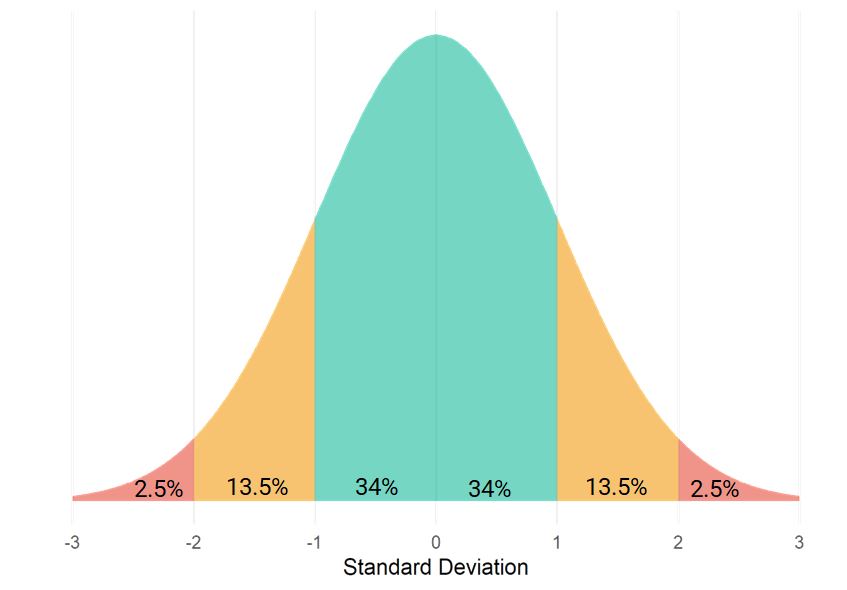
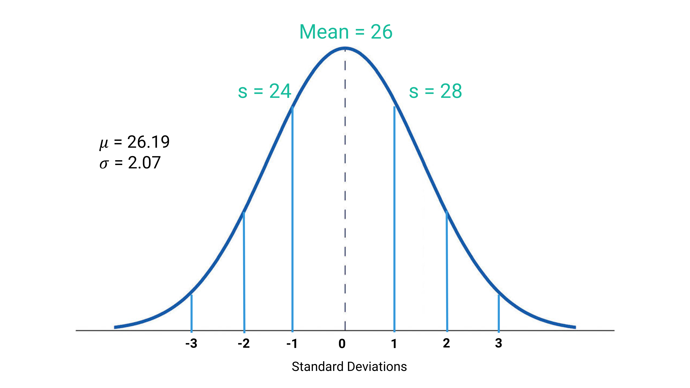
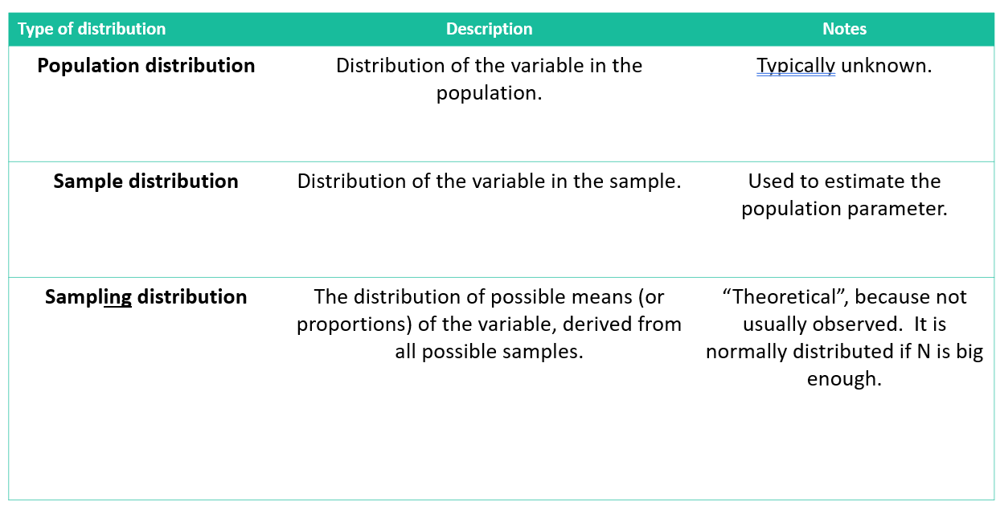
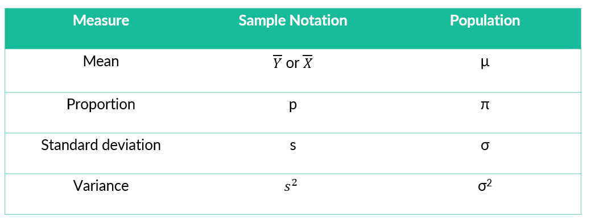

```{r}
#| label: setup
#| message: false
#| include: false

# GLOBAL ENVIRONMENT PANE
## source("tutorials/SOC6302-03/custom-setup-styles.R")
## library(gssr)
## library(gssrdoc)
## data(gss_all)
## gss24 <- gss_get_yr(2024)
## data(gss_dict)

## Load packages, custom functions, and styles
source("custom-setup-styles.R")

## Load all gss
gss_all <- readRDS("data/gss_all.rds")

# Get the data only for the 2024 survey respondents
#gss24 <- readRDS("data/gss24.rds")

## Options
tutorial_options(exercise.checker = gradethis::grade_learnr)
options(dplyr.summarise.inform=F)   # Avoid grouping warning
options(digits=4)                   # Round numbers
theme_set(theme_minimal())          # set ggplot theme
# st_options(freq.report.nas = FALSE) # remove extra columns in freq()
 # any reason need to see this?!?! CHECK FOR SP22
  
knitr::opts_chunk$set(echo = FALSE,
                      warning = FALSE, 
                      messages = FALSE)
```

<link href="https://fonts.googleapis.com/css2?family=Shadows+Into+Light&display=swap" rel="stylesheet">

```{=html}
<script>
  document.addEventListener("DOMContentLoaded", function () {
    document.querySelectorAll("a[href^='http']").forEach(function(link) {
      link.setAttribute("target", "_blank");
      link.setAttribute("rel", "noopener noreferrer");
    });
  });
</script>
```

## Sampling

{width="25%"}

`r fa("fas fa-lightbulb", fill = "#18BC9C")` [**LEARNING
OBJECTIVES**]{style="color: #18BC9C;"}

1.  Explain the importance and use of the normal distribution in
    statistics.
2.  Describe the properties of the normal distribution.
3.  Transform a raw score into a standard (Z) score and vice versa.
4.  Describe the aims of sampling and the central limit theorem.

<br>

`r fa("fas fa-book", fill = "#18BC9C")`
[**READINGS**]{style="color: #18BC9C;"}

Readings are available on Quercus.

1.  Wheelan, Charles. 2014. “The Central Limit Theorem.” Pp. 127–42 in
    *Naked Statistics: Stripping the Dread from the Data*. New
    York: W. W. Norton & Company.

<br>

`r fa("fas fa-language", fill = "#18BC9C")`
[**TERMS**]{style="color: #18BC9C;"}

-   NORMAL DISTRIBUTIONS
-   68-95-99.7 RULE
-   Z SCORE
-   SAMPLING DISTRIBUTIONS
-   PARAMETER
-   STATISTIC
-   SAMPLING ERROR
-   STANDARD ERROR
-   STANDARD ERROR OF THE MEAN
-   SAMPLE SIZE
-   CENTRAL LIMIT THEOREM
-   SIMPLE RANDOM SAMPLE
-   SYSTEMATIC SAMPLING
-   STRATIFIED RANDOM SAMPLING
-   PROPORTIONATE
-   DISPROPORTIONATE

::: my-tip
#### Heads Up!

This tutorial is one of the most difficult of the semester.
  
Be prepared to struggle a bit in understanding the material in this tutorial. 
Students often find the content to be the most challenging of the semester. 
The math appears complicated, but we're building on your knowledge from the previous tutorials. 

The most challenging part is working your mind around the theory. 
So, stick with it. It's worth the struggle.
:::


Normal Distribution
------------------------------------------------------------------------------------------

In this course, we have been working with **empirical distributions**, distributions based on real data. In this tutorial, we're going to focus on a **theoretical distributions**, which are based on probability theory.  

Specifically, we will focus on **normal distributions**.  

```{r}

# Create a data frame of x values and their corresponding densities
x_vals <- seq(-4, 4, length.out = 100)
df <- data.frame(x = x_vals, 
                 y = dnorm(x_vals, mean = 0, sd = 1))

# Plot using ggplot
ggplot(df, aes(x = x, y = y)) +
  geom_line(color = "#18BC9C", size = 1.2) +
  geom_vline(xintercept = 0, color = "#3498DB", linetype = "dashed", size = 1) +
  annotate("text", x = 0.2, y = 0.4, label = "mean = median = mode", 
           color = "#3498DB", hjust = 0) +
  labs(title = "Standard Normal Distribution",
       x = NULL,
       y = NULL) +
  theme_minimal() +
  theme(axis.text.y = element_blank(),
        axis.ticks.y = element_blank())
```
  
The value of a normal distribution is that many empirical distributions that we study seem to take the shape of a normal distribution.  

The normal distribution is unimodal (meaning there is only one mode), symmetrical, and bell shaped. The mean, median, and mode are all at the same central peak.

We can often learn a lot about the characteristics of these empirical distributions based on our knowledge of the normal distribution.  
  
### Normal Distribution and Standard Deviations  
  
The normal distribution is one of the most important concepts in statistics. 
So far, you've been calculating the standard deviations to understand the spread of a distribution.  

It has probably seemed fairly abstract. But, standard deviations have a very important relationship to normal distributions.  
  
Check out this [video](https://youtu.be/rzFX5NWojp0) to learn why [5 minutes].  
  

  
  
### 68-95-99.7 Rule  
  
The entire area under a normal curve is equal to 1.00 or 100% (1.00 × 100) of the observations. 
The mean of a normal distribution divides the observations exactly in half. 
Because the normal curve is perfectly symmetrical, exactly 0.50 (proportion) or 50% (percentage) of the observations lie above or to the right of the mean, and 50% lie below or to the left of the mean.  

The standard deviations also have some magical properties. 
34.13% of the observations lie between the mean and 1 standard deviation to the right of the mean. The same percentage lies between the mean and 1 standard deviation to the left of the mean.  
  
Positive standard deviations are located to the right of the mean, and negative standard deviations denote the area to the left of the mean. 
  
Thus, 68.26% (34.13 + 34.13) of all the observations in the distribution occur between the mean and $±1$ standard deviation. 

And, we can carry this out further. 95.46% of all observations in the distribution occur between the mean and ±2 standard deviations. 
99.72% of the observations occur between the mean and ±3 standard deviations.  
  
  
{ width=100% }
  
<br>  
  
Watch this [video](https://youtu.be/mtbJbDwqWLE){target="_blank"} for a more detailed explanation of this concept [9 minutes].  


::: my-tip
#### Heads Up!

There's some math in this video......and you'll be asked to make these calculations.  
:::
  

### Review  
  
Recall that the entire area under a normal curve is equal to 1.00 or 100% (1.00 × 100) of the observations. 
And, the standard deviation has some magical properties: 68-95-99.7 rule. 

-    Roughly 68% of all the observations in the distribution occur between the mean and $±1$ standard deviation.
-    Roughly 95% of all observations in the distribution occur between the mean and $±2$ standard deviations.
-    Roughly 99.72% of all observations occur between the mean and $±3$ standard deviations.
  
<br>

Let's review with an example. 

::: my-think
#### Think Like a Statistician:

What proportion of women think the ideal age of marriage is 28 or younger?
:::

Pretend that, on average, women's ideal age to marry is 26.19. And, the standard deviation is 2.07. 

{ width=100% }


The value of interest, ($28$), is almost exactly 1 standard deviation away from the mean.

How do I know? Add one standard deviation ($2.07$) to our mean ($26.19$): 

$26.19 + 2.07 = 28.26$  

That's pretty close to 28.  
  
Using this information, we can determine the   

-   area to the left of the mean is $.5$.  
-   area between the mean and 1 standard deviation is half of $.68$, or $.34$.  
  
Add these together:  

$.5 + .34 = .84$  

::: my-take
#### Your Data Take!
About .84, or over 84%, of women think the ideal age of marriage is 28 or younger.  
:::


*** 
  
*What if we wanted to know the proportion of women who think the ideal age of marriage is 29 or younger?*

This raw score (29) doesn't exactly match one of the standard deviation values. 
  
Enter....standardization.  


Standardization
--------------------------------------------------------------------------------

Any normal curve can be transformed into a standard normal distribution with a **mean of 0, and a SD of 1.** We use this information to do two things:
  
1. We express the difference between any score in a distribution and the mean in terms of standard scores, also known as **Z scores**.

2. Then, we use Z scores to determine the proportion of cases between the mean and any Z score.

{ width=100% }

  
<br>

Check out this [video](https://youtu.be/uAxyI_XfqXk) to get a more detailed explanation of the usefulness of standardization [11 minutes].  
  
  

  
  
### Raw score into Z scores
  
An observation (or raw score) can be standardized by transforming it into a Z score, 
a standardized measure of how many standard deviations the observation is above or below the mean.  
  
::: my-def
#### Z SCORE

The number of standard deviations that a given raw score (or the observed score) is above or below the mean. 
:::  

$$
Z = \frac{X - \mu}{\sigma}
$$

<br>  

Social scientists use Z scores when they want to standardize the data, either due to its distribution or to make a comparison between variables with different scales. 
Z scores are a standardized measure of how much below or above the mean a specific value (raw score) is in a given dataset.  

When a raw score is above the mean, the Z score will always be positive. When a raw score is below the mean, the Z score will always be negative.
  
Watch this short [video](https://youtu.be/1o-t_mVDDYQ) to get an overview of how to turn a value into a Z score [2 minutes].  
  

  
  
<br>   

Let's try it out by returning to our example of women's ideal age of marriage. 

::: my-think
#### Think Like a Statistician:

What proportion of women think the ideal age of marriage is **29** or younger?
:::

Our first step is to turn our observation (29) into a Z score, using the given mean (26.19) and standard deviation (2.07).
 
{ width=100% }
  
Plug our numbers into the formula:

$$
Z = \frac{29 - 26.19}{2.07} = 1.36
$$
  
Nice! The math isn't really the hard part here, but rather it is knowing which numbers go where in the formula.


You can also use an online [Z score calculator](https://www.socscistatistics.com/tests/ztest/zscorecalculator.aspx). 
But, you'll still need to know which numbers correlate with which symbol. 
  
Alright, now we know that a value of 29 is 1.36 standard deviations above the mean. 
But, we still need to convert this Z score into a meaningful percentage. 
  
### Z scores into proportions  
  
To turn our Z score into a more interpretable proportion or percentage, we use something called a "Standard Normal Distribution Table."
  
<br>
  
Check out this [video](https://youtu.be/2tuBREK_mgE) for instructions on using a Standard Normal Distribution Table [~7 minutes].  
  

  
<br>   

Let's apply these skills to our example. Our Z score was 1.36. You can use a Standard Normal Distribution Table found online, like this [**Standard Normal Distribution Table**.](https://www.mathsisfun.com/data/standard-normal-distribution-table.html)
  
The advantage of an online tool is you can use the slider in order to find the area of the curve that matches your Z score. 

{ width=100% }

Notice that I dragged the slider until the Z score matched 1.36. 
The interactive normal distribution automatically shows me that this area contains 41.31% of the area between the mean and a Z score of 1.36.
  
It's a good practice to verify your results by checking the table.

{ width=100% }
  
Using the table, we find the proportion equal to a Z score of 1.36 = .4131. Great! This matches the percentage determined by using the slider.

Does this mean that the answer to our question, what proportion of women who think the ideal age of marriage is 29 or younger, is 41.31%?  

Not exactly.  

Look back at the shaded area of the picture. This proportion tells us the area under the curve between the mean and our Z score. So, we could say that 41.31% of women think the ideal age of marriage is between 26 (the mean) and 29. 
  
But, if we want to identify the proportion of women who think the ideal age of marriage is age 29 or younger, we need to account for the 50% of women who think the ideal age of marriage is younger than 26 (the mean).  


We can determine that the:    
  
-   area to the left of the mean is $.5$.  
-   area between the mean and our Z score is $.4131$.  
  
Add these together:  

$.5 + .4131 = .9131$


::: my-take
#### Your Data Take!
91.31% of women think the ideal age of marriage is age 29 or younger.  
:::

You can check your answer by adjusting the settings on the slider of the normal curve. Instead of showing us the proportion from 0 (the standard mean) to our Z score, click the button to select "Up to Z" to see the new results.

{ width=100% }
  
Do you know how to change the slider to show you the percentage of women who think the ideal age of marriage is older than age 29?  
  
It would be even simpler to use `r fa("r-project", fill = "steelblue")`. 
We simply use the [`pnorm()`](https://www.rdocumentation.org/packages/stats/versions/3.6.2/topics/Normal) function.  

`r fa("otter", fill = "#F39C12")`<practice> PRACTICE:</practice>
  
1. Use the `pnorm()` function to calculate our Z score (1.36).
2. Then, click "Run Code" to see your results.  
3. When you are satisfied with your answer, click "Submit Answer."  
  
  
```{r pnorm, exercise=TRUE, error= TRUE}
pnorm(______)
```

```{r pnorm-solution}
pnorm(1.36)
```

::: {#pnorm-hint}
**Hint:** Did you replace the blank line with our Z score: 1.36?
:::


```{r pnorm-check}
grade_code("About 91% of women think the ideal age of marriage is age 29 or younger.")
```
  
  
### Transform a proportion (area) into a Z score
  
We can also work backwards. If we have a percentage, we can use the table to find a Z score. This was mentioned briefly in the last video, but check out this [video](https://youtu.be/gnT9JrmDmrs) for a more comprehensive explanation [~9 minutes]. 


<br>

::: my-tip
#### Heads up! 

Be aware that the logic varies slightly, depending on whether the table used provides only positive Z scores, or both positive and negative Z scores.
:::

Sampling Distributions
--------------------------------------------------------------------------------
  
A population is a group including all the cases (e.g., individuals, cities, etc.) the researcher is interested in. A sample is a smaller subset of cases drawn from the population. 

::: my-def
#### PARAMETER

A measure (e.g., mean or standard deviation) used to describe a population distribution.
:::
  
  
::: my-def
#### STATISTIC

A measure (e.g., mean or standard deviation) used to describe a sample distribution.
:::
  

Population parameters are generally unknown, but we can try to estimate them using sample statistics. 

::: {style="color: #18BC9C; font-family: 'Shadows Into Light'"}
**In order to make inferences about the general population, we must collect a random sample.**
:::  
  
### Sampling Error

::: my-def
#### SAMPLING ERROR

The discrepancy between a sample estimate of a population parameter and the real population parameter.
:::

We typically rely on samples to estimate the true parameters of the population of interest. But, there is usually a difference between a sample estimate of a population parameter (i.e., a statistic) and the real population parameter.  
  
For example, if the true mean height of students in our class (the population) is 5’ 7”, but the mean height found in our sample is 5’ 9”, then the sampling error is 2 inches.
  
***

`r fa("otter", fill = "#F39C12")`<practice> PRACTICE:</practice>
 

```{r P01, echo=FALSE}
  question("In the above example, what is the population parameter?",
           answer("5’ 7”", correct = TRUE, message = "Bravo!"),
           answer("5’ 9”", message = "Try again. Parameters refer to the TRUE measure"),
           random_answer_order = TRUE,
           allow_retry = TRUE)
```
  
```{r P02, echo=FALSE}
  question("In the above example, what is the sample statistic?",
           answer("5’ 9”", correct = TRUE, message = "Bravo!"),
           answer("5’ 7”", message = "Try again. Statistics refer to measures taken from a sample."),
           random_answer_order = TRUE,
           allow_retry = TRUE)
```
  
  
### Sampling Distributions

::: my-def
#### SAMPLING DISTRIBUTION

A theoretical probability distribution of all possible sample values for the statistic in which we are interested.
:::
 

If we drew all possible random samples (all the same size sample) from our population of interest, computed the statistic of interest for each sample, and plotted the frequency distribution of that statistic, we would be plotting a sampling distribution.

For example, we could draw a sample of 10 students in a 100 person class and calculate their mean study hours per week. 
Then, we could draw another sample of 10 students and calculate *their* mean study hours. 
We could do this over and over and over again until we conducted every single possible random sample of 10 students in the 100 person class and calculate every mean. 
Then, we could make a frequency plot of all the means.  
  
  
The distribution plot of means of all of our samples -- **DISTRIBUTION OF SAMPLE MEANS** -- would be approximately normally distributed.  


{ width=100% }
  
As long as our samples are random, the distributions of sample means are normally distributed, even when populations aren't. 

::: {style="color: #18BC9C; font-family: 'Shadows Into Light'"}
**If our sample is not random, we cannot be sure our sampling distribution of the mean is normally distributed.**  
:::
  
[**FUN FACTS:**]{style="color: #3498DB;"}

1. You can have a sampling distribution for any type of statistic (mean, proportion, variance, etc.)
  
2. A sampling distribution has a mean and a standard deviation.  

::: {style="color: #18BC9C; font-family: 'Shadows Into Light'"}
**A sampling distribution (of means), like all distributions, has a mean and a standard deviation.**
:::
  
Its mean is the same as the true population mean!  

Its standard deviation is known as the __standard error.__
  

  
### Standard Error

::: my-def
#### STANDARD ERROR OF THE MEAN

The standard deviation of the sampling distribution of the mean.
:::


The **standard error of the mean** describes how much dispersion there is in the value of the mean from sample to sample. 
  
The standard error of the mean is equal to the standard deviation of the population divided by the square root of the sample size.

The standard error of the mean (SEM) is given by:

$$
\text{SEM} = \frac{s}{\sqrt{n}}
$$

where:  
- \( s \) is the sample standard deviation  
- \( n \) is the sample size

#### Notation

Note, the notation would change in the formula if we're referring to the population distribution, rather than a sample.

The standard error of the mean (SEM), when using population parameters, is defined as:

$$
\text{SEM} = \frac{\sigma}{\sqrt{N}}
$$

where:  
- \( \sigma \) is the population standard deviation  
- \( N \) is the population size

{ width=100% }

<br>
  
Watch this short [video](https://youtu.be/Gak9AxlV1NI) about how to calculate the standard error of the mean [~4 minutes].  
  

  
<br>

`r fa("otter", fill = "#F39C12")`<practice> PRACTICE:</practice>

The standard deviation of work hours per week in the population is $14.69$.

What is the standard error of the population distribution of the mean, if:

```{r P03, echo=FALSE}
  question("The sample size is 8?",
           answer("5.195", correct = TRUE, message = "Bravo!"),
           answer("1.84", message = "Did you divide by the sample size instead of its square root?"),
           answer("2.07", message = "Did you mistakenly square the standard deviation first?"),
           answer("14.69", message = "This is the population standard deviation, not the standard error. It doesn't account for sample size."),
           random_answer_order = TRUE,
           allow_retry = TRUE)
```

```{r P04, echo=FALSE}
  question("The sample size is 50?",
           answer("2.077", correct = TRUE, message = "Bravo!"),
           answer("0.29", message = "Did you divide by the sample size instead of its square root?"),
           answer("14.69", message = "Again, this is the population standard deviation, not adjusted for sample size."),
           answer("5.195", message = "Good guess, but the SEM changes with the sample size."),
           random_answer_order = TRUE,
           allow_retry = TRUE)
```

```{r P05, echo=FALSE}
  question("The sample size is 100?",
           answer("1.47", correct = TRUE, message = "Bravo!"),
           answer("14.69", message = "Still just the population standard deviation—no adjustment for sample size."),
           answer("0.1469", message = "Comes from dividing by the sample size directly, which is incorrect."),
           answer("10.00", message = "Possibly from confusing the square root operation and dividing incorrectly."),
           random_answer_order = TRUE,
           allow_retry = TRUE)
```


#### Importance of the Sampling Distribution

The sampling distribution is used to support the use of samples to estimate the true parameters of the population.

Also allows us to know how much our estimate will vary from the “true” result.

::: {style="color: #18BC9C; font-family: 'Shadows Into Light'"}
**How much confidence can we place in our results?**
:::
  
### Sample Size

If all possible random samples of size N are drawn from a population, as N becomes larger, the sampling distribution of sample means becomes approximately normal.
  
With a sufficient sample size, the sampling distribution of the mean will be normal.
    
If the population distribution is approximately normal, a sample of 30 or more will be sufficient.  
  
With __50 or more__ observations in a sample, the sampling distribution of the mean will be approximately normal regardless of the shape of the population distribution.
  
  
### Probability Sampling

A method of sampling where the researcher specifies the probability of being sampled for every member of the population.

For example, if I were to randomly select one student from a University of Toronto lecture with 120 attendees, each student would have a 1 in 120 chance (or approximately 0.0083 probability) of being selected.

Knowing the probability of being sampled allows us to make inferences about the population based on probability theory.

::: my-tip
#### Heads Up!

If you assign a 0.1 probability to each of 15 students being selected, you’d end up with a total probability of 1.5. That’s a red flag—probabilities must sum to 1 or less in any valid scenario. It’s like saying there’s a 150% chance of something happening… which is great for optimism, but not for math.
:::

<br>

[**Simple random sample**:]{style="color: #18BC9C;"}  
Every member of the population has an equal chance of being chosen and every combination of N members has an equal chance of being chosen.

Suppose there are 100 students in a University of Toronto class, and you want to randomly select 10 students for a survey.  

Run this code a couple of time to see the different samples.

```{r simple, exercise = TRUE}
# Create a population of 100 students
students <- paste("Student", 1:100)

# Select 10 students without replacement (i.e., no duplicates).
sample(students, size = 10, replace = FALSE)

```

<br>

[**Systematic random sample**:]{style="color: #18BC9C;"}  
Random sampling where every Kth case is chosen.  

-   the first member of the sample is selected at random
-   every Kth member thereafter is also chosen

$$
K = \frac{\text{Population Size}}{\text{Sample Size}}
$$
  
Every member has equal chance of selection, but every combination of members does not.

Run this code a couple of time to see the different samples.

```{r systematic, exercise = TRUE}

# Create a population of 100 students
students <- paste("Student", 1:100)

# Calculate sampling interval (k)
k <- length(students) / 10  # 10 is our desired sample size

# Randomly select a starting point between 1 and k
start <- sample(1:k, 1)

# Generate the indices for the systematic sample
sample_indices <- seq(from = start, by = k, length.out = 10)

# Select students using the indices
systematic_sample <- students[sample_indices]

# Display the sampled students
print(systematic_sample)
```

<br>

[**Stratified random sample**:]{style="color: #18BC9C;"}  
Population is divided (or stratified) into groups, and random samples are drawn from each group. There are two types of stratified random samples:  

**Proportionate stratified sampling:**  
Size of each group’s sample is proportional to the group’s size in the population

**Disproportionate stratified sampling:**    
Size of each group’s sample is not proportional to its size in the population
Involves “oversampling” of 1 or more groups

{width="100%"}

  
### Central Limit Theorem  

"){ width=100% }
  
The sampling distribution is used to support the use of samples to estimate the true parameters of the population. 
Sampling distributions allow us to make comparisons between different groups, even when the underlying distribution of the population being studied is unknown. 
  
They help us know how much our estimate will vary from the “true” result. 
In other words, sampling distributions help us answer the question, "How much confidence can we place in our results?"  
  
Sampling distributions are theoretical. By using the Central Limit Theorem, we can compare our sample statistic with the sampling distribution in order to estimate how unlikely it is that our sample mean deviates from the actual population mean.  

In order to make use of the central limit theorem, our sample size has to be large enough (50 or more) 
and it has to be **random: each person must have an equal probability of being selected for the sample.**  


### Simulation

Let's see how this works using the `agekdbrn` variable. (I've already removed missing values and limited the dataset to 2022 respondents.) 

To take a random sample of people's ages when they had their first child,
we can use the `sample()` function. The function needs two pieces of information: 1) the variable we want to sample and 2) the number of people we want to sample. We'll start with a random sample of 50 people and store our values as an object called "sample1."

Because the `sample()` function will take a _random_ sample, the sample will be different every time you run the code. 

**Run the code a few times before submitting your answer.** Notice that the numbers are different each time, but pay attention to how the mean changes.
  
1. Use the `sample()` function to generate a random sample for the variable `agekdbrn`.
2. Tell `r fa("r-project", fill = "steelblue")` you want to know the mean of your random sample (`sample1`).
3. Then, click "Run Code" to see your results.  
4. When you are satisfied with your answer, click "Submit Answer."
  
  
```{r sample50, exercise=TRUE, error= TRUE}
sample1 <- sample(gss_all$_____, 50)
sample1 
mean(_______) # Look at the mean of your random sample of 50 respondents
```

```{r sample50-solution}
sample1 <- sample(gss_all$agekdbrn, 50)
sample1 
mean(sample1) # Look at the mean of your random sample of 50 respondents
```

```{r sample50-hint-1, error=TRUE}
sample1 <- sample(gss_all$agekdbrn, 50)
sample1 
mean(_______) # Look at the mean of your random sample of 50 respondents
```
  
```{r sample50-hint-2}
sample1 <- sample(gss_all$agekdbrn, 50)
sample1 
mean(sample1) # Look at the mean of your random sample of 50 respondents
```


```{r sample50-check}
grade_code("Most of the means won't be exactly 24.9, which is the mean for our full sample of respondents. But most of the means won't be far from 24.9.")
```
  
  
If we take enough samples, the distribution of our sample means will stack up close to 25 (our full sample mean), and approximate a normal distribution. 
To illustrate, we will calculate a mean for 100 random samples of 50 respondents and then plot the means in a histogram. 
You don't need to understand this code, but what it is doing is generating 100 samples of 50 randomly selected respondents, storing each sample of 50 respondents' ages at the time their first child was born, and then calculating 100 means (1 mean for each sample). 
Then, <mark>geom_histogram()</mark> will plot every sample mean.

Run the code below a few times to see how the distribution of sample means changes each time you draw 100 new samples.
  
```{r samplemeans, exercise = TRUE}
agekdbrn.sample <- as.data.frame(t(replicate(100, sample(gss_all$agekdbrn, 50))))

agekdbrn.sample$mean <- rowMeans(agekdbrn.sample, na.rm=TRUE)

ggplot(agekdbrn.sample, aes(x=mean)) + 
  geom_histogram(binwidth = 1)

```
  
  
We can also calculate the standard deviation of our sample means, which is referred to as __the standard error of the mean__. 
To do so, we divide the standard deviation for the population (6.43) by the square root for the sample size (100).

1. Replace the blank line in the code below with the sample size.
2. Then, click "Run Code" to see your results.  
3. When you are satisfied with your answer, click "Submit Answer." 
  
```{r se, exercise = TRUE}
sd(gss_all$agekdbrn)/sqrt(___)
```
  
<div id="se-hint">
**Hint:** Did you replace the blank line with the sample size 100?
</div>  
  
```{r se-solution}
sd(gss_all$agekdbrn)/sqrt(100)

```

```{r se-check}
grade_code("About 68% of the samples will have a mean age between 24.27 (24.90 - 0.63) and 25.53 (24.90 + 0.63).")
```

  
### Now, we can apply the 68-95-99.7 rule.  

Roughly 95% of observations in a normal distribution occur between the mean and ±2 standard deviations.  
  
If we took enough samples (with a large enough sample size), we'd expect the average of our sample means to be close to the full sample mean of 24. And, we would expect 95% of our sample means to fall within ±2 standard deviations of 24.90:

1. Add to the code below to calculate 2 standard deviations above the mean of 24.9 using the standard error (.63).
2. Then, click "Run Code" to see your results.  
3. When you are satisfied with your answer, click "Submit Answer."
  
```{r se2, exercise = TRUE, exercise.lines = 5}
#Lower bound
24.90-(2*.63)
#Upper bound


```

```{r se2-hint-1, error=TRUE}
#Lower bound
24.90-(2*.63)
#Upper bound
24.90+(_____)
```

```{r se2-solution}
#Lower bound
24.90-(2*.63)
#Upper bound
24.90+(2*.63)
```

```{r se2-check}
grade_code("About 95% of the samples will have a mean age between 23.64 and 26.16.")
```
  
  
So, how likely is it that a random sample of 100 people would be 35, on average, at the time of their first child's birth? We could calculate it:

    (35-24.90)/0.63 = 16.03
    
Not very likely. That's 16 standard errors above the mean. Not impossible (weird things happen) but it is extremely unlikely. 
  
  
{ width=100% }
  
<br>
  
Watch this review [video](https://youtu.be/rBjft49MAO8) explaining how all of these terms and ideas fit together [12 minutes].  
  
  

Learning Check #04 {data-progressive=TRUE}
------------------------------------------------------------------------------------------

Please answer the following questions to verify you understand the topics in this tutorial. 


```{r Q01, echo=FALSE}
  question("Q01. To draw a normal distribution, which two measurements do you need to know?",
    answer("mean and standard deviation",  correct = TRUE),
    answer("mean and mode",    message = "In a normal distribution, the mean and the median are equal to one another."),
    answer("mean and median",  message = "In a normal distribution, the mean and the median are equal to one another."),
    answer("IQR and standard deviation", message = "Make sure you watch the videos. This is a very important topic to understand."),
    random_answer_order    = TRUE
  )
```
  
  
```{r Q02, echo=FALSE}
  question("Q02. If the standard deviation is large, how will the curve of the data look?",
    answer("flat and spead out", correct = TRUE),
    answer("tall and narrow",    message = "'Small means tall!'"),
    answer("bimodal",            message = "Make sure you watch the videos. This is a very important topic to understand."),
    answer("positively skewed",  message = "Make sure you watch the videos. This is a very important topic to understand."),
    random_answer_order    = TRUE
  )
```
  
  
```{r Q03, echo=FALSE}
  question("Q03. What does 68% represent in terms of the 68-95-99.7 rule?",
    answer("68% of the data is within 1 standard deviation of the mean (μ)", correct = TRUE),
    answer("68% of distributions in nature follow the normal bell curve",    
           message = "Make sure you watch the videos. This is a very important topic to understand."),
    answer("You can multiply any value by 68% to find its location in the distribution", 
           message = "Make sure you watch the videos. This is a very important topic to understand."),
    answer("68% of all observations fall under the bell curve",  
           message = "Make sure you watch the videos. This is a very important topic to understand."),
    random_answer_order    = TRUE
  )
```
  
  
The normal distribution below has a standard deviation of 10 and a mean of 60.  
  
{ width=100% }
  
  
```{r Q04, echo=FALSE}
  question("Q04. Approximately what area is contained between 60 and 80?",
    answer("47.5%", correct = TRUE),
    answer("68%", 
           message = "Remember that the two standard deviation rule applies to the center of the data, not _any_ two standard deviations."),
    answer("95%", 
           message = "Make sure you watch the videos. This is a very important topic to understand."),
    answer("34.13%", 
           message = "Make sure you watch the videos. This is a very important topic to understand."),
    random_answer_order    = TRUE
  )
```
  
  
```{r Q05, echo=FALSE}
  question("Q05. Approximately what area is contained between 40 and 70?",
    answer("81.5%", correct = TRUE),
    answer("61%", 
           message = "You're on the right track. But the areas between each standard deviation are not identical."),
    answer("95%"),
    answer("102%",  
           message = "Try watching the videos again."),
    random_answer_order    = TRUE
  )
```
  
  
Let's say that the values on this bell curve represent student scores on their statistics midterm. Yikes! But, YOU scored an __80__ on the exam.  
  
```{r Q06, echo=FALSE}
  question("Q06. Your score on the exam was higher than approximately what percentage of other students?",
    answer("97.5%", correct = TRUE, message = "Congrats!"),
    answer("95%", message = "You're on the right track. But don't foget about that sneaky tail on the left."),
    answer("99%", message = "You're on the right track. But don't foget about that sneaky tail on the right."),
    answer("2.5%",  message = "But you did REALLY well...."),
    random_answer_order    = TRUE
  )
```
  
  
  
__The average age of a normally distributed sample of adults who were victims of murder is 28.15 and the standard deviation is 12.55.__  

_Based on this information, answer the questions below._ 
  
```{r Q07, echo=FALSE}
  question("Q07. Calculate the Z score for a murder victim who is age 15.",
    answer("-1.05",  correct = TRUE),
    answer("1.05", message = "Watch those signs!"),
    answer(".09"),
    answer("-.09"),
    random_answer_order    = TRUE
  )
```
  
```{r Q08, echo=FALSE}
  question("Q08. What percentage of victims are younger than age 15?",
    answer("15%", correct = TRUE),
    answer("35%"),
    answer("85%"),
    answer("25%"),
    random_answer_order    = TRUE
  )
```
  
```{r Q09, echo=FALSE}
  question("Q09. Calculate the Z score for a murder victim who is age 65.",
    answer("2.94", correct = TRUE),
    answer("-2.94", message = "Watch those signs!"),
    answer("1.86", message = "Watch those symbols."),
    answer("-1.86"),
    random_answer_order    = TRUE
  )
```
  
```{r Q10, echo=FALSE}
  question("Q10. How many murder victims are older than age 65?",
    answer(".16%", correct = TRUE),
    answer("49.84%", message = "Watch those signs!"),
    answer("99.84%"),
    answer("50.16%"),
    random_answer_order    = TRUE
  )
```
  
```{r Q11, echo=FALSE}
  question("Q11. What percentage of murder victims are between the ages of 18 and 30?",
    answer("35.06%", correct = TRUE),
    answer("29.10%", message = "Watch those signs!"),
    answer("6%"),
    answer("56%"),
    random_answer_order    = TRUE
  )
```
  
```{r Q12, echo=FALSE}
  question("Q12. Which Z score represents the area for up to 70% of murder victims?",
    answer("0.52", correct = TRUE),
    answer("0.1985"),
    answer("-0.52", message = "Watch those signs!"),
    answer("56%"),
    random_answer_order    = TRUE
  )
```
  
```{r Q13, echo=FALSE}
  question("Q13. Parameters are associated with _______ ; statistics are associated with ________ .",
    answer("populations; samples", correct = TRUE),
    answer("samples; populations"),
    answer("cases; samples"),
    answer("populations; datasets"),
    random_answer_order    = TRUE
  )
```
  
  
A researcher wants to know the average number of pets kept by UofT students. 
The population standard deviation is 1.2 and the researcher surveys 100 students.

```{r Q14, echo=FALSE}
  question("Q14. What is the standard error (of the mean) of this sampling distribution?",
    answer(".12", correct = TRUE),
    answer("1.2"),
    answer("90.9", message = "Check your numerator and denominator."),
    answer(".012", message = "Don't forget to take the square root of N first."),
    random_answer_order    = TRUE
  )
```
  
```{r Q15, echo=FALSE}
  question("Q15. If all possible random samples are drawn from a population, as N becomes larger, the sampling distribution of sample means becomes approximately normal. This statement is known as the",
    answer("central limit theorem.", correct = TRUE),
    answer("sampling frame."),
    answer("sampling distribution."),
    answer("central sampling theorem."),
    random_answer_order    = TRUE
  )
```
  
```{r Q16, echo=FALSE}
  question("Q16. How large must our sample be in order to assume the sampling distribution of the means is normal?",
    answer("50", correct = TRUE),
    answer("40"),
    answer("75"),
    answer("100"),
    random_answer_order    = TRUE
  )
```
  