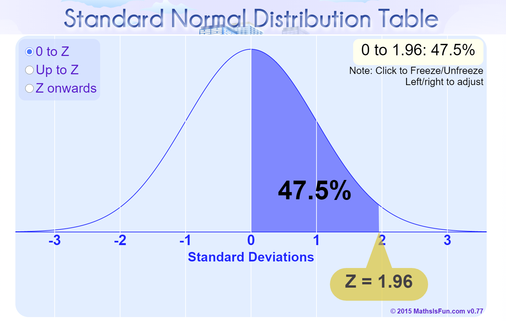

```{r}
#| label: setup
#| message: false
#| include: false

# GLOBAL ENVIRONMENT PANE
## source("tutorials/SOC6302-03/custom-setup-styles.R")
## library(gssr)
## library(gssrdoc)
## data(gss_all)
## gss24 <- gss_get_yr(2024)
## data(gss_dict)

## Load packages, custom functions, and styles
source("custom-setup-styles.R")

## Load all gss
#gss_all <- readRDS("data/gss_all.rds")

# Get the data only for the 2024 survey respondents
#gss24 <- readRDS("data/gss24.rds")

## Options
tutorial_options(exercise.checker = gradethis::grade_learnr)
options(dplyr.summarise.inform=F)   # Avoid grouping warning
options(digits=4)                   # Round numbers
theme_set(theme_minimal())          # set ggplot theme
# st_options(freq.report.nas = FALSE) # remove extra columns in freq()
 # any reason need to see this?!?! CHECK FOR SP22
  
knitr::opts_chunk$set(echo = FALSE,
                      warning = FALSE, 
                      messages = FALSE)
```

<link href="https://fonts.googleapis.com/css2?family=Shadows+Into+Light&display=swap" rel="stylesheet">

```{=html}
<script>
  document.addEventListener("DOMContentLoaded", function () {
    document.querySelectorAll("a[href^='http']").forEach(function(link) {
      link.setAttribute("target", "_blank");
      link.setAttribute("rel", "noopener noreferrer");
    });
  });
</script>
```

## Sampling

{width="25%"}

`r fa("fas fa-lightbulb", fill = "#18BC9C")` [**LEARNING
OBJECTIVES**]{style="color: #18BC9C;"}

1. Explain the concepts of estimation, including point estimates, confidence levels, and confidence interval.
2. Calculate and interpret confidence intervals for means and means.
3. Define and apply the assumptions and components of hypothesis testing.
4. Evaluate statistical significance by calculating and interpreting t-tests and Z-tests.

<br>

`r fa("fas fa-book", fill = "#18BC9C")`
[**READINGS**]{style="color: #18BC9C;"}

Readings are available on Quercus.

1. Inference: Why my statistics professor thought I might have cheated  
2. Polling: How we know that 64 percent of Americans support the death penalty 

<br>

`r fa("fas fa-language", fill = "#18BC9C")`
[**TERMS**]{style="color: #18BC9C;"}

-   POINT ESTIMATE  
-   CONFIDENCE INTERVAL  
-   CONFIDENCE LEVELS  
-   ESTIMATED STANDARD ERROR  
-   MARGIN OF ERROR  
-   STATISTICAL HYPOTHESIS TESTING  
-   RESEARCH HYPOTHESIS ($H_{1}$)  
-   NULL HYPOTHESIS ($H_{0}$)  
-   ONE-TAILED TEST  
-   TWO-TAILED TEST  
-   RIGHT-TAILED TEST  
-   LEFT-TAILED TEST  
-   ALPHA ($\alpha$)  
-   Z SCORE  
-   T STATISTIC  
-   P VALUE  
-   T TEST  
-   FALSE POSITIVE  
-   FALSE NEGATIVE  


Estimation
------------------------------------------------------------------------------------------

A sampling distribution is a theoretical probability distribution of all possible sample values for a statistic, often a mean.  
  
Sampling distributions have a mean, which is equal to the sum of all sample statistics divided by the number of samples.  
  
The sampling distribution also has a **standard error**, which describes how much dispersion there is in the sampling distribution, or how much variability there is in the value of the mean from sample to sample. The standard error is equal to the standard deviation of the population divided by the square root of the sample size.  
  
The size of the standard error of the mean is in inverse proportion to the sample size.

      larger samples  = smaller standard error
      smaller samples = larger standard error
  
For example, the standard deviation of work hours per week in the student population is 14.69. When the sample size is _____, the standard error is _____.  
  
-   Sample size 8   = Standard error 5.19
-   Sample size 50  = Standard error 2.08
-   Sample size 100 = Standard error 1.47
  
<br>  

###
  
### Importance of the Sampling Distribution
  
What we know about sampling distributions is used to support the use of samples to estimate the true parameters of the population. To do this, we combine what we know about Z scores with what we know about sampling distributions.

1. The sampling distribution represents the statistic of interest from each of all possible samples.
2. Sampling distributions approximate normal distributions with a sufficient sample size (central limit theorem).
3. We can calculate the area under the curve with Z scores.

We use **samples** to create an estimate of a population. 
Estimation simply means that we are establishing an approximate calculation of a population parameter, 
based on a sample statistic (presumably derived from a random sample from a population).  
  
::: my-def 
####  Point Estimate 

Estimate of an exact value (percentage, mean, median, etc.). A sample statistic is used as the approximation of a population parameter.
:::
  
  
<br>
  
#### How do you get a point estimate of a population **mean or proportion**? 

You simply use the sample mean or proportion. Why? 
Based on the Central Limit Theorem, we know that means (or proportions) from samples center around the true population value. 
So sample statistics are the best estimate of the population parameter.
  
<br>
  
#### How do you get a point estimate of the **standard deviation**?

The sample standard deviation is our best estimate of the population standard deviation. 
  
<br>
  
::: my-def 
#### Confidence Interval

A range of values within which we believe the true population parameter lies. The range is constructed using a sample statistic and what we know about sampling distributions. 
:::


We use the theoretical sampling distribution to estimate the probability that our sample mean will fall within a certain distance (either above or below) from the true population parameter.  

The likelihood (or probability) that the true value of a population parameter is within the confidence interval is commonly referred to as our **confidence level**. In the social sciences, the most commonly used confidence level is 95%.  
  
Most of the time, social scientists construct confidence intervals for means. Sometimes, we also use them for proportions/percentages.  
   
About 95% of all random sample means will fall within ±1.96 standard errors of the true population mean. How do we know? The Central Limit Theorem tells us that (if sample size is large enough), sampling distributions look normal. And if there’s a 95% chance that a sample mean is within 1.96 standard deviations of the population mean, then there’s a 95% chance that the population mean is within ±1.96 standard deviations of the sample mean.
  
  
We use Z scores to establish our confidence level. If we divide 95% (.95) by two, we get .475.  
  
Look this up in a [Standard Normal Distribution Table.](https://www.mathsisfun.com/data/standard-normal-distribution-table.html) The Z Score equivalent is 1.96!

{ width=50% }


A 95% confidence level means: 

* There is a .95 probability that the given interval contains the true population mean. 
* There is a .05 probability that the given interval doesn't contain the true population mean.
  
  
If the sample is random and large enough, 95 times out of 100, the true population mean will fall within our confidence interval. And, 5 times out of 100, the true population mean will not fall within our confidence interval.  
  
  
::: my-tip
#### Heads up! 

A 95% confidence level does not mean that your point estimate has a 95% chance of being exactly correct! 
:::

<br>

###

### Convey Uncertainty 
  
  
{ width=70% }  
  
  
If we know that 95% of sample means will fall within 1.96 standard errors from the true mean, we can assume that:

**there is a 95% probability that our true mean is within ±1.96 standard errors from our sample mean**. 
  
  
Why use a confidence interval instead of a point estimate? 
We use confidence intervals to convey our uncertainty about the true population parameters, which we estimated based on a (random) sample. 
  
  
<br>  

Watch this [video](https://youtu.be/yDEvXB6ApWc) for the details [~ 13 minutes].


  
<br>  


