```{r}
#| label: setup
#| message: false
#| include: false

# GLOBAL ENVIRONMENT PANE
## source("tutorials/SOC6302-03/custom-setup-styles.R")
## library(gssr)
## library(gssrdoc)
## data(gss_all)
## gss24 <- gss_get_yr(2024)
## data(gss_dict)

## Load packages, custom functions, and styles
source("custom-setup-styles.R")

## Load all gss
#gss_all <- readRDS("data/gss_all.rds")

# Get the data only for the 2024 survey respondents
#gss24 <- readRDS("data/gss24.rds")

## Options
tutorial_options(exercise.checker = gradethis::grade_learnr)
options(dplyr.summarise.inform=F)   # Avoid grouping warning
options(digits=4)                   # Round numbers
theme_set(theme_minimal())          # set ggplot theme
# st_options(freq.report.nas = FALSE) # remove extra columns in freq()
 # any reason need to see this?!?! CHECK FOR SP22
  
knitr::opts_chunk$set(echo = FALSE,
                      warning = FALSE, 
                      messages = FALSE)
```

<link href="https://fonts.googleapis.com/css2?family=Shadows+Into+Light&display=swap" rel="stylesheet">

```{=html}
<script>
  document.addEventListener("DOMContentLoaded", function () {
    document.querySelectorAll("a[href^='http']").forEach(function(link) {
      link.setAttribute("target", "_blank");
      link.setAttribute("rel", "noopener noreferrer");
    });
  });
</script>
```

## Sampling

{width="75%"}

`r fa("fas fa-lightbulb", fill = "#18BC9C")` [**LEARNING
OBJECTIVES**]{style="color: #18BC9C;"}

1. Explain the concepts of estimation, including point estimates, confidence levels, and confidence interval.
2. Calculate and interpret confidence intervals for means and means.
3. Define and apply the assumptions and components of hypothesis testing.
4. Evaluate statistical significance by calculating and interpreting t-tests and Z-tests.

<br>

`r fa("fas fa-book", fill = "#18BC9C")`
[**READINGS**]{style="color: #18BC9C;"}

Readings are available on Quercus.

1. Inference: Why my statistics professor thought I might have cheated  
2. Polling: How we know that 64 percent of Americans support the death penalty 

<br>

`r fa("fas fa-language", fill = "#18BC9C")`
[**TERMS**]{style="color: #18BC9C;"}

-   POINT ESTIMATE  
-   CONFIDENCE INTERVAL  
-   CONFIDENCE LEVELS  
-   ESTIMATED STANDARD ERROR  
-   MARGIN OF ERROR  
-   STATISTICAL HYPOTHESIS TESTING  
-   RESEARCH HYPOTHESIS ($H_{1}$)  
-   NULL HYPOTHESIS ($H_{0}$)  
-   ONE-TAILED TEST  
-   TWO-TAILED TEST  
-   RIGHT-TAILED TEST  
-   LEFT-TAILED TEST  
-   ALPHA ($\alpha$)  
-   Z SCORE  
-   T STATISTIC  
-   P VALUE  
-   T TEST  
-   FALSE POSITIVE  
-   FALSE NEGATIVE  


Estimation
------------------------------------------------------------------------------------------

A sampling distribution is a theoretical probability distribution of all possible sample values for a statistic, often a mean.  
  
Sampling distributions have a mean, which is equal to the sum of all sample statistics divided by the number of samples.  
  
The sampling distribution also has a **standard error**, which describes how much dispersion there is in the sampling distribution, or how much variability there is in the value of the mean from sample to sample. The standard error is equal to the standard deviation of the population divided by the square root of the sample size.  
  
The size of the standard error of the mean is in inverse proportion to the sample size.

      larger samples  = smaller standard error
      smaller samples = larger standard error
  
For example, the standard deviation of work hours per week in the student population is 14.69. When the sample size is _____, the standard error is _____.  
  
-   Sample size 8   = Standard error 5.19
-   Sample size 50  = Standard error 2.08
-   Sample size 100 = Standard error 1.47
  
<br>  

###
  
### Importance of the Sampling Distribution
  
What we know about sampling distributions is used to support the use of samples to estimate the true parameters of the population. To do this, we combine what we know about Z scores with what we know about sampling distributions.

1. The sampling distribution represents the statistic of interest from each of all possible samples.
2. Sampling distributions approximate normal distributions with a sufficient sample size (central limit theorem).
3. We can calculate the area under the curve with Z scores.

We use **samples** to create an estimate of a population. 
Estimation simply means that we are establishing an approximate calculation of a population parameter, 
based on a sample statistic (presumably derived from a random sample from a population).  
  
::: my-def 
####  Point Estimate 

Estimate of an exact value (percentage, mean, median, etc.). A sample statistic is used as the approximation of a population parameter.
:::
  
  
<br>
  
#### How do you get a point estimate of a population **mean or proportion**? 

You simply use the sample mean or proportion. Why? 
Based on the Central Limit Theorem, we know that means (or proportions) from samples center around the true population value. 
So sample statistics are the best estimate of the population parameter.
  
<br>
  
#### How do you get a point estimate of the **standard deviation**?

The sample standard deviation is our best estimate of the population standard deviation. 


  
Confidence intervals
------------------------------------------------------------------------------------------

We use the theoretical sampling distribution to estimate the probability that our sample mean will fall within a certain distance (either above or below) from the true population parameter. This range is constructed using a sample statistic and what we know about sampling distributions.


::: my-def 
#### Confidence Interval

A range of values within which we believe the true population parameter lies. 
:::


The likelihood (or probability) that the true value of a population parameter is within the confidence interval is commonly referred to as our **confidence level**. In the social sciences, the most commonly used confidence level is 95%.  
  
Most of the time, social scientists construct confidence intervals for means. Sometimes, we also use them for proportions/percentages.  
   
About 95% of all random sample means will fall within ±1.96 standard errors of the true population mean. How do we know? The Central Limit Theorem tells us that (if sample size is large enough), sampling distributions look normal. And if there’s a 95% chance that a sample mean is within 1.96 standard deviations of the population mean, then there’s a 95% chance that the population mean is within ±1.96 standard deviations of the sample mean.
  
  
We use Z scores to establish our confidence level. If we divide 95% (.95) by two, we get .475.  
  
Look this up in a [Standard Normal Distribution Table.](https://www.mathsisfun.com/data/standard-normal-distribution-table.html) The Z Score equivalent is 1.96!

{ width=50% }


A 95% confidence level means: 

* There is a .95 probability that the given interval contains the true population mean. 
* There is a .05 probability that the given interval doesn't contain the true population mean.
  
  
If the sample is random and large enough, 95 times out of 100, the true population mean will fall within our confidence interval. And, 5 times out of 100, the true population mean will not fall within our confidence interval.  
  
  
::: my-tip
#### Heads up! 

A 95% confidence level does not mean that your point estimate has a 95% chance of being exactly correct! 
:::

<br>

###

### Convey Uncertainty 
  
  
{ width=70% }  
  
  
If we know that 95% of sample means will fall within 1.96 standard errors from the true mean, we can assume that:

**there is a 95% probability that our true mean is within ±1.96 standard errors from our sample mean**. 
  
  
Why use a confidence interval instead of a point estimate? 
We use confidence intervals to convey our uncertainty about the true population parameters, which we estimated based on a (random) sample. 
  
  
<br>  

Watch this [video](https://youtu.be/yDEvXB6ApWc) for the details [~ 13 minutes].


  
<br>  


### Levels of Confidence

In order to calculate a confidence interval, we must pick a confidence level, and find the corresponding Z score. This is exactly the same logic underlying the 68-95-99.7 rule.


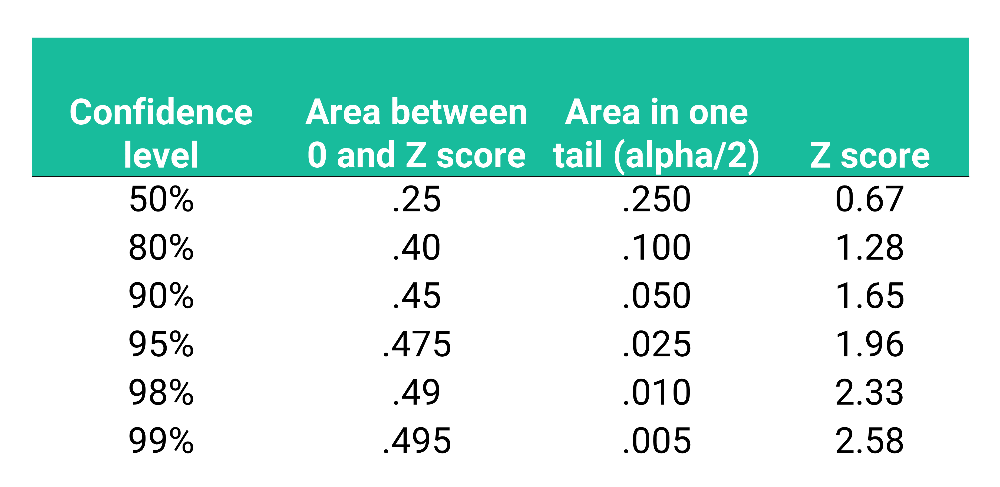{ width=70% }
  
If we want to have a 95% confidence interval, we will choose a Z score of 1.96.

***

`r fa("otter", fill = "#F39C12")`<practice> PRACTICE:</practice>


```{r P01, echo=FALSE}
  question("If we want to have a 99% confidence interval, what Z score will we use?",
           answer("2.58", correct = TRUE, message = "Bravo!"),
           answer("1.96", message = "Try again. This would give us a 95% confidence interval."),
           answer("2.33", message = "Try again. This would give us a 98% confidence interval."),
           answer("1.65", message = "Try again. This would give us a 90% confidence interval."),
           random_answer_order = TRUE,
           allow_retry = TRUE)
```

```{r P02, echo=FALSE}
  question("If we use a 90% confidence interval, which of the following statements is __NOT__ true?",
           answer("Your point estimate has a 90% chance of being exactly correct.", 
                  correct = TRUE),
           answer("There is a .90 probability that the given interval contains the true population mean."),
           answer("There is a .10 probability that the given interval doesn't contain the true population mean."),
           answer("If we want to have a 90% confidence interval, we will choose a Z score of 1.65."),
           random_answer_order = TRUE,
           allow_retry = TRUE)
```


To calculate the confidence intervals, we use the Z score, sample mean, and standard error.  

Confidence intervals are equal to the sample mean ± the Z score times the standard error.

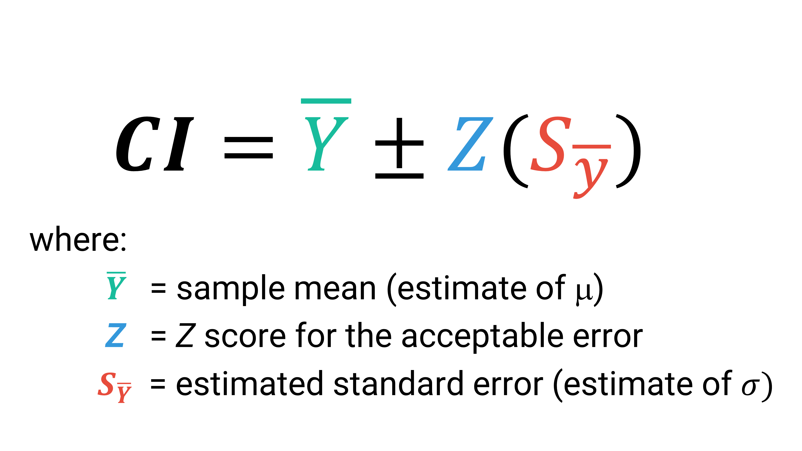{ width=70% }
  
  
We can break this down into three steps: 

1. Decide on the level of confidence, and find the corresponding Z score.

2. Calculate the estimated standard error.

3. Calculate the confidence interval.
  
  
<br>  
  

### Estimated Standard Errors
  
So far, we have calculated standard errors by using the standard deviation of the _population_ and dividing it by the square root of the sample size. 
  
  
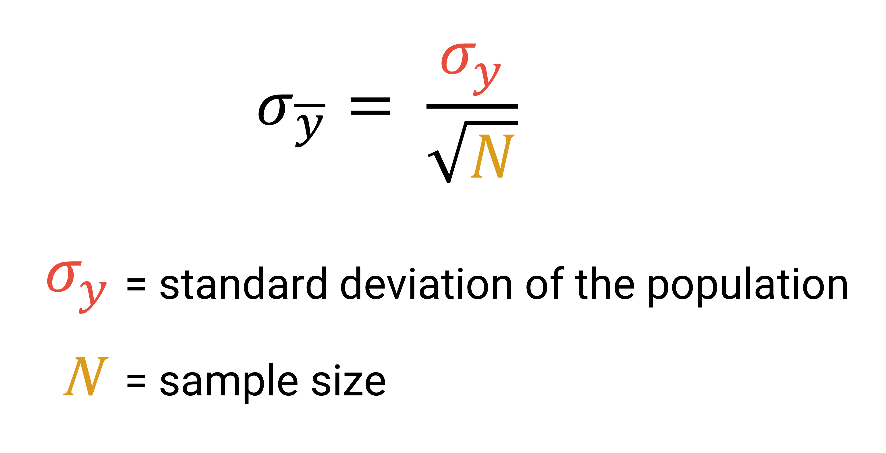{ width=60% }
  
But......what if we don't know the standard deviation of the population? We only have a sample. 
  
If our sample size is 50 or more (or 30 if the population distribution is normal), we can create an _estimated standard error_ by using the sample standard deviation.
  
  
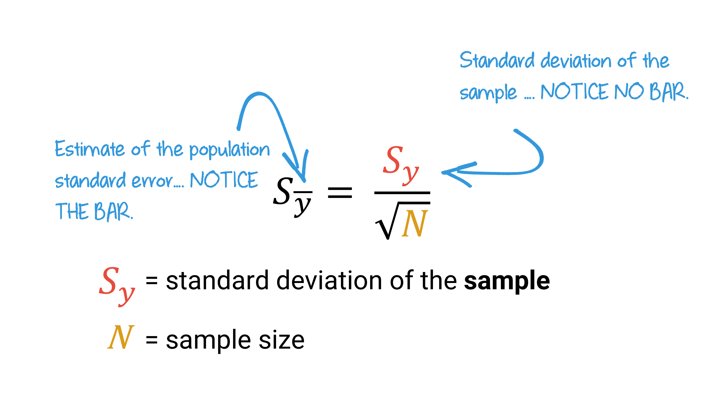{ width=60% }

  
Once we know the Z score and standard error, we can return to our formula and calculate a confidence interval.

<br>


### Example

Let's walk through an example. 
A researcher sampled 501 U.S. residents and calculated the average number of hours spent per day watching television was 3.06 hours, 
with a standard deviation of 2.39 hours. 
We want to report the average number of hours people spend watching television a day, with 95% confidence.  
  
First, we determine the Z score for the 95% confidence level is 1.96.

"){ width=60% }
  
  
Then, we calculate the estimated standard error:

"){ width=60% }


Now, we have all the numbers we need for our confidence interval formula.
  
  
"){ width=60% }
  
  
Calculate your confidence interval based on the preceding formula.
  
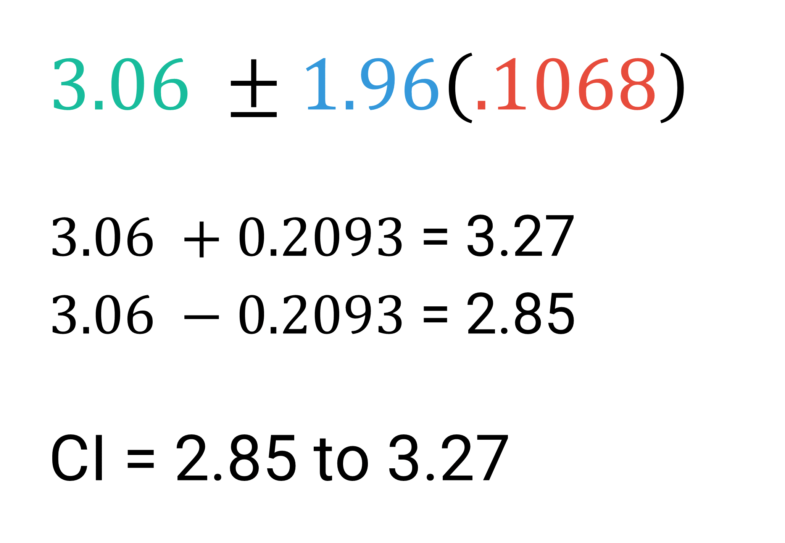{ width=50% }
  
<br>  
  
#### Interpretation
  
All that is left to do is to interpret the confidence interval. Interpreting a statistic, in this case a confidence interval, simply means to say in plain language what the statistic  is telling us.

We can interpret this confidence interval by saying:
  
There’s a 95% chance that the true population average of the number of television hours per day is between 2.85 and 3.27 hours.  
  
OR
  
We are 95% confident that the interval 2.85 hours and 3.27 hours captures the true population average number of hours of television watched per day.

<br>

***

`r fa("otter", fill = "#F39C12")`<practice> PRACTICE:</practice>
 

From 2000 Census data:  
  
* Cuban Americans had an average income of $24,018 (Sy = $36,298); N=29,233.  
  
* Mexican Americans had an average income of $16,537 (Sy = $23,502); N=34,620.  
  
* Puerto Ricans had an income average of $18,748 (Sy = $25,694); N=66,933.  
  
  
**What is the SE estimate and 95% CI for each?**  
(Remember: first get a Z score, then estimate a SE, then plug the numbers into the formula.)
  
  
```{r P03, echo=FALSE}
  question("What Z score will we use in these calculations?",
           answer("1.96", correct = TRUE, message = "You got it!"),
           answer("2.58"),
           answer("2.33"),
           answer("1.65"),
           random_answer_order = TRUE,
           allow_retry = TRUE)
```
  
  
```{r P04, echo=FALSE}
  question("What is the estimated standard error for the sample of Cuban Americans?",
           answer("212.30", correct = TRUE, message = "Very nice!"),
           answer("170.97", message = "Hmm. I think you mixed up the Sy and N in your calculations."),
           answer("$36,298", message = "This is the standard deviation. To find the standard error, take this number and divide it by the square root of the number in the sample."),
           answer(".384", message = "Don't forget to take the square root of the sample size."),
           random_answer_order = TRUE,
           allow_retry = TRUE)
```


```{r P05, echo=FALSE}
  question("What is the 95% confidence interval for the sample of Cuban Americans?",
          answer("$23,602 - $24,434", correct = TRUE, message = "Well done!"),
          answer("$23,805 - $24,230", 
                 message = "Don't forget to multiply the standard error by the Z score."),
          answer("$12,280 - $60,316", 
                 message = "Remeber to use the standard error, not the standard deviation of the sample."),
          answer("$24,016 - $24,230",
                 message = "Remember to take the square root of the sample size."),
           random_answer_order = TRUE,
           allow_retry = TRUE)
```

```{r P06, echo=FALSE}
  question("What is the 95% confidence interval for the sample of Mexican Americans?",
          answer("$16,289 - $16,785", correct = TRUE, message = "Nice job!"),
          answer("$23,602 - $24,434"),
          answer("$18,553 - $18,943"),
           random_answer_order = TRUE,
           allow_retry = TRUE)
```

```{r P07, echo=FALSE}
  question("What is the 95% confidence interval for the sample of Puerto Ricans?",
          answer("$18,553 - $18,943", correct = TRUE),
          answer("$16,289 - $16,785"),
          answer("$23,602 - $24,434"),
           random_answer_order = TRUE,
           allow_retry = TRUE)
```


### Proportions and Percentages

Often times we want a confidence interval for a proportion or percentage, instead of for a mean.
For example, during election season, political scientists want to use a confidence interval for the proportion of people who will be voting for each candidate.  
  
Based on the same concepts as constructing confidence intervals for means, with a sufficient sample size, 
the sampling distribution of proportions will be approximately normal.

We can construct a standard error of the sampling distribution of proportions by slightly adjusting our formula.  


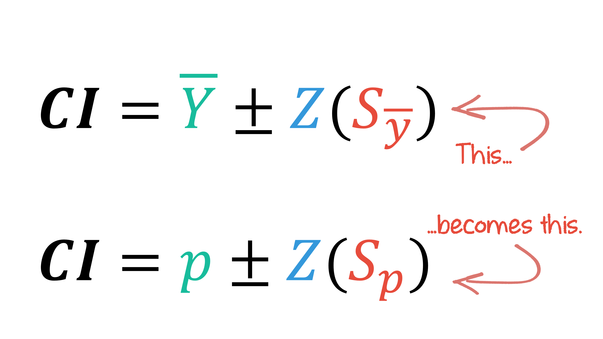{ width=70% }

Instead of using the mean and sample size, to estimate the standard error of proportions, we need to know the **sample proportion** and sample size. 

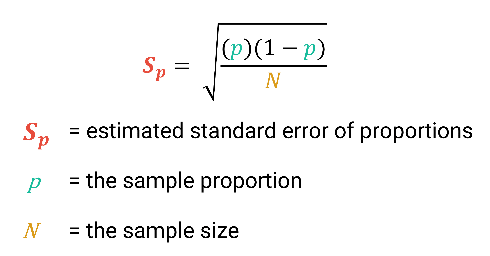{ width=70% }

<br>

### Example
  
Pew Research Center conducted a nationally representative survey of 4,860 U.S. adults in 2019. 
They found that [47% of Americans say dating is now harder](https://www.pewsocialtrends.org/2020/08/20/nearly-half-of-u-s-adults-say-dating-has-gotten-harder-for-most-people-in-the-last-10-years/) than it was 10 years ago. 

We want to construct a confidence interval where we can be 95% confident that the true percentage of Americans who say dating is now harder than it was 10 years ago falls within the range. 
  
To do so, we follow the same steps as before.
  
1. Decide on the level of confidence, and find the corresponding Z score.

2. Calculate the estimated standard error.

3. Calculate the confidence interval.
  
  
  
__Step 1.__ 
Recall that the Z score for the 95% confidence level is 1.96. Easy!  
  
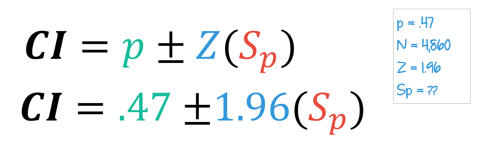{ width=70% }
  
  
__Step 2.__

Then, we'll try out our new formula for calculating the standard error of a proportion/percentage.  
  
  
{ width=50% }
  
And, we'll plug our calculated standard error back into our confidence interval formula.  
  
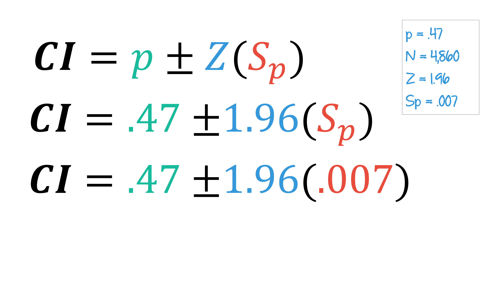{ width=70% }
  
  
__Step 3.__  
  
Now, we're back to calculating a confidence interval based on the preceding formula.  
  
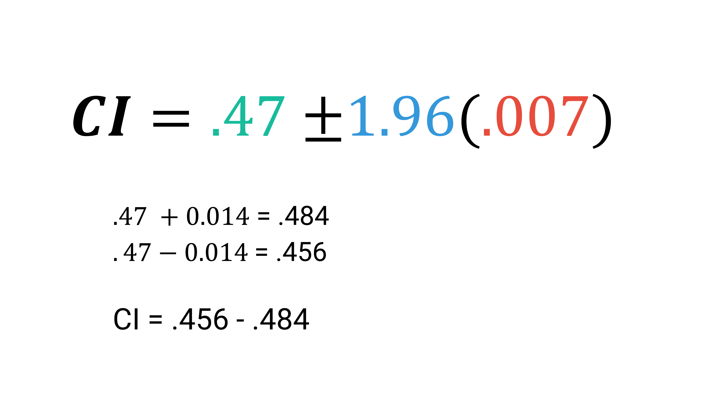{ width=70% }
  
We can interpret this confidence interval by saying:  
  
There’s a 95% chance that the proportion of adults who think dating is now harder than it was 10 years ago is between .456 and .484.  
  
OR  
  
We are 95% confident that the interval between 45.6% and 48.4% captures the true proportion of the population that think dating is now harder than it was 10 years ago.
  
Check out how narrow our confidence interval is! This is because of the large sample size of the survey.   

#### Margin of Error  
  
Margin of error is the distance, expressed in percentage points, between the point estimate and the margins of the CI.  
  
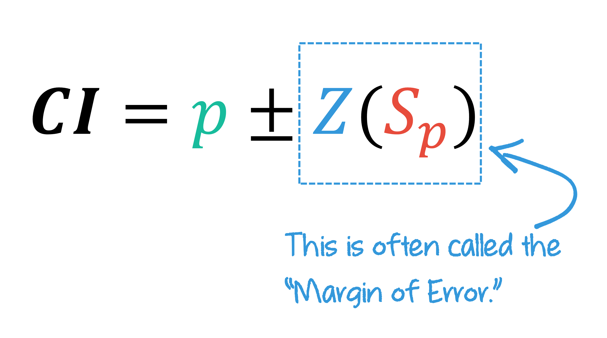{ width=70% }
  
Margins of error are almost always reported in reputable political polls. Read this short explanation from the Pew Research Center about the importance of [margins of error in election polls](https://www.pewresearch.org/fact-tank/2016/09/08/understanding-the-margin-of-error-in-election-polls/).  
  
  
### Reducing Risk vs. Precision

{ width=35% }
    
There are a number of factors that influence how precise (i.e., wide or narrow) our confidence interval is:
  
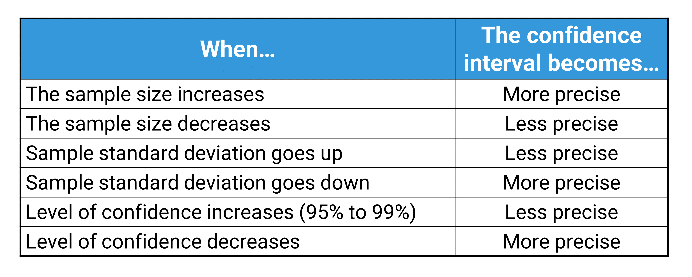{ width=70% }
 
  
In the social sciences, the convention is to use at least a 95% confidence level. Meaning, social scientists are willing to accept that 5% of the time, their sample might produce a wrong estimate of the true population parameter.  
  
  
If we want to reduce the risk that our confidence interval doesn't contain the true population parameter, we could use a 99% confidence level instead of a conventional 95% confidence level, where there is only a 1% risk that we are wrong and the specified interval does not contain the true population mean.  
  
The trade-off between greater confidence in an estimate is the precision of that estimate. As our confidence increases  that the true population mean is within our confidence interval, the confidence interval becomes wider, and therefore our estimate becomes less precise. 


Learning Check #05 {data-progressive=TRUE}
------------------------------------------------------------------------------------------

Please answer the following questions to verify you understand the topics in this tutorial. 

```{r Q01, echo=FALSE}
  question("A process whereby we select a random sample from a population and use a sample statistic to estimate a population parameter is referred to as ",
    answer("estimation",  correct = TRUE),
    answer("central tendency"),
    answer("descriptive statistics"),
    answer("confidence"),
    random_answer_order    = TRUE
  )
```
  

```{r Q02, echo=FALSE}
  question("Typically, since population parameters are unknown, we use the _____ to estimate the value of the standard error.",
    answer("sample standard deviation",  correct = TRUE),
    answer("population standard deviation"),
    answer("sample size"),
    answer("population size"),
    random_answer_order    = TRUE
  )
```
  

```{r Q03, echo=FALSE}
  question("Widening the confidence interval (e.g., from 95% to 99%) increases the _____ of the estimate, but decreases its _____.",
    answer("confidence; precision",  correct = TRUE),
    answer("precision; reliability"),
    answer("precision; confidence"),
    answer("accuracy; precision"),
    random_answer_order    = TRUE
  )
```
  

The most common confidence levels and Z scores are reported in the table below. 
Use this table to compute the confidence intervals below.  
{ width=70% }

  
The table below summarizes the average occupational prestige of men and women with a high school diploma and with a bachelor’s degree. 
Occupation prestige is a scaled measure of the status of occupations and is well correlated with average income.  
  
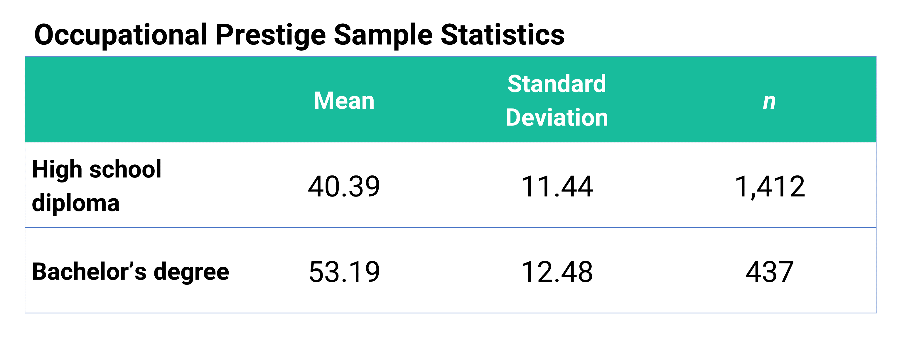{ width=70% }
  
  
```{r Q04, echo=FALSE}
  question("Construct a 95% confidence interval for occupational prestige for respondents with a high school diploma.",
    answer("39.79 to 40.99",  correct = TRUE),
    answer("52.02 to 54.36"),
    answer("40.09	to 40.69"),
    answer("28.95 to 51.83"),
    random_answer_order    = TRUE
  )
```
  
  
```{r Q05, echo=FALSE}
  question("Construct a 95% confidence interval for occupational prestige for respondents with a bachelor’s degree.",
    answer("52.02 to 54.36",  correct = TRUE),
    answer("39.79 to 40.99"),
    answer("40.71 to 65.67"),
    answer("52.89 to 53.49"),
    random_answer_order    = TRUE
  )
```
  
  
Now, show that you know how to interpret your findings. Click "Continue" below.  
  
###
  
### Interpret
  
  
```{r Q06, echo=FALSE}
  question("Which of the following statements is NOT an accurate statement of the findings?",
           answer("Because the mean is within our confidence interval, there is a .95 probability that the occupational prestige of people with a bachelor's degree is 53.19.", correct = TRUE),
           answer("There is a .95 probability that the occupational prestige of people with a bachelor's degree is between 52.02 and 54.36."),
           answer("There is a .05 probability that the occupational prestige of people with a bachelor's degree is NOT between 52.02 and 54.36."),
           answer("We are 95% confident that the interval between 52.02 and 54.36 captures the true mean occupational prestige of people with a bachelor's degree."),
           random_answer_order = TRUE)
```
      
  
In the 2018 General Social Survey, 73% of respondents reported believing in some form of life after death (N = 2,348).  Based on this information, please answer the following.

```{r Q07, echo=FALSE}
  question("What is the estimated standard error (of the sampling distribution of proportions)?",
    answer(".009",  correct = TRUE),
    answer(".1971", message = "sqrt ((.73 × .27)/2348) = sqrt (.1971/2348) = .009"),
    answer("8.39", message = "sqrt ((.73 × .27)/2348) = sqrt (.1971/2348) = .009"),
    answer(".444", message = "sqrt ((.73 × .27)/2348) = sqrt (.1971/2348) = .009"),
    random_answer_order    = TRUE
  )
```


```{r Q08, echo=FALSE}
  question("Construct a __90%__ confidence interval for the true proportion.",
    answer(".71 - .75", correct = TRUE),
    answer(".72 - .76", message = "Hmmm.. Is your rounding off?"),
    answer(".58 - .88", message = "Watch those decimal places."),
    answer(".70 - .76"),
    random_answer_order    = TRUE
  )
```
