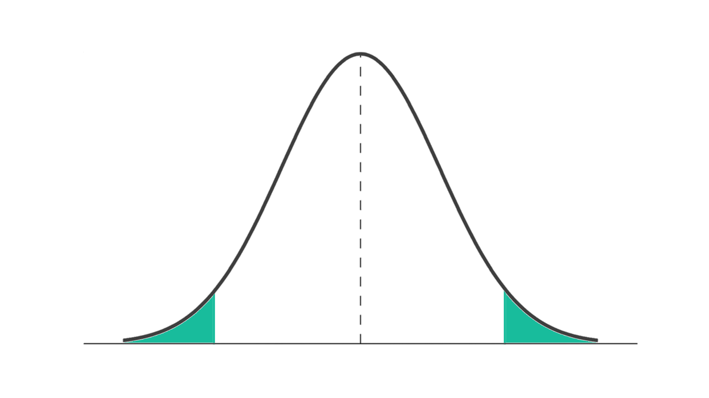
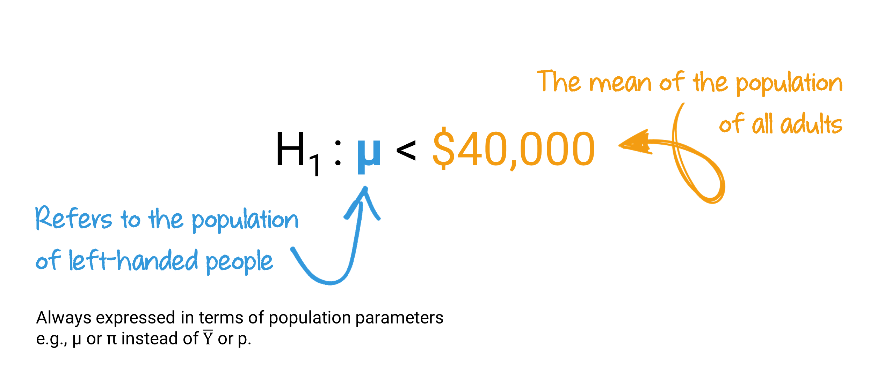
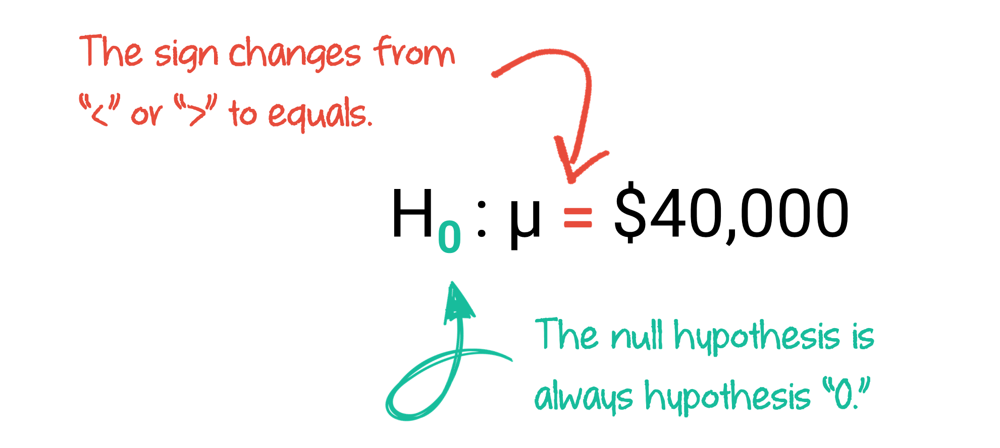
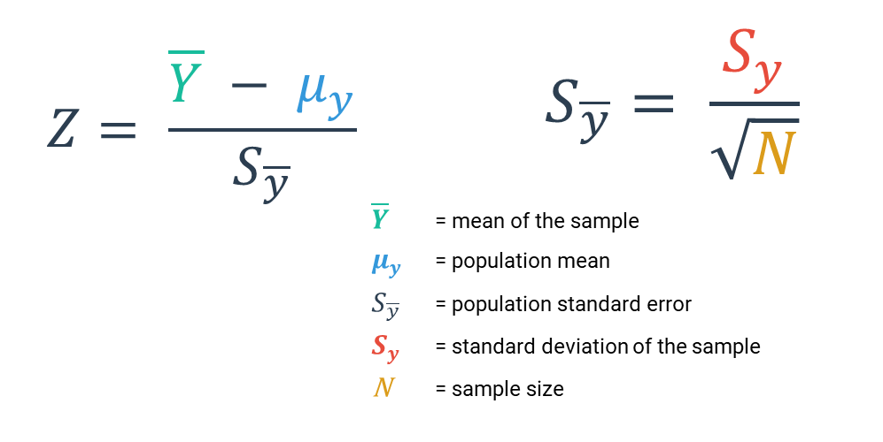
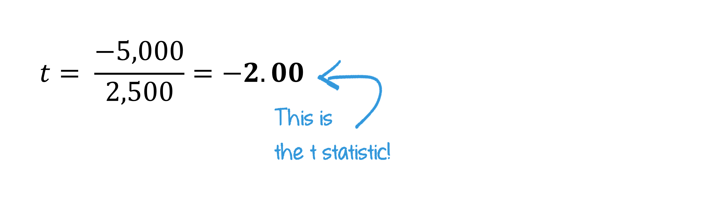
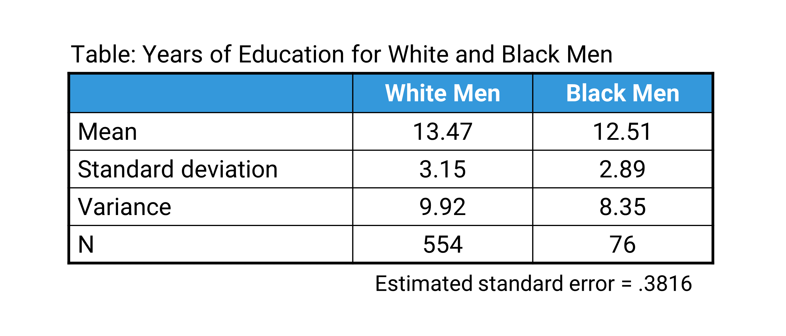
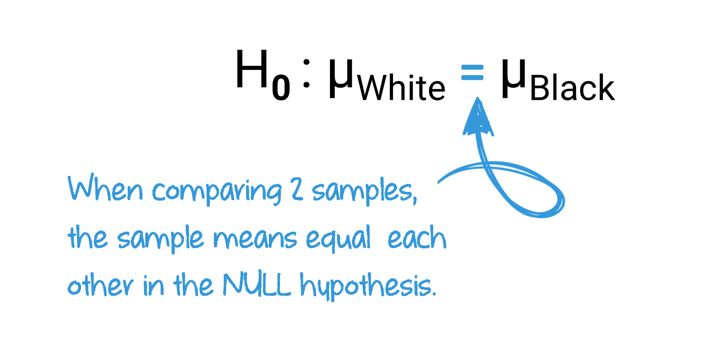
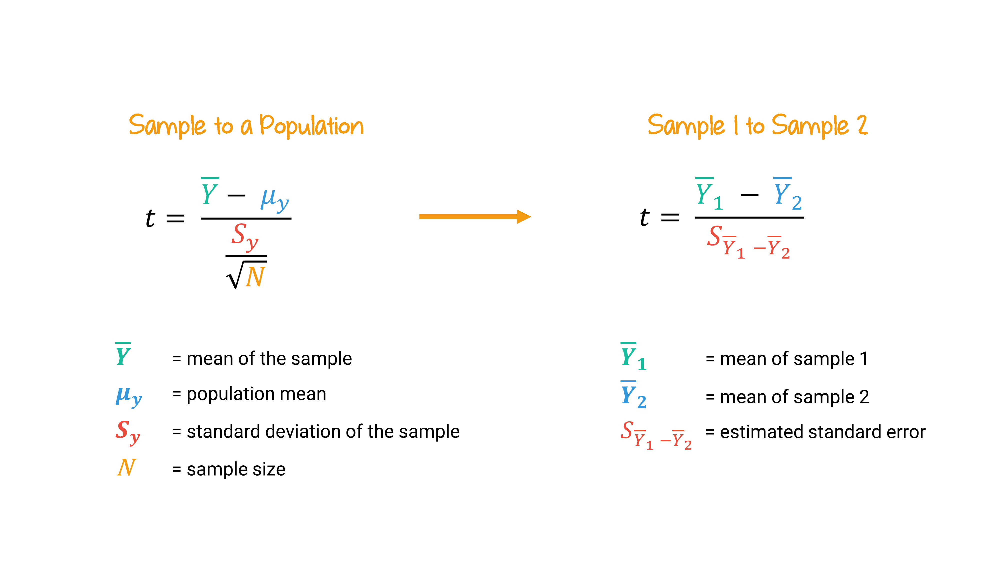
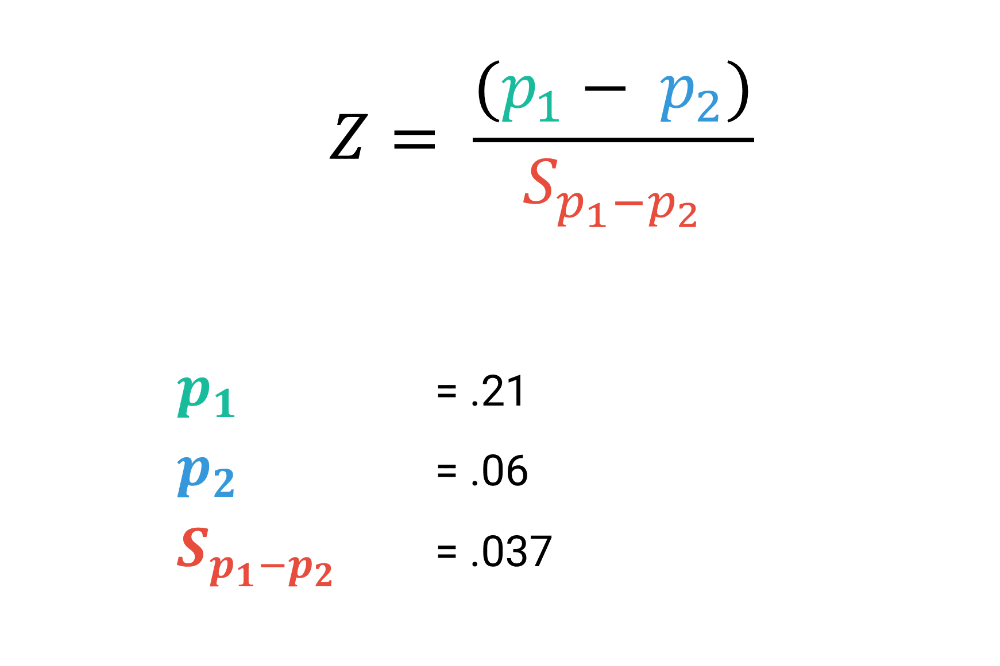

```{r}
#| label: setup
#| message: false
#| include: false

# GLOBAL ENVIRONMENT PANE
## source("tutorials/SOC6302-03/custom-setup-styles.R")
## library(gssr)
## library(gssrdoc)
## data(gss_all)
## gss24 <- gss_get_yr(2024)
## data(gss_dict)

## Load packages, custom functions, and styles
source("custom-setup-styles.R")

## Load all gss
#gss_all <- readRDS("data/gss_all.rds")

# Get the data only for the 2024 survey respondents
#gss24 <- readRDS("data/gss24.rds")

## Options
tutorial_options(exercise.checker = gradethis::grade_learnr)
options(dplyr.summarise.inform=F)   # Avoid grouping warning
options(digits=4)                   # Round numbers
theme_set(theme_minimal())          # set ggplot theme
# st_options(freq.report.nas = FALSE) # remove extra columns in freq()
 # any reason need to see this?!?! CHECK FOR SP22
  
knitr::opts_chunk$set(echo = FALSE,
                      warning = FALSE, 
                      messages = FALSE)
```

<link href="https://fonts.googleapis.com/css2?family=Shadows+Into+Light&display=swap" rel="stylesheet">

```{=html}
<script>
  document.addEventListener("DOMContentLoaded", function () {
    document.querySelectorAll("a[href^='http']").forEach(function(link) {
      link.setAttribute("target", "_blank");
      link.setAttribute("rel", "noopener noreferrer");
    });
  });
</script>
```

## Sampling

{width="75%"}

`r fa("fas fa-lightbulb", fill = "#18BC9C")` [**LEARNING
OBJECTIVES**]{style="color: #18BC9C;"}

1. Explain the concepts of estimation, including point estimates, confidence levels, and confidence interval.
2. Calculate and interpret confidence intervals for means and means.
3. Define and apply the assumptions and components of hypothesis testing.
4. Evaluate statistical significance by calculating and interpreting t-tests and Z-tests.

<br>

`r fa("fas fa-book", fill = "#18BC9C")`
[**READINGS**]{style="color: #18BC9C;"}

Readings are available on Quercus.

1. Inference: Why my statistics professor thought I might have cheated  
2. Polling: How we know that 64 percent of Americans support the death penalty 

<br>

`r fa("fas fa-language", fill = "#18BC9C")`
[**TERMS**]{style="color: #18BC9C;"}

-   POINT ESTIMATE  
-   CONFIDENCE INTERVAL  
-   CONFIDENCE LEVELS  
-   ESTIMATED STANDARD ERROR  
-   MARGIN OF ERROR  
-   STATISTICAL HYPOTHESIS TESTING  
-   RESEARCH HYPOTHESIS ($H_{1}$)  
-   NULL HYPOTHESIS ($H_{0}$)  
-   ONE-TAILED TEST  
-   TWO-TAILED TEST  
-   RIGHT-TAILED TEST  
-   LEFT-TAILED TEST  
-   ALPHA ($\alpha$)  
-   Z SCORE  
-   T STATISTIC  
-   P VALUE  
-   T TEST  
-   FALSE POSITIVE  
-   FALSE NEGATIVE  


Estimation
------------------------------------------------------------------------------------------

A sampling distribution is a theoretical probability distribution of all possible sample values for a statistic, often a mean.  
  
Sampling distributions have a mean, which is equal to the sum of all sample statistics divided by the number of samples.  
  
The sampling distribution also has a **standard error**, which describes how much dispersion there is in the sampling distribution, or how much variability there is in the value of the mean from sample to sample. The standard error is equal to the standard deviation of the population divided by the square root of the sample size.  
  
The size of the standard error of the mean is in inverse proportion to the sample size.

      larger samples  = smaller standard error
      smaller samples = larger standard error
  
For example, the standard deviation of work hours per week in the student population is 14.69. When the sample size is _____, the standard error is _____.  
  
-   Sample size 8   = Standard error 5.19
-   Sample size 50  = Standard error 2.08
-   Sample size 100 = Standard error 1.47
  
<br>  

###
  
### Importance of the Sampling Distribution
  
What we know about sampling distributions is used to support the use of samples to estimate the true parameters of the population. To do this, we combine what we know about Z scores with what we know about sampling distributions.

1. The sampling distribution represents the statistic of interest from each of all possible samples.
2. Sampling distributions approximate normal distributions with a sufficient sample size (central limit theorem).
3. We can calculate the area under the curve with Z scores.

We use **samples** to create an estimate of a population. 
Estimation simply means that we are establishing an approximate calculation of a population parameter, 
based on a sample statistic (presumably derived from a random sample from a population).  
  
::: my-def 
####  Point Estimate 

Estimate of an exact value (percentage, mean, median, etc.). A sample statistic is used as the approximation of a population parameter.
:::
  
  
<br>
  
#### How do you get a point estimate of a population **mean or proportion**? 

You simply use the sample mean or proportion. Why? 
Based on the Central Limit Theorem, we know that means (or proportions) from samples center around the true population value. 
So sample statistics are the best estimate of the population parameter.
  
<br>
  
#### How do you get a point estimate of the **standard deviation**?

The sample standard deviation is our best estimate of the population standard deviation. 


  
Confidence Intervals
------------------------------------------------------------------------------------------

We use the theoretical sampling distribution to estimate the probability that our sample mean will fall within a certain distance (either above or below) from the true population parameter. This range is constructed using a sample statistic and what we know about sampling distributions.


::: my-def 
#### Confidence Interval

A range of values within which we believe the true population parameter lies. 
:::


The likelihood (or probability) that the true value of a population parameter is within the confidence interval is commonly referred to as our **confidence level**. In the social sciences, the most commonly used confidence level is 95%.  
  
Most of the time, social scientists construct confidence intervals for means. Sometimes, we also use them for proportions/percentages.  
   
About 95% of all random sample means will fall within ±1.96 standard errors of the true population mean. How do we know? The Central Limit Theorem tells us that (if sample size is large enough), sampling distributions look normal. And if there’s a 95% chance that a sample mean is within 1.96 standard deviations of the population mean, then there’s a 95% chance that the population mean is within ±1.96 standard deviations of the sample mean.
  
  
We use Z scores to establish our confidence level. If we divide 95% (.95) by two, we get .475.  
  
Look this up in a [Standard Normal Distribution Table.](https://www.mathsisfun.com/data/standard-normal-distribution-table.html) The Z Score equivalent is 1.96!

{ width=50% }


A 95% confidence level means: 

* There is a .95 probability that the given interval contains the true population mean. 
* There is a .05 probability that the given interval doesn't contain the true population mean.
  
  
If the sample is random and large enough, 95 times out of 100, the true population mean will fall within our confidence interval. And, 5 times out of 100, the true population mean will not fall within our confidence interval.  
  
  
::: my-tip
#### Heads up! 

A 95% confidence level does not mean that your point estimate has a 95% chance of being exactly correct! 
:::

<br>

###

### Convey Uncertainty 
  
  
{ width=70% }  
  
  
If we know that 95% of sample means will fall within 1.96 standard errors from the true mean, we can assume that:

**there is a 95% probability that our true mean is within ±1.96 standard errors from our sample mean**. 
  
  
Why use a confidence interval instead of a point estimate? 
We use confidence intervals to convey our uncertainty about the true population parameters, which we estimated based on a (random) sample. 
  
  
<br>  

Watch this [video](https://youtu.be/yDEvXB6ApWc) for the details [~ 13 minutes].


  
<br>  


### Levels of Confidence

In order to calculate a confidence interval, we must pick a confidence level, and find the corresponding Z score. This is exactly the same logic underlying the 68-95-99.7 rule.


{ width=70% }
  
If we want to have a 95% confidence interval, we will choose a Z score of 1.96.

***

`r fa("otter", fill = "#F39C12")`<practice> PRACTICE:</practice>


```{r P01, echo=FALSE}
  question("If we want to have a 99% confidence interval, what Z score will we use?",
           answer("2.58", correct = TRUE, message = "Bravo!"),
           answer("1.96", message = "Try again. This would give us a 95% confidence interval."),
           answer("2.33", message = "Try again. This would give us a 98% confidence interval."),
           answer("1.65", message = "Try again. This would give us a 90% confidence interval."),
           random_answer_order = TRUE,
           allow_retry = TRUE)
```

```{r P02, echo=FALSE}
  question("If we use a 90% confidence interval, which of the following statements is __NOT__ true?",
           answer("Your point estimate has a 90% chance of being exactly correct.", 
                  correct = TRUE),
           answer("There is a .90 probability that the given interval contains the true population mean."),
           answer("There is a .10 probability that the given interval doesn't contain the true population mean."),
           answer("If we want to have a 90% confidence interval, we will choose a Z score of 1.65."),
           random_answer_order = TRUE,
           allow_retry = TRUE)
```


To calculate the confidence intervals, we use the Z score, sample mean, and standard error.  

Confidence intervals are equal to the sample mean ± the Z score times the standard error.

{ width=70% }
  
  
We can break this down into three steps: 

1. Decide on the level of confidence, and find the corresponding Z score.

2. Calculate the estimated standard error.

3. Calculate the confidence interval.
  
  
<br>  
  

### Estimated Standard Errors
  
So far, we have calculated standard errors by using the standard deviation of the _population_ and dividing it by the square root of the sample size. 
  
  
{ width=60% }
  
But......what if we don't know the standard deviation of the population? We only have a sample. 
  
If our sample size is 50 or more (or 30 if the population distribution is normal), we can create an _estimated standard error_ by using the sample standard deviation.
  
  
{ width=60% }

  
Once we know the Z score and standard error, we can return to our formula and calculate a confidence interval.

<br>


### Example

Let's walk through an example. 
A researcher sampled 501 Canadian residents and calculated the average number of hours spent per day watching television was 3.06 hours, 
with a standard deviation of 2.39 hours. 
We want to report the average number of hours people spend watching television a day, with 95% confidence.  
  
First, we determine the Z score for the 95% confidence level is 1.96.

"){ width=60% }
  
  
Then, we calculate the estimated standard error:

"){ width=60% }


Now, we have all the numbers we need for our confidence interval formula.
  
  
"){ width=60% }
  
  
Calculate your confidence interval based on the preceding formula.
  
{ width=50% }
  
<br>  
  
#### Interpretation
  
All that is left to do is to interpret the confidence interval. Interpreting a statistic, in this case a confidence interval, simply means to say in plain language what the statistic  is telling us.

We can interpret this confidence interval by saying:
  
There’s a 95% chance that the true population average of the number of television hours per day is between 2.85 and 3.27 hours.  
  
OR
  
We are 95% confident that the interval 2.85 hours and 3.27 hours captures the true population average number of hours of television watched per day.

<br>

***

`r fa("otter", fill = "#F39C12")`<practice> PRACTICE:</practice>
 

From 2000 Census data:  
  
* Cuban Americans had an average income of $24,018 (Sy = $36,298); N=29,233.  
  
* Mexican Americans had an average income of $16,537 (Sy = $23,502); N=34,620.  
  
* Puerto Ricans had an income average of $18,748 (Sy = $25,694); N=66,933.  
  
  
**What is the SE estimate and 95% CI for each?**  
(Remember: first get a Z score, then estimate a SE, then plug the numbers into the formula.)
  
  
```{r P03, echo=FALSE}
  question("What Z score will we use in these calculations?",
           answer("1.96", correct = TRUE, message = "You got it!"),
           answer("2.58"),
           answer("2.33"),
           answer("1.65"),
           random_answer_order = TRUE,
           allow_retry = TRUE)
```
  
  
```{r P04, echo=FALSE}
  question("What is the estimated standard error for the sample of Cuban Americans?",
           answer("212.30", correct = TRUE, message = "Very nice!"),
           answer("170.97", message = "Hmm. I think you mixed up the Sy and N in your calculations."),
           answer("$36,298", message = "This is the standard deviation. To find the standard error, take this number and divide it by the square root of the number in the sample."),
           answer(".384", message = "Don't forget to take the square root of the sample size."),
           random_answer_order = TRUE,
           allow_retry = TRUE)
```


```{r P05, echo=FALSE}
  question("What is the 95% confidence interval for the sample of Cuban Americans?",
          answer("$23,602 - $24,434", correct = TRUE, message = "Well done!"),
          answer("$23,805 - $24,230", 
                 message = "Don't forget to multiply the standard error by the Z score."),
          answer("$12,280 - $60,316", 
                 message = "Remeber to use the standard error, not the standard deviation of the sample."),
          answer("$24,016 - $24,230",
                 message = "Remember to take the square root of the sample size."),
           random_answer_order = TRUE,
           allow_retry = TRUE)
```

```{r P06, echo=FALSE}
  question("What is the 95% confidence interval for the sample of Mexican Americans?",
          answer("$16,289 - $16,785", correct = TRUE, message = "Nice job!"),
          answer("$23,602 - $24,434"),
          answer("$18,553 - $18,943"),
           random_answer_order = TRUE,
           allow_retry = TRUE)
```

```{r P07, echo=FALSE}
  question("What is the 95% confidence interval for the sample of Puerto Ricans?",
          answer("$18,553 - $18,943", correct = TRUE),
          answer("$16,289 - $16,785"),
          answer("$23,602 - $24,434"),
           random_answer_order = TRUE,
           allow_retry = TRUE)
```


### Proportions and Percentages

Often times we want a confidence interval for a proportion or percentage, instead of for a mean.
For example, during election season, political scientists want to use a confidence interval for the proportion of people who will be voting for each candidate.  
  
Based on the same concepts as constructing confidence intervals for means, with a sufficient sample size, 
the sampling distribution of proportions will be approximately normal.

We can construct a standard error of the sampling distribution of proportions by slightly adjusting our formula.  


{ width=70% }

Instead of using the mean and sample size, to estimate the standard error of proportions, we need to know the **sample proportion** and sample size. 

{ width=70% }

<br>

### Example
  
Pew Research Center conducted a nationally representative survey of 4,860 U.S. adults in 2019. 
They found that [47% of Americans say dating is now harder](https://www.pewsocialtrends.org/2020/08/20/nearly-half-of-u-s-adults-say-dating-has-gotten-harder-for-most-people-in-the-last-10-years/) than it was 10 years ago. 

We want to construct a confidence interval where we can be 95% confident that the true percentage of Americans who say dating is now harder than it was 10 years ago falls within the range. 
  
To do so, we follow the same steps as before.
  
1. Decide on the level of confidence, and find the corresponding Z score.

2. Calculate the estimated standard error.

3. Calculate the confidence interval.
  
  
  
__Step 1.__ 
Recall that the Z score for the 95% confidence level is 1.96. Easy!  
  
{ width=70% }
  
  
__Step 2.__

Then, we'll try out our new formula for calculating the standard error of a proportion/percentage.  
  
  
{ width=50% }
  
And, we'll plug our calculated standard error back into our confidence interval formula.  
  
{ width=70% }
  
  
__Step 3.__  
  
Now, we're back to calculating a confidence interval based on the preceding formula.  
  
{ width=70% }
  
We can interpret this confidence interval by saying:  
  
There’s a 95% chance that the proportion of adults who think dating is now harder than it was 10 years ago is between .456 and .484.  
  
OR  
  
We are 95% confident that the interval between 45.6% and 48.4% captures the true proportion of the population that think dating is now harder than it was 10 years ago.
  
Check out how narrow our confidence interval is! This is because of the large sample size of the survey.   

#### Margin of Error  
  
Margin of error is the distance, expressed in percentage points, between the point estimate and the margins of the CI.  
  
{ width=70% }
  
Margins of error are almost always reported in reputable political polls. Read this short explanation from the Pew Research Center about the importance of [margins of error in election polls](https://www.pewresearch.org/fact-tank/2016/09/08/understanding-the-margin-of-error-in-election-polls/).  
  
  
### Reducing Risk vs. Precision

{ width=35% }
    
There are a number of factors that influence how precise (i.e., wide or narrow) our confidence interval is:
  
{ width=70% }
 
  
In the social sciences, the convention is to use at least a 95% confidence level. Meaning, social scientists are willing to accept that 5% of the time, their sample might produce a wrong estimate of the true population parameter.  
  
  
If we want to reduce the risk that our confidence interval doesn't contain the true population parameter, we could use a 99% confidence level instead of a conventional 95% confidence level, where there is only a 1% risk that we are wrong and the specified interval does not contain the true population mean.  
  
The trade-off between greater confidence in an estimate is the precision of that estimate. As our confidence increases  that the true population mean is within our confidence interval, the confidence interval becomes wider, and therefore our estimate becomes less precise. 


Hypothesis Testing
------------------------------------------------------------------------------------------

::: my-def 
#### Statistical Hypothesis Testing

A procedure that allows us to evaluate hypotheses about population parameters based on sample statistics.
:::
  
<br>  

We will be testing the statistical significance of means and proportions.

[**We can compare a subgroup to the population:**]{style="color: #18BC9C;"}

-    E.g., Do left-handed people earn less than all adults?  

  

[**We can compare two subgroups based on samples:**]{style="color: #18BC9C;"}

-    E.g., Do left-handed people earn less than right-handed people?
  
<br>

[**We can also test for different relationships:**]{style="color: #18BC9C;"}

-    Left-handed people’s earnings are different than the earnings of all adults
-    Left-handed people’s earnings are less than the earnings of all adults
-    Left-handed people’s earnings are greater than the earnings of all adults

OR

-    Left-handed people’s earnings are different than right-handed people’s earnings
-    Left-handed people’s earnings are less than right-handed people’s earnings
-    Left-handed people’s earnings are greater than right-handed people’s earnings
  
<br>

When constructing confidence intervals, we were concerned with identifying the probability our statistic fell within the middle part of a distribution. 
When testing hypotheses, we shift our focus to identifying the probability our statistic falls within the tails of a distribution.  
  
  
{ width=80% }
  
To get an overview of hypothesis testing, first watch [this video](https://youtu.be/bf3egy7TQ2Q) [~12 minutes].
  

  
  
### 

### Steps in hypotheses testing

We're going to follow 5 steps to test hypotheses: 
  
1. Check assumptions
2. State the research and null hypotheses 
3. Select alpha and specify the test statistic
4. Compute the test statistic
5. Interpret the results
  
<br>
  
#### 1. Check assumptions

In order to proceed with testing hypotheses, assumptions first have to be established. 

* The sample must have been random.
* Each variable’s level of measurement (interval-ratio or nominal) must be appropriate for the test.
* The sample size must be large enough so that a normal sampling distribution can be assumed. 
* Either the population is normally distributed with respect to our variable of interest OR 
  our sample size is sufficiently large (over 50) so that we know the sampling distribution of the mean is approximately normal.
  
<br>
  
#### 2. State the research and null hypotheses 

::: my-def 
#### Research Hypothesis ($H_{1}$)

A statement reflecting the substantive hypothesis.
:::
 
<br> 
  
::: my-def 
#### Null Hypothesis ($H_{0}$)

A statement of “no difference,” which contradicts the research hypothesis.  
:::
  
Hypotheses can be written out in full sentences, or expressed as equations. 
The notations in the equation are always expressed in terms of population parameters (i.e., use Greek letters).  


::: {style="color: #E74C3C;"}
**Hypothesis 1**
  
**$\mu_{1} > \mu_2$** 
Left-handed people's earnings are greater than right-handed people's earnings  

**$\mu_1 < \mu_2$**
Left-handed people's earnings are less than right-handed people's earnings  

**$\mu_1 \neq \mu_2$**
Left-handed people's earnings are different than right-handed people's earnings  
:::

::: {style="color: #3498DB;"}

**Hypothesis 2**

**$\mu_1 = \mu_2$** 
Left-handed people's earnings are equal to right-handed people's earnings  

:::
  
<br>
  
Sometimes it is clearer to use subscripts meaningfully, instead of numbering the sample/population.

::: {style="color: #E74C3C;"}
**Hypothesis 1**
  
$\pi_{\text{left}} < \pi_{\text{right}}$
:::
  
  
::: {style="color: #3498DB;"}

**Hypothesis 2**

$\mu_{\text{Men}} = \mu_{\text{Women}}$
:::

<br>

When we believe that some number or value is not equal to that of the population or another sample, this is called a **two-tailed test**. In a two-tailed test, the sample outcome is hypothesized to be at either tail of the sampling distribution.

{ width=40% }
  
<br>  

When we have a belief about which side of the population value our sample will lie, we call this a **one-tailed test**.

**Right-tailed test:** we suspect our sample is *greater than* the population value.  
In a right-tailed test, the sample outcome is hypothesized to be at the right tail of the sampling distribution.  
  
{ width=40% }

**Left-tailed test:** we suspect our sample is *less than* the population value.  
In a left-tailed test, the sample outcome is hypothesized to be at the left tail of the sampling distribution.  
  
{ width=40% }

***

`r fa("otter", fill = "#F39C12")`<practice> PRACTICE:</practice>

```{r P08, echo=FALSE}
  question("If you hypothesize that the average American works more than the normative 40 hours/ week, it’s a ___________________",
           answer("right-tailed test", correct = TRUE, message = "Bravo!"),
           answer("left-tailed test", message = "Try again. We suspect the sample mean is greater than the population mean."),
           answer("two-tailed test", message = "Try again. We have a suspicion about which side of the population mean our sample mean will be on."),
           random_answer_order = TRUE,
           allow_retry = TRUE)
```
  
  
```{r P09, echo=FALSE}
  question("If you hypothesize that, on average, Americans do not work 40 hours/week, without specifying if they work less or more, it’s a ___________________",
           answer("right-tailed test", message = "Try again. The sample outcome is hypothesized to be at either tail of the sampling distribution."),
           answer("left-tailed test", message = "Try again. The sample outcome is hypothesized to be at either tail of the sampling distribution."),
           answer("two-tailed test", correct = TRUE),
           random_answer_order = TRUE,
           allow_retry = TRUE)
```
  

#### 3. Select alpha ($\alpha$) and specify the test statistic
  
::: my-def 
#### $\alpha$

The level of probability at which the null hypothesis is rejected.
:::

<br>

Alpha ($\alpha$) is a pre-determined cut-off value for the probability that, if the null hypothesis is true, you could have obtained your sample statistic.  
  
If you calculate a probability of less than this value, you will reject the null hypothesis.  
  
An $\alpha$ of .01 means you will reject the null hypothesis if your sample statistic falls in the most extreme .01 of the distribution. 


**The most common α in the social sciences is .05** (with .01 and .001 next most common). 
In this course, assume that $\alpha$ is .05 unless told otherwise.  
  
It is best practice to pick an $\alpha$, the cut-off point at which we will say our results are significant and reject the null hypothesis, **before we calculate our test statistic**.
  
***
   
To know if we can reject the null hypothesis, we must convert a sample statistic into a Z or *t* score, 
a standardized score that we can look up in a table. Z statistics and *t* statistics are test statistics,  converted sample statistics (e.g., a difference in two sample proportions).  
  
To compare two groups’ **proportions**, we’ll use the Z distribution (a.k.a. normal distribution), along with a Z statistic.  
  
To compare two groups’ **means**, we’ll use a *t* statistic.  
  
At this point, you're already familiar with Z distribution, which is simply the normal distribution. A *t* distribution is a family of symmetrical curves.  
  
<br>

#### 4. Compute the test statistic
  
Watch this [video](https://youtu.be/-bhfcBvyWoc){target="_blank"} to learn about why we need to use both Z and *t* statistics [5 minutes].  
  

  
  
We'll go over how to calculate Z and *t* statistics in more detail in this tutorial. 
  
<br>
  
#### 5. Interpret the results
  
In order to interpret our results, we must convert our test statistic into a probability of how unusual or rare our obtained statistic is compared with what is stated in the null hypothesis.
  
::: my-def 
#### p-value

The probability associated with the obtained value of our test statistic.  
:::

<br>

The p-value is simply a measure of how extreme our test statistic is if the null hypothesis is true.  
  
P-values can range from 0 to 1, because they represent the *probability* of getting a value as or more extreme as the test statistic, and they correspond to an area under the curve (in one or both tails, depending on whether doing one- or two-tailed test).  
  
To interpret our results, we compare our p-value with our pre-determined $\alpha$. 
If the p-value is less than the alpha value, you will reject the null hypothesis.  
  
  
Here's a short [video](https://youtu.be/eyknGvncKLw) explaining the relationship between the $\alpha$ value and p-value [5 minutes].
  

  
<br>
  
At the end of every hypothesis test, you will either 
  
a. reject the null hypothesis or 
  
b. fail to reject the null hypothesis (i.e., retain the null hypothesis)
  
  
Hypothesis testing does not tell you the probability that your research hypothesis ($H_{1}$) is true. 
You can't prove that your research hypothesis is true, **only that your null hypothesis is unlikely to be true.**  
  
  
### Errors  
  
Because we are dealing with probabilities, not certainties, 
it is possible for researchers to draw the wrong conclusion from their hypothesis tests.  
  
::: my-def 
#### False positive

When you reject $H_{0}$ even though it’s true.
:::
  
False positives are also known as **type I** errors.  
  
The probability of a false positive (__type I** error) is equal to the selected $\alpha$.
We can reduce the risk of a false positive by making $\alpha$ smaller.  
  
-    If alpha is .10, there’s a 10% chance of Type I error.
-    If alpha is .05, there’s a 5%  chance of Type I error.
-    If alpha is .01, there’s a 1%  chance of Type I error.
  
  
::: my-def 
#### False negative

Fail to reject $H_{0}$ even though you should.
:::
  
False negatives are also known as **type II** errors. 
  
These occur when a researcher fails to reject a null hypothesis ($H_{0}$) which is really false.  

If we reduce the risk of a Type I error, we increase the risk of a Type II error. **There’s a trade-off between the two types of errors.**
  
  
Read this [__short blog post__](https://blog.datasciencedojo.com/type-i-and-type-ii-errors/) about how to remember the difference between these two errors. 
  
  
### Comparing One Sample Mean

We're going to work through an example of hypothesis testing together. 

We want to know if left-handed people in Canada earn less income than the general population, on average. The average income for people in the United States is $40,000. 
We took a random sample of 100 left-handed people and found they have an average income of $35,000 and an estimated standard error of 
$25,000 (a.k.a. standard deviation of the sample).  
  
The difference in income between left-handed people and the general population is $5,000 per year. But is that a statistically significant difference? Or, could the difference be due to chance (i.e., sample variation)?
  
Let's test our hypothesis.  
  
<br>
  
#### 1. Check assumptions

In order to test our hypothesis, we need to first confirm that the necessary assumptions have been met. 

-   The sample must have been random. 
-   Each variable’s level of measurement (interval-ratio or nominal) must be appropriate for test. 
-   The sample size must be large enough so that a normal sampling distribution can be assumed. 
-   Either the population is normally distributed with respect to our variable of interest OR 
  our sample size is sufficiently large (over 50) so that we know the sampling distribution of the mean is approximately normal.
  
  
I told you we **randomly** sampled **100** left-handed people. 
We also confirm that the variable we are measuring, annual income, is an **interval-ratio** variable.

Therefore, our study meets the conditions to proceed.
  
<br>
  
#### 2. State the research and null hypotheses  
  
We start by stating our **research hypothesis**, a statement reflecting the substantive hypothesis.   
    
::: {style="color: #3498DB; font-family: 'Shadows Into Light'"}
Left-handed people make less money than the general population.  
:::  
  
{ width=80% }
  
  
This research hypothesis is an example of a left-tailed test, 
because we suspect the average earnings of left-handed people are _less than_ the average earnings of the population. 
  
  
Then, we state our **null hypothesis**, a statement of “no difference,” which contradicts the research hypothesis.  
  
Our null hypothesis is that left-handed people's earnings are equal to the earnings of the population ($40,000).  
This means that we expect our sample mean to equal $40,000, just like the population mean.  
  
::: {style="color: #3498DB; font-family: 'Shadows Into Light'"}
There is no difference in earnings between left-handed people and the population.
:::  
  
{ width=70% }
  
  
Hypothesis testing works by figuring out whether or not to reject the null hypothesis. 
If you can’t reject, you “fail to reject” (or “retain”) $H_{0}$.

::: {style="color: #3498DB; font-family: 'Shadows Into Light'"}
If the weight of my evidence suggests that it is statistically probable that left-handed people differ from the general population, then we can reject the null hypothesis in favor of the research hypothesis.
  
If not, then we cannot reject the null hypothesis.  
:::  
  
If we get a sample mean of $35,000, how likely is it that the difference between our sample mean and 
$40,000 is just due to sample variation?  
  
  
{ width=70% }
  
  
If it is significantly improbable that a random sample of left-handed people would make $35,000 a year 
when the true population of all left-handed people is $40,000 a year, then we can reject the null hypothesis. 
We would say that a sampling distribution with a mean of $40,000 is improbable, given our sample data.
  
<br>
  
#### 3. Select alpha and specify the test statistic 
  
We need to identify our $\alpha$ (alpha) level and our test statistic. 
We'll choose the standard α level for the social sciences, which is .05. 
This means we are willing to accept a 5% chance of making the wrong conclusion. 
  
And, we need to identify the appropriate test statistic. 
Our choices are a Z statistic, used for proportions, or a *t* statistic, used for means.  
  
Because our variable of interest is average annual income, we know we are comparing means. 
So, we choose a *t* statistic.  
  
To reiterate, 
in order to know whether it is statistically improbable that our sample mean is different from our hypothesized mean, we use a *t* statistic.  
  
<br>
  
#### 4. Compute the test statistic
  
  
::: my-def 
#### *t* Statistic  

Represents the number of standard error units that our sample mean is from the hypothesized value.
:::

To find the *t* statistic, we combine the formula for the Z score with the formula for the standard error. 
The Z score is used to identify the place of a raw score on the distribution of responses. 
The standard error represents how much variability there is in the mean from sample to sample. 
  
  
{ width=70% }
  
  
We can combine these two formulas, to create the *t* statistic formula: 
  
{ width=70% }
  
To illustrate this, let's go back to our example. Our random sample of 100 left-handed people has a mean of $35,000 
and a standard error of $25,000. 
The population mean is $40,000.

 / (25000/sqrt 100)."){ width=70% }


{ width=70% }
  
  
But what does a *t* statistic mean? The *t* statistic works much like our Z score.  
  
Watch this [video](https://youtu.be/32CuxWdOlow) for an explanation of the difference between a Z distribution and *t* distribution [3 minutes].
  

  
<br>
  
#### 5. Interpret the results
  
To interpret our results, we need to compare how unusual or rare our obtained statistic is with the stated null hypothesis (there’s no difference in the means).
  
We can use a *t* distribution to find the probability of observing a sample with a mean of $35,000
if the true population mean is equal to $40,000.  
  
  
{ width=60% }
  
  
We want to know the probability of observing a sample with a mean of $35,000 
if the true population mean is equal to $40,000. So, we will convert our *t* statistic to a probability.
  
The *t* distribution increasingly resembles the Z (normal) distribution as sample sizes increase. 
The two are almost identical when a sample size is larger than 120 and even when samples are about 50, the two are very close.   
   
Because of the near identical distributions with sufficient sample sizes, 
in this course, we're going to stick with the Z distribution table when looking up the probability of our *t* statistic. 
This means, we're deviating from convention and you will find different explanations if you go looking for additional videos on how to convert a *t* statistic to a probability. 
But, the truth of the matter is, most statistical programs report the findings from a Z distribution. 
So, I'd rather save your time and energy learning to use a new table, and instead have you focus on understanding the theoretical concepts.  
  
To be clear, you still need to **calculate** a *t* statistic when appropriate, but when we **convert** the *t* statistic into a probability, 
you can use the Z distribution instead of the *t* distribution.  
  
  
We will convert our *t* statistic to a probability of how unusual or rare our obtained statistic is compared with what was stated in our null hypothesis. 
To find this probability, referred to as a **p-value**, we return to our trusted [Standard Normal Distribution Table](https://www.mathsisfun.com/data/standard-normal-distribution-table.html). 
  
We need to find the area in the tail associated with our *t* value. 
The values under the curve have been given to us in percentages. 
To convert these to a proportion, for a **p-value**, simply move the decimal over 2 places.  
  
{ width=60% }
  
Great! Now we know our p-value is .0228. 
To interpret our findings, we compare our p-value (.0228 or .023 rounded) with our $\alpha$ value (.05).  
  
  
Our p-value (.023) is less than our alpha (.05). Therefore, we can reject the null hypothesis in favor of the research hypothesis. 
It is **statistically improbable** that we could have obtained a random sample of left-handed people whose income was $35,000 
if the true population of left-handed people earned an average of $40,000.  

To interpret our findings in plain language, we could say:

-   “There is a statistically significant difference between the annual earnings of left-handed people and the annual earnings of the population.”
  
-   “There is a statistically significant difference between the annual earnings of left-handed people and the annual earnings of the population, with left-handing people earning significantly less income annually than the population.”
  
-   “The annual earnings of left-handed people were statistically significantly lower than the annual earnings of the population.”

-   “Left-handed people’s annual earnings are statistically significantly lower than the earnings of all adults.”  
  
<br>  
  
Dear left-handed students: This data was all made up. Don't fret. :)  
  
  
  
### Comparing Two Sample Means

In our previous example, we compared a sample to the total population. 
But, often times, we want to compare two sample means. 
This is called a **difference between means test**. 
Or, a ***t*-test**, which is short for *t*-test for independent means. 
*Independent* means that the two groups we’re comparing are assumed not to overlap (e.g., we assume that no one is a Democrat and a Republican at the same time).  


Let's walk through an example. A fellow researcher used a random sample of 630 men and provided you with the following table:


{ width=60% }
  
  
The table shows us that the average years of education for White men is 13.47 whereas the average years of education for Black men is 12.51. 
The table note also tells us that the estimated standard error is .3816. 
  
  
We want to know if the difference between White men's and Black men's years of education are statistically different from each other. 
In fact, it looks like White men's years of education are greater than Black men's years of education. 
Are the average years of education statistically different, or are the differences likely due to sampling error?  
  
So, we begin our hypothesis testing.
  
<br> 

#### 1. Check assumptions

We begin by confirming that the necessary assumptions have been met. 

* The sample must have been random. 
* Each variable’s level of measurement (interval-ratio or nominal) must be appropriate for test. 
* The sample size must be large enough so that a normal sampling distribution can be assumed. 
* Either the population is normally distributed with respect to our variable of interest OR 
  our sample size is sufficiently large (over 50) so that we know the sampling distribution of the mean is approximately normal.
  
  
Your fellow researcher confirmed the **630** men were **randomly** sampled. 
We also confirm that the variable of interest, years of education, is an **interval-ratio** variable.  
  
Therefore, our study meets the conditions to proceed.
  
<br>  
 
#### 2. State the research and null hypotheses

First, we report our research hypothesis, a statement reflecting the substantive hypothesis.

::: {style="color: #3498DB; font-family: 'Shadows Into Light'"}
White men have more years of education, on average, than Black men.
:::    

{ width=60% }

This research hypothesis is an example of a right-tailed test, because we suspect the average years of education for White men is greater than Black men's average years of education.  
  
  
Then, we state our null hypothesis, a statement of “no difference,” which contradicts the research hypothesis.

Our null hypothesis is that White men's average years of education are equal to Black men's average years of education.  
  
This means that we believe the years of education are actually equal, and that our sample statistics (means) are different simply because of sample variation.  

::: {style="color: #3498DB; font-family: 'Shadows Into Light'"}
There is no difference in years of education between White men and Black men.
:::  
  
{ width=60% }
  
<br>  
  
#### 3. Select alpha and specify the test statistic

Next, we'll choose our $\alpha$ level and our test statistic. Let's choose a more conservative $\alpha$ level this time. Instead of the standard .05 $\alpha$ level, let's say we only want to draw a wrong conclusion 1% of the time. So, this time, our $\alpha$ level will be .01.  
  
Because we're still comparing means, not proportions, our test statistic will remain a *t* statistic.  
  
<br>  
  
#### 4. Compute the test statistic 
  
  
Our formula for calculating a *t* statistic changes slightly when we are comparing two sample means, instead of a sample mean with a population mean. 
  
  
{ width=70% }

We already have all of the values we need to plug into our new formula. 
The table reported the two sample means, and the note at the bottom of the table stated the estimated standard error was .3816. 
Let's go ahead and do that now. 


 / .3816"){ width=60% }
  
  
Okay, we now know our *t* statistic is 2.52!
  
<br>
  
#### 5. Interpret the results 
  
We will convert our *t* statistic to a probability to find out how unusual or rare our obtained statistic is compared with what was stated in our null hypothesis. 
To find this probability, referred to as a p-value, we refer to the [Standard Normal Distribution Table](https://www.mathsisfun.com/data/standard-normal-distribution-table.html){target="_blank"}.

We need to find the area in the tail associated with our t value. The values under the curve have been given to us in percentages. To convert these to a proportion, for a p-value, simply move the decimal over 2 places.  

{ width=60% }

***

`r fa("otter", fill = "#F39C12")`<practice> PRACTICE:</practice>


```{r P10, echo=FALSE}
  question("What is the p-value associated with our *t* statistic 2.52?",
    answer(".0059",  correct = TRUE, message = "Bravo!  And, we can round it to .006!"),
    answer(".00059", message = "Watch those decimal places."),
    answer(".59",    message = "Watch those decimal places. Move it two places to the left."),
    answer(".0252",  message = "You moved the decimal places of the *t* statistic. Make sure you move the decimal place of the % under the curve."),
           random_answer_order = TRUE,
           allow_retry = TRUE)
```
  
  
To interpret our findings, we compare our p-value to our $\alpha$ level. Remember, for this example, we selected an $\alpha$ level of .01. 

```{r P11, echo=FALSE}
  question("Because p is ________ than an $\\alpha$ level of .01, we ________________ the null hypothesis.",
    answer("less than (<); reject",  correct = TRUE, message = "When p-value is _small_, the null hypothesis will _fall_!"),
    answer("greater than (>); reject",               message = "This sign means 'greater than.'"),
    answer("less than (<); fail to reject",          message = "When the p-value is _grand_, the null hypothesis will _stand_!"),
    answer("greater than (>); fail to reject",       message = "This sign means 'greater than.'"),
           random_answer_order = TRUE,
           allow_retry = TRUE)
```
  
  
```{r P12, echo=FALSE}
  question("Which of the following statements accurately reflects our findings?",
    answer("The mean years of education of White men is statistically significantly greater than the mean years of education of Black men.",  correct = TRUE, "Nicely done!"),
    answer("The variance from the sample of White men is significantly larger than the variance of Black men."),
    answer("The mean years of education of White men is not statistically significantly different than the mean years of education of Black men."),
    answer("Our evidence proves that our research hypothesis was true.", message = "We can only show that the null hypothesis is unlikely to be true."),
           random_answer_order = TRUE,
           allow_retry = TRUE)
```


### Comparing Proportions

So far, we have been comparing sample *means*. But, often times we want to compare sample *proportions*.

To know whether it is statistically improbable that one sample proportion is statistically different from another sample proportion, 
we use a familiar Z statistic instead of a *t* statistic.
  
  
Let's go through a practice example.  
  
  
In the 2008 U.S. General Social Survey, the proportion of Republicans (N = 141) with a “great deal” of confidence in the executive branch of government was .21. 
The proportion of Democrats (N = 267) was .06. 
The standard error (SE) of the difference, $𝑆_(𝑝_1−𝑝_2 )$, is .03726.  
  
  
Is the difference in proportions statistically significant?  

<br>

#### 1. Check assumptions 

We know that the General Social Survey selects participants at random and that our sample size is large enough that a normal sampling distribution can be assumed and that the sampling distribution of the mean will be approximately normal. Our variable, a proportion, is appropriate for a test.  

<br>  
  
#### 2. State the research and null hypotheses
  
We begin by establishing our research hypothesis: 

::: {style="color: #3498DB; font-family: 'Shadows Into Light'"}
The proportion of Republicans who have a great deal of confidence in the executive branch is statistically different than the proportion of Democrats.  
:::  
 
***

`r fa("otter", fill = "#F39C12")`<practice> PRACTICE:</practice>

  
```{r P13, echo=FALSE}
  question("Which of these equations represents our research hypothesis?",
    answer("$H_{1}: \\pi_{Rep} \\neq \\pi_{Dem}$", correct = TRUE, message = "Bravo!"),
    answer("$H_{1}: \\pi_{Rep} = \\pi_{Dem}$"),
    answer("$H_{1}: \\pi_{Rep} > \\pi_{Dem}$"),
    answer("$H_{1}: \\pi_{Rep} < \\pi_{Dem}$"),
           random_answer_order = TRUE,
           allow_retry = TRUE)
```
  
  
```{r P14, echo=FALSE}
  question("This hypotheis is considered to be a ________________ test.",
           answer("right-tailed", message = "Try again. The sample outcome is hypothesized to be at either tail of the sampling distribution."),
           answer("left-tailed", message = "Try again. The sample outcome is hypothesized to be at either tail of the sampling distribution."),
           answer("two-tailed", correct = TRUE),
           random_answer_order = TRUE,
           allow_retry = TRUE)
```
  
  
We also must state our null hypothesis:

::: {style="color: #3498DB; font-family: 'Shadows Into Light'"}
There is no difference between the proportion of Republicans and the proportion of Democrats who have a great deal of confidence in the executive branch.
:::  
  
***

`r fa("otter", fill = "#F39C12")`<practice> PRACTICE:</practice>

  
```{r P15, echo=FALSE}
  question("Which of these equations represents our null hypothesis?",
    answer("$H_{0}: \\pi_{Rep} \\neq \\pi_{Dem}$"),
    answer("$H_{0}: \\pi_{Rep} = \\pi_{Dem}$", correct = TRUE, message = "Bravo!"),
    answer("$H_{0}: \\pi_{Rep} > \\pi_{Dem}$"),
    answer("$H_{0}: \\pi_{Rep} < \\pi_{Dem}$"),
           random_answer_order = TRUE,
           allow_retry = TRUE)
```
  
<br>  
  
#### 3. Select alpha and specify the test statistic
  
Now, we need to identify our alpha level and our test statistic. Let's choose the standard $\alpha$ level for the social sciences and identify the appropriate test statistic for comparing proportions. 
  
***

`r fa("otter", fill = "#F39C12")`<practice> PRACTICE:</practice>
 
    
```{r P16, echo=FALSE}
  question("Our standard $\\alpha$ level is ______ and our appropriate test statistic is a __________.",
    answer(".05 ; Z statistic", correct = TRUE, message = "Bravo!"),
    answer(".01 ; Z statistic"),
    answer(".05 ; *t* statistic"),
    answer(".01 ; *t* statistic"),
           random_answer_order = TRUE,
           allow_retry = TRUE)
```
  
<br>
  
#### 4. Compute the test statistic
  
Calculating the Z statistic is fairly simple, so long as you don't have to calculate the standard error by hand. 
In this course, you will not have to calculate the standard error (the denominator) yourself. (You're welcome!)
  
{ width=60% }
  
  
Let's try it with our example. Plug the values into the formula.  

{ width=60% }
  
  
::: my-tip
#### Heads up!  

Make sure you're using your calculator properly to get the correct order of operations.  
:::  
  
Make sure you get ($p_{1} - p_{2}$) / $S_{p1- p1}$. You do NOT want $p_{1}$ - ($p_{2}$ / $S_{p1- p1}$)

***

`r fa("otter", fill = "#F39C12")`<practice> PRACTICE:</practice>
  
  
```{r P17, echo=FALSE}
  question("What does your test statistic equal?",
    answer("Z = 4.05", correct = TRUE, message = "Bravo! (.21 - .06) / .037  =  4.05"),
    answer("Z = 2.88",  message = "(.21 - .06) / .037  =  "),
    answer("Z = .1295",  message = "Watch the order of operations! (.21 - .06) / .037  =  "),
    answer("Z = 7.29",   message = "(.21 - .06) / .037  =  "),
           random_answer_order = TRUE,
           allow_retry = TRUE)
```
  
<br>  
  
#### 5. Interpret the results

In order to interpret our results, we need to compare our p-value, a measure of how unusual or rare our obtained statistic is, with what is stated in the null hypothesis (there's no difference in the proportions). 
  
To find our p-value, we return to the [__Standard Normal Distribution Table__](https://www.mathsisfun.com/data/standard-normal-distribution-table.html) (SNDT). 
We need to find the area in the two tails associated with our Z score. Go find it now.    
  
  
  
Hmmm... That's strange, our Z score is too big for the table (or the slider)! 
  
If your test statistic is beyond what’s available in the table, 
you can use the most extreme test statistic that’s available. 
According to our online SNDT, a Z score is associated with a p-value of .02% (or .0002, written as a proportion!). 
  
At this point, we've got enough information to interpret our results (our p-value associated with our Z score must be less than .0001). 
But what if you wanted to know the exact proportion associated with our Z score?  
  
You could use an online calculator such as this [__Z test calculator__](https://www.socscistatistics.com/pvalues/normaldistribution.aspx) 
You simply type in your Z score, and select your significance level (a.k.a. $\alpha$). 
Then, we tell the calculator if we are calculating a one- or two-tailed test.  
  
If we were calculating a one-tailed test, our p-value would be equivalent to .000026. 
As in, .000026 is above our Z score. 
But, we're calculating a two-tailed test so we need to double our p-value (.000026 * 2) so that it equals __.000051__.  
  
  
{ width=70% }
  
  
You also could have selected two-tailed test using the online calculator, but make sure you understand why the p-value is multiplied by two for a two-tailed test.  
  
Finally, is the difference in proportions statistically significant? To answer the question, we compare the p-value to our $\alpha$ level.  
  
In this case, we __reject our null hypothesis__ that there is no statistical difference between the proportion of Republicans and proportion of Democrats who have a great deal of confidence in the executive branch.  
  
***

`r fa("otter", fill = "#F39C12")`<practice> PRACTICE:</practice>

  
```{r P18, echo=FALSE}
  question("Why can we reject our null hypothesis?",
    answer("p < $\\alpha$", correct = TRUE),
    answer("p > $\\alpha$",     message = ".000051 < .05"),
    answer("p = $\\alpha$",     message = ".000051 < .05"),
    answer("p $\\neq \\alpha$", message = ".000051 < .05"),
           random_answer_order = TRUE,
           allow_retry = TRUE)
```
  
  
  
Let's repeat our findings in words. Here are three possible examples of reporting our findings.

-   “There is a statistically significant difference between the proportion of Republicans and the proportion of Democrats who had a “great deal” of confidence in the executive branch of government in 2008.”  
  
-   “There is a statistically significant difference between the proportion of Republicans and the proportion of Democrats who had a “great deal” of confidence in the executive branch of government in 2008, with a higher proportion of Republicans reporting a great deal of confidence.”  
  
-   “The proportion of Republicans who had a “great deal” of confidence in the executive branch of government in 2008 was statistically significantly greater than the proportion of Democrats.”  
  
  
Before moving on in this tutorial, review how all of the terms fit together in this [video](https://youtu.be/XHPIEp-3yC0) [~6 minutes].  
  


Learning Check #05 {data-progressive=TRUE}
------------------------------------------------------------------------------------------

Please answer the following questions to verify you understand the topics in this tutorial. 


```{r Q01, echo=FALSE}
  question("Q01. Widening the confidence interval (e.g., from 95% to 99%) increases the _____ of the estimate, but decreases its _____.",
    answer("confidence; precision",  correct = TRUE),
    answer("precision; reliability"),
    answer("precision; confidence"),
    answer("accuracy; precision"),
    random_answer_order    = TRUE
  )
```
  

The table below summarizes the average occupational prestige of men and women with a high school diploma and with a bachelor’s degree. 
Occupation prestige is a scaled measure of the status of occupations and is well correlated with average income.  
  
{ width=70% }
  
  
```{r Q02, echo=FALSE}
  question("Q02. Construct a 95% confidence interval for occupational prestige for respondents with a high school diploma.",
    answer("39.79 to 40.99",  correct = TRUE),
    answer("52.02 to 54.36"),
    answer("40.09	to 40.69"),
    answer("28.95 to 51.83"),
    random_answer_order    = TRUE
  )
```
  
  
```{r Q03, echo=FALSE}
  question("Q03. Construct a 95% confidence interval for occupational prestige for respondents with a bachelor’s degree.",
    answer("52.02 to 54.36",  correct = TRUE),
    answer("39.79 to 40.99"),
    answer("40.71 to 65.67"),
    answer("52.89 to 53.49"),
    random_answer_order    = TRUE
  )
```
  
  
Now, show that you know how to interpret your findings. Click "Continue" below.  
  
###
  
### Interpret
  
  
```{r Q04, echo=FALSE}
  question("Q04. Which of the following statements is NOT an accurate statement of the findings?",
           answer("Because the mean is within our confidence interval, there is a .95 probability that the occupational prestige of people with a bachelor's degree is 53.19.", correct = TRUE),
           answer("There is a .95 probability that the occupational prestige of people with a bachelor's degree is between 52.02 and 54.36."),
           answer("There is a .05 probability that the occupational prestige of people with a bachelor's degree is NOT between 52.02 and 54.36."),
           answer("We are 95% confident that the interval between 52.02 and 54.36 captures the true mean occupational prestige of people with a bachelor's degree."),
           random_answer_order = TRUE)
```
      
  
In the 2018 General Social Survey, 73% of respondents reported believing in some form of life after death (N = 2,348).  Based on this information, please answer the following.

```{r Q05, echo=FALSE}
  question("Q05. What is the estimated standard error (of the sampling distribution of proportions)?",
    answer(".009",  correct = TRUE),
    answer(".1971", message = "sqrt ((.73 × .27)/2348) = sqrt (.1971/2348) = .009"),
    answer("8.39", message = "sqrt ((.73 × .27)/2348) = sqrt (.1971/2348) = .009"),
    answer(".444", message = "sqrt ((.73 × .27)/2348) = sqrt (.1971/2348) = .009"),
    random_answer_order    = TRUE
  )
```


```{r Q06, echo=FALSE}
  question("Q06. Construct a __90%__ confidence interval for the true proportion.",
    answer(".71 - .75", correct = TRUE),
    answer(".72 - .76", message = "Hmmm.. Is your rounding off?"),
    answer(".58 - .88", message = "Watch those decimal places."),
    answer(".70 - .76"),
    random_answer_order    = TRUE
  )
```


A researcher is studying whether Americans __differ__ from Canadians in terms of how often they cook dinner from scratch each week. 
The researcher randomly surveys 125 Americans and 64 Canadians, and finds that the Americans cook an average of 3.4 dinners from scratch each week, 
whereas Canadians cook an average of 4.2 dinners from scratch each week. 
Using statistical software, the researcher learns that the standard error for the difference between means is .231. 

```{r Q07, echo=FALSE}
  question("Q07. What type of test should you conduct?",
    answer("right-tailed"),
    answer("left-tailed"),
    answer("two-tailed",  correct = TRUE),
    answer("binomial"),
    random_answer_order    = TRUE
  )
```
  
  
```{r Q08, echo=FALSE}
  question("Q08. Compute and then identify the appropriate test statistic.",
    answer("_t_ = -3.46",  correct = TRUE),
    answer("Z = -3.46", message = "Remember, _t_ is used for comparisons. Z statistics are used for proportions."),
    answer("_t_ = 32.9", message = "Subtract the means, don't add them."),
    answer("_t_ = -0.003", message = "Pay attention to those decimal places."),
    random_answer_order    = TRUE
  )
```
  
  
```{r Q09, echo=FALSE}
  question("Q09. Assuming an $\\alpha$ level of .05, should the researcher reject the null hypothesis? Why or why not?",
    answer("Yes, because the p-value (.0006) is less than the $\\alpha$ level of .05.", correct = TRUE),
    answer("Yes, because the p-value (.0003) is less than the $\\alpha$ level of .05.", message = "This was a two-tailed test. So, you have to double the p-value."),
    answer("Yes, because the p-value (.03%) is less than the $\\alpha$ level of .05.", message = "Remember to move the decimal place over two. Also, this was a two-tailed test, so you also have to double the p-value."),
    answer("No, because the $\\alpha$ level of .05 is greater than the p-value.", message = "When the p-value is small, the null hypothesis will fall!"),
    random_answer_order    = TRUE
  )
```
  
  
```{r Q10, echo=FALSE}
  question("Q10. Which of these statements best summarizes the researcher’s conclusion?",
    answer("The average number of meals Americans cook from scratch each week is statistically significantly different from the average number of meals Canadians cook from scratch each week.",  correct = TRUE),
    answer("The variance from the sample of Americans is significantly larger than the variance of Canadians."),
    answer("There is no statistically significant difference between Americans and Canadians in how many dinners they cook from scratch each week."),
    answer("Our evidence proves that Americans cook fewer meals from scratch each week than Canadians do.", message = "We can only show that the null hypothesis is unlikely to be true."),
    random_answer_order    = TRUE
  )
```
  
