```{r}
#| label: setup
#| message: false
#| include: false

# GLOBAL ENVIRONMENT PANE
## source("tutorials/SOC6302-03/custom-setup-styles.R")
## library(gssr)
## library(gssrdoc)
## data(gss_all)
## gss24 <- gss_get_yr(2024)
## data(gss_dict)

## Load packages, custom functions, and styles
source("custom-setup-styles.R")

## Load all gss
#gss_all <- readRDS("data/gss_all.rds")

# Get the data only for the 2022 survey respondents
gss22 <- readRDS("data/gss22.rds")

# Override default discrete color and fill scales
scale_colour_discrete <- function(...) scale_color_manual(values = my_palette)

## Options
tutorial_options(exercise.checker = gradethis::grade_learnr)
options(dplyr.summarise.inform=F)   # Avoid grouping warning
options(digits=4)                   # Round numbers
theme_set(theme_minimal())          # set ggplot theme
# st_options(freq.report.nas = FALSE) # remove extra columns in freq()
 # any reason need to see this?!?! CHECK FOR SP22
  
knitr::opts_chunk$set(echo = FALSE,
                      warning = FALSE, 
                      messages = FALSE)
```

<link href="https://fonts.googleapis.com/css2?family=Shadows+Into+Light&display=swap" rel="stylesheet">

```{=html}
<script>
  document.addEventListener("DOMContentLoaded", function () {
    document.querySelectorAll("a[href^='http']").forEach(function(link) {
      link.setAttribute("target", "_blank");
      link.setAttribute("rel", "noopener noreferrer");
    });
  });
</script>
```

## Associations

{width="50%"}

`r fa("fas fa-lightbulb", fill = "#18BC9C")` [**LEARNING
OBJECTIVES**]{style="color: #18BC9C;"}

1.  Evaluate and interpret claims of statistical significance.
2.  Identify independent and dependent variables and examine their relationship using bivariate tables.
3.  Calculate and interpret the significance of a chi-square test statistic and Pearson’s Correlation Coefficient (R).


<br>

`r fa("fas fa-book", fill = "#18BC9C")`
[**READINGS**]{style="color: #18BC9C;"}

Readings are available on Quercus.

1. Cohen, Philip N. 2025. “Doing Description.” Pp. 43–79 in *Citizen Scholar: Public Engagement for Social Scientists.* New York: Columbia University Press.  
2. Wasserstein, Ronald L., and Nicole A. Lazar. 2016. “The ASA’s Statement on p-Values: Context, Process, and Purpose.” *The American Statistician* 70(2):129–33. [doi:10.1080/00031305.2016.1154108](http://amstat.tandfonline.com/doi/abs/10.1080/00031305.2016.1154108).


<br>

`r fa("fas fa-language", fill = "#18BC9C")`
[**TERMS**]{style="color: #18BC9C;"}


-   DEPENDENT VARIABLE  
-   INDEPENDENT VARIABLE  
-   HYPOTHESIS STATEMENT  
-   BIVARIATE ANALYSIS  
-   CROSS-TABULATION  
-   POSITIVE RELATIONSHIP  
-   NEGATIVE RELATIONSHIP  
-   CORRELATION
-   CAUSATION
-   STATISTICAL SIGNIFICANCE
-   STATISTICAL INDEPENDENCE
-   STATISTICAL DEPENDENCE
-   CHI-SQUARE TEST
-   OBSERVED FREQUENCIES
-   EXPECTED FREQUENCIES
-   DEGREES OF FREEDOM
-   PEARSON'S CORRELATION COEFFICIENT (R)

Bivariate Analysis
--------------------------------------------------------------------------------

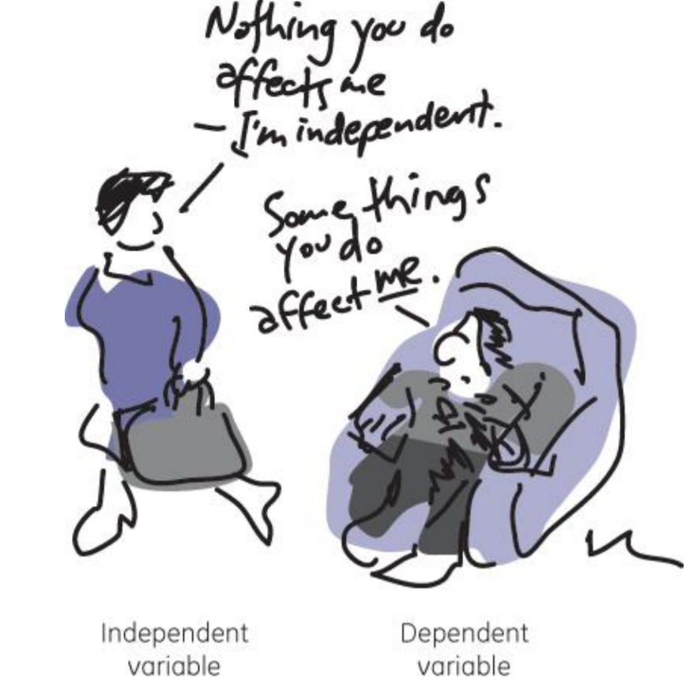{ width=60% }

Researchers generally have a belief about how two variables are related to one another, 
which is what establishes one variable as a *dependent* variable and the other as an *independent* variable.  

::: my-def 
#### Bivariate Analysis

A statistical method designed to detect and describe the relationship between the independent and dependent variable.
:::
  
The statement establishing how the researcher thinks the variables are associated with one another is the **hypothesis statement**.  


[**Example:**]{style="color: #F39C12;"}  

If you are testing whether eating chocolate for breakfast affects a person’s happiness during the day, which is the independent variable and which is the dependent?  
  
To figure it out, try writing the question in the form of an "If/Then" statement.  
  
-   If (_I do this_), then (_this will happen_).  
-   If (_Independent Variable_), then (_Dependent Variable_).  
  
> **IF** a person (_eats chocolate for breakfast_), **THEN** they will be (*happy*) during the day.
  
The independent variable is 'eating chocolate' (or not) and the dependent variable is 'happiness.' Happiness *depends* on whether a person ate chocolate for breakfast.  
  
<br>

Identifying the independent and dependent variable is not always straightforward in a hypothesis statement. For example, the variables age and health are related. 
Many variations of hypotheses could be written that contain both variables:  
  
* $H_{1}$: As age increases, health declines.
* $H_{1}$: As individuals age, their health declines.
* $H_{1}$: Health gets worse with age.
* $H_{1}$: Age is negatively associated with health.
* $H_{1}$: Older Americans are in poorer health than younger Americans.
  
<br>
  
How do you identify which is the independent variable and which is the dependent variable? 
Try stating the relationship in both directions:
  
>   "Age affects health." or "Health affects age."
    
It doesn't make sense to say that health affects age. People age, no matter their health status. 
But, how old you are likely *influences* your health. 
So, health might be *dependent* on age, making health our dependent variable and age the independent variable.  

***

`r fa("otter", fill = "#F39C12")`<practice> PRACTICE:</practice>

*If I drink Mountain Dew before bed, then I will not sleep very much.*
```{r P01, echo=FALSE}
question("What is the dependent variable in this hypothesis?",
         answer("drinking Mountain Dew", message = "The scientist thinks Mountain Dew will _influence_ sleep."),
         answer("the amount of sleep", correct = TRUE, message = "The researcher thinks sleep _depends_ on drinking Mountain Dew before bed."),
         random_answer_order = TRUE,
         allow_retry = TRUE
)
```


*If I leave all the lights on all day, then my electric bill will be expensive.*
```{r P02, echo=FALSE}
question("What is the independent variable in this hypothesis?",
         answer("electric bill", message = "The researcher thinks the duration that the lights are on will _increase_ the amount of the electric bill."),
         answer("the duration of energy consumption", correct = TRUE, message = "The researcher thinks the cost of the electric bill _depends_ on amount of electricity used."),
         random_answer_order = TRUE,
         allow_retry = TRUE
)
```


*Spending time on Instagram increases risk of depression.*
```{r P03, echo=FALSE}
question("What is the dependent variable in this hypothesis?",
         answer("time on Instagram", message = "The researcher thinks the amount of time on Instagram _influences_ the risk of depression."),
         answer("risk of depression", correct = TRUE, message = "The researcher thinks the risk of depression _depends_ on the amount of time on Instagram."),
         random_answer_order = TRUE,
         allow_retry = TRUE
)
```

<br>

###

### Cross-tabs

One method for displaying the relationship between two variables, also known as a bivariate analysis, is a cross-tabulation (a.k.a. a cross-tab) table.  
  
It draws upon our knowledge of independent and dependent variables to describe how two variables are related to one another.  
  
::: my-def 
#### Cross-tabulation
Two variables organized in a table.
:::
  
A cross-tabulation table shows the distribution of one variable *across* the categories of another variable.  
  
* The categories of the **independent** variable are usually shown in the columns. 
* The categories of the **dependent** variable are usually shown in the rows. 
* The **cell** values show the *intersection* of a row and column. 
* The tables also typically include **marginals**, the row and column totals. 
  
  
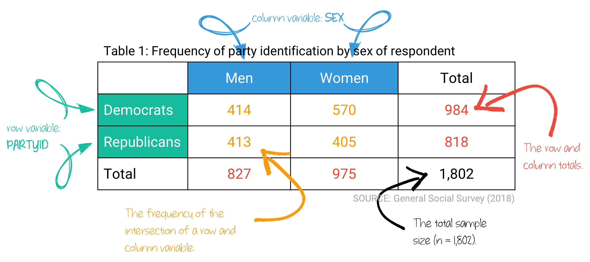{ width=90% }

***

`r fa("otter", fill = "#F39C12")`<practice> PRACTICE:</practice>

```{r P04, echo=FALSE}
  question("What is the dependent variable in this table?",
    answer("party identification",  correct = TRUE, message = "Exactly right!"),
    answer("gender",       message = "Hmmm..... can one's gender _depend_ on party identity?"),
    answer("Democrats",    message = "This is a category of the dependent variable."),
    answer("men",          message = "This is a category of the independent variable."),
           random_answer_order = TRUE,
           allow_retry = TRUE)
```
  
  
```{r P05, echo=FALSE}
  question("Which of these is a set of marginals in the table?",
    answer("827; 975",  correct = TRUE),
    answer("414; 570"),
    answer("413; 405"),
           random_answer_order = TRUE,
           allow_retry = TRUE)
```
  
  
  
#### Making comparisons  
  
As you (hopefully) remember, we must convert frequencies into percentages in order to compare relationships. To calculate the percentages *within* each category of the **independent variable** 
typically means calculating the percentages *down* the table.  
  
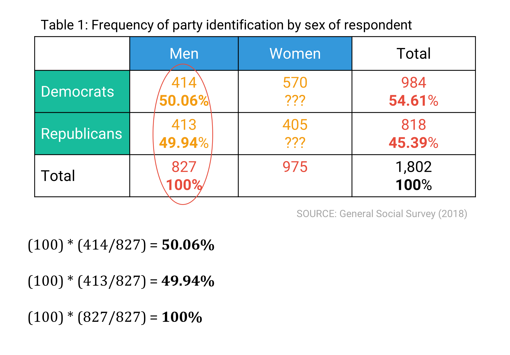{ width=70% }
  
  
***

`r fa("otter", fill = "#F39C12")`<practice> PRACTICE:</practice>

  
```{r P06, echo=FALSE}
  question("What percentage of women are Democrats?",
    answer("58.46%",  correct = TRUE, message = "Fantastic!"),
    answer("57.93%",  message = "This is the percentage of Democrats who are women."),
    answer("31.63%",  message = "This is the percentage of Democratic women in the total sample."),
    answer("54.11%",  message = "This is percentage of women (Republican and Democrat) in the total sample."),
           random_answer_order = TRUE,
           allow_retry = TRUE)
```
  
  
```{r P07, echo=FALSE}
  question("What percentage of women are Republicans?",
    answer("41.54%",  correct = TRUE, message = "You're a statistician!"),
    answer("49.51%",  message = "This is the percentage of Republicans who are women."),
    answer("22.48%",  message = "This is the percentage of Republican women in the total sample."),
    answer("54.11%",  message = "This is percentage of women (Republican and Democratic) in the total sample."),
           random_answer_order = TRUE,
           allow_retry = TRUE)
```
  
  
### Interpretation
  
Once we have the percentages *within* each category of the independent variable, 
we interpret the table by comparing *across* categories of the independent variable. 
  
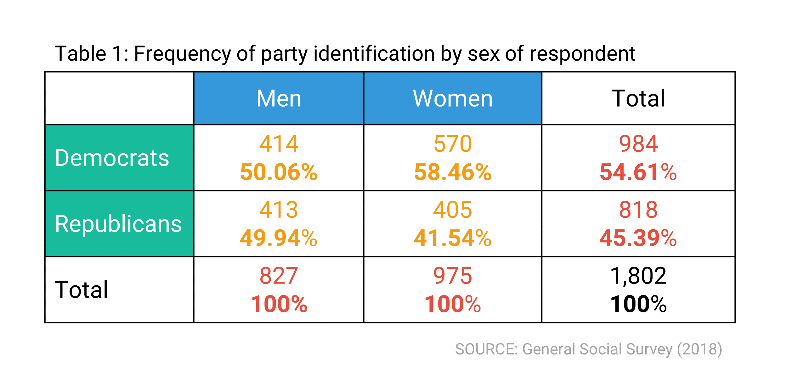{ width=70% }
  
<br>    


There are **three** key properties of interpreting a bivariate relationship: 
 
<br>
  
#### 1. Existence: Does there appear to be a relationship (correlation) at all?
  
If the percentages across the independent variable categories are not equal (or not close to equal), 
we suspect a relationship between the two variables. 
We will formally test for such a relationship, with a chi-square test, later on. 
  
In our example, we could say:

> 58.46% of women identified as Democrats, compared with 50.06% of men. 
> Therefore, it appears that women are more likely than men to identify as Democrats. 
  
Here, we've established the existence of a relationship between the two variables. 
The percentage of women and men who are Democrats are not equal to one another. 
If the same percentage of women and men identified as Democrats, 
there would be no relationship between political party identity and gender.
We found a difference. 
Therefore, we move on to the next property.  
  
<br>  
  
#### 2. Strength: How strong is the relationship?  
  
If we suspect there is a relationship, we next evaluate how strong the relationship might be. 
A quick method is to examine the percentage *difference* across the categories of the independent variable. 
The larger the percentage difference across the categories, the stronger the association.  
  
We rarely see either a 0% or a 100% difference. 
When knowing the category of the independent variable helps us guess the category of the dependent variable, the relationship is strong. In this example, knowing if someone is a woman or a man helps us guess their political party identification.    
  
In our example, we could say:
  
> There is a 8.4% difference in the percentage of men and women who identify as Democrats. 
  
We would say this is a moderately strong relationship. 
Knowing if someone is a man or a women makes us better able to guess whether they identify as a Democrat or not. 
If the percentage difference between the two was small, 
we wouldn't be better off guessing someone's political identity by knowing their gender, 
and the relationship would be considered weak.  
  
<br>  
  
#### 3. Direction: What is the direction of the relationship?  
  
For ordinal or interval-ratio level variables, we also describe the direction of the relationship between the two variables. 

::: my-def 
#### Positive Relationship

The variables vary in the same direction.
:::
  
[**Example:**]{style="color: #F39C12;"}  

::: {style="color: #3498DB; font-family: 'Shadows Into Light'"}
As the number of weekly exercises someone does increases, muscle strength increases.   
:::

<br>
  
::: my-def 
#### Negative Relationship

The variables vary in opposite directions.
::: 
  
[**Example:**]{style="color: #F39C12;"}  

::: {style="color: #3498DB; font-family: 'Shadows Into Light'"}
As the number of weekly exercises someone does increases, depressive symptoms decrease.   
:::

<br>

::: my-tip
#### Heads up!   

Findings should be phrased to make clear what is positively/negatively associated.
:::

[**Example:**]{style="color: #F39C12;"}  

It is better to state:  

::: {style="color: #3498DB; font-family: 'Shadows Into Light'"}
“Being a Democrat is positively associated with supporting healthcare reform” 
:::

than the less clear:  

::: {style="color: #3498DB; font-family: 'Shadows Into Light'"}
“Political party is positively associated with opinion of healthcare reform.”  
:::
  
  
### Correlation and causation

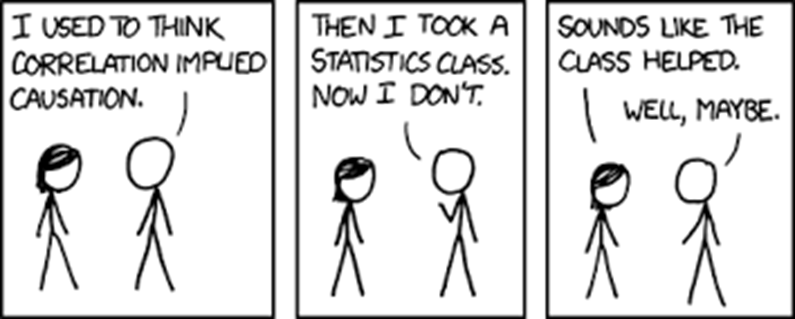{width="80%"} <br />

Measuring data can be tricky.
So can interpreting data.
Scientists have a common phrase used to bemoan the difficulty of interpreting the relationship between variables:

**Correlation is not causation.**

To understand what this cautionary phrase means, we have to differentiate between *correlation* and *causation*.

::: my-def 
#### Correlation

Two actions or occurrences that tend to happen together, but one does not necessarily cause the other to occur.
:::

We usually say these things are associated.

[**Example:**]{style="color: #F39C12;"}

::: {style="color: #3498DB; font-family: 'Shadows Into Light'"}
The more fire trucks there are at a fire, the greater the damage.
:::

The presence of many fire trucks did not cause the fire damage.
But, a lot of fire trucks at a fire usually signals there was a lot of damage.

<br>

::: my-def 
#### Causation

One event is the result of the occurrence of the other event.
:::

Three conditions of causation:

1.  The cause must precede the effect in time  
2.  There has to be an empirical relationship between cause and effect  
3.  This relationship cannot be explained by other factors  

<br>

[**Example:**]{style="color: #F39C12;"}

::: {style="color: #3498DB; font-family: 'Shadows Into Light'"}
Those who study longer get higher grades.
:::

1.   Studying happened before the grade.
2.   Studying and grades are related.
3.   There is not another reason that would account for the association between the two variables.  
  
  
There can be other factors involved, but nothing that would explain away the relationship between these two variables.


<br>

::: my-tip
#### Heads up!  
Social sciences usually demonstrate a correlation, not causation, between two variables (although that is not always the case).
:::
  
  
### Statistical significance

::: my-def 
#### Statistical Independence

The absence of association between two cross-tabulated variables.

:::

A relationship between two variables (a *correlation*) is indicated by statistical **[de]{style="color: #F39C12;"}pendence**, and the absence of a relationship is indicated by statistical **[in]{style="color: #F39C12;"}dependence**.

When the percentage distribution of the dependent variable within categories of the independent variable are different enough that it is unlikely to have occurred by chance, we can say that there is an association between the two variables.
The likelihood of being in any given category of the dependent variable is **dependent** upon the category of the independent variable.

If the percentage distributions of the dependent variable within each category of the independent variable are (nearly) identical, we can say that there is no association between the two variables.
When the two variables are unrelated, the variables are statistically **independent**.

When we show with statistics that there is a relationship between two variables, we say that the findings are "**statistically significant**." But, what does that exactly mean?

<br>

#### Significance vs. importance

A common and easy misperception regarding statistical significance is that it does not reveal whether the difference is significantly meaningful. Statistical significance simply refers to the likelihood that there is an actual difference between two groups, rather than due to chance.

Research that results in statistical tests with a p-value greater than .05 often don't get published.
This arbitrary threshold often determines whether or not a study's findings are determined to be important, even though p-values are not actually measures of substantive importance.

Thus, researchers are incentivized to find a p-value less than .05 in order to publish their findings.
As you've seen so far, a number of factors influence the calculated test statistic, and ultimately the p-value obtained.
The size of the sample, the level of measurement, the comparison group, the introduction of a control variable, and so on, all matter in determining a p-value.

These purposeful data manipulations can result in many false positives, meaning a difference really doesn't exist and future researchers won't be able to replicate the findings.
These efforts to manipulate the data in a way that favors rejecting the null hypothesis is commonly referred to as **p-hacking**, an unethical attempt to exploit the data to find a result that does not really exist.

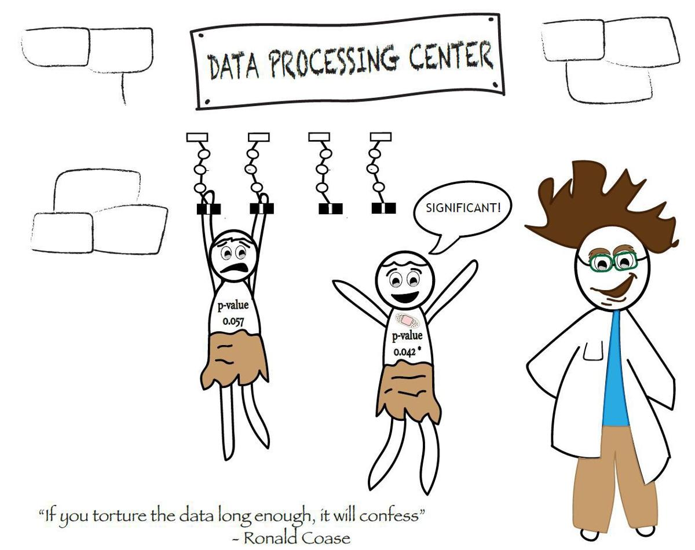{width="60%"}

Chi-square Test
--------------------------------------------------------------------------------

::: my-def 
#### Chi-square test

An inferential statistics technique designed to test for significant relationships between two categorical (nominal or ordinal) variables organized in a bivariate table.
:::

The chi-square (pronounced kai-square and written as χ2) test tells us whether the difference between the distribution of the dependent variable for each category of the independent variable is different enough that it could not have happened by chance.

We calculate a p-value for our chi-square statistic and compare it to an alpha.
We will follow the same steps as we have been in testing hypotheses:

1.  Check assumptions
2.  State the research and null hypotheses
3.  Select alpha and specify the test statistic
4.  Compute the test statistic
5.  Interpret the results

<br>

#### 1. Check assumptions

The chi-square test requires no assumptions about the shape of the population distribution from which the sample was drawn.

Like all inferential techniques, it does assume random sampling.

It can be applied to variables measured at a nominal and/or an ordinal level of measurement.

<br>

#### 2. State the research and null hypotheses

For chi-square tests, there is no need to express $H_{1}$ and $H_{0}$ with Greek letters; you can use full sentences.

When conducting a chi-square test, $H_{1}$ is **always a one-tailed test**.
So, you never need to double p-values, or distinguish one-tailed from two-tailed table columns.

The research hypothesis ($H_{1}$) proposes that the two variables are related in the population.

> Gender and fear of walking alone at night are statistically dependent.  

The null hypothesis ($H_{0}$) states that no association exists between the two cross-tabulated variables in the population, and therefore the variables are statistically independent.

> Gender and fear of walking alone at night are statistically independent.  

[**Example:**]{style="color: #F39C12;"}

Let's assume we surveyed a random sample of 2,105 adults and collected information about their gender and whether they were afraid to walk alone at night.
We then report our findings, the observed frequencies of fear of walking alone by gender.

::: my-def 
#### Observed frequencies $F_{o}$ 

The cell frequencies actually observed in a bivariate table.
:::
  
  
The easiest way to present our findings is to create a cross-tab table, like the one below. This table represents our **observed frequencies**. The percentages in the table reflect the data that was actually collected, our empirical data.

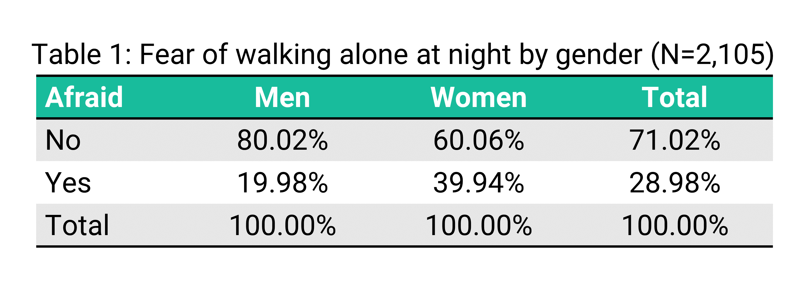{width="70%"}

To test our hypothesis, we need to compare our actual data to theoretical data that shows what we would expect to find if there was NO relationship between gender and fear of walking alone at night (the null hypothesis).

::: my-def 
#### Expected frequencies $F_{e}$ 

The cell frequencies that would be expected in a bivariate table if the two variables were statistically independent.
:::

We can create this theoretical "expected" frequency table.
If $H_{0}$ were true, the column percentages within each category of the independent variable would match the column marginals.
This table represents our **expected frequencies**, if no relationship between gender and fear of walking alone existed.

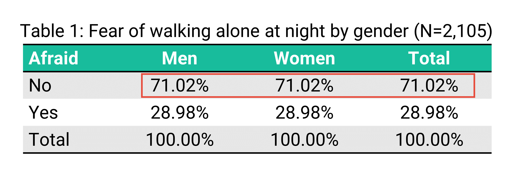{width="70%"}
  
###
  
### [3. Select alpha ($\alpha$) and specify the test statistic]{style="color: #18BC9C;"}

We'll use the typical alpha of .05 and we will use a chi-square statistic.

The reason we use a chi-square test is that it is based on the difference between expected and observed frequencies.
This is the perfect test for comparing variables displayed in a bivariate table.

The minimum possible value of chi-square is zero (meaning, chi-square can never be negative), with no upper limit to its maximum value.

The sampling distribution of chi-square tells the probability of getting values of chi-square, assuming no relationship exists in the population.

The χ2 (chi-square) sampling distribution is not one distribution, but a family of distributions.

Each chi-square distribution is distinguished by degrees of freedom (df).
[Degrees of freedom](https://blog.minitab.com/blog/statistics-and-quality-data-analysis/what-are-degrees-of-freedom-in-statistics) are, in essence, an estimate of the number of independent pieces of information that went into calculating a statistic.

The shape of each chi-square distribution is determined by the number of degrees of freedom.
As the number of degrees of freedom increases, the chi-square distribution becomes more symmetrical.
The distributions are all positively skewed, but they begin to resemble the normal curve when degrees of freedom are greater than 30.

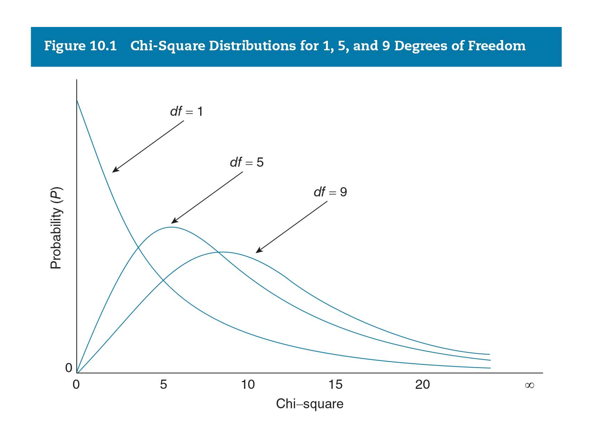{width="80%"}


### [4. Compute the test statistic]{style="color: #18BC9C;"}

The formula for calculating the chi-square test statistic is as follows:

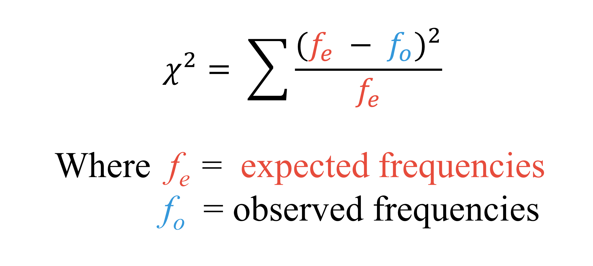{width="50%"}

The symbol Σ (sigma) means you should sum everything.
The $F_{o}$ denotes the actual (observed) frequencies reported in the table.
The $F_{e}$ denotes the expected frequencies if there was no relationship between the two variables.
This takes some math to calculate.

In our example, we have four values which represent $F_{o}$, for each of the four cells in our table (925, 570, 231, & 379).

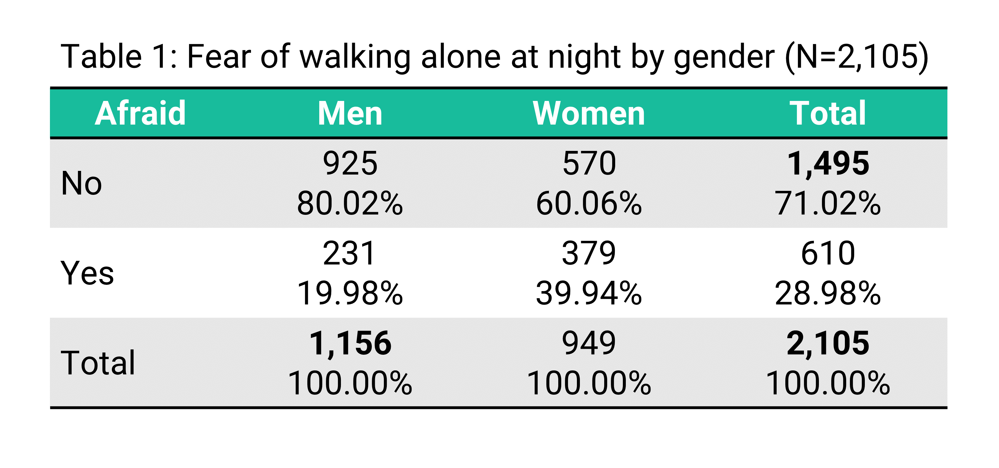{width="70%"}

Now, we'll need to find four values that represent $F_{e}$, theoretical cell values if there was no relationship between gender and fear of walking alone at night.

To obtain the expected frequencies for each cell in any cross-tab, we multiply the row and column totals for the cell and divide the product by the total number of cases in the table.

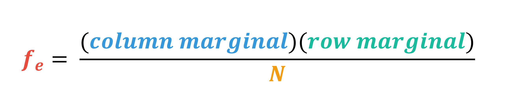{width="60%"}

For example, to find the $F_{e}$ value for the number of men who are not afraid to walk alone at night, if there was no relationship between these variables, we would multiple the column marginal for men (1,156) by the row marginal for not being afraid (1,495) and divide it by the total number of cases (2,105).

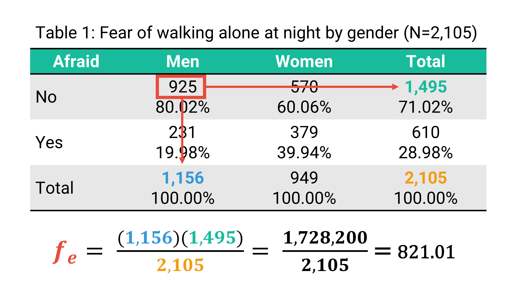{width="70%"}

Our calculation of 821.01 means that if there was no relationship between gender and fear of walking alone at night, we would expect 821.01 men in our sample to report they are not afraid to walk alone at night.

We also have to calculate the frequencies for the remaining three cells.
Give it a try.  

***

`r fa("otter", fill = "#F39C12")`<practice> PRACTICE:</practice>

```{r P08, echo=FALSE}
question("What is the $F_{e}$ for women who are not afraid to walk alone at night?",
    answer("673.99", correct = TRUE, message = "(949 * 1,495)/2,105"),
    answer("334.99", message = "Hint: (949 * 1,495)/2,105"),
    answer("275.01", message = "Hint: (949 * 1,495)/2,105"),
    answer("821.01", message = "Hint: (949 * 1,495)/2,105"),
         random_answer_order = TRUE,
         allow_retry = TRUE
)
```

```{r P09, echo=FALSE}
question("What is the $F_{e}$ for men who are afraid to walk alone at night?",
    answer("334.99", correct = TRUE, message = "(1,156 * 610)/2,105"),
    answer("673.99", message = "Hint: (1,156 * 610)/2,105"),
    answer("275.01", message = "Hint: (1,156 * 610)/2,105"),
    answer("821.01", message = "Hint: (1,156 * 610)/2,105"),
         random_answer_order = TRUE,
         allow_retry = TRUE
)
```

```{r P10, echo=FALSE}
question("What is the $F_{e}$ for women who are afraid to walk alone at night?",
    answer("275.01", correct = TRUE, message = "(949 * 610)/2,105"),
    answer("673.99", message = "Hint: (949 * 610)/2,105"),
    answer("334.99", message = "Hint: (949 * 610)/2,105"),
    answer("821.01", message = "Hint: (949 * 610)/2,105"),
         random_answer_order = TRUE,
         allow_retry = TRUE
)
```
  
  
### Calculating the chi-square

We now combine our tables showing the observed and expected frequencies.

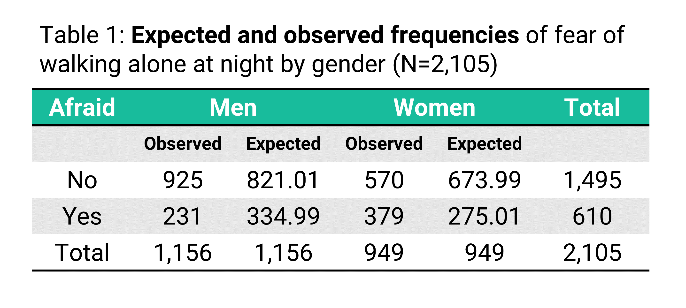{width="60%"}

Now we have enough information to return to our formula to calculate the chi-square statistic.
We'll need to calculate four values (for each of our four cells) and then sum them.

Let's start with the men who are not afraid.
We'll take our expected value (821.01) and subtract our observed value (925) from it.
Then, we'll square it.
(Don't forget this step!) Because we square the difference, chi-square statistics are always **positive**.

Then, divide it by our expected value for unafraid men.

$$
\frac{(821.01 - 925)^2}{821.01} = 13.17
$$

Then, we will do the same thing for the remaining three cells.

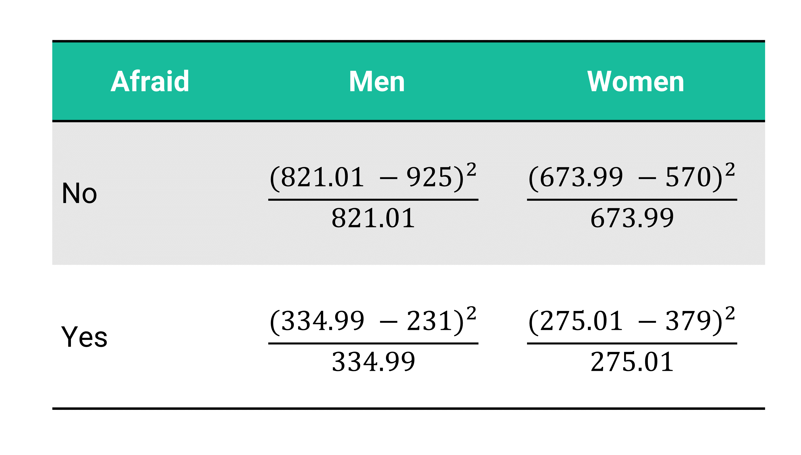{width="60%"}

Let's take this step by step for men who are afraid:

$$
\frac{(334.99 - 231)^2}{334.99} = 32.28
$$


The table below shows you the results for each step of the four calculations.

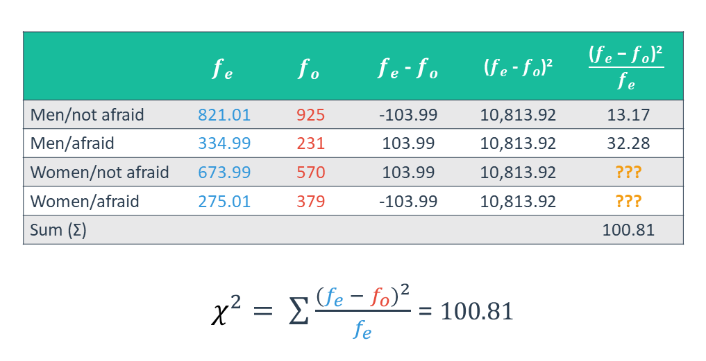{width="80%"}


::: my-tip
#### Heads up!

It does not matter whether you put “($F_{e}$ – $F_{o}$)” or “($F_{o}$ – $F_{e}$)” in the numerator. Once you do the squaring, they are identical.
:::


Can you fill in the remaining two cell values?

***

`r fa("otter", fill = "#F39C12")`<practice> PRACTICE:</practice>

```{r P11, echo=FALSE}
question("What is the empty cell value for women who are not afraid?",
    answer("16.04", correct = TRUE),
    answer("39.32", message = "Hint: 10,813.92 / 673.99"),
    answer("13.17", message = "Hint: 10,813.92 / 673.99"),
    answer("32.28", message = "Hint: 10,813.92 / 673.99"),
         random_answer_order = TRUE,
         allow_retry = TRUE
)
```

```{r P12, echo=FALSE}
question("What is the empty cell value for women who are afraid?",
    answer("39.32", correct = TRUE),
    answer("16.04", message = "Hint: 10,813.92 / 275.01"),
    answer("13.17", message = "Hint: 10,813.92 / 275.01"),
    answer("32.28", message = "Hint: 10,813.92 / 275.01"),
         random_answer_order = TRUE,
         allow_retry = TRUE
)
```

Nice!
Now we add the four values together to get a chi-square result of 100.81!

### [5. Interpret the results]{style="color: #18BC9C;"}

In order to interpret our results, we must convert our chi-square statistic into a p-value.

Because the sampling distribution of chi-square is a *family* of distributions, rather than just one distribution, we have to know the degrees of freedom to identify our p-value.

The formula for calculating degrees of freedom (df) is fairly simple:

```         
df = (r – 1)(c – 1)
r = the number of rows
c = the number of columns
```

If we had a table with 3 rows and 2 columns, our degrees of freedom would be 2:

        
$$
(3-1)(2-1) = 2 df
$$

Let's look again at our table.
We have two rows (No and Yes) and two columns (Men and Women).
Notice that we don't count the row and column marginals.

{width="60%"}

***

`r fa("otter", fill = "#F39C12")`<practice> PRACTICE:</practice>

```{r P13, echo=FALSE}
question("How many degrees of freedom do we have?",
    answer("1", correct = TRUE, message = "(2-1)(2-1) = 1"),
    answer("2", message = "Hint: df = (r – 1)(c – 1) = (2-1)(2-1) = 1"),
    answer("3", message = "Hint: df = (r – 1)(c – 1) = (2-1)(2-1) = 1"),
    answer("4", message = "Hint: df = (r – 1)(c – 1) = (2-1)(2-1) = 1"),
         allow_retry = TRUE
)
```
  
  
  
What is the probability of getting a chi-square of 100.81, assuming no relationship exists in the population between gender and fear of walking alone at night?

We simply look up the answer in a table or use an [online table or calculator](https://www.mathsisfun.com/data/chi-square-calculator.html).

Or, we could ask R to tell us! Here's the formula:  

> `pchisq(chi_square_value, df, lower.tail = FALSE)`

We're interested only in the upper tail of the chi-square distribution —i.e., the probability of getting a value greater than or equal to your test statistic, so we set the lower.tail to false.  

1. Use the `pchisq()` function with the option `lower.tail = FALSE`.
2. Put in our chi-square value of `100.81` and df of `1`.  
3. When you are satisfied with your answer, click "Submit Answer."  


```{r chi, exercise=TRUE, error=TRUE}

# add your code here

```
  
```{r chi-solution}
pchisq(100.81, 1, lower.tail = FALSE)
```

```{r chi-hint-1}
pchisq()
```

```{r chi-hint-2}
pchisq(100.81, __, lower.tail = _____)
```

```{r chi-hint-3}
pchisq(100.81, 1, lower.tail = _____)
```


```{r chi-check}
grade_code()
```


The calculator (or table if you used that) shows that the p value is 0.
In other words, the p-value is so small it is less than .001.

The probability that there is no relationship in the population between gender and fear of walking alone at night is less than 0.001.

Our p-value (\<0.001) is less than our alpha (0.05).
Therefore, we can reject the null hypothesis.

To interpret our findings in plain language, we could say:

-   “We reject the null hypothesis that gender and fear of walking alone at night are independent.”

-   “There is a statistically significant association between gender and fear of walking alone at night, with women substantially more fearful than men.”

-   “Fear of walking alone at night is statistically significantly less for men than women in the population.”

-   “Women's fear of walking alone at night is statistically significantly greater than men's fear of walking alone at night.”


#### Limitations

There are a few limitations of the chi-square test that you should know about.

The chi-square test does not give us information about the strength of the relationship or its substantive importance in the population.

The chi-square test is sensitive to sample size.
The size of the calculated chi-square is directly proportional to the size of the sample, independent of the strength of the relationship between the variables.

#### Extra example

Need another example?
Watch this [video](https://youtu.be/VskmMgXmkMQ) for another demonstration [5 minutes].


Pearson’s Correlation Coefficient (R)
------------------------------------------------------------------------------------------

::: my-def 
#### Pearson’s Correlation Coefficient

A measure of association between two interval-ratio level variables.
:::

One way we can test two interval-ratio variables is to calculate a **Pearson’s Correlation Coefficient**. It does not require specifying an independent and dependent variable.  
  
<br>
  
::: my-tip
#### Heads up!  

Pearson’s Correlation Coefficient is denoted with the capital letter **R**, not to be confused with the statistical software `r fa("r-project", fill = "#3498DB")`.
:::

<br>

#### 1. Check assumptions

-    Both variables should be measured on an interval or ratio scale—not ordinal or nominal.  
-    The relationship between the two variables should be linear. A scatterplot of the two variables should show points *roughly* forming a straight line.  

There shouldn't be curves, peaks and turns in the data. For example, graphing COVID-19 test rates by the date wouldn't work because there are multiple peaks (waves) in the relationship.  

<br>

#### 2. State the research and null hypotheses 

The research and null hypothesis work just like in hypothesis testing.

[**Example:**]{style="color: #F39C12;"}

$H_{0}$ [There is no linear correlation between parental time spent with children and children's emotional well-being scores.]{style="color: #3498DB; font-family: 'Shadows Into Light'"}

$H_{1}$ [More time spent with children is associated with higher emotional well-being.]{style="color: #3498DB; font-family: 'Shadows Into Light'"} 

This research hypothesis would be a one-tailed test, because we are specifying a direction. In practice, we usually run a two-tailed test anyway because it's a more conservative threshold.  
  
<br>

#### 3. Select alpha ($\alpha$) and specify the test statistic

We need to identify our $\alpha$ (alpha) level. We can choose any level, but it's conventional to use the α level for the social sciences, which is .05. This means we are willing to accept a 5% chance of making the wrong conclusion. 

<br>

###

### [4. Compute the test statistic]{style="color: #18BC9C;"}

In this course, I will not ask you to calculate R by hand, but I do want you to see how it works. And, you will need to know when it applies and how to interpret it. 

<br>

$$
r = \frac{n(\sum xy) - (\sum x)(\sum y)}{\sqrt{[n \sum x^2 - (\sum x)^2][n \sum y^2 - (\sum y)^2]}}
$$


This looks much more complicated that it actually is, but it's easier to see with an example.  

[**Example:**]{style="color: #F39C12;"}

Let's use this fake data table to see how it works.  

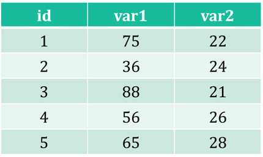{ width=50% }

<br>

The first thing we want to do is add three columns.

1.  `xy` = multiple the values of `x` by the values of `y`
2.  `$x^2$` = square `x`
3.  `$y^2$` = square `y`

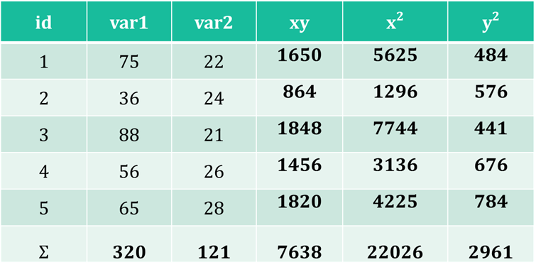{ width=70% }
  
  
Then, add a summary row for each of the columns.  

Now, we have all the data we need. From the table:

-    $Σx   = 320$
-    $Σy   = 121$
-    $Σxy = 7638$
-    $Σ𝑥^2 = 22026$
-    $Σ𝑦^2 = 2961$
-    $n     = 5$ 

Then, we just plug in the numbers into the formula:

$$
r = \frac{5(7638) - (320)(121)}{\sqrt{[5(22026) - (320)^2][5(2961) - (121)^2]}}
$$

<br>

**This results in $r = -.5$**

Unlike the chi-square test that we use for nominal and ordinal variables, R can be positive or negative. The values of R range from -1 to +1. The closer R is to zero, the weaker the relationship between two variables. 

The positive or negative sign denotes the direction between the two interval-ratio variables. If increases in one variable corresponds with increases in the other variable, the sign for R will be positive (**positive slope**). If increases in one variable corresponds with decreases in the other variable, the sign for R will be negative (**negative slope**).  

**r ranges from -1 to +1**  

-     -1 	= 	perfect negative correlation
-     0 	= 	no relationship
-     1 	= 	perfect positive correlation

<br>

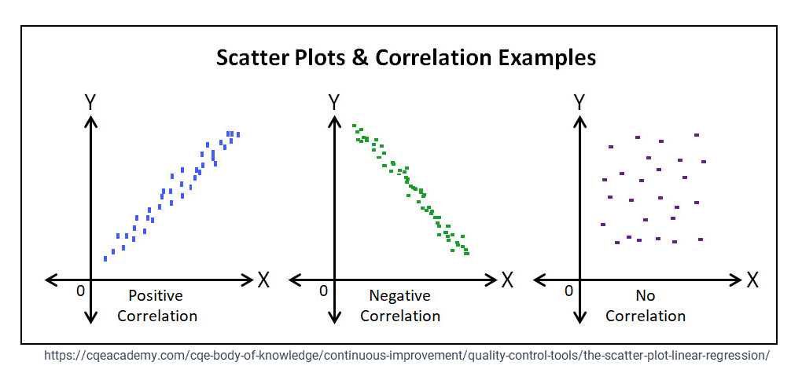{ width=70% }
  
<br>
  
We can approximate the relationship between two interval-ratio variables by drawing a straight line through the center of the observations on the scatterplot. 
The relationship between two variables is usually imperfect, so we must fit the best available line to the data we have.   
  
  
The closer R is to -1 or +1 indicates how closely an observation line fits the data of the scatterplot. 
When the line doesn't fit the data well, the R value will be closer to zero. 
Unlike our subjective assessment of the strength of relationship between two categorical variables, 
R has established cut-off points describing the strength of the relationship between two interval-ratio variables. 
  
<br>
  
**Strength of relationship**

      Strong:     Over 0.6
      Moderate:   0.3 to 0.5
      Weak:       0.1 to 0.2
      Very weak:  Below 0.1
  
   
<br>
    
When reporting R, it is best to describe both the direction and the strength of the relationship. When R is close to -1, we could say there is a strong negative relationship between the two variables. 
If R is close to 1, we could say there is a strong positive relationship between the two variables. 
  
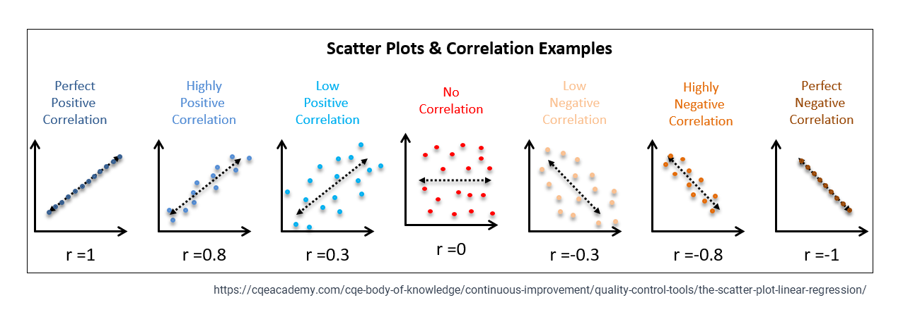{ width=90% }
  
***

`r fa("otter", fill = "#F39C12")`<practice> PRACTICE:</practice>

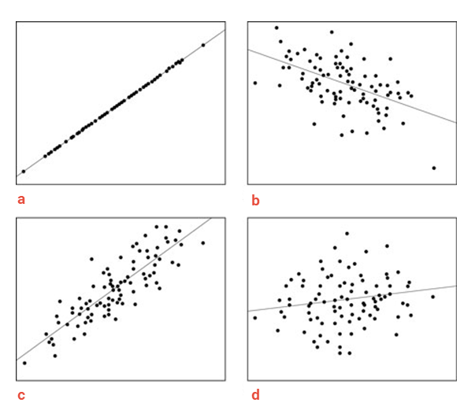{ width=50% }
  
  
```{r P14, echo=FALSE}
question("What correlation coefficient would you expect for scatterplot a?",
    answer("nearly +1", correct = TRUE),
    answer("–0.50"),
    answer("+0.85"),
    answer("+0.15"),
      random_answer_order = TRUE,
      allow_retry = TRUE
)
```
  
  
```{r P15, echo=FALSE}
question("What correlation coefficient would you expect for scatterplot b?",
    answer("nearly +1"),
    answer("–0.50", correct = TRUE),
    answer("+0.85"),
    answer("+0.15"),
      random_answer_order = TRUE,
      allow_retry = TRUE
)
```
  
  
  
### [5. Interpret the results]{style="color: #18BC9C;"}

R can also be converted into a test statistic, **Student's T-test**, and then we can compare it with a p-value, the probability that the null hypothesis is true. 

$$
t = \frac{r * \sqrt{n - 2}}{\sqrt{1 - r^2}}
$$
  
*$n$ is the sample size.  
$r$ is the sample correlation coefficient
  
Then, we'd compare our $t$ value to a p-value, just as we did in hypothesis testing. The p-value corresponding with R reports the probability that the correlation between x and y in the sample data occurred by chance. To figure out the p-value, we could either look the p-value up using a t-table or [use software](https://www.danielsoper.com/statcalc/calculator.aspx?id=44). 
We'll stick with software for this course.  


To interpret R, we report the R value and the p-value. We could report something like this:

*   There is no evidence of an association between v1 and v2 (r = ##, p = .###).  
*   The correlation between v1 and v2 was found to be statistically significant (r = ##, p < .05).  
*   There is a [weak/moderate/strong] [positive/negative] relationship between v1 and v2. Increases in v1 was correlated with [increases/decreases] in v2 (r = ##, p < .05).  
*   Results indicated an inverse relationship between v1 and v2 (r = ##, p < .05), suggesting that v2 decreases as v1 increases.  
  
<br>
  
[**Example:**]{style="color: #F39C12;"}
 
To calculate the Pearson correlation between 2 interval-ratio variables, we'll use the command `cor()`. 
The syntax will look like this:  
  
>    `cor(data$v1, data$v2)`  
    
Because Pearson's R doesn't require specifying an independent and dependent variable, the order of the variables does not matter.  
  
See how it works by trying it out now.  
  
1. Replace the blank lines in the code below, specifying `weight` as the first variable and `height` as the second variable. 
2. **Run the code** to see your results. 
3. When you are satisfied with your answer, click "**Submit Answer**."  
  
  
```{r cor01, exercise=TRUE, error= TRUE, warning=FALSE}
cor(gss22$______, gss22$______)
```
  
```{r cor01-solution}
cor(gss22$weight, gss22$height)
```
  
```{r cor01-hint-1, error=TRUE}
cor(gss22$weight, gss22$______)
```
  
```{r cor01-check}
grade_code("Your first correlation!")
```
  
***

`r fa("otter", fill = "#F39C12")`<practice> PRACTICE:</practice>

```{r P16, echo=FALSE}
question("Given this R value, the association between height and weight could be best described as a:",
    answer("moderately positive relationship", correct = TRUE),
    answer("moderately negative relationship"),
    answer("weakly positive relationship"),
    answer("strongly positive relationship"),
      random_answer_order = TRUE,
      allow_retry = TRUE
)
```


Learning Check #06 {data-progressive=TRUE}
------------------------------------------------------------------------------------------

Please answer the following questions to verify you understand the topics in this tutorial. 

```{r Q01, echo=FALSE}
  question("Q01. If two variables are unrelated in the population, this is referred to as",
    answer("statistical independence",  correct = TRUE),
    answer("statistical dependence"),
    answer("statistical significance"),
    answer("statistical inference"),
    random_answer_order    = TRUE
  )
```

```{r Q02, echo=FALSE}
  question("Q02. The particular shape of a chi-square distribution depends on",
    answer("the number of degrees of freedom",  correct = TRUE),
    answer("the number of variables being analyzed"),
    answer("an assumption that the population is normally distributed"),
    answer("your confidence level (alpha)"),
    random_answer_order    = TRUE
  )
```

```{r Q03, echo=FALSE}
  question("Q03. Chi-square is a useful test for determining _____ significance but not for determining _____ significance.",
    answer("statistical; substantive",  correct = TRUE),
    answer("substantive; statistical"),
    answer("observed; expected"),
    answer("expected; observed"),
    random_answer_order    = TRUE
  )
```

```{r Q04, echo=FALSE}
  question("Q04. Chi-square values are always _____.",
    answer("positive",  correct = TRUE),
    answer("zero"),
    answer("negative"),
    answer("positive or negative"),
    random_answer_order    = TRUE
  )
```


The table below shows the relationship between political party identity (Republican/Democrat) and attitudes about the death penalty (favor/oppose).

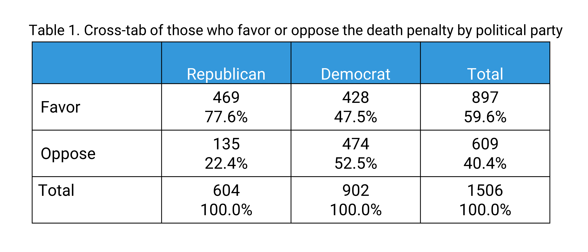{width="70%"}

```{r Q05, echo=FALSE}
  question("Q05. In the table above, ____________ is the dependent variable and ____________ is the independent variable.",
    answer("attitudes about the death penalty; political party",  correct = TRUE),
    answer("political party; attitudes about the death penalty"),
    answer("attitudes about the death penalty; Republicans"),
    answer("political party; attitudes"),
    random_answer_order    = TRUE
  )
```

Calculate the expected frequencies ($F_{e}$) for each cell, either by hand or by using the online [chi-square calculator](https://www.mathsisfun.com/data/chi-square-calculator.html).

```{r Q06, echo=FALSE}
  question("Q06. What is the expected frequency for Republicans who oppose the death penalty (if there was no relationship between the variables)?",
    answer("244.25",  correct = TRUE),
    answer("359.75"),
    answer("537.25"),
    answer("364.75"),
    random_answer_order    = TRUE
  )
```

```{r Q07, echo=FALSE}
  question("Q07. Assuming an $\\alpha$ level of .05, should the researcher reject the null hypothesis? Why or why not?",
    answer("Yes, because the p-value (.000) is less than the $\\alpha$ level of .05.", correct = TRUE),
    answer("Yes, because the p-value (.000) is greater than the $\\alpha$ level of .05."),
    answer("No, because the $\\alpha$ level of .05 is greater than the p-value.", message = "When the p-value is small, the null hypothesis will fall!"),
    random_answer_order    = TRUE
  )
```

```{r Q08, echo=FALSE}
  question("Q08. Which of these statements best summarizes the researcher’s conclusion?",
    answer("There is a statistically significant difference in the population between political party identity and support for the death penalty, with Republicans significantly more in favor of the death penalty than Democrats.", 
           correct = TRUE),
    answer("There is a statistically significant difference in the population between political party identity and support for the death penalty, with Democrats significantly more in favor of the death penalty than Republicans."),
    answer("There is no statistically significant difference in the population between Republicans and Democrats in favoring or opposing the death penalty."),
    answer("Our evidence shows the difference between the percentage of Republicans and Democrats who support the death penalty is substantial and important."),
    random_answer_order    = TRUE
  )
```

```{r Q09, echo=FALSE}
  question("Q09. The correlation (R) between women’s ideal age of marriage and men’s ideal age of marriage is 0.36. Thus, the association between these two variables could best be described as a:",
    answer("moderate positive relationship",  correct = TRUE),
    answer("moderate negative relationship"),
    answer("weak positive relationship"),
    answer("highly positive relationship"),
      random_answer_order    = TRUE
  )
```

```{r Q10, echo=FALSE}
question("Q10. A researcher finds a Pearson’s correlation coefficient of r = 0.62 between the number of hours parents spend with their children and the children's emotional well-being scores. This result suggests a?",
    answer("moderate positive relationship"),
    answer("moderate negative relationship"),
    answer("weak positive relationship"),
    answer("strongly positive relationship",  correct = TRUE),
      random_answer_order    = TRUE
  )
```
