```{r}
#| label: setup
#| message: false
#| include: false

# GLOBAL ENVIRONMENT PANE
## source("tutorials/SOC6302-03/custom-setup-styles.R")
## library(gssr)
## library(gssrdoc)
## data(gss_all)
## gss24 <- gss_get_yr(2024)

## Load packages, custom functions, and styles
source("custom-setup-styles.R")

## Load all gss
#gss_all <- readRDS("data/gss_all.rds")

# Get the data only for the 2022 survey respondents
gss22 <- readRDS("data/gss22.rds")

# Override default discrete color and fill scales
scale_colour_discrete <- function(...) scale_color_manual(values = my_palette)

## Options
tutorial_options(exercise.checker = gradethis::grade_learnr)
options(dplyr.summarise.inform=F)   # Avoid grouping warning
options(digits=4)                   # Round numbers
theme_set(theme_minimal())          # set ggplot theme
# st_options(freq.report.nas = FALSE) # remove extra columns in freq()
 # any reason need to see this?!?! CHECK FOR SP22
  
knitr::opts_chunk$set(echo = FALSE,
                      warning = FALSE, 
                      messages = FALSE)
```

<link href="https://fonts.googleapis.com/css2?family=Shadows+Into+Light&display=swap" rel="stylesheet">

```{=html}
<script>
  document.addEventListener("DOMContentLoaded", function () {
    document.querySelectorAll("a[href^='http']").forEach(function(link) {
      link.setAttribute("target", "_blank");
      link.setAttribute("rel", "noopener noreferrer");
    });
  });
</script>
```

## Description

{width="50%"}

`r fa("fas fa-lightbulb", fill = "#18BC9C")` [**LEARNING OBJECTIVES**]{style="color: #18BC9C;"}

1.  Further explore a bivariate relationship by introducing another variable.
2.  Develop best practices in viewing and creating a descriptive summary table.
3.  Develop best practices in viewing and creating data visualizations

<br>

`r fa("fas fa-book", fill = "#18BC9C")` [**READINGS**]{style="color: #18BC9C;"}

Readings are available on Quercus.

1. Cairo, Alberto. 2019. “Charts That Lie by Being Poorly Designed.” Pp. 53–80 in *How Charts Lie: Getting Smarter about Visual Information*. New York: W. W. Norton & Company.  
2. Gagnon, Francis. 2021. “500,000 Dots Is Too Many.” [https://chezvoila.com/blog/500k/](https://chezvoila.com/blog/500k/).

<br>

`r fa("fas fa-language", fill = "#18BC9C")` [**TERMS**]{style="color: #18BC9C;"}

-   DIRECT RELATIONSHIP
-   ELABORATION
-   CONTROL VARIABLE
-   SPURIOUS RELATIONSHIP
-   CONDITIONAL RELATIONSHIP
-   EXPLORATORY DATA ANALYSIS  
-   CONFIRMATION BIAS  
-   CHART LEGENDS  
-   AXIS TRUNCATION  
-   DUBIOUS DATA  
-   PRIMARY DATA SOURCE  
-   DUBIOUS SOURCES  
-   CHERRY-PICKING  
-   CHART JUNK  

Elaboration
--------------------------------------------------------------------------------

The goal of analyzing two variables simultaneously is to try and establish how they are related to one another.
These relationships can take many forms.

#### Direct relationship

When a relationship between two variables cannot be accounted for by other theoretically relevant variables, we refer to it as a **direct** relationship.

Once we have established a direct relationship between two variables, social scientists often want to establish the order of the relationship.
Did **A** lead to **B** or did **B** lead to **A**?

Direct causality (A → B):

::: {style="color: #3498DB; font-family: 'Shadows Into Light'"}
“Higher levels of education lead to better health.”
:::

Reverse causality (B → A):

::: {style="color: #3498DB; font-family: 'Shadows Into Light'"}
“Better health leads to higher levels of education.”
:::

In real life, the arrows often point in both directions.
The scientific debate is often about which causal direction is stronger.

<br>

Another point of debate, beyond the direction of the relationship between the two variables, is whether there is a true causal link between the two variables.
The relationship between **A** and **B** might be “explained away” by **C**, a third variable.

::: my-def
#### Elaboration

Further exploring a bivariate relationship by introducing another variable.
:::

Often we have a reason to suspect that a third variable will have some effect on the bivariate relationship between our independent and dependent variables.

This is better explained with an example.
The table below presents the number of driving accidents per year for men and women.
Compare the percentage of men who have had two or more accidents (62%) with the percentage of women who have had two or more accidents (41%).

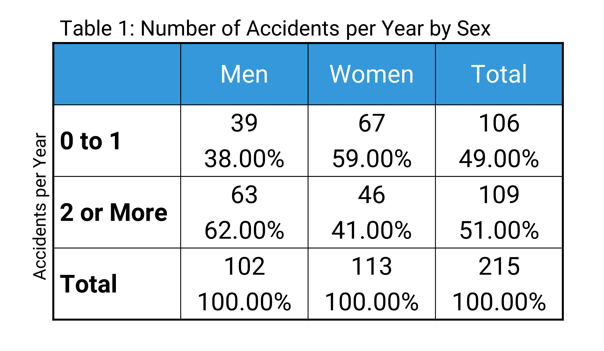{width="60%"}

It appears that men get in more driving accidents than women and the relationship between gender and number of accidents is fairly strong.
Knowing someone's gender would help use guess whether they have had 0-1 accidents or 2 or more accidents per year.

But, what if we suspect that men drive more often than women and that's the real explanation for why men have more accidents than women?
Men may have more accidents simply because they are more likely to be behind the wheel than women, not because men are worse drivers than women.
Let's look at the data again, but this time, we'll make two cross-tabs.
Each new table is called a **“partial table.”**

In the first cross-tab, we'll compare men's and women's frequency of accidents among people who say they "drive rarely."

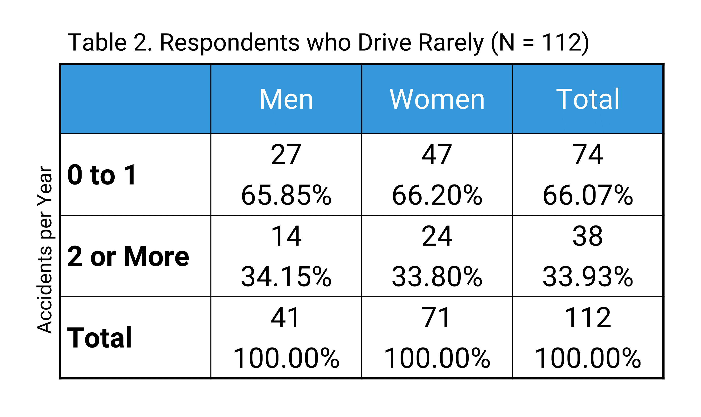{width="60%"}

Now, we can see that among people who drive rarely, the proportion of men and women who have two or more accidents is remarkably similar.
What do we see when we compare men's and women's accidents among those who drive frequently?

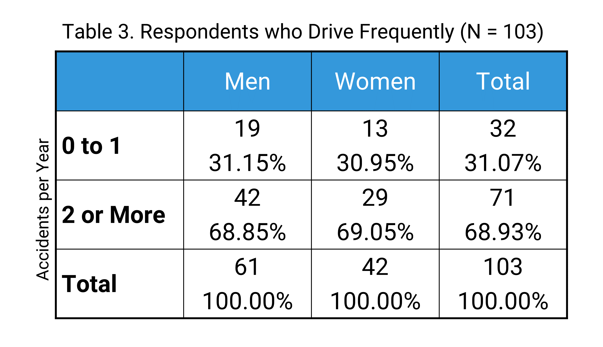{width="60%"}

Among frequent drivers, we see much higher rates of accidents for both men and women.
How would we interpret these three cross-tabs when we analyze them collectively?

Men have more automobile accidents, on average, than women.
However, after *controlling for* frequency of driving, the relationship between gender and accidents per year disappears.

It's not that gender was the *cause* of more frequent accidents, but that gender was associated with frequency of driving, which is associated with more frequent accidents.
Gender is related to frequency of driving, which directly influences the number of accidents per year.
Therefore, the relationship between gender and number of accidents is not a *direct* relationship.

::: my-def
#### Control variable

An additional variable that we take into account to understand the relationship between our main variables of interest.
:::

When we add a third variable that theoretically may influence the relationship between our independent and dependent variables, we refer to this new variable as a **control variable**.

In a cross-tabulation, we end up producing one cross-tab per category of the control variable.

#### Spurious relationship

When the control variable is added, if the relationship between the IV and DV disappears, the relationship is considered to be **spurious**.

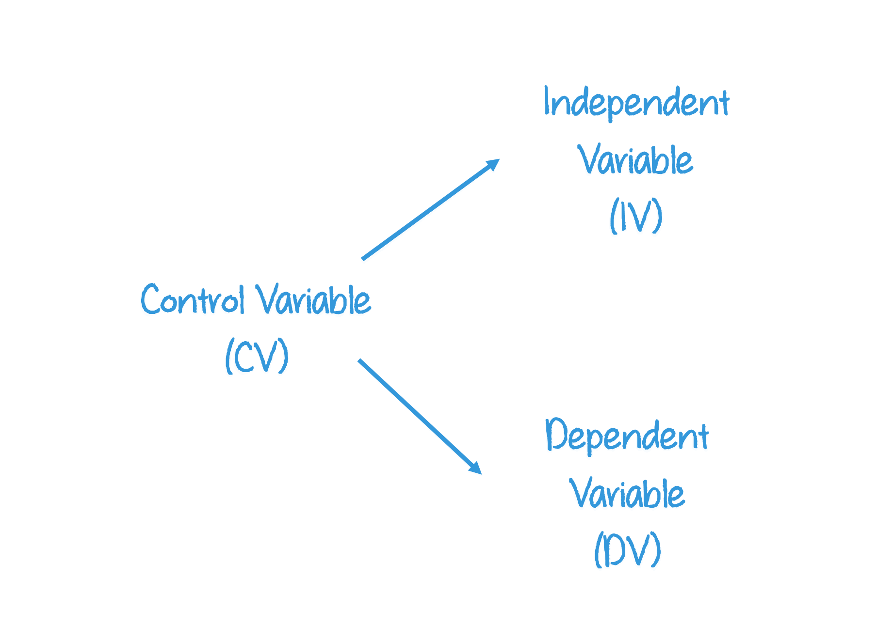{width="60%"}

[**Example:**]{style="color: #F39C12;"}

::: {style="color: #3498DB; font-family: 'Shadows Into Light'"}
When people eat more ice cream, more crimes are committed.
:::

In the summer, more people eat ice cream and more people commit crimes.
Eating ice cream doesn't lead to crime.
Both things happen to occur in the summer.

{width="60%"}

### Conditional relationship

When the control variable is added, if the relationship between the IV and DV is dependent upon the category of the control, the relationship is considered to be **conditional**.

The relationship between the IV and DV will change depending on the value of the control variable.
Put differently, **C** is a moderator when it changes the relationship between **A** and **B**.
To moderate a relationship means to affect its strength and/or direction.
If the control variable splits our analysis into two cross-tabs, one table may show no relationship and the other may show a strong, negative relationship.

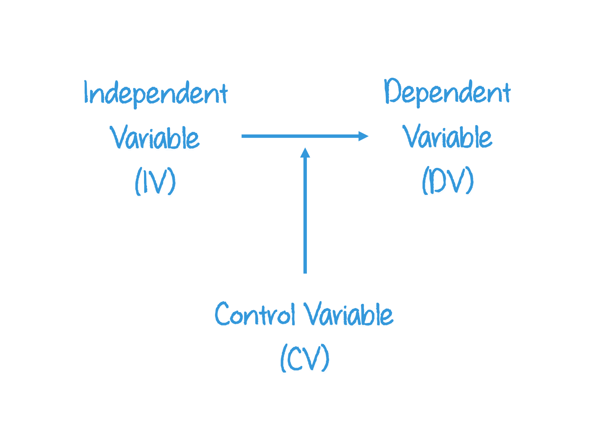{width="60%"}

[**Example:**]{style="color: #F39C12;"}

::: {style="color: #3498DB; font-family: 'Shadows Into Light'"}
Young people tend to be religious if their parents are also religious.
:::

Young people who are close to their parents tend to be similar to them in terms of religiosity.
For teens who are not close to their parents, there is no relationship.

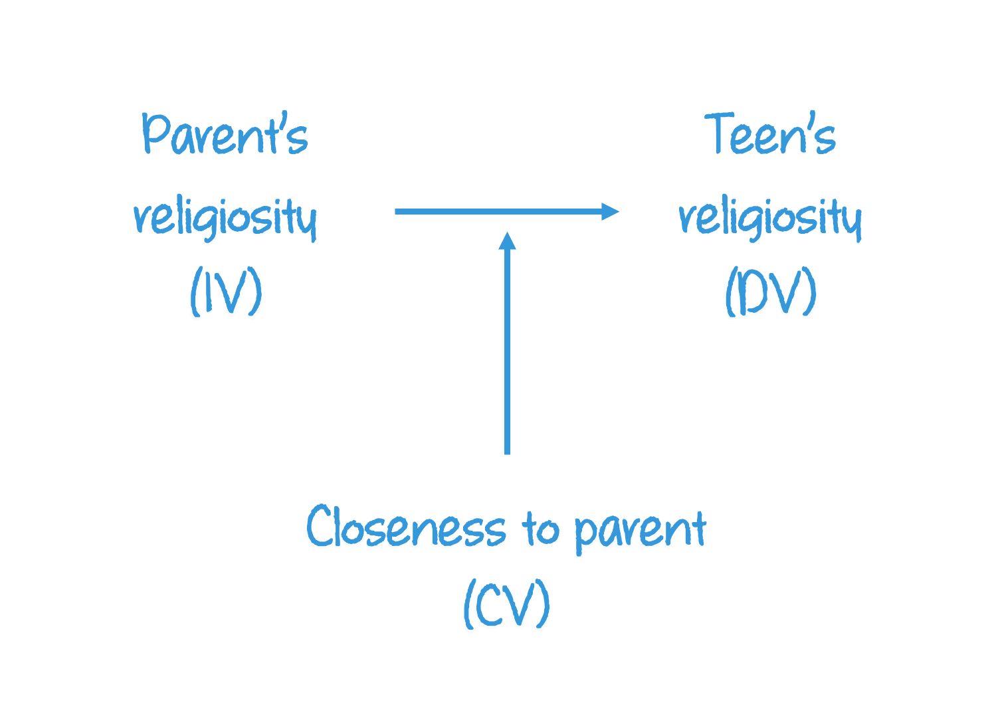{width="60%"}

------------------------------------------------------------------------

`r fa("otter", fill = "#F39C12")`<practice> PRACTICE:</practice>

*If divorce increases risk of depression more for men than for women, we’d say that “gender moderates the association between divorce and depression.”*

```{r P01, echo=FALSE}
question("Which model best describes the relationship between these variables?",
    answer("conditional", correct = TRUE, message = "The relationship between divorce and depression is conditional on one's gender."),
    answer("spurious"),
    answer("direct"),
         random_answer_order = TRUE,
         allow_retry = TRUE
)
```

*Research shows that the longer people wear masks during the day, the more likely they are to get infected with COVID-19. When the researchers control for whether people were considered to be an essential worker, the relationship disappears.*

```{r P02, echo=FALSE}
question("Which model best describes the relationship between these variables?",
    answer("conditional"),
    answer("spurious", correct = TRUE, message = "Whether or not someone is an essential worker is corrrelated both with the need to wear a mask for long hours and greater exposure to the population who might be infected."),
    answer("direct"),
         random_answer_order = TRUE,
         allow_retry = TRUE
)
```

To summarize:

-   Elaboration allows us to test for spuriousness.
-   Elaboration clarifies the causal sequence of bivariate relationships by introducing variables hypothesized to intervene between the IV and DV.
-   Elaboration specifies the different conditions under which the original bivariate relationship might hold.

Descriptive Tables
--------------------------------------------------------------------------------

Descriptive tables provide a foundational overview of variables—such as distributions, means, and correlations—that help researchers identify potential control variables and spot patterns that may indicate spurious or conditional relationships.

These insights guide the elaboration process by informing which variables to adjust for or explore further in multivariate analysis.

Descriptive tables, like a Table 01 in a peer reviewed journal article, set the stage for elaboration.
Here's how:

#### 1.  Identifying Control Variables

-   Table 01 shows distributions of potential control variables (e.g., age, income, education).\
-   Researchers use this to decide which variables to control for in later models.

[*Example:*]{style="color: #F39C12;"}\
If income varies widely and is correlated with both education and health outcomes, it might be a control variable.

#### 2.  Spotting Spurious Relationships

-   Descriptive stats can reveal correlations that look strong but may be misleading.

[*Example:*]{style="color: #F39C12;"}\
A high correlation between ice cream sales and drowning deaths might appear in Table 01—but elaboration (adding temperature as a control) shows it's spurious.

#### 3.  Testing Conditional Relationships

-   Table 01 helps identify subgroups (e.g., gender, region) for stratified analysis.\
-   Researchers might later test if the effect of education on income differs by gender—this is a conditional relationship.

#### 4.  Baseline Comparisons

-   Table 01 provides the baseline characteristics of the sample.\
-   This helps assess whether groups are comparable before elaboration techniques are applied.
  
<br>
  

### Table 01

It is common to show summary statistics of the sample in Table 01 of a research article.

These descriptive statistics, characteristics of the study population, are often stratified by a key categorical variable.

Let's look at an example. 
I suspected that mothers' partnership status (whether mothers were married, living with a partner, single, or divorced) 
influenced their time spent in daily activities such as childcare, housework, leisure, and sleep.  
    
  
The table below is from research I published analyzing data from the American Time Use Survey to investigate this hypothesis. 
The table shows the means and standard errors for the variables I analyzed, summarized for all mothers and grouped by mothers' partnership status. 

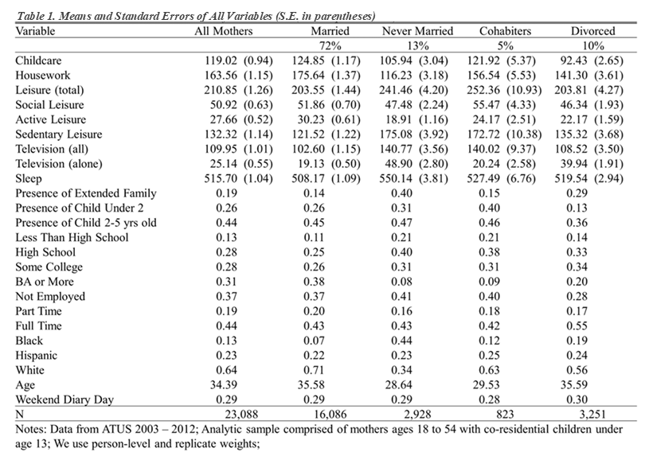{width="100%"}

<br>

`r fa("otter", fill = "#F39C12")`<practice> PRACTICE:</practice>

```{r P03, echo=FALSE}
question("What is the independent variable in this hypothesis?",
         answer("partnership status", correct = TRUE,  message = "I thought partnership status would influence daily activity."),
         answer("daily activities", message = "I thought daily activities depended on partnership status."),
         random_answer_order = TRUE,
         allow_retry = TRUE
)
```
  
```{r P04, echo=FALSE}
question("How many mothers are in the sample?",
         answer("23,088", correct = TRUE),
         answer("16,086", message = "This is the number of MARRIED mothers in the sample."),
         answer("2,928",  message = "This is the number of NEVER MARRIED mothers in the sample."),
         answer("823",    message = "This is the number of COHABITING mothers in the sample."),
         answer("3,251",  message = "This is the number of DIVORCED mothers in the sample."),
                  random_answer_order = TRUE,
         allow_retry = TRUE
)
```

<br>

Notice that some of the variables have a standard errors (S.E.) reported in parentheses. 
These variables are all interval-ratio variables. 
The variables without the standard deviation are either nominal or ordinal variables,
so a S.E. wouldn't make sense to report. 
  
The first row shows the number of minutes per day that mothers report providing childcare. For example, married mothers reported about 125 daily minutes of childcare and the standard error was 1 minute. This means there was little uncertainty around the estimate of the mean of 125 daily minutes.

<br>

`r fa("otter", fill = "#F39C12")`<practice> PRACTICE:</practice>

```{r P05, echo=FALSE}
question("How many minutes per day of housework do 'never married' mothers report?",
         answer("116", correct = TRUE),
         answer("106", message = "This is the number of childcare minutes."),
         answer("164", message = "This is the number of minutes for the full sample."),
         answer("175", message = "This is the number of housework minutes for married mothers."),
                  random_answer_order = TRUE,
         allow_retry = TRUE
)
```

```{r P06, echo=FALSE}
question("How many minutes per day did 'never married' mothers watch television ALONE?",
         answer("49", correct = TRUE),
         answer("141", message = "This is the number of minutes watching television alone or with someone."),
         answer("25", message = "This is the number of minutes for the full sample."),
         answer("19", message = "This is the number of television minutes for married mothers."),
                  random_answer_order = TRUE,
         allow_retry = TRUE
)
```
  
<br>
  
The table also shows numerous summary statistics describing mothers' demographic characteristics. 
The reason summary statistics describing the demographic characteristics of the sample are important is that they might influence the relationship between the independent and dependent variable.  
  
In this example, it might not be partnership status that influences mothers' time use, but maybe single mothers are more likely to work full-time than married mothers, thus having less time for housework. So, it is important to inform the reader of summary statistics for variables that might also be associated with the dependent variable, beyond the independent variable the researcher is interested in studying.  
  
These demographic variables all happen to be nominal or ordinal variables, but that is not always the case. 
The statistics represent the proportion of mothers within each category.  
  
For example, .19 of all mothers report the presence of an extended family member in their household. 
This means that 19% of all mothers reported that an adult family member lives in their household. We could also say that 81% of all mothers do not live with an extended family member because all proportions sum to 1.  
  
When a variable is ordinal or nominal (but not dichotomous), such as educational attainment, each of the categories are reported. 
The category proportions must sum to 1. For instance, .13 of all mothers have less than a high school diploma, .28 of all mothers have a high school degree, .28 have some college experience, and .31 of all mothers have a bachelor's (BA) degree or more. 
If you add up these numbers (.13 + .28 + .28 + .31), you get 1.  
  
Each category is **mutually exclusive**, meaning that if a mother has a college degree, she is counted in the 'BA degree or more' category, even though she must obviously also have a high school degree.  
  
Summary tables help us compare statistics across different groups. 
It's one thing to know the proportion of cohabiting mothers (mothers who live with their partner but are not married) who have a child under the age of 2 in their household. 
But, is 40% of cohabiting mothers a lot or a little? Do married mothers have more toddlers on average than cohabitors? What about never married mothers?  
  
We use the summary statistics to compare across categories of the independent variable, 
evaluating differences in the dependent variable (i.e., time spent on housework) and differences in the characteristics of the sample (i.e., which mothers have young children in the home). 

<br>
  
`r fa("otter", fill = "#F39C12")`<practice> PRACTICE:</practice>

```{r P07, echo=FALSE}
question("What proportion of cohabiting mothers live with a child under the age of 2 (Presence of child under 2)?",
         answer(".40", correct = TRUE),
         answer(".60", message = "This is the number of cohabiting mothers without a child under the age of 2."),
         answer(".26", message = "This is the number of all mothers living with a child under the age of 2."),
         answer(".31", message = "This is the number of 'never married' mothers living with a child under the age of 2."),
                  random_answer_order = TRUE,
         allow_retry = TRUE
)
```
  
```{r P08, echo=FALSE}
question("Which statement could we make given the information in the table?",
         answer("On average, married mothers report less total daily leisure time than never married mothers.", correct = TRUE),
         answer("On average, never married mothers report less total daily leisure time than married mothers."),
         answer("On average, cohabiting mothers report less total daily leisure time than divorced mothers."),
         random_answer_order = TRUE,
         allow_retry = TRUE
)
```

<br>


### General Table Guidelines

1.  Always indicate the total population or sample size.
2.  Give clear, informative titles
3.  Indicate the source of the data.
4.  Ensure items are self-explanatory
5.  Adhere to journal guidelines
6.  Declutter your table

<br>

#### Formatting

Below are some best practices and general guidelines for formatting and presenting Table 01 in research articles:

**Standard Deviations/Errors in Parentheses**

> Include standard deviations/errors in parentheses next to means for continuous variables to clearly convey variability and support interpretation.

**Dependent Variables (DVs) Placement**

> List DVs and key IVs at the top or use separate columns/tables for DVs and independent variables (IVs) to maintain clarity and analytical focus.

**Weighted vs. Unweighted Data**

> Clearly indicate whether statistics are weighted or unweighted to ensure transparency and proper interpretation of representativeness.

**Data Source and Notes**

> Always cite the data source and include explanatory notes (e.g., definitions, missing data handling) to enhance credibility and reproducibility.

**Rounding**

> Use consistent rounding (typically one or two decimal places) to improve readability and avoid misleading precision.

**Font Face and Styling**

> Apply bolding, italics, or font changes sparingly to highlight key sections or group labels, while maintaining a clean and professional look.

**Capitalization**

> Use consistent capitalization (e.g., title case or sentence case) across rows and columns to support visual coherence and reduce distraction.

**Lines, Spacing, and Shading**

> Use spacing and horizontal lines to separate sections and guide the reader’s eye through complex tables. Use lines and subtle shading sparingly.

**Grouped and Total Sample**

> Present both key subgroup statistics and total sample values to allow comparisons while preserving overall context and sample structure.


### Coding Tables
  
[**Stage One**]{style="color: #18BC9C;"}: You only care about making the information human-readable now

[**Stage Two**]{style="color: #18BC9C;"}: Nicely-formatted, reproducible output, ready for publication

```{r, echo = FALSE}

# Create the data frame
table_stages <- data.frame(
  consideration = c(
    "Amount of coding",
    "Replicability",
    "Adjustability of models and parameters",
    "Suitability to frequent updates",
    "Formatting"
  ),
  stage_1 = c(
    "little",
    "results replicate but may require copying or post-processing",
    "high",
    "slow",
    "little to none"
  ),
  stage_2 = c(
    "moderate to lots",
    "fully replicable",
    "moderate to low",
    "fast",
    "complete"
  ))

# Display the table
table_stages |>
  flextable() |>
  style_flextable() |>
  set_header_labels(
    consideration = " ", stage_1 = "Stage 1", stage_2 = "Stage 2"
  )

```  
  
<br>
  
Stage 1 is often considered to be the **brute-force** approach. It is faster in the short term, but time consuiming in the long run. Replication is often not easy and it's prone to errors. This is generally the preferred approach when starting new analyses and figuring out your research project. It's good for quickly understanding your data and showing others for quick feedback.  
  
Stage 2 is the **elegant** approach. It can be time consuming in the short-term, but time saving in the long run. It makes replication easy and reduces errors. This approach is ideal for publication ready tables.   

<br>

Choosing which approach to use depends on what you are currently trying to achieve. Ask yourself:  

-   Do I need output to be immediately shareable without postprocessing?  
-   Do I need output for publication, or just for reading/comparing results?  
-   Do I need to be able to adjust number formatting and rounding later?  
-   Will I need to adjust table layout and formatting later?  
-   What will be the required workflow when I re-produce this table?  
-   What will happen to the table if I alter models or other components?  

<br>


#### Brute-force approach

If you're not using Quarto, or you are just in a hurry to make your table, a common approach is to simply set up a table shell (empty table) in Excel or Google Sheets. Then, you'll copy and paste the R stats you need to fill out your table into your spreadsheet.  

1. Setup a “shell” for the table in Excel

2. Copy and paste R output into Excel

{width="60%"}


This is a solid approach, but it doesn't work well for creating reproducible reports. It is also prone to errors and you have to update the table every time you make a change with your data or analysis.


#### `gtsummary::tbl_summary()`

When creating reproducible reports, such as using Quarto, you can use packages and functions in R. There are many different packages to choose from, but I'm partial to `gtsummary::tbl_summary()`.

The best practices for formatting Table 01 in research articles can be illustrated using the `gtsummary::tbl_summary()` function in R. This function is widely used to create clean, publication-ready summary tables of descriptive statistics.

```{r, echo = FALSE}

# Create the data frame
gtsummary_best_practices <- data.frame(
  best_practice = c(
    "Standard Deviations/errors in Parentheses",
    "Variable Placement",
    "Weighted vs. Unweighted Data",
    "Data Source and Notes",
    "Rounding",
    "Font Face and Styling",
    "Capitalization",
    "Lines, Spacing, and Shading",
    "Grouped and Total Sample"
  ),
  tbl_summary = c(
    "`statistic = {mean} ({sd})` shows variability clearly for continuous variables.",
    "use `select()` strategically, as `tbl_summary()` lists the variables in this order",
    "Weighting can be applied via survey design or noted manually in captions or footnotes.",
    "`modify_caption()` and footnotes allow citation of data sources and clarification of definitions.",
    "`digits = all_continuous() ~ 2` ensures consistent rounding across variables.",
    "`modify_header()` and `modify_caption()` enable bolding and styling for clarity.",
    "Variable labels and captions can be customized to maintain consistent capitalization.",
    "Default layout includes clean lines and spacing; `as_gt()` allows further customization.",
    "`by = group_var` compares subgroups; `add_overall` adds total sample size for context."
  )
)

# Display the table
gtsummary_best_practices |>
  flextable() |>
  style_flextable() |>
  set_header_labels(
    best_practice = "Best Practice", tbl_summary = "tbl_summary()"
  )
```


```{r}
#| message: false
#| label: table01


```

::: my-tip
#### Heads Up!

These nicely formatted tables can also be [exported into a Word document](https://mran.microsoft.com/snapshot/2017-12-11/web/packages/officer/vignettes/word.html) using a simple function: `officer::read_docx()`.

:::


Data Storytelling
--------------------------------------------------------------------------------
Data visualization is simply the visual presentation of data or information. 
It combines both art and data science. 
There are two primary purposes of data visualization:  
  
1) Exploratory data analysis and  
2) Conveying information.  
  
<br>  

#### Exploratory data analysis
  
When we're exploring data, visualizations are used primarily to summarize the main characteristics of a variable or dataset. Sometimes data visualization is used to determine if a statistical technique is appropriate for the data.  
  
Most of our work with plots so far have been exploratory in nature. 
Exploratory data analysis is undertaken to help **YOU**, the researcher, interpret and understand data.  
  
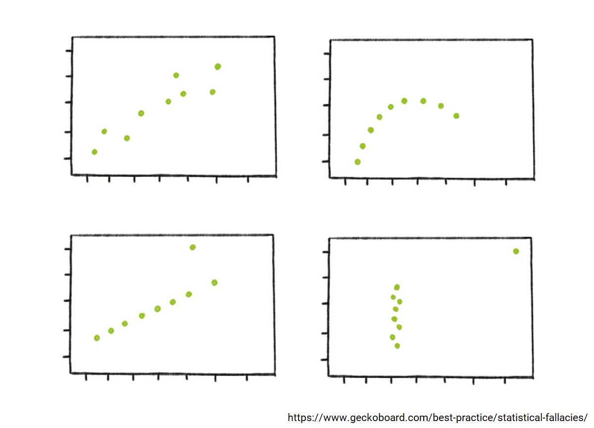{ width=100% }
  
Data scientists routinely graph their data in order to see patterns in the data that might not be apparent in the summary statistics. For example, the graph above illustrates four different datasets that all have identical summary statistics (measures of central tendency).  
  
  
<br>  

#### Conveying information 
  
Data visualization is also used to present information to an audience, 
to share the results of a study or to provide context about a real world issue.  
  
Data visualizations conveying information are around you every day. 
Newspapers and websites routinely present data in their articles to help describe realities of the social world. 
Data visualizations break down information to help us easily digest large sets of numbers and 
explain how individual stories relate to larger social patterns.  
  
Storytelling with data visuals is done to help an **AUDIENCE** interpret and understand data.  
  
Watch this short [video](https://youtu.be/TA_tNh0LMEs) about data journalism, the practice of telling stories with data [4 minutes].
  
  
  
<br>  
  
Data visualizations are produced to communicate a message supported by the data. 
That is to say, plots are used to persuade viewers to believe or do something.  
  
  
According to Alberto Cairo, author of the book [How Charts Lie](https://wwnorton.com/books/9781324001560), 
<span style="color:#F39C12">__"Visualizations are not images. They are visual arguments__."</span>     
  
### Reading Data Stories  
  
The primary way most of us interact with data visualizations is as consumers. 
We're the audience, active readers of data stories.  
    
If data visualizations are arguments, not images, then we need to know how to read and evaluate them. When consuming graphs, we are all victims of **confirmation bias**, 
readily believing information that confirms or supports our prior beliefs. 
  
Cairo cautions us:  
  
> "Don't read too much into a graph, particularly if you are reading what you want to read."  
  
Data visualizations can be misleading for many reasons: accidentally, 
because the creator intended to deceive, if presented out of context, and so on. 
It is easier to be misled than you might even realize.  
  
Watch this [video](https://youtu.be/vbDObzI-CTc) for an example of how you can even mislead yourself [8 minutes].  
  
NOTE: Stop watching at 7 minutes, where the commercial begins.  
  

  
  
<br>  
  
Many charts are designed carefully and are accurate and persuasive visualizations. 
But, consuming data visualizations without a critical eye can still leave people with inaccurate impressions.  
  
<br>  

#### Understanding data visualizations requires actively reading 
  
Using one chart as an example, this short [video](https://youtu.be/O-3Mlj3MQ_Q) provides a nice overview of things to consider when consuming data visualizations [5 minutes].  
  

  
  
<br> 
  

### Misleading Plots

**Numbers (data), and thus charts, are not facts.**  
There is no undeniable truth and many, MANY decisions have been made to present data visually. 
  
There are common ways that charts mislead us. 
  
#### 5 Ways Graphs Lie (according to Cairo)

1. Poor design
2. Dubious data
3. Insufficient data
4. Concealing uncertainty
5. Suggesting misleading patterns
  
  
Watch these two short videos for a summary of how charts commonly mislead readers.  
  
<br>  

[Data Visualization and Misrepresentation](https://youtu.be/x-rDVXVwW9s) [4 minutes]

  
<br>  
  
[How to spot a misleading graph](https://youtu.be/E91bGT9BjYk) [4 minutes]

  
<br>  

**Let's summarize a few of the things to be on the lookout for.**  
  
#### Chart legends  
  
::: my-def
#### Chart Legends 

A description of what is being counted on a graph's Y-axis.</card>  
:::
  
Legends are one of the first things readers should pay attention to on a chart. 
Verify what is being counted and how it is being counted. 
A common mistake is the label on the y-axis is missing, which means readers may assume incorrectly what the data shows.  
  
For example, in the chart below, the reader has no idea what information is being presented because it is missing both a title and a label for the y-axis. 

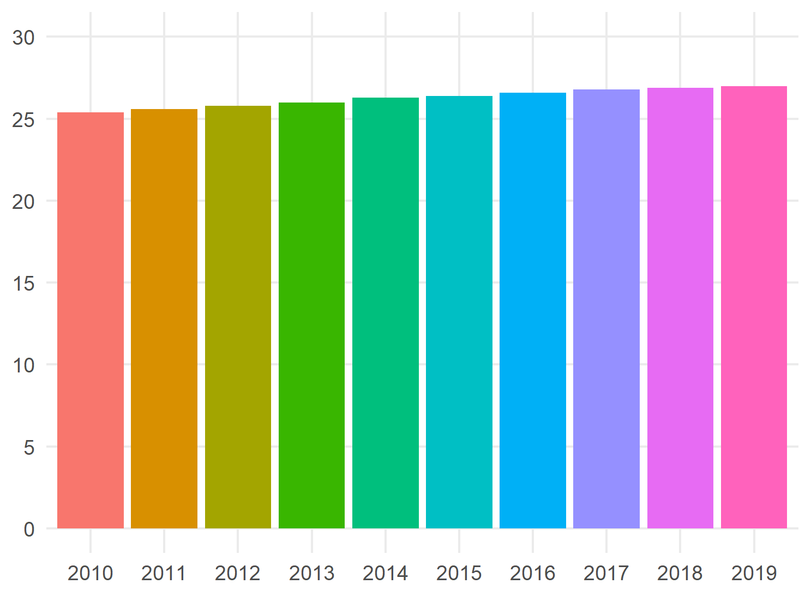{ width=100% }
  
  
What is being counted (and how) should be clearly stated, either in the title or in the y-axis label.
The chart should also state what the values of the y-axis refer to and which units they represent: 
frequencies? percentages? ages? dollars? rates?  
  
Be particularly scrupulous with rates. 1 out 10 people is much different than 1 out of 10,000.  
  
  
#### Chart axes  
  
When presented with a chart, readers should also pay attention to the axes. 
Look at the y and x axis of all charts. 
Does the y-axis of a bar chart start at zero? Should it?
  
::: my-def
#### Axis truncation

Scale on a graph that does not start at 0.
:::
  
<br> 
Darrell Huff's 1954 book ["How to Lie with Statistics"](https://wwnorton.com/books/How-to-Lie-with-Statistics/) 
popularized the notion that all charts should start at zero. 
Huff persuasively argued that axis truncation, in particular starting the y-axis at a value other than zero, misleads readers by exaggerating differences when variation is actually minimal.  
  
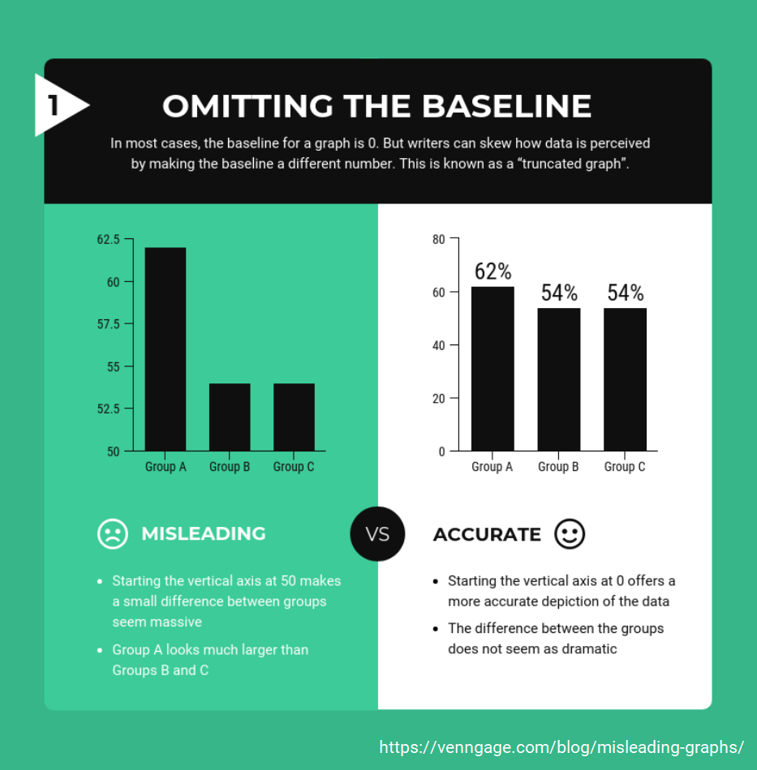{ width=100% }
  
<br>
  
This is still a good guideline, but there are instances in which it is appropriate to change the y-axis.  
  
Let's look at an example. 
The bar graph below shows the average age U.S. women have their first child for each year. 
There appears to be a slight but not substantial change over time in women's ages at the time they first give birth.  
  
  
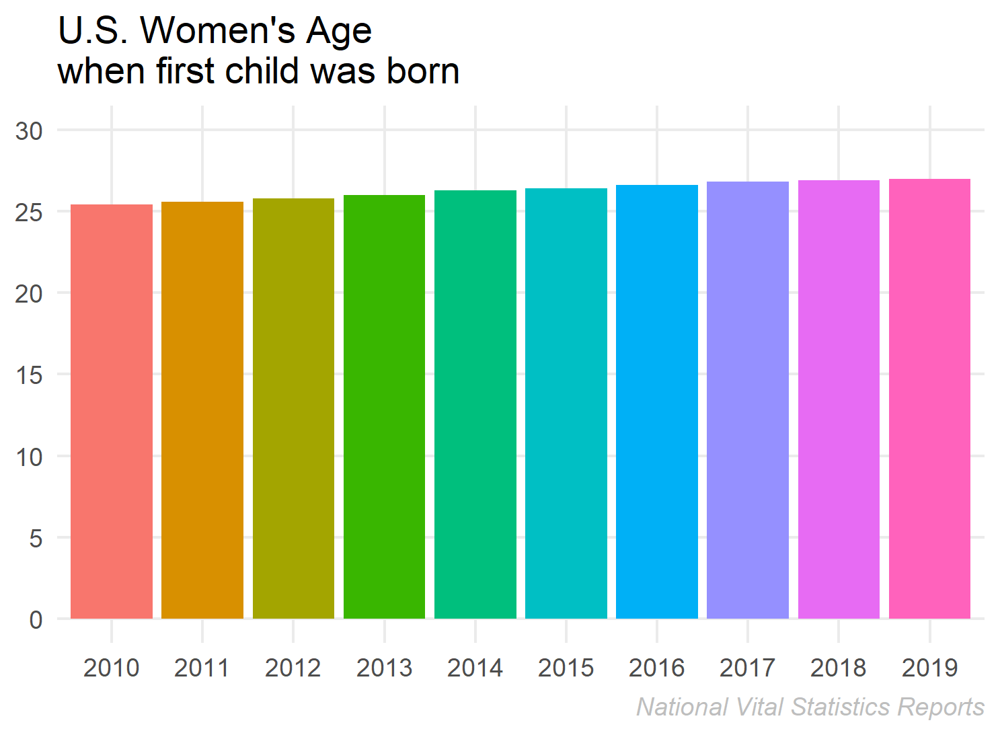{ width=100% }
  
  
But, it is kinda weird to start the y-axis at zero for this chart. Why? 
Well, people don't generally birth a baby when they are babies themselves (0 years old). 
Starting this scale at zero is silly.  
  
Let's look at the SAME DATA, but change the y-axis so that we're zoomed in on the twenties age-range.  
  
  
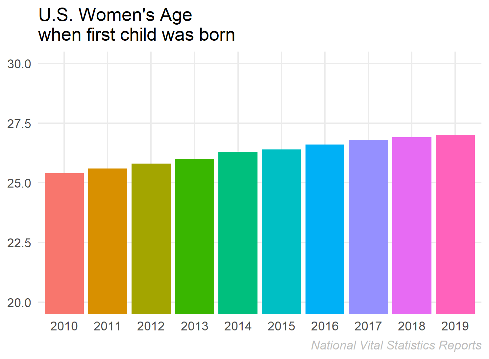{ width=100% }
  
  
Now it is easier to see that the average age when women have their first child has slowly but steadily been climbing. 
The average age has risen from about 25.5 years old to 27 years old in less than a decade (this is a LOT of change). 
  
Still, there is a good reason NOT to change the minimum value of a bar chart. 
The bars are meant to convey relative sizes. 
But, manipulating the y-axis changes the underlying quantities.  

<span style="color:#F39C12">__The y-axis of a bar chart should typically start at zero.__ </span>  
  
-----
  
How do charts illustrate small changes without breaking the expectation that bar charts start at zero? 
By presenting the data as a line graph.  
  
This example chart shows trends over time, so the data is well-suited to be presented as a line graph. 
Starting the y-axis at zero for line graphs can have the same issue as bar charts, 
minimizing important changes.  
  
But, unlike bar charts, the y-axis can be adjusted without violating assumptions about the relative sizing of quantities. 
  
  
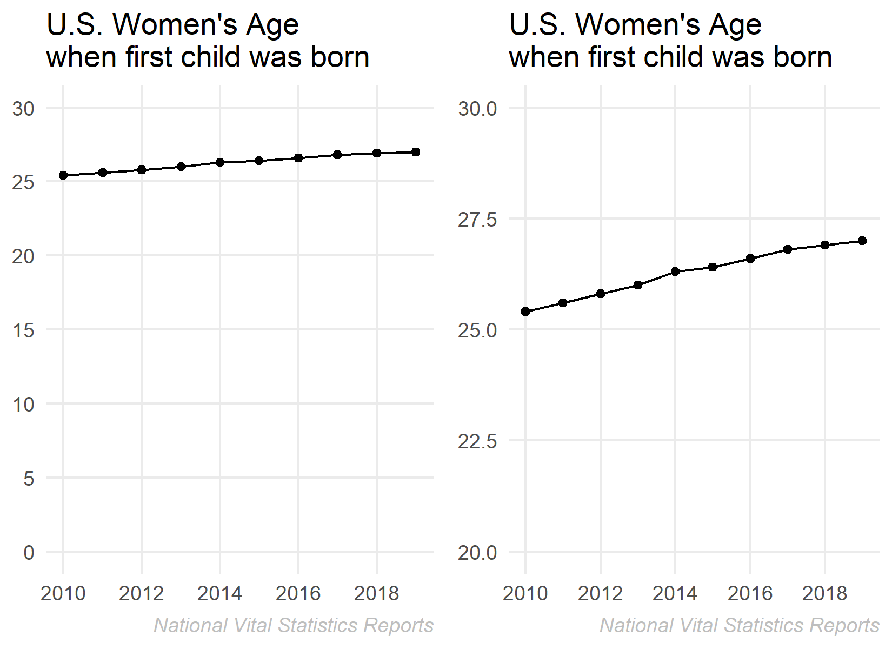{ width=100% }
  
<br>  

In the chart on the right, it is easier to see that women's average age when having her first child has climbed over the decade. 
And, the chart doesn't violate visual assumptions.  
  
A more modern guideline might be:  
  
> Scale the y-axis of line graphs to emphasize the point, without obscuring or magnifying differences.  
  
  
To summarize, the appropriate scale always depends on the context. 

The y-axis can be misleading when truncated or shown in full. 
It is up to the consumer to critically evaluate the information presented.  
  
When you encounter bar graphs with a y-axis that does not start at zero, you should be very skeptical of the data visualization. 
And, judge for yourself whether the y-axis of line graphs have been appropriately scaled to show real differences, 
without obscuring or exaggerating changes.  
  
#### Uncertainty  
  
Data visualizations can also mislead viewers when they omit uncertainty. 
*Estimates* can look like precise numbers when shown in a chart.  
  
Data visualizations almost always show point estimates, exact values. 
But, data visualizations that are based on samples sometimes need to make explicit the uncertainty in the point estimate. 
A common approach is to present either the confidence intervals on the data visualization or to note the range of the standard error on the chart.  
  
<br>

Take a look at the two graphs below.  
  
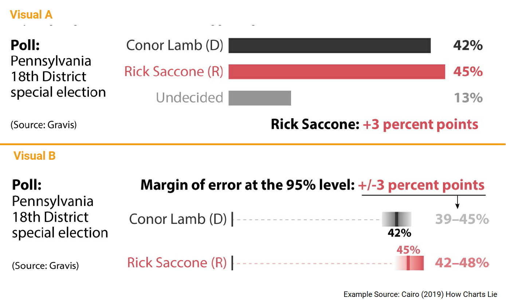{ width=80% }
  
  
Both data visuals report the uncertainty in a political poll. 
In the first instance, the margin of error is listed as +3 percent point. 
The reader of the graph must do some math themselves to realize that 
Lamb is expected to take between 39% and 45% of the total votes. 
Saccone is expected to take between 42% and 48% of the vote. 
Most people won't do this and will assume Saccone is expected to receive more votes than Lamb.  
  
Now look at Visual B. 
This visual conveys the uncertainty in the political poll. 
Without having to subtract or add the margin of error, 
readers can see that the confidence intervals overlap.  
  
Neither chart is wrong, but one data visual is careful to highlight the uncertainty of the point estimate in the data visualization.  
  
It is a smart move to look for information about the range of an estimate.  
Error bars around point estimates, like in the graph below, 
help readers know how much variation to expect in a point estimate. 
But, do not forget to also look for a label explaining what the range represents.  

It is a safe bet to assume most error bars represent either the standard error 
or a 95% confidence interval, but readers won't know for sure unless the visual says so explicitly.  
  
  
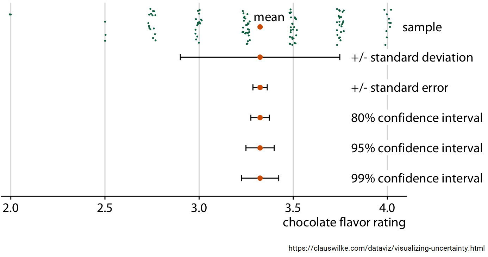{ width=90% }

  
#### Dubious Data
   
Critically consuming data visualizations requires evaluating the sources of both the **data** and the **chart designer**.  
  
Sometimes a data visualization is well executed, but the data presented is poor quality. 
A common refrain among statisticians is:
  
> Garbage in, garbage out.  
  
In other words, if a pretty chart is built on bad data, the data visualization is still terrible.  
  
Look to see if the primary source of the data is listed 
and read any chart notes about decisions the chart designer made when presenting the data.  
  
It is not uncommon for sources to be listed, but to take viewers on an endless number of clicks before getting to the primary data source. 
  
::: my-def
#### Primary data source

Original data collected firsthand by researchers.  
:::  
  
Data should be evaluated on:  
  
1. **Currency**: How recently was it collected? 
2. **Relevance**: Does the data measure the construct intended?
3. **Sample**: What is the information based on? Who does it represent?
4. **Purpose**: What was the intention of the data collection?
  
  
<br>  

Take this example. 
[Coca-Cola sponsored research](https://www.ucsusa.org/resources/how-coca-cola-disguised-its-influence-science-about-sugar-and-health) on sugar and health. Private funding for the research does not necessarily compromise the findings, but skeptisim is certainly warrented since Coca-Cola would financially benefit from the results of the study.  
  
  
It is a good habit to be distrustful of any data visualization that does not clearly label (or better yet, link to) to the primary source of the data. 
Even when the source of the data is stated, it might be wise to remain skeptical. 
  
<br>  

#### Dubious Source
  
Other times, the data is sound but the author of the chart has bad or biased intentions.  
  
Because people often mistake charts for fact, bad actors sometimes use data visualizations to intentionally mislead people. 
Misleading charts can often be spotted by the use of language meant to **evoke a strong emotional reaction** from the audience rather than the use of neutral terms.  
  
Sometimes charts are misleading because the creator intentionally left out the context needed to interpret the data. 

Charts can also lie when they show too little or too much data. 
When you see charts that show raw numbers without any comparisons, that is a flag to be wary before drawing any conclusions. You probably don't have enough information to discern what the number represents. 
Charts can also mislead by showing too little data when creators cherry-pick which data to present. 
  
<br>  

::: my-def
#### Cherry-picking

Selecting only information that supports a particular position.  
:::

Cherry-picking data is the practice of presenting only the data that supports your point and then discarding the rest of the data. 
A common way data is cherry-picked is changing the x-axis to exaggerate variation that otherwise would show minimal changes. 
  
  
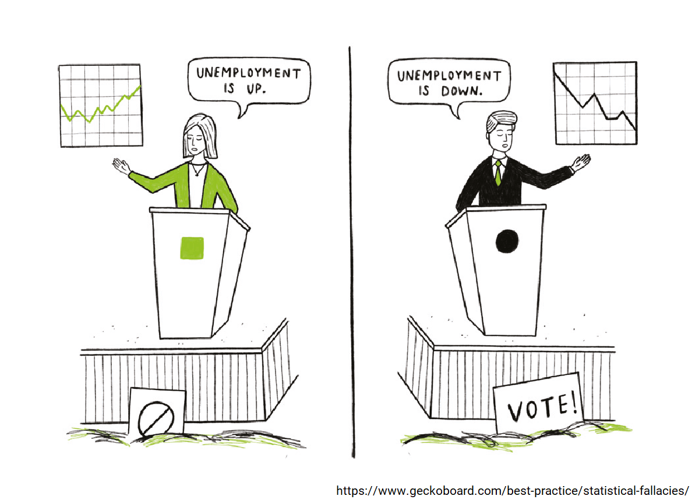{ width=100% }

  
Misleading charts sometimes also show too much data. When data points overlap too much, it obscures patterns and density.  

**Summary:** Evaluate the bylines (who made the graphic) AND the data sources (who collected the data and how). If a chart panders to your most deeply held beliefs, take an extra critical eye to the data visualization. 
  
::: my-tip
#### Heads Up! 
Charts alone rarely prove anything (Alberto Cairo).
:::


### Designing Plots

Most of the time most of us are consumers of data visualizations, 
but many of us will at some time be tasked with creating data visuals.  
  
#### What makes bad figures bad?
  
Healy suggests that bad graphs come in three varieties:  
  
1. aesthetic  
2. substantive  
3. perceptual  
  
  
**Read**: [Section 1.2 What makes bad figures bad?](https://socviz.co/lookatdata.html#what-makes-bad-figures-bad) 
from the book *"Data Visualization: A practical introduction"* by Kieran Healy.  
(Note: The link will open in a new tab of your web browser. You can stop reading when you get to section 1.3.)  
  
The flip side of knowing how to identify bad and misleading charts is knowing the
best practices in creating good data visualizations.  

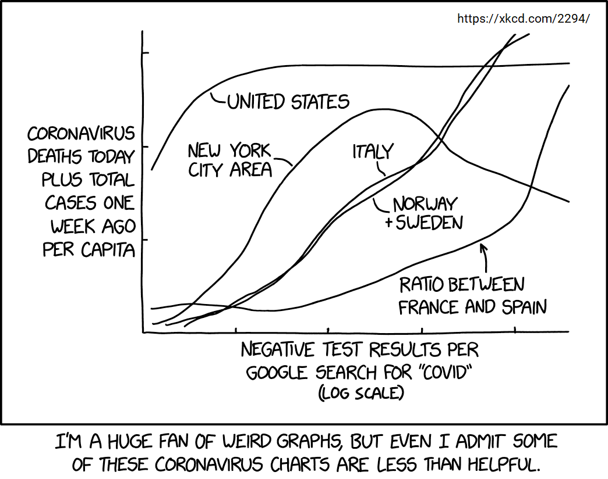{ width=100% }
  
<br>  
  
The video below suggests 3 simple techniques for telling compelling data stories:  
  
1. Choose a human-friendly chart type  
2. Ruthless minimalism  
3. Everything contributes to a key takeaway  
  
<br >
Watch the [video](https://youtu.be/edAf1jx1wh8) now for the details [17 minutes].  
  

  
<br>
  
#### Choose a human-friendly chart type  
  
The first task in creating good data visualizations is to be able to 
distinguish between different types of plots.  
  
Watch this [video](https://youtu.be/C07k0euBpr8) detailing the common uses of each type of graph [12 minutes].  
  
  


<br>

#### Design

In addition to selecting an appropriate type of plot, 
data scientists must also select appropriate elements for the plot.  
  
**Remember, every chart must have**: 

* title
* variable names
* category labels
* units of measurement
* data source

> Great data visualizations strive for a balance between simplicity and accuracy. 
  
Usually there is a trade-off. 
As the designer simplifies the chart, some accuracy in the data visualization is lost. 
Precise visualizations also can be overly complicated, 
making it hard for readers to understand the point.  
  
  
::: my-def
#### Chart junk 

Distracting elements on a chart that are not necessary to comprehend the information.
:::
  
Chart designers should avoid adding any unnecessary elements to a chart. 
In the chart below, the pictures of the motorocyles make it difficult to focus on the trend lines.  
  
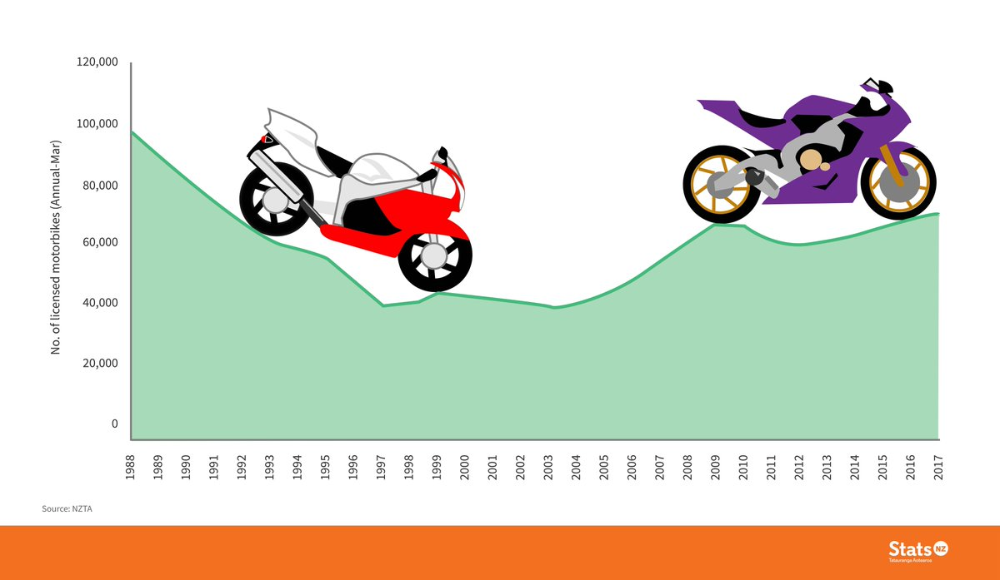{ width=100% }
  
<br>

Sometimes chart junk is much more subtle than the addition of needless pictures. 
Charts are often littered with needless gridlines, unnecessary legends, and distracting background colors.  
  
Check on this [video](https://youtu.be/zObrKaahU_U) for ways to reduce chart junk [5 minutes].  
  
  
  
<br>

Unlike chart junk, data scientists should be thoughtful about ADDING information about the uncertainty in point estimates. Whenever possible, don't make readers do the math themselves.  
  
Examples of conveying uncertainty.  
  
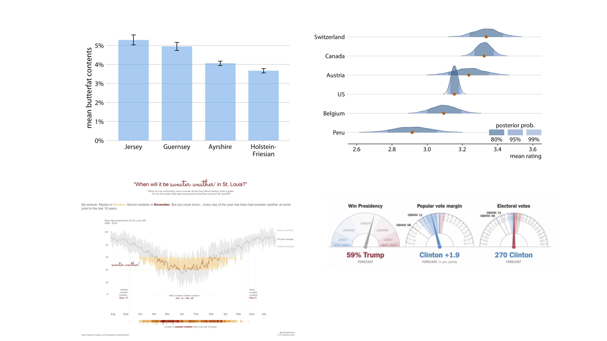{ width=100% }

<br>

#### Make an argument

Effective data visualizations make a point. 
Which means, every visualization decision should focus attention on the main point of the visual. 
  
<br>
  
#### Colors  

The use of colors in charts is a topic that could be its own class. 
But, we'll focus on a few key strategies in using colors to make the argument clear, without misleading readers.  
  
#### Numeric data 
  
Color scales should be used to represent interval-ratio data. 

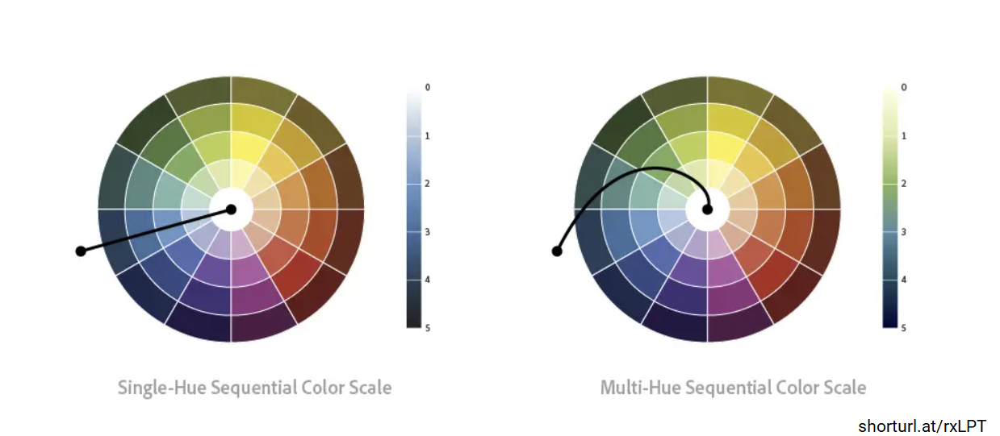{ width=100% }
  
  
Dark colors are perceived as having higher values than lighter colors. So small ends of a scale should have light colors whereas high ends of scales should be presented in dark colors. 
  
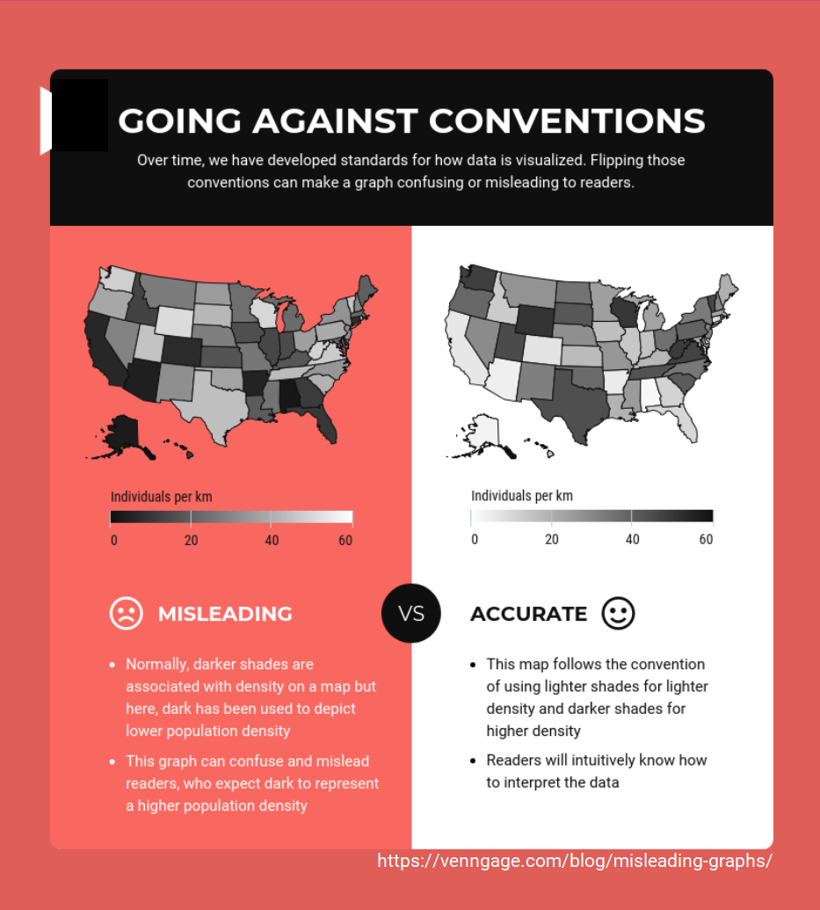{ width=100% }

<br>
  
#### Categorical data  
  
Don’t use a scale for mapping categorical data. Categorical data (i.e., nominal, ordinal) should be mapped to a distinct color rather than a gradient scale of just one color.  
  
A concern with picking distinct colors is that adjacent color hues often look the nicest to the eye. But, the colors can be hard to distinguish on old computers, printed out or projected on a screen, or for people with impaired vision. Picking colors around the color wheel improves readability but can make charts look ugly, distracting readers from the point of the data visualization. So, chart designers have to try and balance these two features.  
  
  
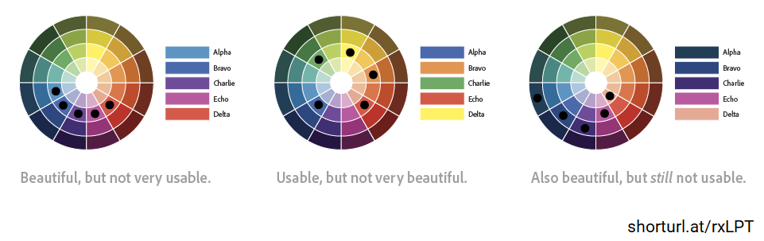{ width=50% }

  
#### Labels
  
Labels should not use confusing abbreviations.  
  
Every chart needs labels, but not every chart requires a legend. Sometimes when a legend is required, labeling the series directly can make it easier for the reader.  
  
  
#### Axis

Chart designers should allow for an appropriate amount of zooming in on the data, without minimizing changes OR over-emphasizing effect sizes.  
  
[A guideline](https://chezvoila.com/blog/yaxis/) for line graphs is that 
no data should appear in the **bottom third of the plotting area**.  
  
  
#### Source

Chart designers should always cite the source of the data so readers can find it and evaluate it themselves. It is also ideal to name the person or organization who designed the chart.  

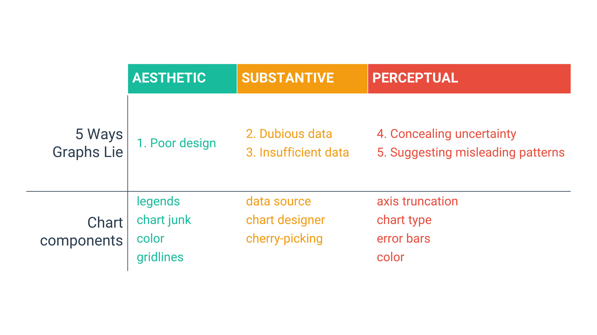{width=100%}


### Summary 

Tables are a vital part of describing and presenting data. But, sometimes it's better to simply explain something in text and other times a picture would do a better job at conveying information.  

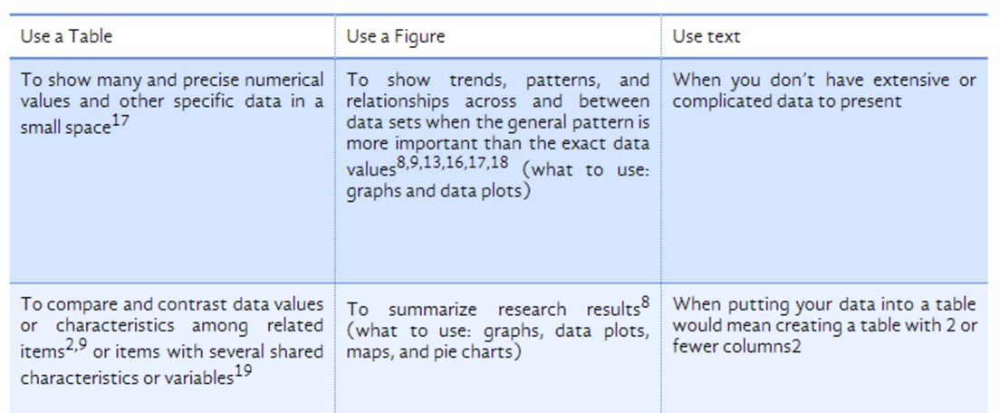{width="100%"}

Source: [Velany Rodrigues](https://www.editage.com/insights/tips-on-effective-use-of-tables-and-figures-in-research-papers)

Whether you should convey information in text, in a table, or through a figure depends on what you wish readers to focus on. It can also depend on your target journal guidelines. Some journals limit the number of tables and figures and have specific guidelines on the design aspects of these display items.


Regardless of how you present your data, there are two guidelines to keep in mind in your research paper:

1.   Refer, but don’t repeat
2.   Be consistent

Learning Check 07
--------------------------------------------------------------------------------

Please answer the following questions to verify you understand the
topics in this tutorial.

```{r Q01, echo=FALSE}
  question("Q01. A relationship in which both the independent and dependent variables are caused by a control variable, such that the apparent relationship is “explained away” by the control variable, is referred to as a",
    answer("spurious relationship.",  correct = TRUE),
    answer("conditional relationship."),
    answer("direct relationship."),
         random_answer_order = TRUE,
         allow_retry = TRUE
  )
```
  
  
```{r Q02, echo=FALSE}
  question("Q02. A relationship in which the independent variable influences a dependent variable (without other variables appearing in the model) is referred to as a",
    answer("direct relationship.",  correct = TRUE),
    answer("conditional relationship."),
    answer("spurious relationship."),
         random_answer_order = TRUE,
         allow_retry = TRUE
  )
```


A study of cities in the United States finds that in places where there are more psychologists, there are also more people with mental disorders. Controlling for the number of psychiatric hospitals in the city, however, the initial relationship disappears. Graphically, this relationship can be depicted like this:
  
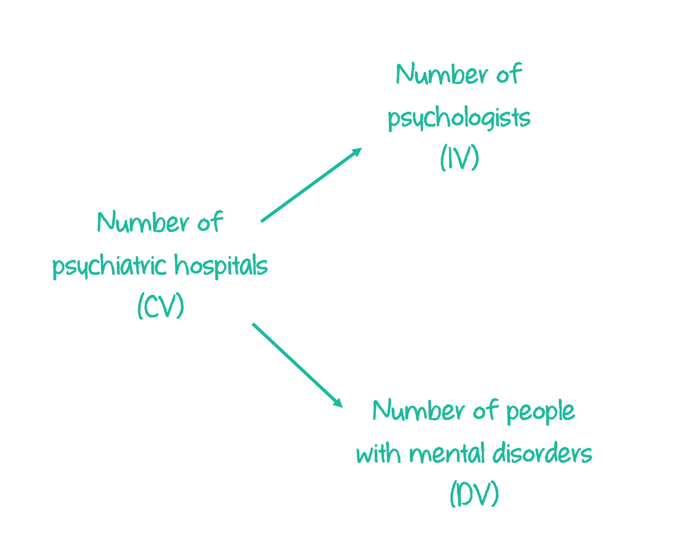{ width=100% }
  
  
```{r Q03, echo=FALSE}
  question("Q03. This is an example of a:",
    answer("spurious relationship",  correct = TRUE),
    answer("conditional relationship"),
    answer("direct relationship"),
         random_answer_order = TRUE,
         allow_retry = TRUE
  )
```
  
  
Among women, those with higher incomes are more likely to marry in any given year. Controlling for gender ideology, income is more predictive of marriage for women who hold liberal views toward gender roles, and less predictive for those who are more conservative. Graphically, this relationship can be depicted like this:
  
  
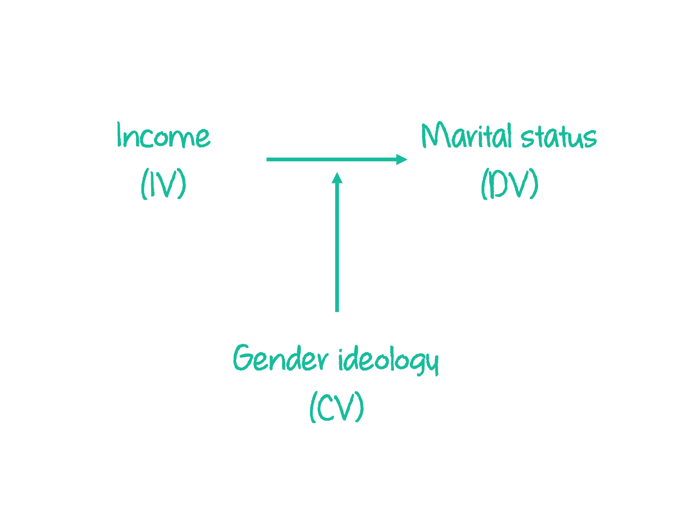{ width=100% }
  
  
```{r Q04, echo=FALSE}
  question("Q04. This is an example of a:",
    answer("conditional relationship",  correct = TRUE),
    answer("direct relationship"),
    answer("spurious relationship"),
         random_answer_order = TRUE,
         allow_retry = TRUE
  )
```


The table below shows summary statistics for African American adult women, disaggregated by whether the survey respondent experienced a familial incarceration, 
defined as an immediate family member being incarcerated. 
(This table is from the article: [Familial Incarceration, Social Role Combinations, and Mental Health Among African American Women](https://onlinelibrary.wiley.com/doi/abs/10.1111/jomf.12699).)

{ width=100% }
  
```{r Q05, echo=FALSE}
  question("Q05. Which statement could we make given the information in the table?",
    answer("On average, women who've experienced a familial incarceration report MORE psychological distress than women who didn't experience a familial incarceration.",  correct = TRUE),
    answer("On average, women who've experienced a familial incarceration report LESS psychological distress than women who didn't experience a familial incarceration."),
    answer("On average, women who've experienced a familial incarceration are older than women who didn't experience a familial incarceration."),
    answer("On average, women who've experienced a familial incarceration report LESS depressive symptomatology than women who didn't experience a familial incarceration."),
         random_answer_order = TRUE,
         allow_retry = TRUE
  )
```

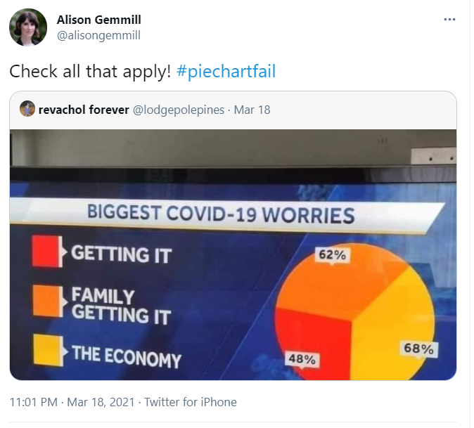{ width=100% }

```{r Q06, echo=FALSE}
  question("Q06. What is wrong with the pie chart?",
    answer("The percentages in a pie chart should sum to 100%.",  correct = TRUE),
    answer("It has needless keys and legends and superfluous axis marks."),
    answer("Some people were likely not worried about COVID-19 and this data category is not presented."),
    answer("The categories are not mutually exhaustive, it does not show all possible worries related to COVID-19."),
         random_answer_order = TRUE,
         allow_retry = TRUE
  )
```
  
```{r Q07, echo=FALSE}
  question("Q07. ___________ helps the researcher interpret and understand data, whereas ___________ is used to persuade viewers to believe or do something.",
    answer("Exploratory data visualization; data storytelling",  correct = TRUE),
    answer("Data storytelling; exploratory data visualization"),
    answer("Data storytelling; cherry-picking"),
    answer("Cherry-picking; chart junk"),
    random_answer_order    = TRUE
  )
```
  
```{r Q08, echo=FALSE}
  question("Q08. According to your reading, the NYTimes 500,000 dots data visualization of COVID-19 deaths suggests which of the following about data visualization?",
    answer("Data visualization is good for showing aggregates but it does not reveal individual experiences.",  
           correct = TRUE),
    answer("Data visualization is terrible at showing aggregates but it is well-suited to revealing individual experiences."),
    answer("Well-made data visulaizations should always include color to capture readers' attention."),
    answer("Data visualizations made in grayscale are most effective in conveying a tragedy."),
         random_answer_order = TRUE,
         allow_retry = TRUE
  )
```
  
  
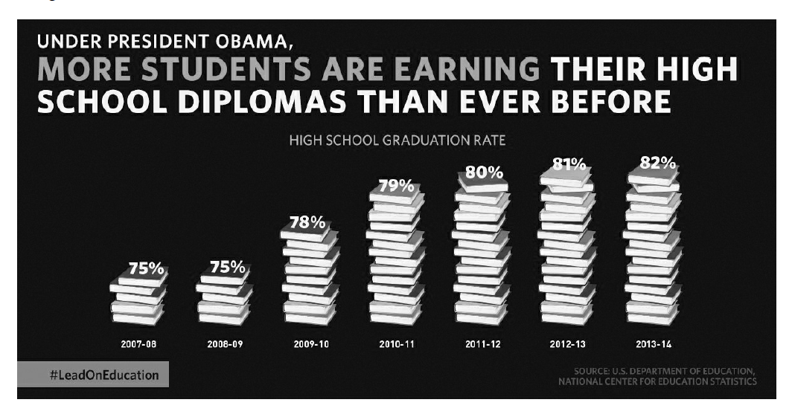{ width=100% }

```{r Q09, echo=FALSE}
  question("Q09. Aside from the chart junk, why is this example chart from Cairo (2019) misleading?",
    answer("The height of the bars (books) should be proportional to the numbers by putting the baseline at 0%.", correct = TRUE),
    answer("The appropriate chart type for this data is a pie graph, not a bar graph."),
    answer("The x-axis is truncated and should start the first year of data collection."),
    answer("The trend line is cumulative and can only rise but not fall.", 
           message = "This would be the correct answer if the chart showed the number of Americans who have ever received a high school diploma. This chart appropriately shows the % graduating each year."),
         random_answer_order = TRUE,
         allow_retry = TRUE
  )
```


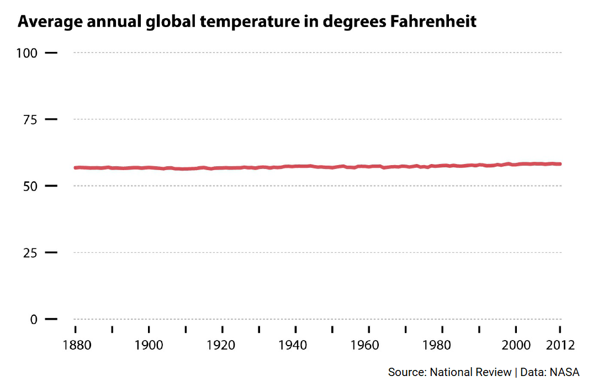{ width=100% }
  
```{r Q10, echo=FALSE}
  question("Q10. Why is the line chart above misleading?",
    answer("The choice of scale minimizes meaningful changes in global temperatures.", correct = TRUE),
    answer("The appropriate chart type for this data is a bar graph, not a line graph."),
    answer("The data used to make this chart is dubious.", 
           message = "The data from NASA is accurate and high quality."),
    answer("The aspect-ratio of the chart selected is too narrow.", 
           message = "If anything, the chart is too wide."),
         random_answer_order = TRUE,
         allow_retry = TRUE
  )
```
  
