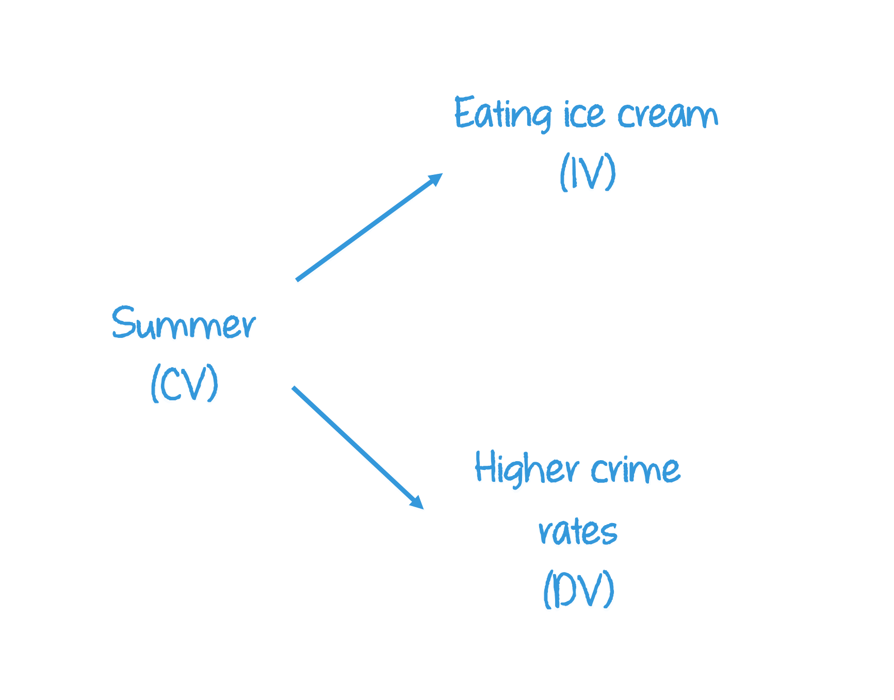
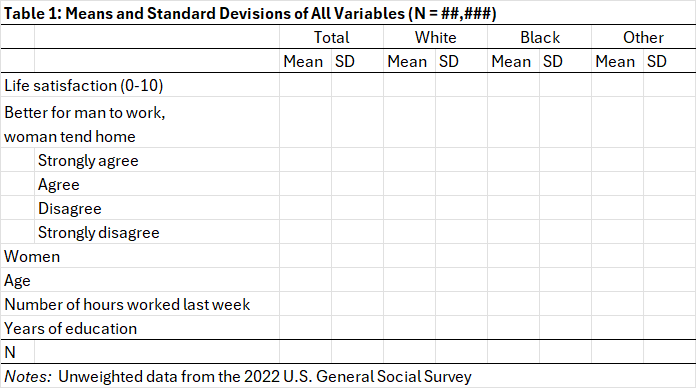
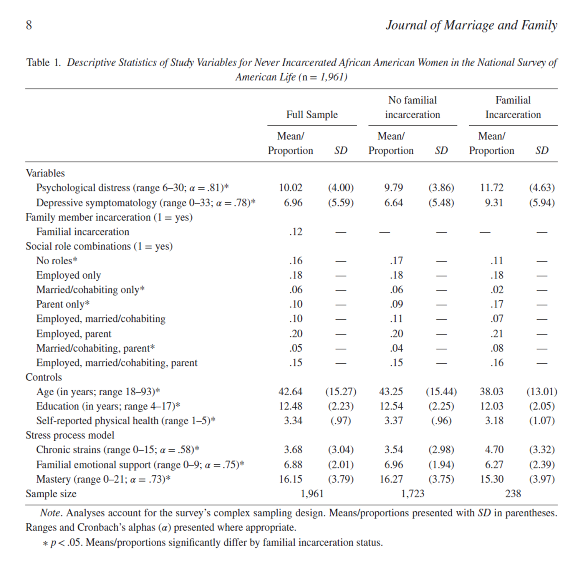

```{r}
#| label: setup
#| message: false
#| include: false

# GLOBAL ENVIRONMENT PANE
## source("tutorials/SOC6302-03/custom-setup-styles.R")
## library(gssr)
## library(gssrdoc)
## data(gss_all)
## gss24 <- gss_get_yr(2024)
## data(gss_dict)

## Load packages, custom functions, and styles
source("custom-setup-styles.R")

## Load all gss
#gss_all <- readRDS("data/gss_all.rds")

# Get the data only for the 2022 survey respondents
gss22 <- readRDS("data/gss22.rds")

# Override default discrete color and fill scales
scale_colour_discrete <- function(...) scale_color_manual(values = my_palette)

## Options
tutorial_options(exercise.checker = gradethis::grade_learnr)
options(dplyr.summarise.inform=F)   # Avoid grouping warning
options(digits=4)                   # Round numbers
theme_set(theme_minimal())          # set ggplot theme
# st_options(freq.report.nas = FALSE) # remove extra columns in freq()
 # any reason need to see this?!?! CHECK FOR SP22
  
knitr::opts_chunk$set(echo = FALSE,
                      warning = FALSE, 
                      messages = FALSE)
```

<link href="https://fonts.googleapis.com/css2?family=Shadows+Into+Light&display=swap" rel="stylesheet">

```{=html}
<script>
  document.addEventListener("DOMContentLoaded", function () {
    document.querySelectorAll("a[href^='http']").forEach(function(link) {
      link.setAttribute("target", "_blank");
      link.setAttribute("rel", "noopener noreferrer");
    });
  });
</script>
```

## Description

{width="75%"}

`r fa("fas fa-lightbulb", fill = "#18BC9C")` [**LEARNING OBJECTIVES**]{style="color: #18BC9C;"}

1.  X
2.  Y
3.  Develop best practices in creating data visualizations

<br>

`r fa("fas fa-book", fill = "#18BC9C")` [**READINGS**]{style="color: #18BC9C;"}

Readings are available on Quercus.

1.  XX\
2.  YY

<br>

`r fa("fas fa-language", fill = "#18BC9C")` [**TERMS**]{style="color: #18BC9C;"}

-   DIRECT RELATIONSHIP
-   ELABORATION
-   CONTROL VARIABLE
-   SPURIOUS RELATIONSHIP
-   CONDITIONAL RELATIONSHIP

Elaboration
--------------------------------------------------------------------------------

The goal of analyzing two variables simultaneously is to try and establish how they are related to one another.
These relationships can take many forms.

#### Direct relationship

When a relationship between two variables cannot be accounted for by other theoretically relevant variables, we refer to it as a **direct** relationship.

Once we have established a direct relationship between two variables, social scientists often want to establish the order of the relationship.
Did **A** lead to **B** or did **B** lead to **A**?

Direct causality (A → B):

::: {style="color: #3498DB; font-family: 'Shadows Into Light'"}
“Higher levels of education lead to better health.”
:::

Reverse causality (B → A):

::: {style="color: #3498DB; font-family: 'Shadows Into Light'"}
“Better health leads to higher levels of education.”
:::

In real life, the arrows often point in both directions.
The scientific debate is often about which causal direction is stronger.

<br>

Another point of debate, beyond the direction of the relationship between the two variables, is whether there is a true causal link between the two variables.
The relationship between **A** and **B** might be “explained away” by **C**, a third variable.

::: my-def
#### Elaboration

Further exploring a bivariate relationship by introducing another variable.
:::

Often we have a reason to suspect that a third variable will have some effect on the bivariate relationship between our independent and dependent variables.

This is better explained with an example.
The table below presents the number of driving accidents per year for men and women.
Compare the percentage of men who have had two or more accidents (62%) with the percentage of women who have had two or more accidents (41%).

{width="60%"}

It appears that men get in more driving accidents than women and the relationship between gender and number of accidents is fairly strong.
Knowing someone's gender would help use guess whether they have had 0-1 accidents or 2 or more accidents per year.

But, what if we suspect that men drive more often than women and that's the real explanation for why men have more accidents than women?
Men may have more accidents simply because they are more likely to be behind the wheel than women, not because men are worse drivers than women.
Let's look at the data again, but this time, we'll make two cross-tabs.
Each new table is called a **“partial table.”**

In the first cross-tab, we'll compare men's and women's frequency of accidents among people who say they "drive rarely."

{width="60%"}

Now, we can see that among people who drive rarely, the proportion of men and women who have two or more accidents is remarkably similar.
What do we see when we compare men's and women's accidents among those who drive frequently?

{width="60%"}

Among frequent drivers, we see much higher rates of accidents for both men and women.
How would we interpret these three cross-tabs when we analyze them collectively?

Men have more automobile accidents, on average, than women.
However, after *controlling for* frequency of driving, the relationship between gender and accidents per year disappears.

It's not that gender was the *cause* of more frequent accidents, but that gender was associated with frequency of driving, which is associated with more frequent accidents.
Gender is related to frequency of driving, which directly influences the number of accidents per year.
Therefore, the relationship between gender and number of accidents is not a *direct* relationship.

::: my-def
#### Control variable

An additional variable that we take into account to understand the relationship between our main variables of interest.
:::

When we add a third variable that theoretically may influence the relationship between our independent and dependent variables, we refer to this new variable as a **control variable**.

In a cross-tabulation, we end up producing one cross-tab per category of the control variable.

#### Spurious relationship

When the control variable is added, if the relationship between the IV and DV disappears, the relationship is considered to be **spurious**.

{width="60%"}

[**Example:**]{style="color: #F39C12;"}

::: {style="color: #3498DB; font-family: 'Shadows Into Light'"}
When people eat more ice cream, more crimes are committed.
:::

In the summer, more people eat ice cream and more people commit crimes.
Eating ice cream doesn't lead to crime.
Both things happen to occur in the summer.

{width="60%"}

### Conditional relationship

When the control variable is added, if the relationship between the IV and DV is dependent upon the category of the control, the relationship is considered to be **conditional**.

The relationship between the IV and DV will change depending on the value of the control variable.
Put differently, **C** is a moderator when it changes the relationship between **A** and **B**.
To moderate a relationship means to affect its strength and/or direction.
If the control variable splits our analysis into two cross-tabs, one table may show no relationship and the other may show a strong, negative relationship.

{width="60%"}

[**Example:**]{style="color: #F39C12;"}

::: {style="color: #3498DB; font-family: 'Shadows Into Light'"}
Young people tend to be religious if their parents are also religious.
:::

Young people who are close to their parents tend to be similar to them in terms of religiosity.
For teens who are not close to their parents, there is no relationship.

{width="60%"}

------------------------------------------------------------------------

`r fa("otter", fill = "#F39C12")`<practice> PRACTICE:</practice>

*If divorce increases risk of depression more for men than for women, we’d say that “gender moderates the association between divorce and depression.”*

```{r P01, echo=FALSE}
question("Which model best describes the relationship between these variables?",
    answer("conditional", correct = TRUE, message = "The relationship between divorce and depression is conditional on one's gender."),
    answer("spurious"),
    answer("direct"),
         random_answer_order = TRUE,
         allow_retry = TRUE
)
```

*Research shows that the longer people wear masks during the day, the more likely they are to get infected with COVID-19. When the researchers control for whether people were considered to be an essential worker, the relationship disappears.*

```{r P02, echo=FALSE}
question("Which model best describes the relationship between these variables?",
    answer("conditional"),
    answer("spurious", correct = TRUE, message = "Whether or not someone is an essential worker is corrrelated both with the need to wear a mask for long hours and greater exposure to the population who might be infected."),
    answer("direct"),
         random_answer_order = TRUE,
         allow_retry = TRUE
)
```

To summarize:

-   Elaboration allows us to test for spuriousness.
-   Elaboration clarifies the causal sequence of bivariate relationships by introducing variables hypothesized to intervene between the IV and DV.
-   Elaboration specifies the different conditions under which the original bivariate relationship might hold.

Descriptive Tables
--------------------------------------------------------------------------------

Descriptive tables provide a foundational overview of variables—such as distributions, means, and correlations—that help researchers identify potential control variables and spot patterns that may indicate spurious or conditional relationships.

These insights guide the elaboration process by informing which variables to adjust for or explore further in multivariate analysis.

Descriptive tables, like a Table 01 in a peer reviewed journal article, set the stage for elaboration.
Here's how:

#### 1.  Identifying Control Variables

-   Table 01 shows distributions of potential control variables (e.g., age, income, education).\
-   Researchers use this to decide which variables to control for in later models.

[*Example:*]{style="color: #F39C12;"}\
If income varies widely and is correlated with both education and health outcomes, it might be a control variable.

#### 2.  Spotting Spurious Relationships

-   Descriptive stats can reveal correlations that look strong but may be misleading.

[*Example:*]{style="color: #F39C12;"}\
A high correlation between ice cream sales and drowning deaths might appear in Table 01—but elaboration (adding temperature as a control) shows it's spurious.

#### 3.  Testing Conditional Relationships

-   Table 01 helps identify subgroups (e.g., gender, region) for stratified analysis.\
-   Researchers might later test if the effect of education on income differs by gender—this is a conditional relationship.

#### 4.  Baseline Comparisons

-   Table 01 provides the baseline characteristics of the sample.\
-   This helps assess whether groups are comparable before elaboration techniques are applied.
  
<br>
  

### Table 01

It is common to show summary statistics of the sample in Table 01 of a research article.

These descriptive statistics, characteristics of the study population, are often stratified by a key categorical variable.

Let's look at an example. 
I suspected that mothers' partnership status (whether mothers were married, living with a partner, single, or divorced) 
influenced their time spent in daily activities such as childcare, housework, leisure, and sleep.  
    
  
The table below is from research I published analyzing data from the American Time Use Survey to investigate this hypothesis. 
The table shows the means and standard deviations for the variables I analyzed, summarized for all mothers and grouped by mothers' partnership status. 

{width="100%"}

<br>

`r fa("otter", fill = "#F39C12")`<practice> PRACTICE:</practice>

```{r P03, echo=FALSE}
question("What is the independent variable in this hypothesis?",
         answer("partnership status", correct = TRUE,  message = "I thought partnership status would influence daily activity."),
         answer("daily activities", message = "I thought daily activities depended on partnership status."),
         random_answer_order = TRUE,
         allow_retry = TRUE
)
```
  
```{r P04, echo=FALSE}
question("How many mothers are in the sample?",
         answer("23,088", correct = TRUE),
         answer("16,086", message = "This is the number of MARRIED mothers in the sample."),
         answer("2,928",  message = "This is the number of NEVER MARRIED mothers in the sample."),
         answer("823",    message = "This is the number of COHABITING mothers in the sample."),
         answer("3,251",  message = "This is the number of DIVORCED mothers in the sample."),
                  random_answer_order = TRUE,
         allow_retry = TRUE
)
```

<br>

Notice that some of the variables have a standard deviation (S.D.) reported in parentheses. 
These variables are all interval-ratio variables. 
The variables without the standard deviation are either nominal or ordinal variables,
so a S.D. wouldn't make sense to report. 
  
The first row shows the number of minutes per day that mothers report providing childcare. For example, married mothers reported about 125 daily minutes of childcare and the standard deviation was 1 minute. This means there was little variability among married mothers' time spent providing childcare.

<br>

`r fa("otter", fill = "#F39C12")`<practice> PRACTICE:</practice>

```{r P05, echo=FALSE}
question("How many minutes per day of housework do 'never married' mothers report?",
         answer("116", correct = TRUE),
         answer("106", message = "This is the number of childcare minutes."),
         answer("164", message = "This is the number of minutes for the full sample."),
         answer("175", message = "This is the number of housework minutes for married mothers."),
                  random_answer_order = TRUE,
         allow_retry = TRUE
)
```

```{r P06, echo=FALSE}
question("How many minutes per day did 'never married' mothers watch television ALONE?",
         answer("49", correct = TRUE),
         answer("141", message = "This is the number of minutes watching television alone or with someone."),
         answer("25", message = "This is the number of minutes for the full sample."),
         answer("19", message = "This is the number of television minutes for married mothers."),
                  random_answer_order = TRUE,
         allow_retry = TRUE
)
```
  
<br>
  
The table also shows numerous summary statistics describing mothers' demographic characteristics. 
The reason summary statistics describing the demographic characteristics of the sample are important is that they might influence the relationship between the independent and dependent variable.  
  
In this example, it might not be partnership status that influences mothers' time use, but maybe single mothers are more likely to work full-time than married mothers, thus having less time for housework. So, it is important to inform the reader of summary statistics for variables that might also be associated with the dependent variable, beyond the independent variable the researcher is interested in studying.  
  
These demographic variables all happen to be nominal or ordinal variables, but that is not always the case. 
The statistics represent the proportion of mothers within each category.  
  
For example, .19 of all mothers report the presence of an extended family member in their household. 
This means that 19% of all mothers reported that an adult family member lives in their household. We could also say that 81% of all mothers do not live with an extended family member because all proportions sum to 1.  
  
When a variable is ordinal or nominal (but not dichotomous), such as educational attainment, each of the categories are reported. 
The category proportions must sum to 1. For instance, .13 of all mothers have less than a high school diploma, .28 of all mothers have a high school degree, .28 have some college experience, and .31 of all mothers have a bachelor's (BA) degree or more. 
If you add up these numbers (.13 + .28 + .28 + .31), you get 1.  
  
Each category is **mutually exclusive**, meaning that if a mother has a college degree, she is counted in the 'BA degree or more' category, even though she must obviously also have a high school degree.  
  
Summary tables help us compare statistics across different groups. 
It's one thing to know the proportion of cohabiting mothers (mothers who live with their partner but are not married) who have a child under the age of 2 in their household. 
But, is 40% of cohabiting mothers a lot or a little? Do married mothers have more toddlers on average than cohabitors? What about never married mothers?  
  
We use the summary statistics to compare across categories of the independent variable, 
evaluating differences in the dependent variable (i.e., time spent on housework) and differences in the characteristics of the sample (i.e., which mothers have young children in the home). 

<br>
  
`r fa("otter", fill = "#F39C12")`<practice> PRACTICE:</practice>

```{r P07, echo=FALSE}
question("What proportion of cohabiting mothers live with a child under the age of 2 (Presence of child under 2)?",
         answer(".40", correct = TRUE),
         answer(".60", message = "This is the number of cohabiting mothers without a child under the age of 2."),
         answer(".26", message = "This is the number of all mothers living with a child under the age of 2."),
         answer(".31", message = "This is the number of 'never married' mothers living with a child under the age of 2."),
                  random_answer_order = TRUE,
         allow_retry = TRUE
)
```
  
```{r P08, echo=FALSE}
question("Which statement could we make given the information in the table?",
         answer("On average, married mothers report less total daily leisure time than never married mothers.", correct = TRUE),
         answer("On average, never married mothers report less total daily leisure time than married mothers."),
         answer("On average, cohabiting mothers report less total daily leisure time than divorced mothers."),
         random_answer_order = TRUE,
         allow_retry = TRUE
)
```

<br>


### General Table Guidelines

1.  Always indicate the total population or sample size.
2.  Give clear, informative titles
3.  Indicate the source of the data.
4.  Ensure items are self-explanatory
5.  Adhere to journal guidelines
6.  Declutter your table

<br>

#### Formatting

Below are some best practices and general guidelines for formatting and presenting Table 01 in research articles:

**Standard Deviations in Parentheses**

> Include standard deviations in parentheses next to means for continuous variables to clearly convey variability and support interpretation.

**Dependent Variables (DVs) Placement**

> List DVs and key IVs at the top or use separate columns/tables for DVs and independent variables (IVs) to maintain clarity and analytical focus.

**Weighted vs. Unweighted Data**

> Clearly indicate whether statistics are weighted or unweighted to ensure transparency and proper interpretation of representativeness.

**Data Source and Notes**

> Always cite the data source and include explanatory notes (e.g., definitions, missing data handling) to enhance credibility and reproducibility.

**Rounding**

> Use consistent rounding (typically one or two decimal places) to improve readability and avoid misleading precision.

**Font Face and Styling**

> Apply bolding, italics, or font changes sparingly to highlight key sections or group labels, while maintaining a clean and professional look.

**Capitalization**

> Use consistent capitalization (e.g., title case or sentence case) across rows and columns to support visual coherence and reduce distraction.

**Lines, Spacing, and Shading**

> Use spacing and horizontal lines to separate sections and guide the reader’s eye through complex tables. Use lines and subtle shading sparingly.

**Grouped and Total Sample**

> Present both key subgroup statistics and total sample values to allow comparisons while preserving overall context and sample structure.


### Coding Tables
  
[**Stage One**]{style="color: #18BC9C;"}: You only care about making the information human-readable now

[**Stage Two**]{style="color: #18BC9C;"}: Nicely-formatted, reproducible output, ready for publication

```{r, echo = FALSE}

# Create the data frame
table_stages <- data.frame(
  consideration = c(
    "Amount of coding",
    "Replicability",
    "Adjustability of models and parameters",
    "Suitability to frequent updates",
    "Formatting"
  ),
  stage_1 = c(
    "little",
    "results replicate but may require copying or post-processing",
    "high",
    "slow",
    "little to none"
  ),
  stage_2 = c(
    "moderate to lots",
    "fully replicable",
    "moderate to low",
    "fast",
    "complete"
  ))

# Display the table
table_stages |>
  flextable() |>
  style_flextable() |>
  set_header_labels(
    consideration = " ", stage_1 = "Stage 1", stage_2 = "Stage 2"
  )

```  
  
<br>
  
Stage 1 is often considered to be the **brute-force** approach. It is faster in the short term, but time consuiming in the long run. Replication is often not easy and it's prone to errors. This is generally the preferred approach when starting new analyses and figuring out your research project. It's good for quickly understanding your data and showing others for quick feedback.  
  
Stage 2 is the **elegant** approach. It can be time consuming in the short-term, but time saving in the long run. It makes replication easy and reduces errors. This approach is ideal for publication ready tables.   

<br>

Choosing which approach to use depends on what you are currently trying to achieve. Ask yourself:  

-   Do I need output to be immediately shareable without postprocessing?  
-   Do I need output for publication, or just for reading/comparing results?  
-   Do I need to be able to adjust number formatting and rounding later?  
-   Will I need to adjust table layout and formatting later?  
-   What will be the required workflow when I re-produce this table?  
-   What will happen to the table if I alter models or other components?  

<br>


#### Brute-force approach

If you're not using Quarto, or are just in a hurry to make your table, a common approach is to simply set up a table shell (empty table) in Excel or Google Sheets. Then, you'll copy and paste the R stats you need to fill out your table into your spreadsheet.  

1. Setup a “shell” for the table in Excel

2. Copy and paste R output into Excel

{width="60%"}


This is a solid approach, but it doesn't work well for creating reproducible reports. It is also prone to errors and you have to update the table every time you make a change with your data or analysis.


#### `gtsummary::tbl_summary()`

When creating reproducible reports, such as using Quarto, you can use packages and functions in R. There are many different packages to choose from, but I'm partial to `gtsummary::tbl_summary()`.

The best practices for formatting Table 01 in research articles can be illustrated using the `gtsummary::tbl_summary()` function in R. This function is widely used to create clean, publication-ready summary tables of descriptive statistics.

```{r, echo = FALSE}

# Create the data frame
gtsummary_best_practices <- data.frame(
  best_practice = c(
    "Standard Deviations in Parentheses",
    "Variable Placement",
    "Weighted vs. Unweighted Data",
    "Data Source and Notes",
    "Rounding",
    "Font Face and Styling",
    "Capitalization",
    "Lines, Spacing, and Shading",
    "Grouped and Total Sample"
  ),
  tbl_summary = c(
    "`statistic = {mean} ({sd})` shows variability clearly for continuous variables.",
    "use `select()` strategically, as `tbl_summary()` lists the variables in this order",
    "Weighting can be applied via survey design or noted manually in captions or footnotes.",
    "`modify_caption()` and footnotes allow citation of data sources and clarification of definitions.",
    "`digits = all_continuous() ~ 2` ensures consistent rounding across variables.",
    "`modify_header()` and `modify_caption()` enable bolding and styling for clarity.",
    "Variable labels and captions can be customized to maintain consistent capitalization.",
    "Default layout includes clean lines and spacing; `as_gt()` allows further customization.",
    "`by = group_var` compares subgroups; `add_n()` adds total sample size for context."
  )
)

# Display the table
gtsummary_best_practices |>
  flextable() |>
  style_flextable() |>
  set_header_labels(
    best_practice = "Best Practice", tbl_summary = "tbl_summary()"
  )
```


```{r}
#| message: false
#| label: table01


```

::: my-tip
#### Heads Up!

These nicely formatted tables can also be [exported into a Word document](https://mran.microsoft.com/snapshot/2017-12-11/web/packages/officer/vignettes/word.html) using a simple function: `officer::read_docx()`.

:::


Data Storytelling
--------------------------------------------------------------------------------


#### Summary 

Tables are a vital part of describing and presenting data. But, sometimes it's better to simply explain something in text and other times a picture would do a better job at conveying information.  

{width="60%"}

Source: [Velany Rodrigues](https://www.editage.com/insights/tips-on-effective-use-of-tables-and-figures-in-research-papers)

Whether you should convey information in text, in a table, or through a figure depends on what you wish readers to focus on. It can also depend on your target journal guidelines. Some journals limit the number of tables and figures and have specific guidelines on the design aspects of these display items.


Regardless of how you present your data, there are two guidelines to keep in mind in your research paper:

1.   Refer, but don’t repeat
2.   Be consistent

Learning Check 07
--------------------------------------------------------------------------------

Please answer the following questions to verify you understand the
topics in this tutorial.

```{r Q01, echo=FALSE}
  question("A relationship in which both the independent and dependent variables are caused by a control variable, such that the apparent relationship is “explained away” by the control variable, is referred to as a",
    answer("spurious relationship.",  correct = TRUE),
    answer("conditional relationship."),
    answer("direct relationship."),
         random_answer_order = TRUE,
         allow_retry = TRUE
  )
```
  
  
```{r Q02, echo=FALSE}
  question("A relationship in which the independent variable influences a dependent variable (without other variables appearing in the model) is referred to as a",
    answer("direct relationship.",  correct = TRUE),
    answer("conditional relationship."),
    answer("spurious relationship."),
         random_answer_order = TRUE,
         allow_retry = TRUE
  )
```


A study of cities in the United States finds that in places where there are more psychologists, there are also more people with mental disorders. Controlling for the number of psychiatric hospitals in the city, however, the initial relationship disappears. Graphically, this relationship can be depicted like this:
  
{ width=50% }
  
  
```{r Q03, echo=FALSE}
  question("This is an example of a:",
    answer("spurious relationship",  correct = TRUE),
    answer("conditional relationship"),
    answer("direct relationship"),
    random_answer_order    = TRUE
  )
```
  
  
Among women, those with higher incomes are more likely to marry in any given year. Controlling for gender ideology, income is more predictive of marriage for women who hold liberal views toward gender roles, and less predictive for those who are more conservative. Graphically, this relationship can be depicted like this:
  
  
{ width=50% }
  
  
```{r Q04, echo=FALSE}
  question("This is an example of a:",
    answer("conditional relationship",  correct = TRUE),
    answer("direct relationship"),
    answer("spurious relationship"),
    random_answer_order    = TRUE
  )
```


The table below shows summary statistics for African American adult women, disaggregated by whether the survey respondent experienced a familial incarceration, 
defined as an immediate family member being incarcerated. 
(This table is from the article: [Familial Incarceration, Social Role Combinations, and Mental Health Among African American Women](https://onlinelibrary.wiley.com/doi/abs/10.1111/jomf.12699).)

{ width=100% }
  
```{r Q05, echo=FALSE}
  question("Which statement could we make given the information in the table?",
    answer("On average, women who've experienced a familial incarceration report MORE psychological distress than women who didn't experience a familial incarceration.",  correct = TRUE),
    answer("On average, women who've experienced a familial incarceration report LESS psychological distress than women who didn't experience a familial incarceration."),
    answer("On average, women who've experienced a familial incarceration are older than women who didn't experience a familial incarceration."),
    answer("On average, women who've experienced a familial incarceration report LESS depressive symptomatology than women who didn't experience a familial incarceration."),
    random_answer_order    = TRUE
  )
```