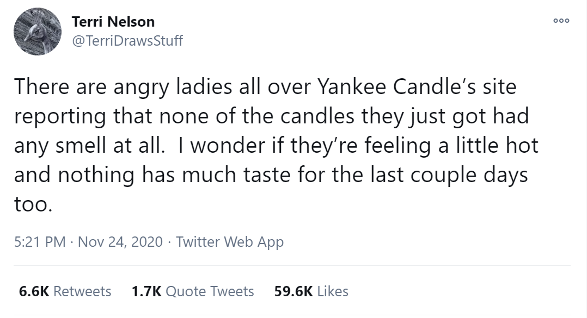
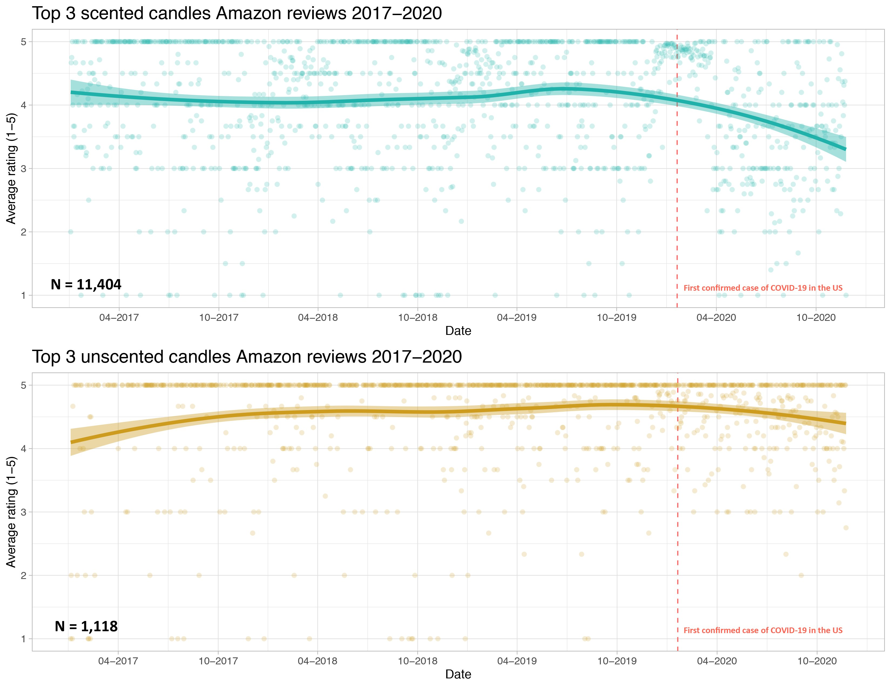
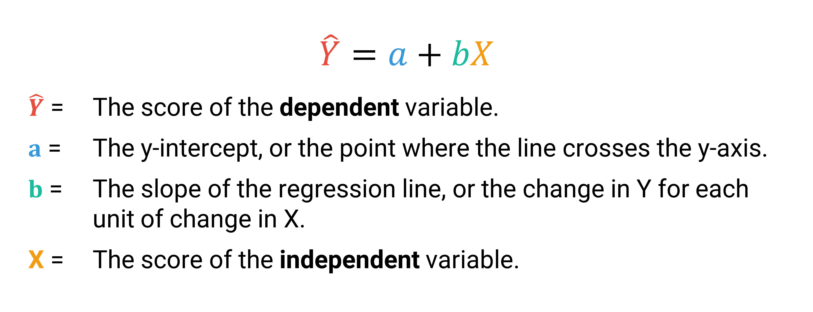
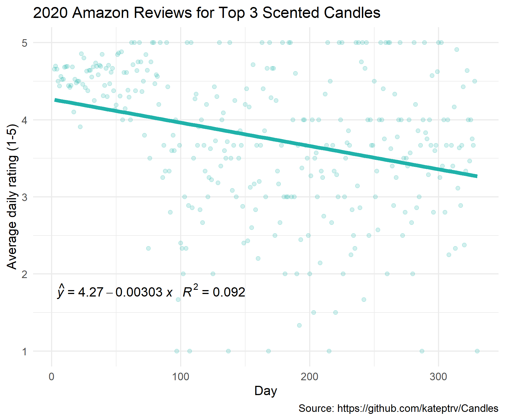
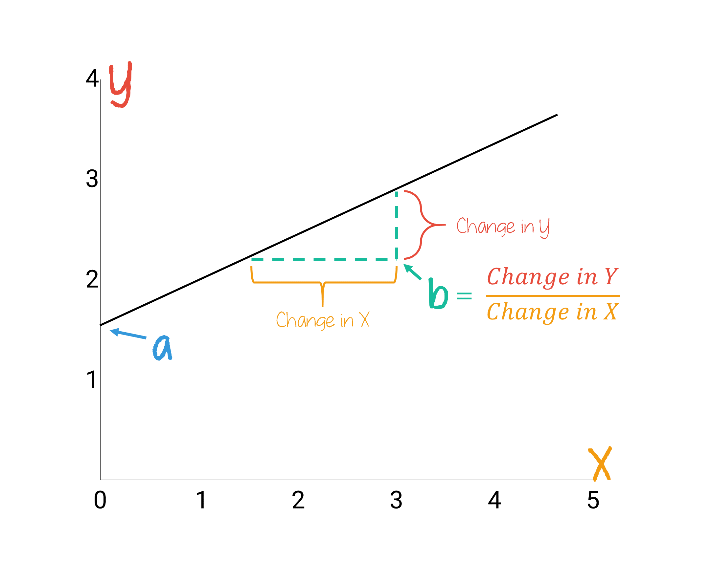
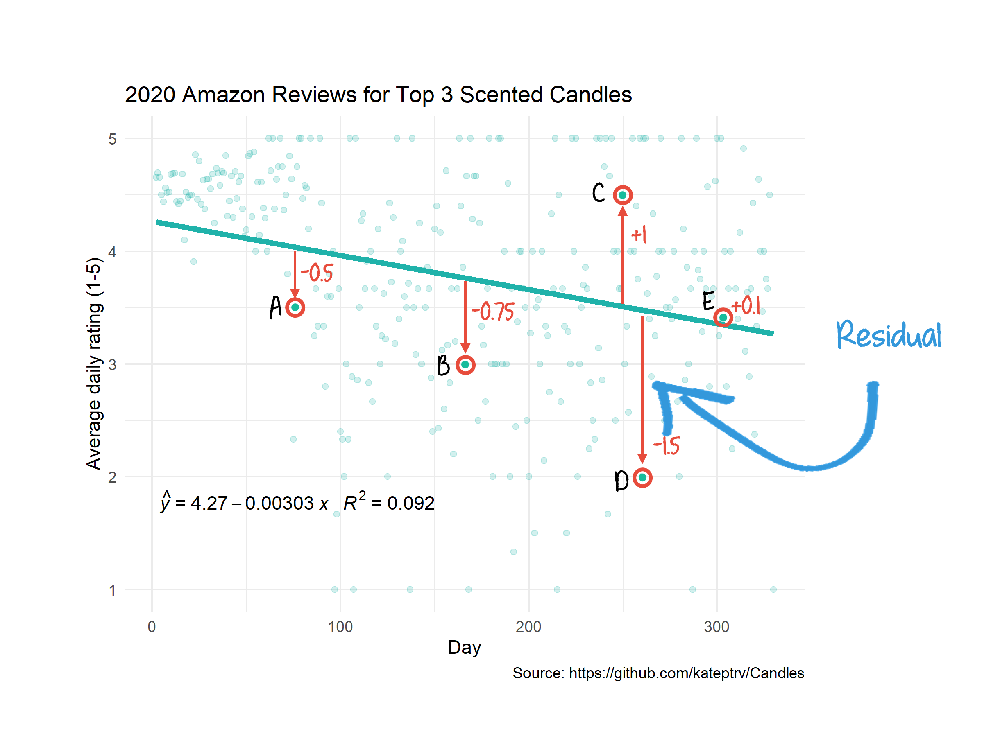
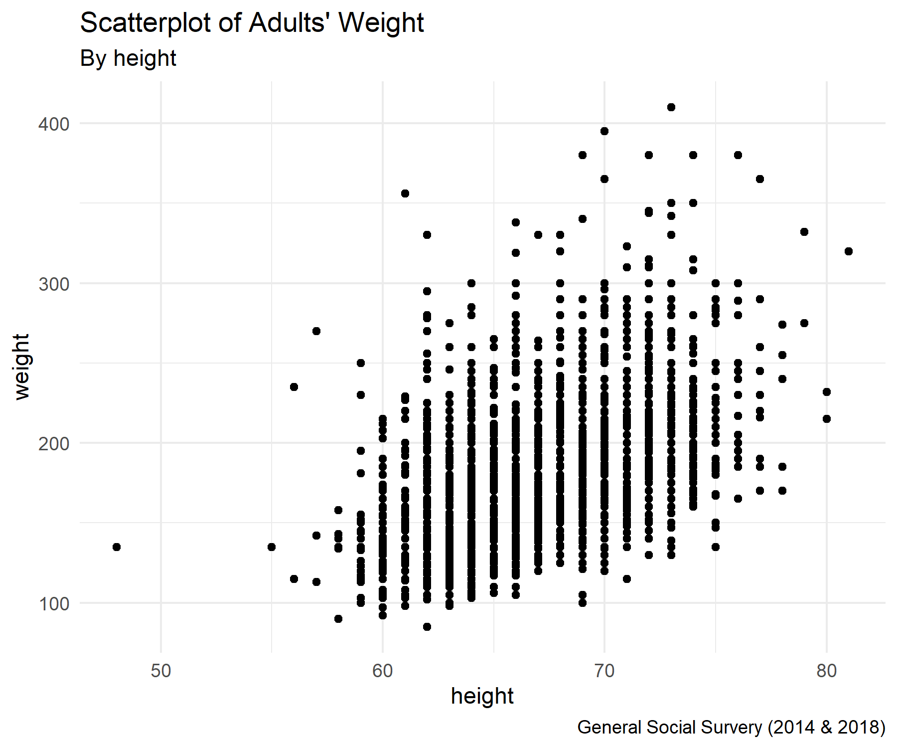

```{r}
#| label: setup
#| message: false
#| include: false

# GLOBAL ENVIRONMENT PANE
## source("tutorials/SOC6302-03/custom-setup-styles.R")
## library(gssr)
## library(gssrdoc)
## data(gss_all)
## gss24 <- gss_get_yr(2024)

library(moderndive) # regression output
library(gtsummary) # tbl_cross

## Load packages, custom functions, and styles
source("custom-setup-styles.R")

## Load all gss
#gss_all <- readRDS("data/gss_all.rds")

# Get the data only for the 2022 survey respondents
gss22 <- readRDS("data/gss22.rds")

# Override default discrete color and fill scales
scale_colour_discrete <- function(...) scale_color_manual(values = my_palette)

## Options
tutorial_options(exercise.checker = gradethis::grade_learnr)
options(dplyr.summarise.inform=F)   # Avoid grouping warning
options(digits=4)                   # Round numbers
theme_set(theme_minimal())          # set ggplot theme
# st_options(freq.report.nas = FALSE) # remove extra columns in freq()
 # any reason need to see this?!?! CHECK FOR SP22
  
knitr::opts_chunk$set(echo = FALSE,
                      warning = FALSE, 
                      messages = FALSE)
```

<link href="https://fonts.googleapis.com/css2?family=Shadows+Into+Light&display=swap" rel="stylesheet">

```{=html}
<script>
  document.addEventListener("DOMContentLoaded", function () {
    document.querySelectorAll("a[href^='http']").forEach(function(link) {
      link.setAttribute("target", "_blank");
      link.setAttribute("rel", "noopener noreferrer");
    });
  });
</script>
```

Bivariate Regression
--------------------------------------------------------------------------------


{width="25%"}

`r fa("fas fa-lightbulb", fill = "#18BC9C")` [**LEARNING OBJECTIVES**]{style="color: #18BC9C;"}

1. Describe linear relationships for bivariate regression models.
2. Interpret the intercept and slope
3. Interpret the goodness of fit ($R^2$).

<br>

`r fa("fas fa-book", fill = "#18BC9C")` [**READINGS**]{style="color: #18BC9C;"}

Readings are available on Quercus.

1. Wheelan, Charles. 2014. “Regression Analysis: The Miracle Elixir.” Pp. 185–211 in *Naked Statistics: Stripping the Dread from the Data*. New York: W. W. Norton & Company.  

<br>

`r fa("fas fa-language", fill = "#18BC9C")` [**TERMS**]{style="color: #18BC9C;"}

* REGRESSION EQUATION  
* $a$ (Y-INTERCEPT)
* $b$ (SLOPE)
* OLS REGRESSION
* LEAST-SQUARES LINE
* RESIDUAL
* $R^2$

Simple Regression
--------------------------------------------------------------------------------

### Review 

[Terri Nelson](https://twitter.com/TerriDrawsStuff/status/1331362372179554304) pointed out on Twitter that there were numerous complaints that people's Yankee candles did not have any smell. 
Because the loss of smell (and taste) is one of the known symptoms of COVID-19, 
Terri wondered if COVID-19 was leading to increasing complaints about non-smelling candles, rather than the candles actually being defective.  

<center>{width=60%}</center>
  
<br>

If this research hypothesis is true, that COVID-19 is associated with more complaints about non-smelling candles, there should be a change in the average ratings of candles after the COVID-19 pandemic began.  
  
The null hypothesis would be that there is no change in the average ratings of candles before and after the COVID-19 pandemic started.  
  
In order to examine the relationship, **[Kate Petrova](https://twitter.com/kate_ptrv/status/1332398743325446147)** created a scatterplot to find out.  
  
  
{ width=90% }
  
<br>
  
The candle scatterplot shows the relationship between time (independent variable) and average ratings of 3 popular candles (dependent variable). Each dot represents a candle rating. The line shows the average candle rating for each time point. The shaded area around the line represents the standard errors for each average.  
  
The average candle rating stayed above 4 points until the beginning of the pandemic. The average appears to drop about 1 month after the pandemic began. By November, the average appears to be less than 3.5.  
  
With this scatterplot, we find evidence to reject the null hypothesis. In other words, the scatterplot is consistent with the research hypothesis.  

<br>
  
#### Elaboration
  
Another way to evaluate this hypothesis is to determine whether the reviews are **conditional** on the candle being scented. Maybe candle reviews were declining for a reason other than a lack of smell. If the research hypothesis is true, the decline in reviews should be evident for scented candles but there should be no change in average reviews for unscented candles.  
  
So, Kate Petrova checked this out too. She created two scatterplots, one for scented candle reviews and one for unscented candle reviews.  
  
{ width=90% }
  
Notice that unlike the scented candle reviews, the review averages for unscented candles stays relatively flat across time. Thus, the decline in candle reviews since the start of the pandemic does appear to be **conditional** on whether the candle was scented or unscented. 
These findings suggest the decline is consistent with a loss of smell among candle reviewers.  
  
We can also formally test whether the average review score of scented candles has been declining over the course of the year, as an increasing number of people contracted COVID-19.  

<br>
  
#### Pearson’s Correlation Coefficient (R)

::: my-def
#### Pearson’s Correlation Coefficient

A measure of association between two interval-ratio level variables.
:::
  
  
[**r ranges from -1 to +1**]{style="color: #18bc9c"}  

-1: 	perfect negative correlation  
 0: 	no relationship  
 1: 	perfect positive correlation  
  
  
[**Strength of relationship**]{style="color: #18bc9c"}  

Strong:     Over 0.6  
Moderate:   0.3 to 0.5  
Weak:       0.1 to 0.2  
Very weak:  Below 0.1  

  
In our candle example, the R value for scented candles was -0.346, whereas the R value for unscented candles was -.134. Therefore, we could say:

There is a moderately negative relationship between reviews for scented candles and day of the year.  Increases in the day of the year was correlated with decreases in average reviews for scented candles (r = -0.346, p < .001). Comparatively, the relationship between day of the year and reviews for unscented candles was weakly negative (r = -.134, p < .001).  
  
In both cases the relationships are statistically significant. But the strength of the relationship between candle reviews and day of the year was substantially much stronger for the scented candles than for the unscented candles.  
  
### Regression Line

Watch this short [video](https://youtu.be/VqD-nf1YUks) for an introduction to regression analysis [5 minutes].  

  
#### Equation
  
The best fitting line is represented as an equation:

{ width=100% }
  
  
Let's walk through each part of this equation with the candle example. 
The following is a scatterplot of the reviews in 2020. 
The x-axis shows the day of the year and the y-axis shows the average rating for each day. 

  
{ width=80% }
  
<br>  

The figure also shows the regression equation.   
  
### $a$ (y-intercept)  

The y-intercept is represented as $a$, the value of Y when X is equal to 0. 
The y-intercept is the place where the regression line crosses the y-axis.  

::: my-tip
#### Heads Up!

$a$ is sometimes expressed as $b_0$.
:::
  
In our example, $a$ is equal to 4.27. What does 4.27 mean exactly? 

In this example, on day zero of 2020 (meaning the last day of 2019), our model would predict the average rating of scented candles would be 4.27 (out of 5).  
  
Often times the y-intercept in a regression equation doesn't make much sense, because in the real world, the data wouldn't exist. For example, if we were predicting average income by age, the intercept would denote the average income of an infant (0 years old), but this is unlikely to be meaningful, since infants don't earn money. Still, the intercept is an important part of the equation, which you'll soon see.  
  
Watch this short [video](https://youtu.be/00YVR5TSZqw) for another example of interpreting the y-intercept ($a$) of a regression model [2 minutes].
  

  
  
***
   
`r fa("otter", fill = "#F39C12")`<practice> PRACTICE:</practice>

{ width=100% }
  
  
```{r P01, echo=FALSE}
question("What does it mean that the value of $a$ is 15.6?",
    answer("When ideal age of marriage for women is 0, the ideal age of marriage for men is predicted to be 15.65 years.", correct = TRUE, 
           message = "This is a good example of the y-intercept not having a meaningful interpretation."),
    answer("The model indicates that each 1 year increase in women's ideal age of marriage was associated with an increase of 15.65 years in men's ideal age of marriage.", 
           message = "That would lead to really big age gaps in marriages!"),
    answer("The model indicates that the average ideal age of marriage for women was 15.6.", 
           message = "Yikes! I hope not!"),
    answer("The model indicates that the average ideal age of marriage for men was 15.6.", 
           message = "Yikes! I hope not!"),
      random_answer_order = TRUE,
      allow_retry = TRUE
)
```
  
<br>  
  
### $b$ (Slope)  
  
The slope of the regression line, represented as $b$, is the change in the dependent variable for each change in the independent variable. 
As you move along the x-axis by 1, the value of the Y variable increases or decreases by the value of $b$. 
  
{ width=60% }
  
  
**Positive relationship**: When $b$ is positive, then when X increases, Y increases

**Negative relationship**: When $b$ is negative, then when X increases, Y decreases  
  
  
In our candle example, the slope $b$ was -.00303. This means that the average rating of scented candles is expected to decrease by .00303 points per day, on average.  
  
This is such a small number, we might want to turn the slope into a weekly change instead of a daily change by multiplying .00303 by 7. Then we could say that the average rating of scented candles is expected to decrease by .02 points (.00303 * .7) each week, on average.  
  
Watch this short [video](https://youtu.be/PplggM0KtJ8) for an explanation of how to interpret the slope of a regression line [3 minutes].  
  

  
  
***
  
`r fa("otter", fill = "#F39C12")`<practice> PRACTICE:</practice>

{ width=70% }

```{r P02, echo=FALSE}
question("What is the best interpretation of $b$ (.463)?",
    answer("For every one unit increase in the ideal age of marriage for women, the ideal age of marriage for men is expected to rise by 0.46 years.", correct = TRUE),
    answer("The model predicts that the average ideal age of marriage for men is 0.46 years greater than average ideal age of marriage for women.", 
           message = "The slope is a measure of change for every 1 unit change in the independent variable, not a measure of difference between averages."),
    answer("The model predicts that men's ideal age of marriage will increase by 0.46 years for every year men age.", 
           message = "The indepenent variable in this model is not men's age."),
    answer("For every one unit increase in the ideal age of marriage for men, the ideal age of marriage for women is expected to rise by 0.46 years.",
           message = "You're close! The independent and dependent variable are reversed in this statement."),
         random_answer_order = TRUE,
         allow_retry = TRUE
)
```

<br>
  
### OLS  
  
To determine exactly where to draw the regression line, 
we have to find the **least-squares line**.  
  
::: my-def
#### Least-squares Line

The best-fitting line is the one that generates the least amount of error.
:::

The error (vertical distance) between the actual data point ($Y$) and the predicted data point ($\hat{Y}$) is referred to as a **residual**.  
  
{ width=100% }
  
Data points above the line will have a positive residual and data points below the line will have a negative residual. In the candle example, the line fits point A better than it fits point B, but not as well as it fits point E.  
  
The best fitting line (regression line) is the one that minimizes the sum of the **squared residuals**. 
Squaring the residuals removes the negative signs (so the errors don't cancel each other out when they are summed) and the larger residuals are weighted more heavily.    
  
The statistical technique that produces the least-squares line is called **Ordinary Least-squares Regression** (OLS), or sometimes shortened to simply linear regression. Calculus is used to determine the formula. 
  
### Predictions  
  
We can use the equation for the best fitting line to predict the value of the dependent variable once we know the y-intercept ($a$) and the slope of the line ($b$). Meaning, this equation can be used to obtain a predicted value for a value of y, given any x value.  
  
The predicted y variable is denoted as $\hat{Y}$ (pronounced "Y hat"). In other words, $\hat{Y}$ is the predicted value of the dependent variable, based on a given value of the independent variable.  
  
Refer back to the candle example. The regression equation was: $\hat{Y}$ = 4.27 -.00303$x$. 
Suppose we want to know what the average rating for scented candles might be 2 months into the year, or the 60th day of the year. Our equation would look like this:

  $\hat{Y}$ = 4.27 -.00303*60  
  $\hat{Y}$ = 4.27 -.1818  
  $\hat{Y}$ = 4.0882  
    
    
Stated more plainly, our model predicts that the average candle rating on the 60th day of the year would be 4.0882.
  
  
***
  
`r fa("otter", fill = "#F39C12")`<practice> PRACTICE:</practice>

  
{ width=70% }

```{r P03, echo=FALSE}
question("What would men's ideal age of marriage be if women's ideal age of marriage is 18?",
    answer("23.93", correct = TRUE),
    answer("18"),
    answer("33.6"),
    answer("15.6"),
      random_answer_order = TRUE,
      allow_retry = TRUE
)
```
  
  
```{r P04, echo=FALSE}
question("What would men's ideal age of marriage be if women's ideal age of marriage is 26?",
    answer("27.64", correct = TRUE),
    answer("15.6"),
    answer("41.6"),
    answer("26"),
      random_answer_order = TRUE,
      allow_retry = TRUE
)
```
  
    
```{r P05, echo=FALSE}
question("What would men's ideal age of marriage be if women's ideal age of marriage is 32?",
    answer("30.42", correct = TRUE),
    answer("32.46"),
    answer("47.6"),
    answer("35"),
      random_answer_order = TRUE,
      allow_retry = TRUE
)
```
 
<br>
 
#### A word of caution
  
Predictions using the regression line should typically only be used within the range of the x values. 
Making predictions beyond the scope of the actual data, called extrapolation, can be highly misleading.

{ width=60% }

<br>  
  
### Regression in R

Let's try running a regression using R.

We'll start by creating a scatterplot showing the relationship between people's height and weight. 
In 2022, the GSS asked respondents "About how much do you weigh without shoes?" (`weight`) and "About how tall are you without shoes? (`height`). People's weights were reported in pounds and height reported in inches.  
  
::: my-tip
#### Heads Up!

The x-axis of a scatterplot contains the independent variable and the y-axis contains the dependent variable.  
:::

  
`r fa("otter", fill = "#F39C12")`<practice> PRACTICE:</practice>
  
```{r P06, echo=FALSE}
  question("Which variable will go along the y-axis of a scatterplot?",
    answer("weight",  correct = TRUE),
    answer("height", message = "A person's height doesn't usually depend on their weight."),
      random_answer_order    = TRUE,
      allow_retry = TRUE
  )
```
  
  
#### Jitter and alpha  
  
We'll turn to the now familiar `ggplot()` function to create a graph. Instead of using `geom_point()`, this time we'll add the `geom_jitter()` layer to `ggplot()`.  
  
**Jittering** is a method for adding a small amount of random variation to the location of each point (observation) in the dataset. Why would we want to add random error into our plot? It's useful when variables are round, concrete numbers (**discrete**). Although weight and height are technically continuous (can be any number with lots of decimal places), in social surveys, many interval-ratio variables are recorded as discrete numbers.  
  
Without *jittering*, scatterplots can be difficult to read because the points overlap one another. For instance, in the plot below, it's hard to know how many people are 60 inches and 150 pounds. The dot could represent one person or hundreds, all plotted on top of each other.  
  
{ width=100% }
  
Adding random noise to a plot can make it easier to read.  
  
The second way to improve a scatterplot is to modify the transparency of the values. 
We'll do this by defining an [alpha level](https://ggplot2.tidyverse.org/reference/aes_colour_fill_alpha.html) inside of the `geom_jitter()` layer. The amount of transparency can range from 0 to 1, with lower alpha values corresponding to more transparency.  

***
  
`r fa("otter", fill = "#F39C12")`<practice> PRACTICE:</practice>

1. Tell `ggplot()` to put the variables `weight` and `height` on the correct axes. 
2. Run the code to see your results. 
3. When you are satisfied with your answer, click "Submit Answer."  
  
  
```{r scat01, exercise=TRUE, error= TRUE, warning=FALSE}
gss22 |>
  filter(weight < 600) |>
  ggplot(aes(x = ______, y = ______)) +
    geom_jitter(alpha = 0.2) +
    labs( title    = "Scatterplot of Adults' Weight",
          subtitle = "By height",
          caption  = "2022 U.S. General Social Survey")
```
  
```{r scat01-solution}
gss22 |>
  filter(weight < 600) |>
  ggplot(aes(x = height, y = weight)) +
    geom_jitter(alpha = 0.2) +
    labs( title    = "Scatterplot of Adults' Weight",
          subtitle = "By height",
          caption  = "2022 U.S. General Social Survey")
```
  
```{r scat01-hint-1, error=TRUE}
gss22 |>
  filter(weight < 600) |>
  ggplot(aes(x = height, y = ______)) +
    geom_jitter(alpha = 0.2) +
    labs( title    = "Scatterplot of Adults' Weight",
          subtitle = "By height",
          caption  = "2022 U.S. General Social Survey")
```
  
```{r scat01-check}
grade_code("What a nice graph!")
```

In the scatterplot, we can see that there appears to be a positive correlation between height and weight. 
Taller people appear to weigh more, on average. Let's add a regression line, the line that creates the least amount of error in the distance between the line and each data point.  
  
To add the regression line to our plot, we'll use the `geom_smooth()` to add this layer. 
Inside the `geom_smooth()` function, we'll add the argument `method = "lm"` to specify that the smoothed line we want on the plot is a linear model (a straight line).  
  
Add it to your plot now.  
  
::: my-tip
#### Heads Up!
  
"lm" stands for **L**inear **M**odel  
:::
  
***
  
`r fa("otter", fill = "#F39C12")`<practice> PRACTICE:</practice>

1. Specify the method to use in the `geom_smooth()` layer is a liner model ("lm"). 
2. Run the code to see your results. 
3. When you are satisfied with your answer, click "Submit Answer."  
  
  
```{r scat02, exercise=TRUE, error= TRUE, warning=FALSE, message = FALSE}
gss22 |>
  filter(weight < 600) |>
  ggplot(aes(x = height, y = weight)) +
  geom_jitter(alpha = 0.2) +
  geom_smooth(method = "__") +
  labs( title    = "Scatterplot of Adults' Weight",
        subtitle = "By height",
        caption  = "General Social Survey (2014 & 2018)")
```
  
```{r scat02-solution}
gss22 |>
  filter(weight < 600) |>
  ggplot(aes(x = height, y = weight)) +
  geom_jitter(alpha = 0.2) +
  geom_smooth(method = "lm") +
  labs( title    = "Scatterplot of Adults' Weight",
        subtitle = "By height",
        caption  = "General Social Survey (2014 & 2018)")
```
  
<div id="scat02-hint">
**Hint:** Did you replace the blank line with the type of line as "lm"?
</div>  
  
```{r scat02-check}
grade_code("A regression line!")
```

<br>

The `lm()` function runs a regression for us in R. The syntax looks like this:  

>   lm(DV ~ IV, data = dataname)
    
See how it works by trying it out now.  

***
  
`r fa("otter", fill = "#F39C12")`<practice> PRACTICE:</practice>

1. Replace the blank lines in the code below, specifying `weight` as the dependent variable and `height` as the independent variable. 
2. Run the code to see your results. 
3. When you are satisfied with your answer, click "Submit Answer."  
  
```{r reg01, exercise=TRUE, error= TRUE, warning=FALSE}
lm(______ ~ ______, data = gss22)
```
  
```{r reg01-solution}
lm(weight ~ height, data = gss22)
```
  
```{r reg01-hint-1, error=TRUE}
lm(weight ~ ______, data = gss22)

```
  
```{r reg01-check}
grade_code("Your first regression!")
```

```{r P07, echo=FALSE}
question("What does it mean that the value of $a$ is -145.40?",
    answer("When a person's height is 0 inches, their predicted weight is -145.40 pounds.", 
           correct = TRUE, message = "Another meaningless intercept value!"),
    answer("The model indicates that each 1 inch increase in height was associated with a decrease in -145.40 pounds.", message = "Lots of imaginary people!"),
    answer("The model indicates that the average height in inches is -145.40."),
    answer("The model indicates that the average weight in pounds is -145.40."),
      random_answer_order = TRUE,
      allow_retry = TRUE
)
```
  
```{r P08, echo=FALSE}
question("What is the best interpretation of the slope (4.938)?",
    answer("For every one unit increase in height, a person's weight is expected to rise by 4.938 pounds.", correct = TRUE),
    answer("The model predicts that the average weight is 4.938 pounds greater than the average height in inches."),
    answer("When a person's height is 0 inches, their predicted weight is 4.938 pounds."),
    answer("For every one unit increase in a person's weight, a person's height is expected to rise by 4.938 inches."),
         random_answer_order = TRUE,
      allow_retry = TRUE
)
```

Categorical IV
--------------------------------------------------------------------------------

### Dichotomous Independent Variable  
  
Regression can be used to evaluate the relationship between a categorical variable and an interval-ratio dependent variable. When a dichotomous variable is coded as 0/1, a one unit difference represents switching from one category to the other.  
  
* The intercept (α) is the average among the group coded as 0.  
* The intercept (α) + the slope (b1) is the average among the group coded as 1.  
* The slope (b1) is the average difference between group 1 and group 2.  

Run a regression looking at the difference in height by gender.
  
`r fa("otter", fill = "#F39C12")`<practice> PRACTICE:</practice>

1. Replace the blank lines in the code below, specifying `height` as the dependent variable and `sex` as the independent variable. 
2. Run the code to see your results. 
3. When you are satisfied with your answer, click "Submit Answer."  

```{r sex01-setup}
gss22$sex <- zap_missing(gss22$sex)
gss22$sex <- as_factor(gss22$sex)
gss22$sex <- droplevels(gss22$sex)
```
  
```{r sex01, exercise=TRUE, error= TRUE, warning=FALSE}
lm(______ ~ ______, data = gss22)
```
  
```{r sex01-solution}
lm(height ~ sex, data = gss22)
```

```{r sex01-hint-1, error=TRUE}
lm(height ~ ______, data = gss22)

```

Now, something magical happens in how you can interpret the *intercept* ($a$) and the *slope* ($b_1$).  

The *MEAN* of the missing category in the table is the intercept ($a$). In this case, the men are missing from the output. The intercept ($a$) is 70.19 which means that men's average height is 70.19 inches.
  
We refer to the category missing from the table as the reference category because the slopes represent the difference in averages in relation to this group. 

So, $b$ is the difference in means between the reference category (aka male) and the category listed in the table (female).  
  
Here, $b$ = -5.57. Meaning, women are -5.57 inches shorter than men on average. 
If you add the intercept (70.19) and $b$ (-5.57), you'll get the average height for women = 64.62.

<br>

***

`r fa("otter", fill = "#F39C12")`<practice> PRACTICE:</practice>

Run a regression looking at the difference in family income by gender.

1. Replace the blank lines in the code below, specifying `realinc` as the dependent variable and `sex` as the independent variable. 
2. Run the code to see your results. 
3. When you are satisfied with your answer, click "Submit Answer."  
  
```{r sex02-setup}
gss22$sex <- zap_missing(gss22$sex)
gss22$sex <- as_factor(gss22$sex)
gss22$sex <- droplevels(gss22$sex)
```
  
```{r sex02, exercise=TRUE, error= TRUE, warning=FALSE}
lm(______ ~ ______, data = gss22)
```
  
```{r sex02-solution}
lm(realinc ~ sex, data = gss22)
```
  
```{r sex02-hint-1, error=TRUE}
lm(realinc ~ ______, data = gss22)

```

```{r P09, echo=FALSE}
question("What is men's average income?",
    answer("$45,843", correct = TRUE, 
           message = "Yes, α is the mean for the reference category."),
    answer("$-6,908",
           message = "This is the difference in income between men and women."),
    answer("There isn't enough information in the table to determine.",
           message = "α is the mean for the reference category."),
    answer("$38,935", 
           message = "This is the average income for women."),
         random_answer_order = TRUE,
         allow_retry = TRUE
)
```
  
```{r P10, echo=FALSE}
question("What is women's average income?",
    answer("$19,979", correct = TRUE, 
           message = "The intercept + the slope for women (30,560 - 10,581)."),
    answer("$30,560", message = "This is men's income. α is the value of y when X = 0."),
    answer("$-10,581",
           message = "This is the difference in income between men and women."),
    answer("There isn't enough information in the table to determine.",
           message = "The intercept (α) is the value of y when X = 0."),
         random_answer_order = TRUE,
         allow_retry = TRUE
)
```
  
  
<br>

### Nominal/Ordinal Independent Variable  

The same logic can be used for categorical variables by transforming them into a series of dichotomous variables.  

{ width=90% }
  
::: {style="color: #3498DB; font-family: 'Shadows Into Light'"}
The mean of the missing category in the table is the intercept ($a$).
:::
  
The group coded 0 across all of the dummy variables becomes the **"reference category."** 
The intercept ($a$) becomes the *MEAN* of the reference category. 

The slopes for each of the other categories represent the difference in averages in relation to the reference category.  
  
Let's look at an example. Below is a crosstab showing the relative frequencies of `lifenow`  by `marital`.

```{r, echo = FALSE}

gss22$marital <- zap_missing(gss22$marital)
gss22$marital <- as_factor(gss22$marital)
gss22$marital <- droplevels(gss22$marital)

gss22 |>
  tbl_cross(
    row = lifenow,
    col = marital,
    percent = "column")
```
  
<br>

***
  
`r fa("otter", fill = "#F39C12")`<practice> PRACTICE:</practice>

Run a regression looking at the difference in life satisfaction by marital status.  
  
1. Replace the blank lines in the code below, specifying `lifenow` as the dependent variable and `marital` as the independent variable. 
2. Run the code to see your results. 
3. When you are satisfied with your answer, click "Submit Answer."  
  
```{r marital01-setup}
gss22$marital <- zap_missing(gss22$marital)
gss22$marital <- as_factor(gss22$marital)
gss22$marital <- droplevels(gss22$marital)
```

```{r marital01, exercise=TRUE, error= TRUE, warning=FALSE}
lm(______ ~ ______, data = gss22)
```
  
```{r marital01-solution}
lm(lifenow ~ marital, data = gss22)
```
  
```{r marital01-hint-1, error=TRUE}
lm(lifenow ~ ______, data = gss22)

```

<br>

The *MEAN* of the missing category in the table is the intercept ($a$). In this case, married people are missing from the output. The intercept ($a$) is 8.329 which means that average life satisfaction for married people is 8.329 (on a scale from 0-10).

There is a $b$ for each marital category which represents the difference in means between the reference category (e.g., married) and each other category.  
  
The $b$ for widowers is -0.239. Meaning, the average life satisfaction of widowers is -0.239 points lower on the scale compared with the average for married people. 

If you add the $a$ intercept (8.329) and $b$ (-0.239), you'll get the average life satisfaction for widowers = 8.09.

You can do the same thing for each of the other categories. Let's try never married people. The $b$ for never married folks is -0.865. In other words, the average life satisfaction of never married people is -0.865 points lower on the scale compared with the average for married people. We could also say the average life satisfaction for married people is 8.33 whereas the average life satisfaction for never married people is 7.464 (8.329-.865).

::: my-tip
#### Heads Up!

Referring to the “slope” of marital status doesn’t make sense. Rather, when talking about $b$ for categorical variables, it represents the difference in the constant (or “level”).
:::

***

`r fa("otter", fill = "#F39C12")`<practice> PRACTICE:</practice>

Run a regression looking at the difference in income by marital status.  
  
1. Replace the blank lines in the code below, specifying `realinc` as the dependent variable and `marital` as the independent variable. 
2. Run the code to see your results. 
3. When you are satisfied with your answer, click "Submit Answer."  
  
```{r marital02-setup}
gss22$marital <- zap_missing(gss22$marital)
gss22$marital <- as_factor(gss22$marital)
gss22$marital <- droplevels(gss22$marital)
```

```{r marital02, exercise=TRUE, error= TRUE, warning=FALSE}
lm(______ ~ ______, data = gss22)
```
  
```{r marital02-solution}
lm(realinc ~ marital, data = gss22)
```
  
```{r marital02-hint-1, error=TRUE}
lm(realinc ~ ______, data = gss22)

```


```{r P11, echo=FALSE}
question("What is the average income of married people?",
    answer("$58,279", correct = TRUE, message = "Yes, α is the value of y when X = 0."),
    answer("$-30,301",
           message = "This is the difference in income between never married and married people"),
    answer("There isn't enough information in the table to determine.",
           message = "The intercept (α) is the value of y when X = 0."),
    answer("$27,978", 
           message = "This is the average income for never married people."),
         random_answer_order = TRUE,
         allow_retry = TRUE
)
```
  
```{r P12, echo=FALSE}
question("What is the average income of never-married people?",
    answer("$27,978", correct = TRUE,
           message = "The intercept + the slope for never-married (58,279 - 30,301)."),
    answer("$58,279",  message = "α is the value of y when X = 0."),
    answer("$-30,301",
           message = "This is the difference in income between never married and married people"),
    answer("There isn't enough information in the table to determine.",
           message = "The intercept (α) is the value of y when X = 0."),
         random_answer_order = TRUE,
         allow_retry = TRUE
)
```
  

<br>


$R^2$
--------------------------------------------------------------------------------

The better a least-squares line is, the better it can predict an outcome with the least amount of error.

$r^2$ is a **p**roportional **r**eduction of **e**rror (PRE) measure, meaning that it measures the extent that knowing the value of one or more variables can help predict the value of the dependent variable. It tells us how well the regression model fits the data.  
  
$R^2$ quantifies how much prediction error is eliminated by using least-squares regression.  

$PRE = \frac{E1 - E2}{E1}$  

<br>
  
#### E1 = Errors of prediction made when IV is ignored  
  
E1 is equivalent to the sum of errors we would have if we guessed that every Y was equal to the mean of Y.  
  
[aka Sum of Squares Total (SST)]{style="color: #3498db; font-family: 'Shadows Into Light'"}  
 
<br>
 
#### E2 = Errors of prediction made based on IV  
  
Equivalent to the sum of errors we would have if we used our least squares line to predict Y  
  
[aka Sum of Squared Errors (SSE)]{style="color: #3498db; font-family: 'Shadows Into Light'"}  

<br>

$R^2$ ranges from 0 to 1, representing the proportion of the variance of a dependent variable that is explained by the independent variable(s) in a regression model.  
  
> When $R^2$ is equal to 0, there is no relationship between the two variables. 

Knowing the value(s) of the independent variable(s) does not help in predicting the value of the dependent variable. Our best guess of the dependent variable is the mean when the r-squared value is 0.  
  
> When $R^2$ is equal to 1, there is a perfect relationship between the variables. 

Knowing the value(s) of the independent variable(s) leads to a perfect prediction of the dependent variable.  
  
When observations are closely grouped around the regression line, the $R^2$ will be larger. 
In the social sciences, a high $R^2$ is rare (people are complicated!).  
  
  
__Watch this [video](https://youtu.be/8tAPsX0YuNE) for a summary of OLS & $R^2$ [12 minutes].__


  
  
  
In order to obtain the percentage of variation in the dependent variable explained by the independent variable(s), multiply $R^2$ by 100.  
   
In our candle example, the $R^2$ was .092. This means that knowing the day of the year has reduced the uncertainty of our prediction of the average rating of scented candles by 9.2%.  
  
Or, by knowing the day of the year of the candle review (independent variable), we reduce our error in predicting the average rating of scented candles (dependent variable) by 9.2%.  
  
Or, knowing the day of the year of the candle review (the independent variable) explains about 9.2% of the variation in the average review of scented candles (the dependent variable).  
  
  
***
  
`r fa("otter", fill = "#F39C12")`<practice> PRACTICE:</practice>

```{r P13, echo=FALSE}
question("The $R^2$ value of the relationship between men's ideal age of marriage and women's ideal age of marriage was .13. Which of the following statements best reflects an interpretation of this $R^2$?",
    answer("By knowing women's ideal age of marriage, we reduce our error in predicting men's ideal age of marriage by 13%.", correct = TRUE),
    answer("By knowing men's ideal age of marriage, we can predict women's ideal age of marriage with 13% accuracy."),
    answer("Men's ideal age of marriage is .13 years greater than women's.",
           message = "R-squared is a measure of the model fit."),
    answer("The unexplained variance in the model is 13%.", 
           message = "R-squared is a measure of explained variance."),
         random_answer_order = TRUE,
         allow_retry = TRUE
)
```
  
  
```{r P14, echo=FALSE}
question("The $R^2$ value of the relationship between gender and income was .034. Which of the following statements best reflects an interpretation of this $R^2$?",
    answer("By knowing someone’s gender, we reduce our error in predicting their income by 3%.", correct = TRUE),
    answer("By knowing someone’s gender, we can predict their income with 3% accuracy."),
    answer("Men’s income is .03 dollars greater than women's.",
           message = "R-squared is a measure of the model fit."),
    answer("By knowing someone’s income, we reduce our error in predicting their gender by 3%.", 
           message = "The IV and DV are switched."),
         random_answer_order = TRUE,
         allow_retry = TRUE
)
```
  
<br>

{ width=100% }
  
NOTE: $R^2$ in the graph is actually 0.02.  
  
  
### Summary

Put all the pieces back together to understand the regression technique by watching this [video](https://youtu.be/WWqE7YHR4Jc) [12 minutes].
  


<br>

Learning Check 08
--------------------------------------------------------------------------------

Please answer the following questions to verify you understand the
topics in this tutorial.
  
```{r Q01, echo=FALSE}
  question("Q01. The correlation (R) between women’s ideal age of marriage and men’s ideal age of marriage is 0.36. Thus, the association between these two variables could best be described as a:",
    answer("moderate positive relationship",  correct = TRUE),
    answer("moderate negative relationship"),
    answer("weak positive relationship"),
    answer("highly positive relationship"),
         random_answer_order = TRUE,
         allow_retry = TRUE
  )
```
  
```{r Q02, echo=FALSE}
  question("Q02. What is a least-squares line?",
    answer("The regression line that best fits the data, creating the least amount of error in the distance between the line and each data point.",  correct = TRUE),
    answer("A statistical representation of a relationship between an ordinal and a nominal variable."),
    answer("A measure of the proportional reduction of error."),
    answer("A regression line maximizes the sum of the squared residual values."),
         random_answer_order = TRUE,
         allow_retry = TRUE
  )
```
  
```{r Q03, echo=FALSE}
  question("Q03. Larger values of $R^2$ imply that the observations are more closely grouped around the",
    answer("least squares line.",  correct = TRUE),
    answer("average value of the independent variable(s)."),
    answer("average value of the dependent variable."),
    answer("average of the residuals."),
         random_answer_order = TRUE,
         allow_retry = TRUE
  )
```
  
  
Use the following regression equation to answer the next questions.

  $\hat{Y}$ = 20,000 + 250$X$
   
  
```{r Q04, echo=FALSE}
  question("Q04. Identify and interpret $a$",
    answer("$a$ is 20,000. When X is 0, Y is predicted to be 20,000.",  correct = TRUE),
    answer("$a$ is 250. For each one unit increase in X, Y increases by 250."),
    answer("$a$ is 20,000. When Y is 0, X is predicted to be 20,000."),
    answer("$a$ is 250. For each one unit increase in Y, X increases by 250."),
         random_answer_order = TRUE,
         allow_retry = TRUE
  )
```
  
```{r Q05, echo=FALSE}
  question("Q05. What would Y be if X was 25?",
    answer("26,250",  correct = TRUE),
    answer("20,275"),
    answer("26,025"),
    answer("20,625"),
         random_answer_order = TRUE,
         allow_retry = TRUE
  )
```
  
```{r Q06, echo=FALSE}
  question("Q06. What would Y be if X was 30?",
    answer("27,500",  correct = TRUE),
    answer("20,030"),
    answer("27,280"),
    answer("20,750"),
         random_answer_order = TRUE,
         allow_retry = TRUE
  )
```
  
```{r Q07, echo=FALSE}
question("Q07. The $R^2$ value of the relationship between age (IV) and income (DV) is .41. Which of the following statements best reflects an interpretation of this $R^2$?",
    answer("By knowing a person's age, we reduce our error in predicting their income by 41%.", correct = TRUE),
    answer("By knowing a person's income, we can predict their age with 41% accuracy."),
    answer("On average, people are about .41 years younger than their average income."),
    answer("The unexplained variance in the model is 41%."),
         random_answer_order = TRUE,
         allow_retry = TRUE
)
```
  
  
Use the following regression equation to answer the next questions.  

  $\hat{Y}$ = 14.8 + 0.501$X$
  
{ width=70% }
  
  
```{r Q08, echo=FALSE}
question("Q08. What does it mean that the value of $a$ is 14.8?",
    answer("When the years of education is 0, the age of first marriage is predicted to be 14.8 years.", correct = TRUE),
    answer("The model indicates that each 1 year increase in educational attainment was associated with an increase of 14.8 years in age at first marriage."),
    answer("The model indicates that the average age of first marriage is 14.8 years old."),
    answer("The model indicates that the average years of education is 14.8."),
         random_answer_order = TRUE,
         allow_retry = TRUE
)
```
  
```{r Q09, echo=FALSE}
question("Q09. What is the best interpretation of the slope (.501)?",
    answer("For every one unit increase in years of education, the age of first marriage is expected to rise by 0.501 years.", correct = TRUE),
    answer("The model predicts that the average age of first marriage is 0.501 years greater than average number of years of education."),
    answer("The model predicts that age of first marriage will be 0.501 years more than a person's years of education."),
    answer("For every one unit increase in the age of first marriage, the years of education is expected to rise by 0.501 years."),
         random_answer_order = TRUE,
         allow_retry = TRUE
)
```
  
```{r Q10, echo=FALSE}
question("Q10. What would be the predicted age of first marriage if someone had 16 years of education?",
    answer("22.82", correct = TRUE),
    answer("30.8"),
    answer("17.36"),
    answer("25"),
         random_answer_order = TRUE,
         allow_retry = TRUE
)
```

```{r Q11, echo=FALSE}
question("Q11. The $R^2$ value of the relationship between age at first marriage and years of education is .13. Which of the following statements best reflects an interpretation of this $R^2$?",
    answer("By knowing someone's years of education, we reduce our error in predicting their age at first marriage by 13%.", correct = TRUE),
    answer("By knowing someone's age at first marriage, we can predict someone's years of education with 13% accuracy."),
    answer("People's age at first marriage is .13 years greater than their years of education."),
    answer("The unexplained variance in the model is 13%."),
         random_answer_order = TRUE,
         allow_retry = TRUE
)
```
  
  
The following output shows the regression results predicting `weight` in pounds by `marital` status. Married people are the reference group.  
  
```{r}
mod <- lm(weight ~ marital, data = gss22)

get_regression_table(mod) |>
  select(term, estimate)
```

```{r Q12, echo=FALSE}
question("Q12. Identify and interpret $a$",
    answer("The average married person weighs 189 pounds", correct = TRUE),
    answer("By knowing someone's marital status, we can predict someone's weight with 189% accuracy."),
    answer("The model indicates that the average weight at first marriage is 189 pounds."),
    answer("For each one unit increase in X, Y increases by 189."),
         random_answer_order = TRUE,
         allow_retry = TRUE
)
```

```{r Q13, echo=FALSE}
question("Q13. What is the average weight of never married people?",
    answer("187 pounds", correct = TRUE),
    answer("197 pounds"),
    answer("There isn't enough information in the table to determine."),
    answer("189 pounds."),
         random_answer_order = TRUE,
         allow_retry = TRUE
)
```

```{r Q14, echo=FALSE}
question("Q14. Which of the following statements is correct?",
    answer("On average, separated people weigh more than married people.", correct = TRUE),
    answer("On average, married people weigh more than separated people."),
    answer("On average, divorced people weigh more than married people."),
    answer("On average, married people weigh more than all other marital status groups."),
         random_answer_order = TRUE,
         allow_retry = TRUE
)
```