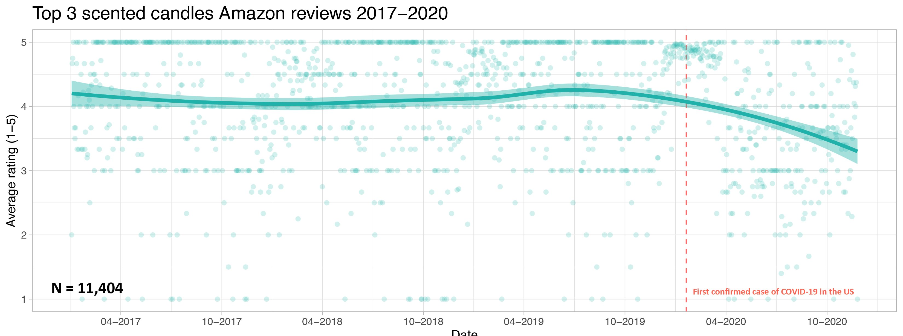
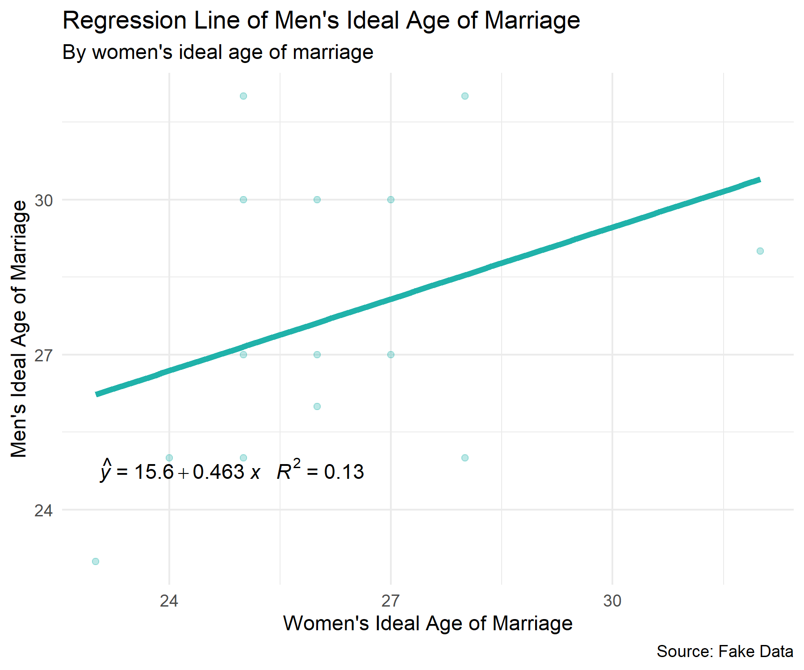
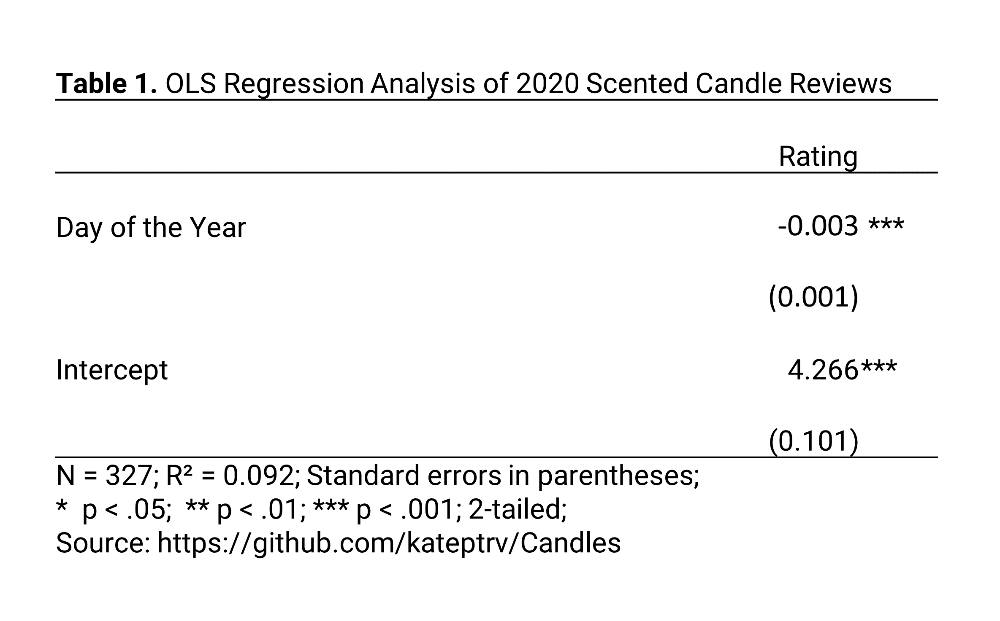
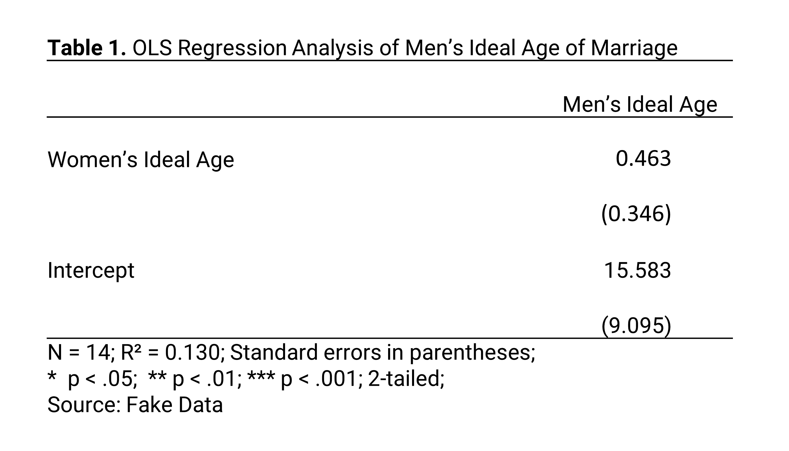
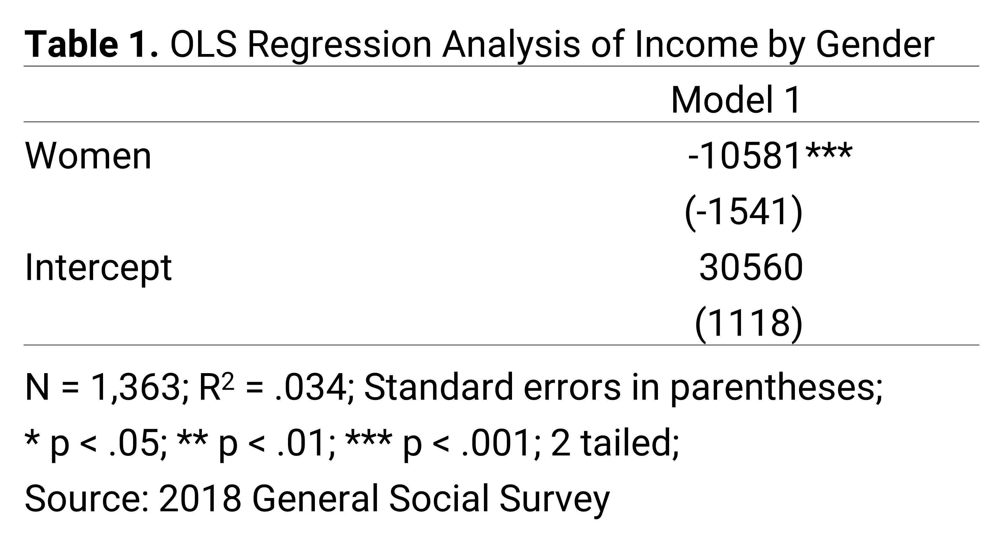
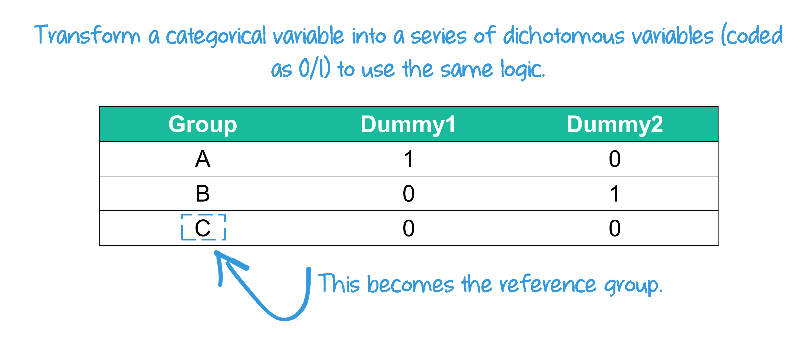
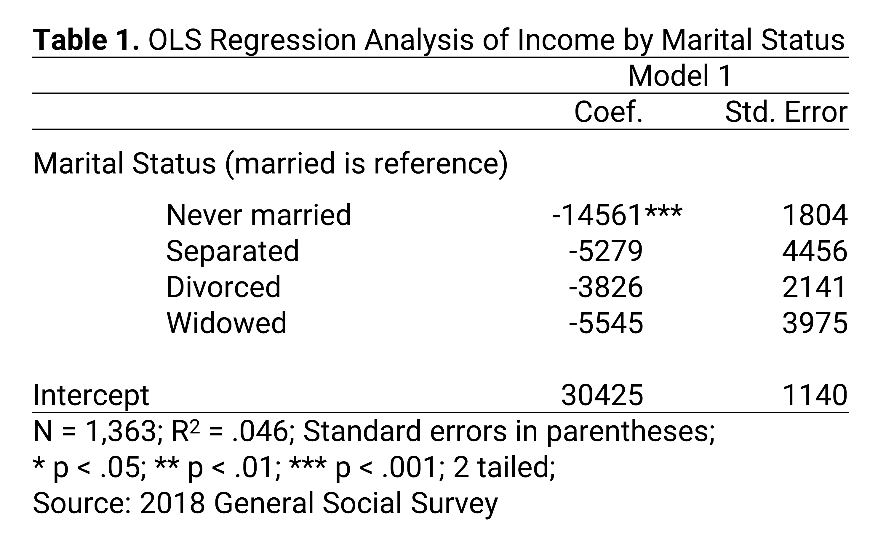
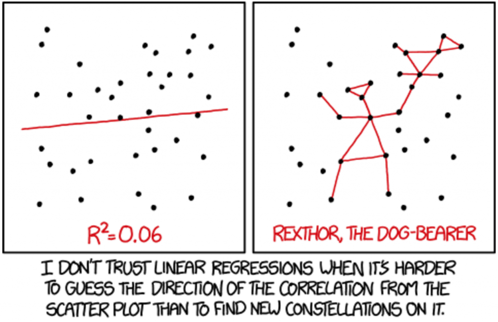
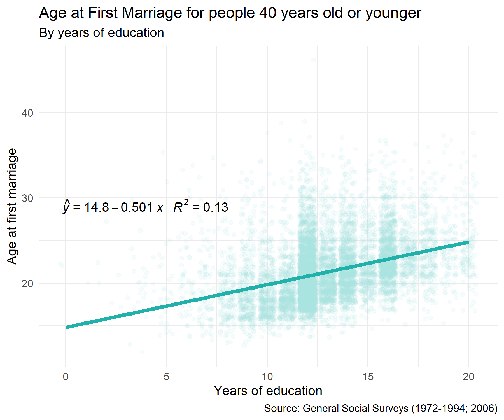
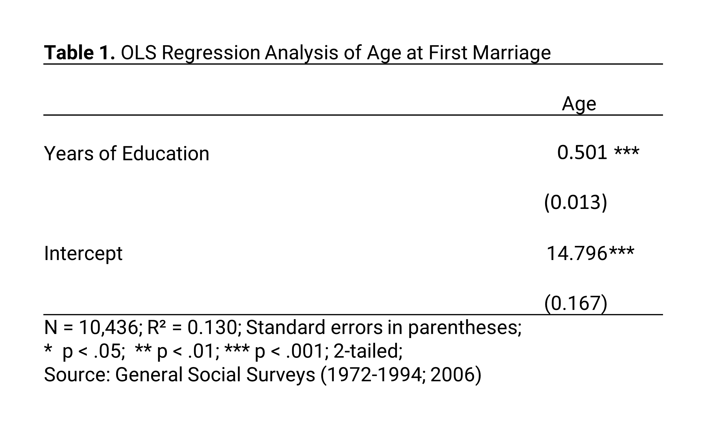

```{r}
#| label: setup
#| message: false
#| include: false

# GLOBAL ENVIRONMENT PANE
## source("tutorials/SOC6302-03/custom-setup-styles.R")
## library(gssr)
## library(gssrdoc)
## data(gss_all)
## gss24 <- gss_get_yr(2024)

## Load packages, custom functions, and styles
source("custom-setup-styles.R")

## Load all gss
#gss_all <- readRDS("data/gss_all.rds")

# Get the data only for the 2024 survey respondents
#gss24 <- readRDS("data/gss24.rds")

# Override default discrete color and fill scales
scale_colour_discrete <- function(...) scale_color_manual(values = my_palette)

## Options
tutorial_options(exercise.checker = gradethis::grade_learnr)
options(dplyr.summarise.inform=F)   # Avoid grouping warning
options(digits=4)                   # Round numbers
theme_set(theme_minimal())          # set ggplot theme
# st_options(freq.report.nas = FALSE) # remove extra columns in freq()
 # any reason need to see this?!?! CHECK FOR SP22
  
knitr::opts_chunk$set(echo = FALSE,
                      warning = FALSE, 
                      messages = FALSE)
```

<link href="https://fonts.googleapis.com/css2?family=Shadows+Into+Light&display=swap" rel="stylesheet">

```{=html}
<script>
  document.addEventListener("DOMContentLoaded", function () {
    document.querySelectorAll("a[href^='http']").forEach(function(link) {
      link.setAttribute("target", "_blank");
      link.setAttribute("rel", "noopener noreferrer");
    });
  });
</script>
```

Regression
--------------------------------------------------------------------------------


{width="25%"}

`r fa("fas fa-lightbulb", fill = "#18BC9C")` [**LEARNING OBJECTIVES**]{style="color: #18BC9C;"}

1. Describe linear relationships for bivariate regression models.
2. Interpret the intercept and coefficients.
3. Interpret the goodness of fit ($R^2$).

<br>

`r fa("fas fa-book", fill = "#18BC9C")` [**READINGS**]{style="color: #18BC9C;"}

Readings are available on Quercus.

1. Regression Analysis: The Miracle Elixir


<br>

`r fa("fas fa-language", fill = "#18BC9C")` [**TERMS**]{style="color: #18BC9C;"}

* REGRESSION EQUATION  
* $a$ (Y-INTERCEPT)
* $b$ (SLOPE)
* OLS REGRESSION
* LEAST-SQUARES LINE
* RESIDUAL
* COEFFICIENTS
* MULTIPLE REGRESSION
* STATISTICAL SIGNIFICANCE
* $R^2$

Review 
--------------------------------------------------------------------------------

[Terri Nelson](https://twitter.com/TerriDrawsStuff/status/1331362372179554304) pointed out on Twitter that there were numerous complaints that people's Yankee candles did not have any smell. 
Because the loss of smell (and taste) is one of the known symptoms of COVID-19, 
Terri wondered if COVID-19 was leading to increasing complaints about non-smelling candles, rather than the candles actually being defective.  

<center>{width=60%}</center>
  
<br>

If this research hypothesis is true, that COVID-19 is associated with more complaints about non-smelling candles, there should be a change in the average ratings of candles after the COVID-19 pandemic began.  
  
The null hypothesis would be that there is no change in the average ratings of candles before and after the COVID-19 pandemic started.  
  
In order to examine the relationship, **[Kate Petrova](https://twitter.com/kate_ptrv/status/1332398743325446147)** created a scatterplot to find out.  
  
  
{ width=90% }
  
<br>
  
The candle scatterplot shows the relationship between time (independent variable) and average ratings of 3 popular candles (dependent variable). Each dot represents a candle rating. The line shows the average candle rating for each time point. The shaded area around the line represents the standard errors for each average.  
  
The average candle rating stayed above 4 points until the beginning of the pandemic. The average appears to drop about 1 month after the pandemic began. By November, the average appears to be less than 3.5.  
  
With this scatterplot, we find evidence to reject the null hypothesis. In other words, the scatterplot is consistent with the research hypothesis.  
  
#### Elaboration
  
Another way to evaluate this hypothesis is to determine whether the reviews are **conditional** on the candle being scented. Maybe candle reviews were declining for a reason other than a lack of smell. If the research hypothesis is true, the decline in reviews should be evident for scented candles but there should be no change in average reviews for unscented candles.  
  
So, Kate Petrova checked this out too. She created two scatterplots, one for scented candle reviews and one for unscented candle reviews.  
  
{ width=90% }
  
Notice that unlike the scented candle reviews, the review averages for unscented candles stays relatively flat across time. Thus, the decline in candle reviews since the start of the pandemic does appear to be **conditional** on whether the candle was scented or unscented. 
These findings suggest the decline is consistent with a loss of smell among candle reviewers.  
  
We can also formally test whether the average review score of scented candles has been declining over the course of the year, as an increasing number of people contracted COVID-19.  
  
#### Pearson’s Correlation Coefficient (R)
  
In our candle example, the R value for scented candles was -0.346, whereas the R value for unscented candles was -.134. Therefore, we could say:

There is a moderately negative relationship between reviews for scented candles and day of the year.  Increases in the day of the year was correlated with decreases in average reviews for scented candles (r = -0.346, p < .001). Comparatively, the relationship between day of the year and reviews for unscented candles was weakly negative (r = -.134, p < .001).  
  
In both cases the relationships are statistically significant. But the strength of the relationship between candle reviews and day of the year was substantially much stronger for the scented candles than for the unscented candles.  
  

 Regression Equation
--------------------------------------------------------------------------------

Watch this short [video](https://youtu.be/VqD-nf1YUks) for an introduction to regression analysis [5 minutes].  

  
#### Equation
  
The best fitting line is represented as an equation:

{ width=100% }
  
  
Let's walk through each part of this equation with the candle example. 
The following is a scatterplot of the reviews in 2020. 
The x-axis shows the day of the year and the y-axis shows the average rating for each day. 
The figure also shows the regression equation.  
  
{ width=80% }
  
<br>
  
### $a$ (y-intercept)

The y-intercept is represented as $a$, the value of Y when X is equal to 0. 
The y-intercept is the place where the regression line crosses the y-axis.  

::: my-tip
#### Heads Up!

$a$ is sometimes expressed as $b_0$.
:::
  
In our example, $a$ is equal to 4.27. What does 4.27 mean exactly? 

In this example, on day zero of 2020 (meaning the last day of 2019), our model would predict the average rating of scented candles would be 4.27 (out of 5).  
  
Often times the y-intercept in a regression equation doesn't make much sense, because in the real world, the data wouldn't exist. For example, if we were predicting average income by age, the intercept would denote the average income of an infant (0 years old), but this is unlikely to be meaningful, since infants don't earn money. Still, the intercept is an important part of the equation, which you'll soon see.  
  
Watch this short [video](https://youtu.be/00YVR5TSZqw) for another example of interpreting the y-intercept ($a$) of a regression model [2 minutes].
  

  
  
***
   
`r fa("otter", fill = "#F39C12")`<practice> PRACTICE:</practice>

{ width=100% }
  
  
```{r P01, echo=FALSE}
question("What does it mean that the value of $a$ is 15.6?",
    answer("When ideal age of marriage for women is 0, the ideal age of marriage for men is predicted to be 15.65 years.", correct = TRUE, 
           message = "This is a good example of the y-intercept not having a meaningful interpretation."),
    answer("The model indicates that each 1 year increase in women's ideal age of marriage was associated with an increase of 15.65 years in men's ideal age of marriage.", 
           message = "That would lead to really big age gaps in marriages!"),
    answer("The model indicates that the average ideal age of marriage for women was 15.6.", 
           message = "Yikes! I hope not!"),
    answer("The model indicates that the average ideal age of marriage for men was 15.6.", 
           message = "Yikes! I hope not!"),
      random_answer_order = TRUE,
      allow_retry = TRUE
)
```

<br>

### $b$ (Slope)

The slope of the regression line, represented as $b$, is the change in the dependent variable for each change in the independent variable. 
As you move along the x-axis by 1, the value of the Y variable increases or decreases by the value of $b$. 
  
{ width=60% }
  
  
**Positive relationship**: When $b$ is positive, then when X increases, Y increases

**Negative relationship**: When $b$ is negative, then when X increases, Y decreases  
  
  
In our candle example, the slope $b$ was -.00303. This means that the average rating of scented candles is expected to decrease by .00303 points per day, on average.  
  
This is such a small number, we might want to turn the slope into a weekly change instead of a daily change by multiplying .00303 by 7. Then we could say that the average rating of scented candles is expected to decrease by .02 points (.00303 * .7) each week, on average.  
  
Watch this short [video](https://youtu.be/PplggM0KtJ8) for an explanation of how to interpret the slope of a regression line [3 minutes].  
  

  
  
***
  
`r fa("otter", fill = "#F39C12")`<practice> PRACTICE:</practice>

{ width=70% }

```{r P02, echo=FALSE}
question("What is the best interpretation of $b$ (.463)?",
    answer("For every one unit increase in the ideal age of marriage for women, the ideal age of marriage for men is expected to rise by 0.46 years.", correct = TRUE),
    answer("The model predicts that the average ideal age of marriage for men is 0.46 years greater than average ideal age of marriage for women.", 
           message = "The slope is a measure of change for every 1 unit change in the independent variable, not a measure of difference between averages."),
    answer("The model predicts that men's ideal age of marriage will increase by 0.46 years for every year men age.", 
           message = "The indepenent variable in this model is not men's age."),
    answer("For every one unit increase in the ideal age of marriage for men, the ideal age of marriage for women is expected to rise by 0.46 years.",
           message = "You're close! The independent and dependent variable are reversed in this statement."),
         random_answer_order = TRUE,
         allow_retry = TRUE
)
```

<br>

### Predictions 

We can use the equation for the best fitting line to predict the value of the dependent variable once we know the y-intercept ($a$) and the slope of the line ($b$). Meaning, this equation can be used to obtain a predicted value for a value of y, given any x value.  
  
The predicted y variable is denoted as $\hat{Y}$ (pronounced "Y hat"). In other words, $\hat{Y}$ is the predicted value of the dependent variable, based on a given value of the independent variable.  
  
Refer back to the candle example. The regression equation was: $\hat{Y}$ = 4.27 -.00303$x$. 
Suppose we want to know what the average rating for scented candles might be 2 months into the year, or the 60th day of the year. Our equation would look like this:

  $\hat{Y}$ = 4.27 -.00303*60  
  $\hat{Y}$ = 4.27 -.1818  
  $\hat{Y}$ = 4.0882  
    
    
Stated more plainly, our model predicts that the average candle rating on the 60th day of the year would be 4.0882.
  
  
***
  
`r fa("otter", fill = "#F39C12")`<practice> PRACTICE:</practice>

  
{ width=70% }

```{r P03, echo=FALSE}
question("What would men's ideal age of marriage be if women's ideal age of marriage is 18?",
    answer("23.93", correct = TRUE),
    answer("18"),
    answer("33.6"),
    answer("15.6"),
      random_answer_order = TRUE,
      allow_retry = TRUE
)
```
  
  
```{r P04, echo=FALSE}
question("What would men's ideal age of marriage be if women's ideal age of marriage is 26?",
    answer("27.64", correct = TRUE),
    answer("15.6"),
    answer("41.6"),
    answer("26"),
      random_answer_order = TRUE,
      allow_retry = TRUE
)
```
  
    
```{r P05, echo=FALSE}
question("What would men's ideal age of marriage be if women's ideal age of marriage is 32?",
    answer("30.42", correct = TRUE),
    answer("32.46"),
    answer("47.6"),
    answer("35"),
      random_answer_order = TRUE,
      allow_retry = TRUE
)
```
 
<br>
 
#### A word of caution
  
Predictions using the regression line should typically only be used within the range of the x values. 
Making predictions beyond the scope of the actual data, called extrapolation, can be highly misleading.

{ width=60% }


OLS & $R^2$
--------------------------------------------------------------------------------

To determine exactly where to draw the regression line, 
we have to find the **least-squares line**.  
  
::: my-def
#### Least-squares Line

The best-fitting line is the one that generates the least amount of error.
:::

The error (vertical distance) between the actual data point ($Y$) and the predicted data point ($\hat{Y}$) is referred to as a **residual**.  
  
{ width=100% }
  
Data points above the line will have a positive residual and data points below the line will have a negative residual. In the candle example, the line fits point A better than it fits point B, but not as well as it fits point E.  
  
The best fitting line (regression line) is the one that minimizes the sum of the **squared residuals**. 
Squaring the residuals removes the negative signs (so the errors don't cancel each other out when they are summed) and the larger residuals are weighted more heavily.    
  
The statistical technique that produces the least-squares line is called **Ordinary Least-squares Regression** (OLS), or sometimes shortened to simply linear regression. Calculus is used to determine the formula. In this course, I'm not going to ask you to calculate the best-fitting line.  
  
  
### Coefficients

The slope ($b$) of $X$ is sometimes called a regression coefficient, or simply a coefficient. 
A coefficient is just a number used to multiply a variable. In the candle example, we could say the coefficient for the variable "day" is -.00303.  
  
So far we have examined simple linear regressions, an equation model with one independent variable used to predict another variable. But, often we want to use two or more variables to predict the value of the dependent variable. Using more than one independent variable in our equation is referred to as **multiple regression**.  
  
In the candle example, we might want to predict the average rating for scented candles based on both the day of the year and the number of candle orders. Maybe we think scented candle reviews could also be declining because fewer people are buying candles in 2020. The 2020 candle consumers could be the true candle lovers, people with high candle smelling expectations, since fewer people may be buying candles because they aren't expecting any visitors to their homes.  
  
Then we could find the predicted average rating of scented candles (dependent variable) based on a combination of two independent variables: $b_1$ (day) and $b_2$ (orders).  
  
Our equation would then look like this:  
  
$\hat{Y}$ = $a$ + $b_1$*$X_1$ + $b_2$*$X_2$  
  
  
To predict the average rating for scented candles, you add the intercept ($a$), the day of the year multiplied by $b_1$, and the number of candle orders multiplied by $b_2$.  
  
The regression coefficient for day of the year ($b_1$) is the slope of the relationship between the dependent variable (average rating of scented candles) and the independent variable (day of the year) that is not correlated with the number of candle orders. It represents the change in the dependent variable associated with a change in the independent variable when the other independent variable is held constant.  
  
  
### Statistical significance
  
Each coefficient in the regression equation has its own standard error, test statistic (*t* value), and p-value.  
  
Researchers denote the p-values with asterisks (*), typically referred to as stars, in tables reporting the results from a regression. 
The table notes often include the following type of statement:

> `* p < .05; ** p < .01; *** p < .001`


We might display the results from the regression in the candle example in a table that looks like this: 

{ width=100% }
  
The p-value for each independent variable tests the null hypothesis, that the variable has no correlation with the dependent variable. The p-value for the "day" coefficient (-.00303) was 2.18e-08 (i.e., p < .0001). This is denoted in the table with the three *. Therefore, using an alpha level of .05, we can reject the null hypothesis that there is no association between the day of the year and change in the average ratings of scented candles in 2020.  
  
***
  
`r fa("otter", fill = "#F39C12")`<practice> PRACTICE:</practice>

{ width=100% }


```{r P06, echo=FALSE}
question("Is women's ideal age of marriage a statistically significant predictor of men's ideal age of marriage?",
    answer("No, because the p-value is greater than .05.", correct = TRUE, 
           message = "Note the very small sample size. These variables may be related if the sample size were larger."),
    answer("Yes, because the p-value is less than .001.", 
           message = "A lack of stars means the p-value is greater than .05"),
    answer("No, because the p-value is equal to .001.",
           message = "A lack of stars means the p-value is greater than .05"),
    answer("Yes, because the coefficient (.463) is positive.", 
           message = "The positive coefficient tells you the direction of the relationship, not the statistical significance."),
         random_answer_order = TRUE,
         allow_retry = TRUE
)
```
  
<br>  
  
#### Dichotomous Independent Variable  
  
Regression can be used to evaluate the relationship between a dichotomous variable and an interval-ratio dependent variable. When a dichotomous variable is coded as 0/1, a one unit difference represents switching from one category to the other.  
  
* The intercept (α) is the average among the group coded as 0.  
* The intercept (α) + the slope (b1) is the average among the group coded as 1.  
* The slope (b1) is the average difference between group 1 and group 2.  
  
  
{ width=100% }
  
***

`r fa("otter", fill = "#F39C12")`<practice> PRACTICE:</practice>

```{r P07, echo=FALSE}
question("What is men's average income?",
    answer("$30,560", correct = TRUE, 
           message = "Yes, α is the value of y when X = 0."),
    answer("$-10,581",
           message = "This is the difference in income between men and women."),
    answer("There isn't enough information in the table to determine.",
           message = "The intercept (α) is the value of y when X = 0."),
    answer("$19,979", 
           message = "This is the average income for women."),
         random_answer_order = TRUE,
         allow_retry = TRUE
)
```
  
```{r P08, echo=FALSE}
question("What is women's average income?",
    answer("$19,979", correct = TRUE, 
           message = "The intercept + the slope for women (30,560 - 10,581)."),
    answer("$30,560", message = "This is men's income. α is the value of y when X = 0."),
    answer("$-10,581",
           message = "This is the difference in income between men and women."),
    answer("There isn't enough information in the table to determine.",
           message = "The intercept (α) is the value of y when X = 0."),
         random_answer_order = TRUE,
         allow_retry = TRUE
)
```
  
  
<br>

#### Nominal/Ordinal Independent Variable  

The same logic can be used for categorical variables by transforming them into a series of dichotomous variables.  

{ width=90% }
  
<span style="color:#F39C12">The mean of the missing category in the table is the intercept ($a$).</span>  
The group coded 0 across all of the dummy variables becomes the **"reference category."** 
The intercept ($a$) becomes the *MEAN* of the reference category. 

The slopes for each of the other categories represent the difference in averages in relation to the reference category. 
  

{ width=100% }

***

`r fa("otter", fill = "#F39C12")`<practice> PRACTICE:</practice>

```{r P10, echo=FALSE}
question("What is the average income of married people?",
    answer("$30,425", correct = TRUE, message = "Yes, α is the value of y when X = 0."),
    answer("$-14,561",
           message = "This is the difference in income between never married and married people"),
    answer("There isn't enough information in the table to determine.",
           message = "The intercept (α) is the value of y when X = 0."),
    answer("$15,864", 
           message = "This is the average income for never married people."),
         random_answer_order = TRUE,
         allow_retry = TRUE
)
```
  
```{r P11, echo=FALSE}
question("What is the average income of never-married people?",
    answer("$15,864", correct = TRUE,
           message = "The intercept + the slope for never-married (30,425 - 14,561)."),
    answer("$30,425",  message = "Yes, α is the value of y when X = 0."),
    answer("$-14,561",
           message = "This is the difference in income between never married and married people"),
    answer("There isn't enough information in the table to determine.",
           message = "The intercept (α) is the value of y when X = 0."),
         random_answer_order = TRUE,
         allow_retry = TRUE
)
```
  

<br>

__Watch this [video](https://youtu.be/8tAPsX0YuNE) for a summary of OLS [12 minutes].__


### $R^2$

$R^2$ is a measure of the proportional reduction of error, meaning that it measures the extent that knowing the value of one or more variables can help predict the value of the dependent variable. $R^2$ quantifies how much prediction error is eliminated by using least-squares regression.  
  
$R^2$ ranges from 0 to 1, representing the proportion of the variance of a dependent variable that is explained by the independent variable(s) in a regression model.  
  
> When $R^2$ is equal to 0, there is no relationship between the two variables. 

Knowing the value(s) of the independent variable(s) does not help in predicting the value of the dependent variable. Our best guess of the dependent variable is the mean when the r-squared value is 0.  
  
> When $R^2$ is equal to 1, there is a perfect relationship between the variables. 

Knowing the value(s) of the independent variable(s) leads to a perfect prediction of the dependent variable.  
  
When observations are closely grouped around the regression line, the $R^2$ will be larger. 
In the social sciences, a high $R^2$ is rare (people are complicated!).  
  
In order to obtain the percentage of variation in the dependent variable explained by the independent variable(s), multiply $R^2$ by 100.  
   
In our candle example, the $R^2$ was .092. This means that knowing the day of the year has reduced the uncertainty of our prediction of the average rating of scented candles by 9.2%. Or, by knowing the day of the year of the candle review (independent variable), we reduce our error in predicting the average rating of scented candles (dependent variable) by 9.2%. Or, knowing the day of the year of the candle review (the independent variable) explains about 9.2% of the variation in the average review of scented candles (the dependent variable).  
  
  
***
  
`r fa("otter", fill = "#F39C12")`<practice> PRACTICE:</practice>

```{r P12, echo=FALSE}
question("The $R^2$ value of the relationship between men's ideal age of marriage and women's ideal age of marriage was .13. Which of the following statements best reflects an interpretation of this $R^2$?",
    answer("By knowing women's ideal age of marriage, we reduce our error in predicting men's ideal age of marriage by 13%.", correct = TRUE),
    answer("By knowing men's ideal age of marriage, we can predict women's ideal age of marriage with 13% accuracy."),
    answer("Men's ideal age of marriage is .13 years greater than women's.",
           message = "R-squared is a measure of the model fit."),
    answer("The unexplained variance in the model is 13%.", 
           message = "R-squared is a measure of explained variance."),
         random_answer_order = TRUE,
         allow_retry = TRUE
)
```
  
  
```{r P13, echo=FALSE}
question("The $R^2$ value of the relationship between gender and income was .034. Which of the following statements best reflects an interpretation of this $R^2$?",
    answer("By knowing someone’s gender, we reduce our error in predicting their income by 3%.", correct = TRUE),
    answer("By knowing someone’s gender, we can predict their income with 3% accuracy."),
    answer("Men’s income is .03 dollars greater than women's.",
           message = "R-squared is a measure of the model fit."),
    answer("By knowing someone’s income, we reduce our error in predicting their gender by 3%.", 
           message = "The IV and DV are switched."),
         random_answer_order = TRUE,
         allow_retry = TRUE
)
```
  
<br>

{ width=100% }
  
NOTE: $R^2$ in the graph is actually 0.02.  
  
  
### Summary

Put all the pieces back together to understand the regression technique by watching this [video](https://youtu.be/WWqE7YHR4Jc) [12 minutes].
  


Learning Check 08
--------------------------------------------------------------------------------

Please answer the following questions to verify you understand the
topics in this tutorial.
  
```{r Q01, echo=FALSE}
  question("Q01. The correlation (R) between women’s ideal age of marriage and men’s ideal age of marriage is 0.36. Thus, the association between these two variables could best be described as a:",
    answer("moderate positive relationship",  correct = TRUE),
    answer("moderate negative relationship"),
    answer("weak positive relationship"),
    answer("highly positive relationship"),
         random_answer_order = TRUE,
         allow_retry = TRUE
  )
```
  
```{r Q02, echo=FALSE}
  question("Q02. What is a least-squares line?",
    answer("The regression line that best fits the data, creating the least amount of error in the distance between the line and each data point.",  correct = TRUE),
    answer("A statistical representation of a relationship between an ordinal and a nominal variable."),
    answer("A measure of the proportional reduction of error."),
    answer("A regression line maximizes the sum of the squared residual values."),
         random_answer_order = TRUE,
         allow_retry = TRUE
  )
```
  
```{r Q03, echo=FALSE}
  question("Q03. Larger values of $R^2$ imply that the observations are more closely grouped around the",
    answer("least squares line.",  correct = TRUE),
    answer("average value of the independent variable(s)."),
    answer("average value of the dependent variable."),
    answer("average of the residuals."),
         random_answer_order = TRUE,
         allow_retry = TRUE
  )
```
  
  
Use the following regression equation to answer the next questions.

  $\hat{Y}$ = 20,000 + 250$X$
   
  
```{r Q04, echo=FALSE}
  question("Q04. Identify and interpret $a$",
    answer("$a$ is 20,000. When X is 0, Y is predicted to be 20,000.",  correct = TRUE),
    answer("$a$ is 250. For each one unit increase in X, Y increases by 250."),
    answer("$a$ is 20,000. When Y is 0, X is predicted to be 20,000."),
    answer("$a$ is 250. For each one unit increase in Y, X increases by 250."),
         random_answer_order = TRUE,
         allow_retry = TRUE
  )
```
  
```{r Q05, echo=FALSE}
  question("Q05. What would Y be if X was 25?",
    answer("26,250",  correct = TRUE),
    answer("20,275"),
    answer("26,025"),
    answer("20,625"),
         random_answer_order = TRUE,
         allow_retry = TRUE
  )
```
  
```{r Q06, echo=FALSE}
  question("Q06. What would Y be if X was 30?",
    answer("27,500",  correct = TRUE),
    answer("20,030"),
    answer("27,280"),
    answer("20,750"),
         random_answer_order = TRUE,
         allow_retry = TRUE
  )
```
  
```{r Q07, echo=FALSE}
question("Q07. The $R^2$ value of the relationship between age (IV) and income (DV) is .41. Which of the following statements best reflects an interpretation of this $R^2$?",
    answer("By knowing a person's age, we reduce our error in predicting their income by 41%.", correct = TRUE),
    answer("By knowing a person's income, we can predict their age with 41% accuracy."),
    answer("On average, people are about .41 years younger than their average income."),
    answer("The unexplained variance in the model is 41%."),
         random_answer_order = TRUE,
         allow_retry = TRUE
)
```
  
  
{ width=70% }
  
  
```{r Q08, echo=FALSE}
question("Q08. What does it mean that the value of $a$ is 14.8?",
    answer("When the years of education is 0, the age of first marriage is predicted to be 14.8 years.", correct = TRUE),
    answer("The model indicates that each 1 year increase in educational attainment was associated with an increase of 14.8 years in age at first marriage."),
    answer("The model indicates that the average age of first marriage is 14.8 years old."),
    answer("The model indicates that the average years of education is 14.8."),
         random_answer_order = TRUE,
         allow_retry = TRUE
)
```
  
```{r Q09, echo=FALSE}
question("Q09. What is the best interpretation of the slope (.501)?",
    answer("For every one unit increase in years of education, the age of first marriage is expected to rise by 0.501 years.", correct = TRUE),
    answer("The model predicts that the average age of first marriage is 0.501 years greater than average number of years of education."),
    answer("The model predicts that age of first marriage will be 0.501 years more than a person's years of education."),
    answer("For every one unit increase in the age of first marriage, the years of education is expected to rise by 0.501 years."),
         random_answer_order = TRUE,
         allow_retry = TRUE
)
```
  
  
```{r Q10, echo=FALSE}
question("Q10. What would be the predicted age of first marriage if someone had 16 years of education?",
    answer("22.82", correct = TRUE),
    answer("30.8"),
    answer("17.36"),
    answer("25"),
         random_answer_order = TRUE,
         allow_retry = TRUE
)
```

  
{ width=80% }
  
  
```{r Q11, echo=FALSE}
question("Q11. Is years of education a statistically significant predictor of age at first marriage?",
    answer("Yes, because the p-value is less than .001.", correct = TRUE),
    answer("No, because the p-value is greater than .05."),
    answer("No, because the p-value is equal to .001."),
    answer("Yes, because the coefficient (.501) is positive."),
         random_answer_order = TRUE,
         allow_retry = TRUE
)
```
  
```{r Q12, echo=FALSE}
question("Q12. The $R^2$ value of the relationship between age at first marriage and years of education is .13. Which of the following statements best reflects an interpretation of this $R^2$?",
    answer("By knowing someone's years of education, we reduce our error in predicting their age at first marriage by 13%.", correct = TRUE),
    answer("By knowing someone's age at first marriage, we can predict someone's years of education with 13% accuracy."),
    answer("People's age at first marriage is .13 years greater than their years of education."),
    answer("The unexplained variance in the model is 13%."),
         random_answer_order = TRUE,
         allow_retry = TRUE
)
```
  
{ width=80% }

  
```{r Q13, echo=FALSE}
question("Q13. What does it mean that the value of $a$ is 23.44?",
    answer("Women's average age when their first child is born is predicted to be 23.44 years.", correct = TRUE),
    answer("The model indicates that each 1 year increase in age was associated with an increase of 23.44 years in age at the time a first child is born."),
    answer("The model indicates that the average age when a first child is born is 23.44 years old."),
    answer("Men's average age when their first child is born is predicted to be 23.44 years."),
         random_answer_order = TRUE,
         allow_retry = TRUE
)
```
  
```{r Q14, echo=FALSE}
question("Q14. What is the best interpretation of the slope (2.11)?",
    answer("Compared with women, men's average age when their first child is born is expected to be 2.11 years greater.", correct = TRUE),
    answer("Men's average age when their first child is born is predicted to be 2.11 years"),
    answer("The model indicates that for every one additional child born, a person's average age increases by 2.11 years"),
    answer("Compared with men, women's average age when their first child is born is expected to be 2.11 years greater."),
         random_answer_order = TRUE,
         allow_retry = TRUE
)
```
  
```{r Q15, echo=FALSE}
question("Q15. Is gender a statistically significant predictor of someone's age when their first child was born?",
    answer("Yes, because the p-value is less than .001.", correct = TRUE),
    answer("No, because the p-value is greater than .05."),
    answer("No, because the p-value is equal to .001."),
    answer("Yes, because the coefficient (2.11) is positive."),
         random_answer_order = TRUE,
         allow_retry = TRUE
)
```

