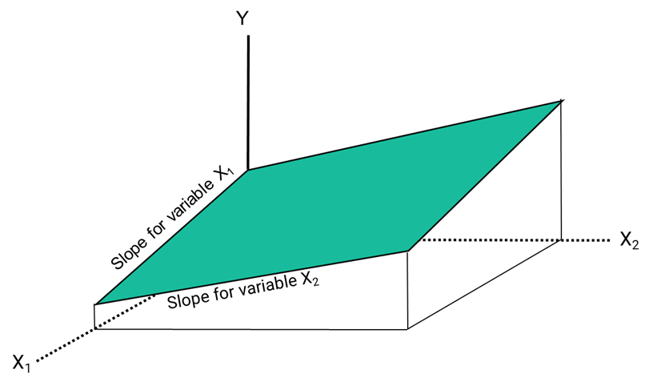
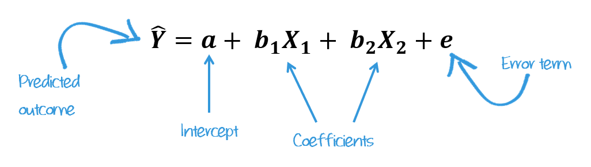

```{r}
#| label: setup
#| message: false
#| include: false

# GLOBAL ENVIRONMENT PANE
## source("tutorials/SOC6302-03/custom-setup-styles.R")
## library(gssr)
## library(gssrdoc)
## data(gss_all)
## gss24 <- gss_get_yr(2024)
library(broom.helpers) # needed for moderndive
library(moderndive) # regression output
library(gtsummary) # tbl_cross
library(marginaleffects) # needed for modelbased
library(modelbased) # ggplots with predictions

## Load packages, custom functions, and styles
source("custom-setup-styles.R")

## Load all gss
#gss_all <- readRDS("data/gss_all.rds")

# Get the data only for the 2022 survey respondents
gss24 <- readRDS("data/gss24.rds")

gss24$sex <- zap_missing(gss24$sex)
gss24$sex <- as_factor(gss24$sex)
gss24$sex <- droplevels(gss24$sex)

## Override default discrete color and fill scales
scale_colour_discrete <- function(...) ggplot2::scale_color_manual(values = my_palette, ...)
scale_fill_discrete <- function(...) ggplot2::scale_fill_manual(values = my_palette, ...)

## Options
tutorial_options(exercise.checker = gradethis::grade_learnr)
options(dplyr.summarise.inform=F)   # Avoid grouping warning
options(digits=4)                   # Round numbers
theme_set(theme_minimal())          # set ggplot theme
# st_options(freq.report.nas = FALSE) # remove extra columns in freq()
 # any reason need to see this?!?! CHECK FOR SP22
  
knitr::opts_chunk$set(echo = FALSE,
                      warning = FALSE, 
                      messages = FALSE)
```

<link href="https://fonts.googleapis.com/css2?family=Shadows+Into+Light&display=swap" rel="stylesheet">

```{=html}
<script>
  document.addEventListener("DOMContentLoaded", function () {
    document.querySelectorAll("a[href^='http']").forEach(function(link) {
      link.setAttribute("target", "_blank");
      link.setAttribute("rel", "noopener noreferrer");
    });
  });
</script>
```

Multiple Regression
--------------------------------------------------------------------------------


{width="25%"}

`r fa("fas fa-lightbulb", fill = "#18BC9C")` [**LEARNING OBJECTIVES**]{style="color: #18BC9C;"}

1. Develop a conceptual and mathematical understanding of multiple linear regression models
2. Interpret and evaluate multiple linear regression output

<br>

`r fa("fas fa-book", fill = "#18BC9C")` [**READINGS**]{style="color: #18BC9C;"}

Readings are available on Quercus.

1. Allison, Paul D. 1999. “Chapter 1: What Is Multiple Regression.” Pp. 1–24 in *Multiple Regression: A Primer*. Thousand Oaks, Calif: Pine Forge Press.


<br>

`r fa("fas fa-language", fill = "#18BC9C")` [**TERMS**]{style="color: #18BC9C;"}

* REGRESSION EQUATION  
* ERROR TERM
* COEFFICIENTS
* MULTIPLE REGRESSION
* STATISTICAL SIGNIFICANCE
* MULTICOLLINEARITY
* REFERENCE GROUP
* INTERACTION

Two continuous variables
--------------------------------------------------------------------------------

So far we have examined bivariate linear regressions, an equation model with one independent variable used to predict another variable. We have been using the following equation:

$\hat{y} = a + bX$

It shows how changes in X affect Y. It’s strength is that it is predictable. Every time you plug in a value for X, you get one exact result for $\hat{y}$. 

::: {style="color: #3498DB; font-size: 125%; font-family: 'Shadows Into Light'"}
**What if a dependent variable is affected by more than one independent variable?** 
:::

Often times, we believe believe many predictors can help explain changes in our outcome variable. Using more than one independent variable in our equation is referred to as **multiple regression**. We can adjust our equation by adding another predictor variable to it:  
  
$\hat{y} = a + b_1X_1 + b_2X_2$  
  
  
In a graph, a simple linear regression appears as a straight line that best fits the data points, whereas a multiple linear regression extends this idea into two or more dimensions, forming a plane when there are two predictors (or a hyperplane when there are more).  

{ width=60% }


In real life, things aren’t neat and perfect. That’s where an error term comes in. Our full multiple regression equation looks like this:

$\hat{y} = a + b_1X_1 + b_2X_2 + e$

By adding $e$, we’re saying that while X1 and X2 helps explain Y, there’s always some randomness or noise—stuff we can’t fully predict or measure. The $e$ accounts for all those little unknowns, like measurement errors or other factors we didn’t include. This equation is more realistic and better suited for modeling actual data.  

::: my-def
#### Error term ($e$)

Represents all other factors that affect Y
:::

Observable factors are all the independent variables we can measure and put into our equation. Other factors, what $e$ accounts for, are often called “unobservables.” They are factors we think matter to $Y$ but we cannot account for them within our model. Unobservable factors are influences on the outcome that we can’t directly measure.  
  
<br>  
  
### Model with 2 continuous variables

We might suspect that daily TV hours are related to both someone's age and educational attainment. We could look at how the variables `age` and `educ` both relate to our outcome variable `tvhours`. Let's start by looking at a scatterplot of each of these correlations.

```{r, echo=FALSE}
#| message: false

gss24 |>
  group_by(age) |>
  summarize(avg_tvhours = mean(tvhours, na.rm = TRUE)) |>
  filter(avg_tvhours < 10) |>
  ggplot(aes(x = age, y = avg_tvhours)) +
  geom_smooth(method = "lm", se = FALSE) +
  geom_point(color = "#E74C3C") +
    labs(
      title    = "Average Daily TV Hours by Age",
      x        = "Age",
      y        = "Average TV Hours",
      caption  = "2024 U.S. General Social Survey"
    ) +
  theme_minimal()
```


```{r, echo=FALSE}
#| message: false

gss24 |>
  group_by(educ) |>
  summarize(avg_tvhours = mean(tvhours, na.rm = TRUE)) |>
  filter(educ > 9) |>
  ggplot(aes(x = educ, y = avg_tvhours)) +
  geom_smooth(method = "lm", se = FALSE) +
  geom_point(color = "#F39C12") +
  scale_x_continuous(limits = c(10, 20), breaks = seq(10, 20, by = 2)) +
    labs(
      title    = "Average Daily TV Hours by Education",
      x        = "Years of education",
      y        = "Average TV Hours",
      caption  = "2024 U.S. General Social Survey"
    ) +
  theme_minimal()
```


As you can see, age is positively associated with average daily TV hours, whereas years of education is negatively associated with average daily TV hours.  

<br>

#### Strategy #1:  Do separate bivariate regressions

This yields separate slope estimates for each independent variable. Bivariate slope estimates implicitly assume that the two independent variables are separately related to the outcome.

`r fa("otter", fill = "#F39C12")`<practice> PRACTICE:</practice>

1. Replace the blank lines in the code below, specifying `tvhours` as the dependent variable and `age` as the independent variable.
2. Run the code to see your results. 
3. When you are satisfied with your answer, click "Submit Answer."  
  
```{r reg01, exercise=TRUE, error= TRUE, warning=FALSE}
lm(______ ~ ______, data = gss24)
```
  
```{r reg01-solution}
lm(tvhours ~ age, data = gss24)
```
  
```{r reg01-hint-1, error=TRUE}
lm(tvhours ~ ______, data = gss24)

```
  
```{r reg01-check}
grade_code("Like a pro!")
```

```{r P01, echo=FALSE}
question("What does it mean that the value of $a$ is 2.04?",
    answer("When a person is 0 years old, their are predicted to report 2.04 daily TV hours.", 
           correct = TRUE, message = "Another meaningless intercept value!"),
    answer("The model indicates that each 1 year increase in age was associated with an increase in 2.04 TV hours.", message = "Whoa. That would be a lot of TV"),
    answer("The model indicates that the average daily TV hours is 2.04."),
    answer("The model indicates that the average age is 2.04."),
      random_answer_order = TRUE,
      allow_retry = TRUE
)
```
  
```{r P02, echo=FALSE}
question("What is the best interpretation of the slope (0.01)?",
    answer("For every one unit increase in age, a person's daily TV hours is expected to rise by 0.01.", correct = TRUE),
    answer("The model predicts that the average daily TV hours is 0.01 greater than the average age."),
    answer("When a person's age is 0 years old, their predicted TV hours is 0.01."),
    answer("For every one unit increase in a person's TV hours, a person's age is expected to rise by 0.01 years."),
      random_answer_order = TRUE,
      allow_retry = TRUE
)
```

Now do the same thing for tvhours and education. 

1. Replace the blank lines in the code below, specifying `tvhours` as the dependent variable and `educ` as the independent variable.
2. Run the code to see your results. 
3. When you are satisfied with your answer, click "Submit Answer."  
  
```{r reg02, exercise=TRUE, error= TRUE, warning=FALSE}
lm(______ ~ ______, data = gss24)
```
  
```{r reg02-solution}
lm(tvhours ~ educ, data = gss24)
```
  
```{r reg02-hint-1, error=TRUE}
lm(tvhours ~ ______, data = gss24)

```
  
```{r reg02-check}
grade_code("Easy peasy!")
```

```{r P03, echo=FALSE}
question("What does it mean that the value of $a$ is 3.70?",
    answer("When a person has 0 years of education, their are predicted to report 3.70 daily TV hours.", correct = TRUE, message = "Another meaningless intercept value!"),
    answer("The model indicates that each 1 year increase in education was associated with an increase in 3.70 TV hours.", message = "Whoa. That would be a lot of TV"),
    answer("The model indicates that the average daily TV hours is 3.70."),
    answer("The model indicates that the average years of education is 3.70."),
      random_answer_order = TRUE,
      allow_retry = TRUE
)
```
  
```{r P04, echo=FALSE}
question("What is the best interpretation of the slope (-0.08)?",
    answer("For every one unit increase in years of education, a person's daily TV hours is expected to decrease by 0.08.", correct = TRUE),
    answer("The model predicts that the average daily TV hours is 0.08 greater than the average years of education"),
    answer("When a person has 0 years of education, their predicted TV hours is -0.08."),
    answer("For every one unit increase in a person's TV hours, a person's years of education is expected to decrease by -0.08 years."),
      random_answer_order = TRUE,
      allow_retry = TRUE
)
```


#### Strategy #2:  Multiple Regression

Multiple regression can examine **partial** relationships. It helps isolate the direct association between two variables by removing the effects of other variables that might confound or distort the relationship. It shows the relative impact of different factors on a dependent variable. Sometimes this is referred to as accounting or controlling for other variables.  

::: my-def
#### Partial relationships

Correlation between two variables after the effects of other variables have been taken into account.
:::

Let's stick with our regression and this time put both `age` and `educ` into the regression equation.

We can find the predicted average `tvhours` (dependent variable) based on a combination of two independent variables: $b_1$ (`age`) and $b_2$ (`educ`).  
  
Our equation would then look like this:  
  
$\hat{Y}$ = $a$ + $b_1$*$X_1$ + $b_2$*$X_2 + e$  

The great news is that all we have to do to add another variable to a simple regression model is include it with the `+` sign between independent variables.

`r fa("otter", fill = "#F39C12")`<practice> PRACTICE:</practice>

1. Replace the blank lines in the code below, specifying `tvhours` as the dependent variable and `age` and `educ` as the independent variables.
2. Run the code to see your results. 
3. When you are satisfied with your answer, click "Submit Answer."  
  
```{r reg03, exercise=TRUE, error= TRUE, warning=FALSE}
lm(______ ~ ______ + ______, data = gss24)
```
  
```{r reg03-solution}
lm(tvhours ~ age + educ, data = gss24)
```
  
```{r reg03-hint-1, error=TRUE}
lm(tvhours ~ ______ + ______, data = gss24)

```
  
```{r reg03-check}
grade_code("Your first multiple regression!")
```

<br>

The intercept value (sometimes referred to as $b_0$) is the expected value of $Y$ when all $X$s are $0$. In this case, the intercept is $3.18$. This is the predicted value of the outcome variable (`tvhours`) when both predictors (`age` and `education`) are set to zero. This means we would expect an average of 3.18 daily TV hours for people 0 years old and with 0 years of education. In other words, it has no meaningful interpretation.  

The intercept is often less about practical interpretation and more about helping the model fit the data. It’s just a mathematical anchor for our regression line. But if zero is meaningful for your predictors, then the intercept tells you what the baseline outcome would be in that scenario.

The slopes ($b$) of each IV are sometimes called a **regression coefficient**, or simply a coefficient. A coefficient is just the number used to multiply each variable. In this example, we could say the coefficient for the variable `age` is 0.01. The coefficient for the variable `educ` is -.08.  

{ width=100% }
  
We interpret each IV coefficient as we did before, but we add a statement that we are "*accounting for*",  "*controlling for*", or "*holding constant*" the other variable in the model. When we say a variable is held constant or controlled, we mean that its value is fixed so it doesn’t vary while we examine the effect of another variable. This doesn’t mean the variable is literally set to one specific number, it means the model accounts for its influence mathematically, so we can isolate the effect of another predictor.


::: {style="color: #18BC9C; font-family: 'Shadows Into Light'"}
**For every one year increase in age, there is a predicted .01 increase in daily TV hours, controlling for years of education.**
:::
  
::: {style="color: #18BC9C; font-family: 'Shadows Into Light'"}
**For every one year increase in education, there is a predicted -0.08 decrease in daily TV hours, after accounting for age.**
:::
  

### Statistical significance
  
Each coefficient in the regression equation has its own standard error, test statistic (*t* value), and p-value.  

Use the function `get_regression_table()` from the [`moderndive`](https://moderndive.github.io/moderndive/) package to see what I mean.

`r fa("otter", fill = "#F39C12")`<practice> PRACTICE:</practice>

1. Replace the blank lines in the code below, specifying `model` as the name of our regression object.
2. Run the code to see your results. 
3. When you are satisfied with your answer, click "Submit Answer."  

```{r reg04, exercise=TRUE, error= TRUE, warning=FALSE}
model <- lm(tvhours ~ age + educ, data = gss24)

get_regression_table(_____)
```
  
```{r reg04-solution}
model <- lm(tvhours ~ age + educ, data = gss24)

get_regression_table(model)

```
  
```{r reg04-check}
grade_code("Well done!")
```

<br>

The p-value for each independent variable tests the null hypothesis, that the variable has no correlation with the dependent variable. The `age` coefficient ($.014$) has a p-value of $.008$ (i.e., p < .001). Therefore, using an alpha level of .05, we can reject the null hypothesis that there is no association between the daily TV hours and age.  

Likewise, the `educ` coefficient ($-.083$) has a p-value of $.003$, so we can say there is a statistically significant negative association between years of education and TV hours.  
  
  
Researchers denote the p-values with asterisks (*), typically referred to as stars, in tables reporting the results from a regression. 
The table notes often include the following type of statement:

> `* p < .05; ** p < .01; *** p < .001`


We might display the results from the regression in the example in a table that looks like this:  

<br>

**Table 2.** OLS Regression Analysis of Americans Daily TV Hours

```{r, echo=FALSE}

model <- lm(tvhours ~ age + educ, data = gss24)

model |>
  tbl_regression(
    intercept = TRUE) |>
  modify_column_hide(conf.low) |>
  modify_column_unhide(column = std.error) |>
  add_significance_stars() |>
  remove_abbreviation() 

```
*Source: U.S. General Social Survey 2024 (N = 1093)*

  
***
  
`r fa("otter", fill = "#F39C12")`<practice> PRACTICE:</practice>


```{r P05, echo=FALSE}
question("Is education a statistically significant predictor of daily tv hours?",
    answer("Yes, because the p-value is less than .01.", correct = TRUE, 
           message = "Note the very small sample size. These variables may be related if the sample size were larger."),
    answer("Yes, because the p-value is less than .001.", 
           message = "It's not statistically significant at this alpha level."),
    answer("Unknown, because the p-value is missing from the table.",
           message = "Look at the star key."),
    answer("Yes, because p is .028", 
           message = "Careful, this is the standard error."),
         random_answer_order = TRUE,
         allow_retry = TRUE
)
```
  
<br>  

#### Interpretation

Multiple regression relies on many assumptions that more advanced regression courses will cover. But, no matter what type of modelling you choose, the interpretation is only as good as the sample, measures, and model. 

Some other things we might be able to say, given the output of a multiple regression:

-   If slopes of $X_1$, $X_2$ are the same as in separate bivariate regression, then each variable has an independent effect.  
  
-   If $X_1$ remains large, $X_2$ shrinks to zero we typically conclude that effect of $X_2$ was spurious, or operates through $X_1$.  
  
-   If both $X_1$ and $X_2$ shrink a little, each has an effect, but some overlap or mediation is occurring.  

::: {style="color: #F39C12; font-size: 125%; font-family: 'Shadows Into Light'"}
**Things to watch out for:**
:::


[**Correlation is not causation**]{style="color: #F39C12"}  
The ability to control for many variables can help detect spurious relationships...but it isn’t perfect. Be aware that other (omitted) variables may be affecting your model. Don’t over-interpret the results.

[**Reverse causality**]{style="color: #F39C12"}  
Many sociological processes involve bi-directional causality. Regression slopes (and correlations) do not identify which variable “causes” the other.

[**Statistical significance $\neq$ practical significance**]{style="color: #F39C12"}  
More stars (or a low p-value) indicates that an effect is unlikely to be due to chance, but it says nothing about the size or importance of that effect. Even tiny effects can be statistically significant in large samples. Focus on effect sizes and context, not just stars.  


One continuous and one categorical variable
--------------------------------------------------------------------------------

::: {style="color: #3498DB; font-size: 125%; font-family: 'Shadows Into Light'"}
**How can we incorporate categorical variables (e.g., race, gender) into regression?**
:::

<br>

#### Strategy #1:  Analyze each sub-group separately

We could create different dataframes for each category of our variable and then run a regression. 

For example, if we thought the relationship between average TV hours and years of education was conditional on gender (e.g., the correlation between TV hours and education was different for men and women), we could run two separate regressions.

**OLS Regression of average daily TV hours among men**

```{r}
# Create a dataset for men
df_men <- gss24 |>
  filter(sex == "male")

mod_men <- lm(tvhours ~ educ, data = df_men)

get_regression_table(mod_men)

```


**OLS Regression of average daily TV hours among women**

```{r}
# Create a dataset for women
df_women <- gss24 |>
  filter(sex == "female")

mod_women <- lm(tvhours ~ educ, data = df_women)

get_regression_table(mod_women)

```

<br>

`r fa("otter", fill = "#F39C12")`<practice> PRACTICE:</practice>

```{r P06, echo=FALSE}
question("Is education a statistically significant predictor of daily tv hours for men and women?",
    answer("Yes, but only for men (p < 0.05 for men; p > 0.05 for women)", correct = TRUE),
    answer("Yes, for both men and women (p < 0.05 for both)"),
    answer("Yes, but only for women (p < 0.05 for women; p > 0.05 for men)"),
    answer("No, for neither group (p > 0.05 for both)"),
         random_answer_order = TRUE,
         allow_retry = TRUE
)
```


#### Strategy #2:  Use dummy variables

::: my-def
#### Dummy variable

Dichotomous variables coded to indicate the presence or absence of something. 
Absence is coded as $0$, presence coded as $1$.
:::

A different approach is to turn categorical variables into **dummy variables** to be included in one regression. 

When you include a categorical variable in a regression model, one category is left out of the model to avoid a problem called **perfect multicollinearity**. The multicollinearity problem occurs when variables are perfectly correlated and the model can't estimate unique effects. If you included all the categories plus an intercept, the model wouldn’t be able tell which variable is doing what because they’re too closely related.

Instead, one category is dropped on purpose to remove redundant information. This "missing" category is called the **reference group**. The coefficients for the other categories show how they differ from the reference group.

Consider the following regression equation:

$\hat{y} = a + b_1educ_1 + b_2female_2 + e$  

<br>

The first coefficient, $b_1$, is our continuous variable `educ` that contains values representing respondents' years of education. The second coefficient, $b_2$ is a new variable `female` where men are coded as `0` and women are coded as `1`.  

In our equation, $b_2$ would be equal to `0` for men. So, our regression model will drop the `female` coefficient:

$\hat{y} = a + b_1educ_1 + e$  

Women are coded as `1`, so $b_2$ stays in the equation (and is added to the constant). Women are modeled using the full regression line: 

$\hat{y} = a + b_1educ_1 + b_2female_2 + e$  


The coefficient $b_2$ represents the difference in the intercept between women and men. When using a dummy variable like `female` (coded as `1` for women, `0` for men), the regression line shifts depending on the value of the coefficient:

> A positive coefficient means women score higher than men on the dependent variable.

> A negative coefficient means women score lower.

Example: If the coefficient for `female` is $1.2$, it means: “Women are, on average, 1.2 points higher than men on the outcome variable.”

This shift reflects a different starting point (intercept) for each group, resulting in separate regression lines.

Try it out with our `tvhours` regression example. 

***

`r fa("otter", fill = "#F39C12")`<practice> PRACTICE:</practice>

1. Replace the blank lines in the code below, specifying `tvhours` as the dependent variable and `educ` and `sex` as the independent variables.
2. Run the code to see your results. 
3. When you are satisfied with your answer, click "Submit Answer."  

```{r reg05, exercise=TRUE, error= TRUE, warning=FALSE}
lm(______ ~ ______ + ______, data = gss24)
```
  
```{r reg05-solution}
lm(tvhours ~ educ + sex, data = gss24)
```
  
```{r reg05-hint-1, error=TRUE}
lm(______ ~ educ + ______, data = gss24)

```
  
```{r reg05-check}
grade_code("Rock on!")
```


The intercept, $3.65$, represents the average daily TV hours for men (the reference group) with an education level of $0$. 

The coefficient for `educ` ($-0.0771$), means that for each additional year of education, daily TV hours decrease by about 0.08 hours. 

The coefficient for `sexfemale` ($0.1564$) indicates that women watch, on average, 0.16 more hours of TV per day than men, after accounting for education.

Is this gender difference statistically significant? Let's find out!

***

`r fa("otter", fill = "#F39C12")`<practice> PRACTICE:</practice>

1. Replace the blank lines in the code below, specifying `model` as the name of our regression object.
2. Run the code to see your results. 
3. When you are satisfied with your answer, click "Submit Answer."  

```{r reg06, exercise=TRUE, error= TRUE, warning=FALSE}
model <- lm(tvhours ~ educ + sex, data = gss24)

get_regression_table(_____)
```
  
```{r reg06-solution}
model <- lm(tvhours ~ educ + sex, data = gss24)

get_regression_table(model)

```
  
```{r reg06-check}
grade_code("Well done!")
```


```{r P07, echo=FALSE}
question("Is gender a statistically significant predictor of daily tv hours, after controlling for years of education?",
    answer("No, because the p-value for sex: female is 0.301 and the confidence interval includes zero", correct = TRUE, message = "Nice! This is a test of whether the coefficient is different from 0. "),
    answer("Yes, because the coefficient for sex: female is 0.156 and the p-value is 0.301"),
    answer("Yes, because the p-value for sex: female is 0.301 and the confidence interval does not include zero"),
    answer("No, because the coefficient for sex: female is negative and the standard error is high"),
         random_answer_order = TRUE,
         allow_retry = TRUE
)
```

<br>

We might display the results from the regression in the example in a table that looks like this:  

<br>

**Table 2.** OLS Regression Analysis of Americans Daily TV Hours

```{r, echo=FALSE}

model <- lm(tvhours ~ educ + sex, data = gss24)

model |>
  tbl_regression(
    intercept = TRUE,
    show_single_row = sex,
    label = list(sex = "Women")
  ) |>
  modify_column_hide(conf.low) |>
  modify_column_unhide(column = std.error) |>
  add_significance_stars() |>
  remove_abbreviation()

```
*Source: U.S. General Social Survey 2024 (N = 1093)*
  
<br>
  
### Visualize predictions

It often helps to visualize the results from a regression model. Let's use the `ggpredict()` function from the [{modelbased}](https://easystats.github.io/modelbased/) package to do so. `estimate_means()` calculates predicted values from a regression model for specific values of the variables. It shows you what your model says the outcome would be if you held some variables constant and changed others.

It helps you see the effect of one variable while controlling for others.

It creates a clean data frame with predicted values (and confidence intervals).

```{r preds, exercise=TRUE}
# Fit the model
model <- lm(tvhours ~ educ + sex, data = gss24)

# Get predicted values
preds <- estimate_means(model, by = c("educ", "sex"))

# Preview the new df
preds |>
  as_tibble() |> 
  head()
```

<br>

Looking at this new table, we can see that the predicted average TV hours for men with 0 years of education would be $3.65$. If that number doesn't sound familiar, take a look back at our regression. It's the same number as the intercept!

For women, the predicted average TV hours with 0 years of schooling is $3.80$. Where did this number come from? Add the intercept $3.65$ to the coefficient for our `sex` variable: $0.1564$.

What about the next row which shows men with 2.22 years of education average 3.47 TV hours. We add our intercept of $3.65$ to our `educ` coefficient $-0.0771$ multiplied by $2.222$:

$3.6455 + (-.0771*2.222)$
$3.6455 -0.1713 = 3.474$

And what about the following row showing the predicted average TV hours for women with 2.222 years of education? We do the same thing except also include the `sex` coefficient:

$3.6455 + (-.0771*2.222) + 0.1564$
$3.6455 -0.1713 + 0.1564 = 3.631$

You can easily plot these predictions with the `ggplot2` package to make your results more understandable.


```{r plot, exercise=TRUE}
# Fit the model
model <- lm(tvhours ~ educ + sex, data = gss24)

# Get predicted values
preds <- estimate_means(model, by = c("educ", "sex"))

# Plot using ggplot2
preds |>
  ggplot(aes(x = educ, y = Mean, color = sex)) +
    geom_line(size = 1.2) +
    labs(
      title = "Predicted Daily TV Hours by Education and Sex",
      x = "Education Level",
      y = "Predicted TV Hours",
      color = "Sex",
      fill = "Sex"
    ) +
    theme_minimal() +
    theme(legend.position = "top")
```

<br>

#### Interactions

If you were following along closely, you might have noticed that when we ran our regressions separately for men and women, it appeared that men watch more daily TV than women (at 0 years of education). The intercept for men was $4.272$ whereas for women the intercept was $3.251$. However, in our multiple regression model, the coefficient for the `sex` variable showed that women reported $0.1564$ more daily TV hours than men, adjusting for education. So, what gives? 

This apparent contradiction suggests that the relationship between education and TV hours might differ by gender. When you run separate regressions for men and women, you allow each group to have its own intercept and slope. But in the combined model without an interaction, you're assuming that education affects TV hours in the same way for both sexes. In other words, the slope for education is shared. The only difference allowed is a shift in the intercept based on gender

However, the fact that men and women have different intercepts in their separate models, and possibly different slopes, means that the effect of education on TV hours might not be the same for men and women. 

Including an interaction (e.g., `educ` * `sex`) between education and sex might be helpful. An interaction term lets the model estimate a different slope for education for men and women, capturing how the relationship between education and TV hours changes depending on gender.

In other words, the interaction helps resolve the mismatch between the separate models and the combined one by allowing the effect of education to vary by sex, rather than forcing it to be the same for everyone.

In the code below, I replaced the `+` sign between `educ` and `sex` with `*` to indicate these terms should be multiplied together (interacted). Run the code below so you can see how it changes our interpretation:

***

`r fa("otter", fill = "#F39C12")`<practice> PRACTICE:</practice>

```{r interaction-model, exercise=TRUE}
# Fit the model
model <- lm(tvhours ~ educ * sex, data = gss24)

get_regression_table(model)
``` 

The coefficient for `educ` is $–0.12$, meaning that for men (the reference group), each additional unit of education is associated with watching 0.12 fewer hours of TV per day.

The coefficient for `sex: female` is $−1.02$. This is the difference in the outcome between women and men when education = 0. Women watch 1.02 fewer hours of TV than men at zero years of education, but this difference is not statistically significant (p = 0.214).

The interaction term `educ:sexfemale` is $0.08$. It tells us whether the relationship between education and daily TV hours differs between men and women. It adjusts the slope of education for women. So for women, the effect of education is:

$−0.12 + 0.08 = -0.04$

This means that for women, each additional unit of education is associated with only $0.04$ fewer hours of TV per day. We could thus say something like: 

>    Education reduces TV watching for both sexes, but the effect is stronger for men.

>    The interaction term suggests that women’s TV habits are less sensitive to education level than men’s.

However, the p-value for the interaction is $0.145$, which is not statistically significant (p > 0.05). So while the trend is interesting, we can't confidently say the difference in slopes is real.

Still, to fully grasp the power of interacting variables, let's graph our new predictions.

***

`r fa("otter", fill = "#F39C12")`<practice> PRACTICE:</practice>

```{r interaction-plot, exercise=TRUE}

# Fit the model
model <- lm(tvhours ~ educ * sex, data = gss24)

# Get predicted values
preds <- estimate_means(model, by = c("educ", "sex"))

# Plot using ggplot2
preds |>
  ggplot(aes(x = educ, y = Mean, color = sex)) +
    geom_line(size = 1.2) +
    labs(
      title = "Predicted Daily TV Hours by Education and Gender",
      x = "Education Level",
      y = "Predicted TV Hours",
      color = "Sex",
      fill = "Sex"
    ) +
    theme_minimal() +
    theme(legend.position = "top")
``` 

<br>

Whoa! Now we have different intercepts (where the regression line crosses the x-axis at 0) and slopes for men and women.

Learning Check 09
--------------------------------------------------------------------------------

Please answer the following questions to verify you understand the
topics in this tutorial.
  
Use the following regression output to answer the next questions.  

```{r}
model <- lm(hrs1 ~ age + educ, data = gss24)

get_regression_table(model)
```
  
```{r Q01, echo=FALSE}
question("Q01. What does the intercept mean?",
    answer("The predicted weekly work hours for someone zero years of age and with zero years of education.", correct = TRUE),
    answer("The average number of hours worked per week by individuals with average age and education."),
    answer("The maximum number of hours worked per week in the sample."),
    answer("The effect of age and education on weekly work hours."),
         random_answer_order = TRUE,
         allow_retry = TRUE
)
```
  
```{r Q02, echo=FALSE}
question("Q02. What is the best interpretation of the coefficient for age?",
    answer("Each additional year of age is associated with working 0.112 fewer hours per week, on average, holding education constant.", correct = TRUE),
    answer("Older individuals work 0.112 fewer hours per week than younger individuals."),
    answer("Age causes a reduction of 0.112 hours in weekly work time for everyone."),
    answer("People with higher education work 0.112 fewer hours per week as they age."),
         random_answer_order = TRUE,
         allow_retry = TRUE
)
```
  
```{r Q03, echo=FALSE}
question("Q03. Is education a statistically significant predictor of weekly work hours?",
    answer("No, because the p-value is greater than 0.05.", correct = TRUE),
    answer("Yes, because the coefficient for education is positive."),
    answer("Yes, because the confidence interval does not include zero."),
    answer("No, because the effect of education is negative."),
         random_answer_order = TRUE,
         allow_retry = TRUE
)
```

Use the following regression output to answer the next questions.  


**Table 2.** OLS Regression Analysis of Americans Weekly Work Hours

```{r, echo=FALSE}

model <- lm(hrs1 ~ age + sex, data = gss24)

model |>
  tbl_regression(
    intercept = TRUE,
    show_single_row = sex,
    label = list(sex = "Women")
  ) |>
  modify_column_hide(conf.low) |>
  modify_column_unhide(column = std.error) |>
  add_significance_stars() |>
  remove_abbreviation()

```
*Source: U.S. General Social Survey 2024 (N = 1093)*

```{r Q04, echo=FALSE}
question("Q04. What does the intercept represent in this model?",
    answer("The predicted weekly work hours for a man who is 0 years old.", correct = TRUE),
    answer("The average number of hours worked per week by all individuals in the sample."),
    answer("The predicted weekly work hours for a women of average age."),
    answer("The predicted weekly work hours for a man of average age."),
         random_answer_order = TRUE,
         allow_retry = TRUE
)
```

```{r Q05, echo=FALSE}
question("Q05. What is the best interpretation of the coefficient for age?",
    answer("Adjusting for gender, each additional year of age is associated with working on average 0.101 fewer hours per week.", correct = TRUE),
    answer("Older individuals work 0.101 fewer hours per week than younger individuals."),
    answer("Age causes an average reduction of 0.101 hours in weekly work time, adjusting for gender."),
    answer("The predicted weekly work hours for man is reduced by .101 weekly work hours."),
         random_answer_order = TRUE,
         allow_retry = TRUE
)
```

```{r Q06, echo=FALSE}
question("Q06. Is age a statistically significant predictor of weekly work hours?",
    answer("Yes, because the p-value is less than 0.05", correct = TRUE),
    answer("No, because the coefficient is small"),
    answer("No, because the confidence interval includes zero"),
    answer("Yes, because older people work less"),
         random_answer_order = TRUE,
         allow_retry = TRUE
)
```

```{r Q07, echo=FALSE}
question("Q07. What does the coefficient for sex: female mean?",
    answer("Holding age constant, on average women work 4.83 fewer hours per week than men.", correct = TRUE),
    answer("Holding age constant, on average women work 4.83 more hours per week than men."),
    answer("The effect of gender on work hours is not statistically significant."),
    answer("Holding age constant, the model predicts that all women work less than men."),
         random_answer_order = TRUE,
         allow_retry = TRUE
)
```

```{r Q08, echo=FALSE}
question("Q08. If the model is changed from `hrs1 ~ age + sex` to `hrs1 ~ age * sex`, what would you expect to see in the regression output?",
    answer("Separate coefficients for age, sex, and their interaction, allowing the effect of age to differ by gender", correct = TRUE),
    answer("Only the interaction term will be included, and the main effects will be removed"),
    answer("The model will assume the effect of age is the same for men and women"),
    answer("The intercept will be dropped from the model"),
         random_answer_order = TRUE,
         allow_retry = TRUE
)
```