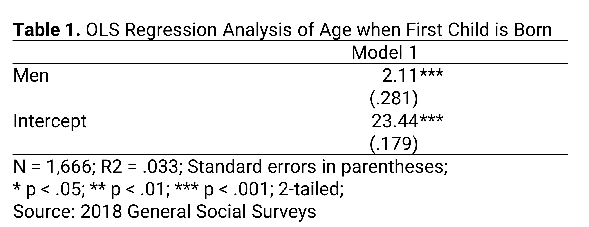

```{r}
#| label: setup
#| message: false
#| include: false

# GLOBAL ENVIRONMENT PANE
## source("tutorials/SOC6302-03/custom-setup-styles.R")
## library(gssr)
## library(gssrdoc)
## data(gss_all)
## gss24 <- gss_get_yr(2024)

## Load packages, custom functions, and styles
source("custom-setup-styles.R")

## Load all gss
#gss_all <- readRDS("data/gss_all.rds")

# Get the data only for the 2024 survey respondents
#gss24 <- readRDS("data/gss24.rds")

# Override default discrete color and fill scales
scale_colour_discrete <- function(...) scale_color_manual(values = my_palette)

## Options
tutorial_options(exercise.checker = gradethis::grade_learnr)
options(dplyr.summarise.inform=F)   # Avoid grouping warning
options(digits=4)                   # Round numbers
theme_set(theme_minimal())          # set ggplot theme
# st_options(freq.report.nas = FALSE) # remove extra columns in freq()
 # any reason need to see this?!?! CHECK FOR SP22
  
knitr::opts_chunk$set(echo = FALSE,
                      warning = FALSE, 
                      messages = FALSE)
```

<link href="https://fonts.googleapis.com/css2?family=Shadows+Into+Light&display=swap" rel="stylesheet">

```{=html}
<script>
  document.addEventListener("DOMContentLoaded", function () {
    document.querySelectorAll("a[href^='http']").forEach(function(link) {
      link.setAttribute("target", "_blank");
      link.setAttribute("rel", "noopener noreferrer");
    });
  });
</script>
```

Regression
--------------------------------------------------------------------------------


{width="25%"}

`r fa("fas fa-lightbulb", fill = "#18BC9C")` [**LEARNING OBJECTIVES**]{style="color: #18BC9C;"}

1. xx
2. yy
3. zz

<br>

`r fa("fas fa-book", fill = "#18BC9C")` [**READINGS**]{style="color: #18BC9C;"}

Readings are available on Quercus.

1. x


<br>

`r fa("fas fa-language", fill = "#18BC9C")` [**TERMS**]{style="color: #18BC9C;"}

* REGRESSION EQUATION  
* COEFFICIENTS
* MULTIPLE REGRESSION
* STATISTICAL SIGNIFICANCE


## Coefficients

The slope ($b$) of $X$ is sometimes called a regression coefficient, or simply a coefficient. 
A coefficient is just a number used to multiply a variable. In the candle example, we could say the coefficient for the variable "day" is -.00303.  
  
So far we have examined simple linear regressions, an equation model with one independent variable used to predict another variable. But, often we want to use two or more variables to predict the value of the dependent variable. Using more than one independent variable in our equation is referred to as **multiple regression**.  
  
In the candle example, we might want to predict the average rating for scented candles based on both the day of the year and the number of candle orders. Maybe we think scented candle reviews could also be declining because fewer people are buying candles in 2020. The 2020 candle consumers could be the true candle lovers, people with high candle smelling expectations, since fewer people may be buying candles because they aren't expecting any visitors to their homes.  
  
Then we could find the predicted average rating of scented candles (dependent variable) based on a combination of two independent variables: $b_1$ (day) and $b_2$ (orders).  
  
Our equation would then look like this:  
  
$\hat{Y}$ = $a$ + $b_1$*$X_1$ + $b_2$*$X_2$  
  
  
To predict the average rating for scented candles, you add the intercept ($a$), the day of the year multiplied by $b_1$, and the number of candle orders multiplied by $b_2$.  
  
The regression coefficient for day of the year ($b_1$) is the slope of the relationship between the dependent variable (average rating of scented candles) and the independent variable (day of the year) that is not correlated with the number of candle orders. It represents the change in the dependent variable associated with a change in the independent variable when the other independent variable is held constant.  
  
  
### Statistical significance
  
Each coefficient in the regression equation has its own standard error, test statistic (*t* value), and p-value.  
  
Researchers denote the p-values with asterisks (*), typically referred to as stars, in tables reporting the results from a regression. 
The table notes often include the following type of statement:

> `* p < .05; ** p < .01; *** p < .001`


We might display the results from the regression in the candle example in a table that looks like this: 

{ width=100% }
  
The p-value for each independent variable tests the null hypothesis, that the variable has no correlation with the dependent variable. The p-value for the "day" coefficient (-.00303) was 2.18e-08 (i.e., p < .0001). This is denoted in the table with the three *. Therefore, using an alpha level of .05, we can reject the null hypothesis that there is no association between the day of the year and change in the average ratings of scented candles in 2020.  
  
***
  
`r fa("otter", fill = "#F39C12")`<practice> PRACTICE:</practice>

{ width=100% }


```{r P09, echo=FALSE}
question("Is women's ideal age of marriage a statistically significant predictor of men's ideal age of marriage?",
    answer("No, because the p-value is greater than .05.", correct = TRUE, 
           message = "Note the very small sample size. These variables may be related if the sample size were larger."),
    answer("Yes, because the p-value is less than .001.", 
           message = "A lack of stars means the p-value is greater than .05"),
    answer("No, because the p-value is equal to .001.",
           message = "A lack of stars means the p-value is greater than .05"),
    answer("Yes, because the coefficient (.463) is positive.", 
           message = "The positive coefficient tells you the direction of the relationship, not the statistical significance."),
         random_answer_order = TRUE,
         allow_retry = TRUE
)
```
  
<br>  
  


Learning Check 09
--------------------------------------------------------------------------------

Please answer the following questions to verify you understand the
topics in this tutorial.
  

{ width=80% }

  
```{r Q01, echo=FALSE}
question("Q01. What does it mean that the value of $a$ is 23.44?",
    answer("Women's average age when their first child is born is predicted to be 23.44 years.", correct = TRUE),
    answer("The model indicates that each 1 year increase in age was associated with an increase of 23.44 years in age at the time a first child is born."),
    answer("The model indicates that the average age when a first child is born is 23.44 years old."),
    answer("Men's average age when their first child is born is predicted to be 23.44 years."),
         random_answer_order = TRUE,
         allow_retry = TRUE
)
```
  
```{r Q02, echo=FALSE}
question("Q14. What is the best interpretation of the slope (2.11)?",
    answer("Compared with women, men's average age when their first child is born is expected to be 2.11 years greater.", correct = TRUE),
    answer("Men's average age when their first child is born is predicted to be 2.11 years"),
    answer("The model indicates that for every one additional child born, a person's average age increases by 2.11 years"),
    answer("Compared with men, women's average age when their first child is born is expected to be 2.11 years greater."),
         random_answer_order = TRUE,
         allow_retry = TRUE
)
```
  
```{r Q03, echo=FALSE}
question("Q15. Is gender a statistically significant predictor of someone's age when their first child was born?",
    answer("Yes, because the p-value is less than .001.", correct = TRUE),
    answer("No, because the p-value is greater than .05."),
    answer("No, because the p-value is equal to .001."),
    answer("Yes, because the coefficient (2.11) is positive."),
         random_answer_order = TRUE,
         allow_retry = TRUE
)
```

{ width=80% }
  
  
```{r Q11, echo=FALSE}
question("Q11. Is years of education a statistically significant predictor of age at first marriage?",
    answer("Yes, because the p-value is less than .001.", correct = TRUE),
    answer("No, because the p-value is greater than .05."),
    answer("No, because the p-value is equal to .001."),
    answer("Yes, because the coefficient (.501) is positive."),
         random_answer_order = TRUE,
         allow_retry = TRUE
)
```
